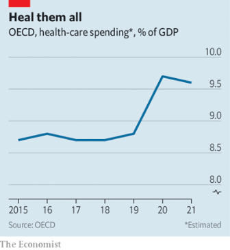

### 1. The world this week
#### 1.1 [Politics](https://www.economist.com/the-world-this-week/2023/01/19/politics)

#### 1.2 [Business](https://www.economist.com/the-world-this-week/2023/01/19/business)
  

#### 1.3 [KAL’s cartoon](https://www.economist.com/the-world-this-week/2023/01/19/kals-cartoon)
  

#### 1.4 [This week’s covers](https://www.economist.com/the-world-this-week/2023/01/19/this-weeks-covers)

### 2. Leaders
#### 2.1 [Disney’s troubles show how technology has changed the business of culture](https://www.economist.com/leaders/2023/01/19/disneys-troubles-show-how-technology-has-changed-the-business-of-culture)

#### 2.2 [Turkey could be on the brink of dictatorship](https://www.economist.com/leaders/2023/01/19/turkey-could-be-on-the-brink-of-dictatorship)

#### 2.3 [Excess deaths are soaring as health-care systems wobble](https://www.economist.com/leaders/2023/01/19/excess-deaths-are-soaring-as-health-care-systems-wobble)
  

#### 2.4 [South Africa’s collapsing railway company is a cautionary tale](https://www.economist.com/leaders/2023/01/19/south-africas-collapsing-railway-company-is-a-cautionary-tale)

#### 2.5 [How to sell to the young](https://www.economist.com/leaders/2023/01/19/how-to-sell-to-the-young)

### 3. Letters
#### 3.1 [Letters to the editor](https://www.economist.com/letters/2023/01/19/letters-to-the-editor)

### 4. By Invitation
#### 4.1 [Mona Juul says Russia-Ukraine talks would be premature—but preparing for them would not](https://www.economist.com/by-invitation/2023/01/18/mona-juul-says-russia-ukraine-talks-would-be-premature-but-preparing-for-them-would-not)

#### 4.2 [Jeffrey Sachs on why neutral countries should mediate between Russia and Ukraine](https://www.economist.com/by-invitation/2023/01/18/jeffrey-sachs-on-why-neutral-countries-should-mediate-between-russia-and-ukraine)

### 5. Briefing
#### 5.1 [As Disney turns 100, its business is on a rollercoaster ride](https://www.economist.com/briefing/2023/01/19/as-disney-turns-100-its-business-is-on-a-rollercoaster-ride)
  
  
  

### 6. Europe
#### 6.1 [France and Germany stifle their spats to celebrate a 60-year friendship](https://www.economist.com/europe/2023/01/19/france-and-germany-stifle-their-spats-to-celebrate-a-60-year-friendship)

#### 6.2 [A helicopter crash has dealt a heavy blow to Ukraine’s government](https://www.economist.com/europe/2023/01/18/a-helicopter-crash-has-dealt-a-heavy-blow-to-ukraines-government)

#### 6.3 [A Russian town counts the cost of Vladimir Putin’s war](https://www.economist.com/europe/2023/01/16/a-russian-town-counts-the-cost-of-vladimir-putins-war)

#### 6.4 [Some liberated Ukrainian regions have mixed loyalties](https://www.economist.com/europe/2023/01/19/some-liberated-ukrainian-regions-have-mixed-loyalties)
  

#### 6.5 [The next Czech president will be a Trumpish oligarch or a general](https://www.economist.com/europe/2023/01/17/the-next-czech-president-will-be-a-trumpish-oligarch-or-a-general)

#### 6.6 [The Ukraine war is forcing eastern Europe to build more links](https://www.economist.com/europe/2023/01/19/the-ukraine-war-is-forcing-eastern-europe-to-build-more-links)
  

#### 6.7 [Europe’s “neutral” countries are having to adapt to the new world](https://www.economist.com/europe/2023/01/19/europes-neutral-countries-are-having-to-adapt-to-the-new-world)

### 7. Britain
#### 7.1 [The toxic culture of the Metropolitan Police Service](https://www.economist.com/britain/2023/01/18/the-toxic-culture-of-the-metropolitan-police-service)
  

#### 7.2 [The SNP response to the blocking of its transgender act is illiberal](https://www.economist.com/britain/2023/01/19/the-snp-response-to-the-blocking-of-its-transgender-act-is-illiberal)

#### 7.3 [Britain’s trade unions lose faith in the pay review bodies](https://www.economist.com/britain/2023/01/19/britains-trade-unions-lose-faith-in-the-pay-review-bodies)
  

#### 7.4 [Britain is well-placed to cope with a downturn in the housing market](https://www.economist.com/britain/2023/01/19/britain-is-well-placed-to-cope-with-a-downturn-in-the-housing-market)
  

#### 7.5 [Horse-racing in Britain is in deep trouble](https://www.economist.com/britain/2023/01/17/horse-racing-in-britain-is-in-deep-trouble)

#### 7.6 [Why super-strict classrooms are in vogue in Britain](https://www.economist.com/britain/2023/01/16/why-super-strict-classrooms-are-in-vogue-in-britain)

#### 7.7 [British politics needs more money](https://www.economist.com/britain/2023/01/19/british-politics-needs-more-money)

### 8. United States
#### 8.1 [Incomes are rising in America, especially for the poorest](https://www.economist.com/united-states/2023/01/15/incomes-are-rising-in-america-especially-for-the-poorest)
  
  

#### 8.2 [The presidential mislaying of classified documents is infectious](https://www.economist.com/united-states/2023/01/13/the-presidential-mislaying-of-classified-documents-is-infectious)

#### 8.3 [How America’s far right flits from issue to issue](https://www.economist.com/united-states/2023/01/19/how-americas-far-right-flits-from-issue-to-issue)
  

#### 8.4 [What the spread of universal basic-income schemes says about America’s safety net](https://www.economist.com/united-states/2023/01/19/what-the-spread-of-universal-basic-income-schemes-says-about-americas-safety-net)

#### 8.5 [It is still legal to hit children in school in 19 American states](https://www.economist.com/united-states/2023/01/19/it-is-still-legal-to-hit-children-in-school-in-19-american-states)
  

#### 8.6 [George Santos is the congressman America deserves](https://www.economist.com/united-states/2023/01/17/george-santos-is-the-congressman-america-deserves)

### 9. Middle East & Africa
#### 9.1 [Turkey eyes reconciliation with a Syrian regime it tried to topple](https://www.economist.com/middle-east-and-africa/2023/01/19/turkey-eyes-reconciliation-with-a-syrian-regime-it-tried-to-topple)
  

#### 9.2 [Binyamin Netanyahu rushes to take on Israel’s Supreme Court](https://www.economist.com/middle-east-and-africa/2023/01/16/binyamin-netanyahu-rushes-to-take-on-israels-supreme-court)

#### 9.3 [Iran and its Arab neighbours are divided over a name](https://www.economist.com/middle-east-and-africa/2023/01/19/iran-and-its-arab-neighbours-are-divided-over-a-name)

#### 9.4 [How young Sudanese are still fighting for democracy](https://www.economist.com/middle-east-and-africa/2023/01/19/how-young-sudanese-are-still-fighting-for-democracy)

#### 9.5 [South Africa’s disintegrating freight railway is crippling firms](https://www.economist.com/middle-east-and-africa/2023/01/17/south-africas-disintegrating-freight-railway-is-crippling-firms)
  

#### 9.6 [Why Zimbabwe’s schools have taken to selling chickens](https://www.economist.com/middle-east-and-africa/2023/01/19/why-zimbabwes-schools-have-taken-to-selling-chickens)

### 10. The Americas
#### 10.1 [What does China’s reopening mean for Latin America?](https://www.economist.com/the-americas/2023/01/18/what-does-chinas-reopening-mean-for-latin-america)
  
  

#### 10.2 [Peru’s political chaos looks likely to persist](https://www.economist.com/the-americas/2023/01/19/perus-political-chaos-looks-likely-to-persist)

#### 10.3 [Brazil’s new president wants to reduce the number of hungry people](https://www.economist.com/the-americas/2023/01/19/brazils-new-president-wants-to-reduce-the-number-of-hungry-people)

### 11. Asia
#### 11.1 [Japan’s armed forces are getting stronger, faster](https://www.economist.com/asia/2023/01/19/japans-armed-forces-are-getting-stronger-faster)
  

#### 11.2 [India’s sinking towns spark debates about development](https://www.economist.com/asia/2023/01/19/indias-sinking-towns-spark-debates-about-development)
  

#### 11.3 [Why South Korea is talking about getting its own nukes](https://www.economist.com/asia/2023/01/19/why-south-korea-is-talking-about-getting-its-own-nukes)

#### 11.4 [Japanese youngsters want to look like Chinese starlets](https://www.economist.com/asia/2023/01/19/japanese-youngsters-want-to-look-like-chinese-starlets)

#### 11.5 [Jacinda Ardern resigns as New Zealand’s prime minister](https://www.economist.com/asia/2023/01/19/jacinda-ardern-resigns-as-new-zealands-prime-minister)

#### 11.6 [A murder in Afghanistan highlights the misery of women](https://www.economist.com/asia/2023/01/19/a-murder-in-afghanistan-highlights-the-misery-of-women)

#### 11.7 [Who gets to define what Asia means?](https://www.economist.com/asia/2023/01/19/who-gets-to-define-what-asia-means)

### 12. China
#### 12.1 [For the first time since the 1960s, China’s population is shrinking](https://www.economist.com/china/2023/01/17/for-the-first-time-since-the-1960s-chinas-population-is-shrinking)
  
  

#### 12.2 [A planned spaceport in Djibouti may give China a boost](https://www.economist.com/china/2023/01/19/a-planned-spaceport-in-djibouti-may-give-china-a-boost)

#### 12.3 [Covid-19 has already torn through large swathes of China](https://www.economist.com/china/2023/01/19/covid-19-has-already-torn-through-large-swathes-of-china)
  

#### 12.4 [Riding the slow train in China](https://www.economist.com/china/2023/01/19/riding-the-slow-train-in-china)

### 13. International
#### 13.1 [Open-source intelligence is piercing the fog of war in Ukraine](https://www.economist.com/interactive/international/2023/01/13/open-source-intelligence-is-piercing-the-fog-of-war-in-ukraine)

### 14. Special report
#### 14.1 [Turkey faces a crucial election this summer](https://www.economist.com/special-report/2023/01/16/turkey-faces-a-crucial-election-this-summer)

#### 14.2 [The Turkish economy is in pressing need of reform and repair](https://www.economist.com/special-report/2023/01/16/the-turkish-economy-is-in-pressing-need-of-reform-and-repair)
  

#### 14.3 [Recep Tayyip Erdogan’s relatives are becoming increasingly powerful](https://www.economist.com/special-report/2023/01/16/recep-tayyip-erdogans-relatives-are-becoming-increasingly-powerful)

#### 14.4 [The effects on Turkey of Syria’s civil war](https://www.economist.com/special-report/2023/01/16/the-effects-on-turkey-of-syrias-civil-war)
  

#### 14.5 [Turkey has given up promoting political Islam abroad](https://www.economist.com/special-report/2023/01/16/turkey-has-given-up-promoting-political-islam-abroad)

#### 14.6 [Turkey has a newly confrontational foreign policy](https://www.economist.com/special-report/2023/01/16/turkey-has-a-newly-confrontational-foreign-policy)
  

#### 14.7 [The Turkish opposition faces big obstacles to winning the election](https://www.economist.com/special-report/2023/01/16/the-turkish-opposition-faces-big-obstacles-to-winning-the-election)
  

#### 14.8 [Turkey is still just a democracy, but it is not certain to remain that way](https://www.economist.com/special-report/2023/01/16/turkey-is-still-just-a-democracy-but-it-is-not-certain-to-remain-that-way)

#### 14.9 [Sources and acknowledgments](https://www.economist.com/special-report/2023/01/16/sources-and-acknowledgments)

### 15. Business
#### 15.1 [How the young spend their money](https://www.economist.com/business/2023/01/16/how-the-young-spend-their-money)
  
  

#### 15.2 [Mexico’s electric-car ambitions](https://www.economist.com/business/2023/01/19/mexicos-electric-car-ambitions)

#### 15.3 [China’s tech crackdown starts to ease](https://www.economist.com/business/2023/01/19/chinas-tech-crackdown-starts-to-ease)

#### 15.4 [Why pointing fingers is unhelpful](https://www.economist.com/business/2023/01/19/why-pointing-fingers-is-unhelpful)

#### 15.5 [The painful development of India’s startups](https://www.economist.com/business/2023/01/19/the-painful-development-of-indias-startups)
  

#### 15.6 [TSMC is making the best of a bad geopolitical situation](https://www.economist.com/business/2023/01/19/tsmc-is-making-the-best-of-a-bad-geopolitical-situation)

### 16. Finance & economics
#### 16.1 [Why health-care services are in chaos everywhere](https://www.economist.com/finance-and-economics/2023/01/15/why-health-care-services-are-in-chaos-everywhere)
  
  
  
  

#### 16.2 [China’s re-globalisation paradox](https://www.economist.com/finance-and-economics/2023/01/19/chinas-re-globalisation-paradox)
  

#### 16.3 [Venture capital’s $300bn question](https://www.economist.com/finance-and-economics/2023/01/18/venture-capitals-300bn-question)

#### 16.4 [Japan’s extraordinarily expensive defence of its monetary policy](https://www.economist.com/finance-and-economics/2023/01/18/japans-extraordinarily-expensive-defence-of-its-monetary-policy)
  

#### 16.5 [Investment banks are struggling in a high-interest-rate world](https://www.economist.com/finance-and-economics/2023/01/17/investment-banks-are-struggling-in-a-high-interest-rate-world)
  

#### 16.6 [The rise of the uber-luxurious office](https://www.economist.com/finance-and-economics/2023/01/19/the-rise-of-the-uber-luxurious-office)

#### 16.7 [Could Europe end up with a worse inflation problem than America?](https://www.economist.com/finance-and-economics/2023/01/19/could-europe-end-up-with-a-worse-inflation-problem-than-america)

### 17. Science & technology
#### 17.1 [Which firm will win the new Moon race?](https://www.economist.com/science-and-technology/2023/01/18/which-firm-will-win-the-new-moon-race)

#### 17.2 [Ideas for finding ET are getting more inventive](https://www.economist.com/science-and-technology/2023/01/18/ideas-for-finding-et-are-getting-more-inventive)

#### 17.3 [A decades-old model of animal (and human) learning is under fire](https://www.economist.com/science-and-technology/2023/01/18/a-decades-old-model-of-animal-and-human-learning-is-under-fire)

### 18. Culture
#### 18.1 [New films in France tackle race, gender, exile and belonging](https://www.economist.com/culture/2023/01/19/new-films-in-france-tackle-race-gender-exile-and-belonging)

#### 18.2 [“Pegasus” lifts the lid on a sophisticated piece of spyware](https://www.economist.com/culture/2023/01/19/pegasus-lifts-the-lid-on-a-sophisticated-piece-of-spyware)

#### 18.3 [A philosopher offers four case studies in failure](https://www.economist.com/culture/2023/01/19/a-philosopher-offers-four-case-studies-in-failure)

#### 18.4 [“O Caledonia” teaches girls how to grow up](https://www.economist.com/culture/2023/01/19/o-caledonia-teaches-girls-how-to-grow-up)

#### 18.5 [In “Still Pictures” Janet Malcolm turns her pen on herself](https://www.economist.com/culture/2023/01/19/in-still-pictures-janet-malcolm-turns-her-pen-on-herself)

#### 18.6 [Translating the Bible is a vexed task, as a new book shows](https://www.economist.com/culture/2023/01/19/translating-the-bible-is-a-vexed-task-as-a-new-book-shows)

### 19. Economic & financial indicators
#### 19.1 [Economic data, commodities and markets](https://www.economist.com/economic-and-financial-indicators/2023/01/19/economic-data-commodities-and-markets)
  
  
  
  

### 20. The Economist explains
#### 20.1 [How gas stoves became part of America’s culture wars](https://www.economist.com/the-economist-explains/2023/01/17/how-gas-stoves-became-part-of-americas-culture-wars)

#### 20.2 [How humans healed the ozone layer](https://www.economist.com/the-economist-explains/2023/01/14/how-humans-healed-the-ozone-layer)

### 21. Obituary
#### 21.1 [Adolfo Kaminsky saved thousands of Jews by changing their identities](https://www.economist.com/obituary/2023/01/19/adolfo-kaminsky-saved-thousands-of-jews-by-changing-their-identities)

### 22. Graphic detail
#### 22.1 [A flurry of new studies identifies causes of the Industrial Revolution](https://www.economist.com/graphic-detail/2023/01/17/a-flurry-of-new-studies-identifies-causes-of-the-industrial-revolution)
  
  
  

