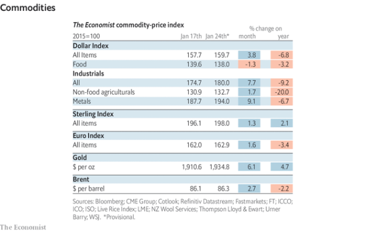

### 1. The world this week
#### 1.1 [Politics](https://www.economist.com/the-world-this-week/2023/01/26/politics)

#### 1.2 [Business](https://www.economist.com/the-world-this-week/2023/01/26/business)

#### 1.3 [KAL’s cartoon](https://www.economist.com/the-world-this-week/2023/01/26/kals-cartoon)
  

#### 1.4 [This week’s cover](https://www.economist.com/the-world-this-week/2023/01/26/this-weeks-cover)

### 2. Leaders
#### 2.1 [The humbling of Goldman Sachs](https://www.economist.com/leaders/2023/01/26/the-humbling-of-goldman-sachs)

#### 2.2 [The world economy’s inflation problem is easing](https://www.economist.com/leaders/2023/01/26/the-world-economys-inflation-problem-is-easing)
  

#### 2.3 [China’s property slump is easing, but the relief will be short-lived](https://www.economist.com/leaders/2023/01/26/chinas-property-slump-is-easing-but-the-relief-will-be-short-lived)

#### 2.4 [What should Britain’s industrial strategy be?](https://www.economist.com/leaders/2023/01/26/what-should-britains-industrial-strategy-be)

#### 2.5 [To save Egypt’s economy, get the army out of it](https://www.economist.com/leaders/2023/01/26/to-save-egypts-economy-get-the-army-out-of-it)
  

### 3. Letters
#### 3.1 [Letters to the editor](https://www.economist.com/letters/2023/01/26/letters-to-the-editor)

### 4. By Invitation
#### 4.1 [Brian Deese, John Podesta and Jake Sullivan on the Inflation Reduction Act](https://www.economist.com/by-invitation/2023/01/24/brian-deese-john-podesta-and-jake-sullivan-on-the-inflation-reduction-act)

### 5. Briefing
#### 5.1 [How Goldman Sachs went from apex predator to Wall Street laggard](https://www.economist.com/briefing/2023/01/26/how-goldman-sachs-went-from-apex-predator-to-wall-street-laggard)
  
  
  

### 6. Europe
#### 6.1 [After a steady first 100 days, choppier waters await Giorgia Meloni](https://www.economist.com/europe/2023/01/26/after-a-steady-first-100-days-choppier-waters-await-giorgia-meloni)

#### 6.2 [What Western tanks should give Ukraine in the next round of the war](https://www.economist.com/europe/2023/01/22/what-western-tanks-should-give-ukraine-in-the-next-round-of-the-war)

#### 6.3 [The state of the Bundeswehr is more dismal than ever](https://www.economist.com/europe/2023/01/26/the-state-of-the-bundeswehr-is-more-dismal-than-ever)
  

#### 6.4 [Spain’s economy is recovering from the pandemic, but problems persist](https://www.economist.com/europe/2023/01/26/spains-economy-is-recovering-from-the-pandemic-but-problems-persist)
  

#### 6.5 [France sees a surprising surge in obesity](https://www.economist.com/europe/2023/01/26/france-sees-a-surprising-surge-in-obesity)

#### 6.6 [Experience from a past crisis suggests Europe should shake off any complacency](https://www.economist.com/europe/2023/01/26/experience-from-a-past-crisis-suggests-europe-should-shake-off-any-complacency)

### 7. Britain
#### 7.1 [Britain’s carmaking industry is increasingly under threat](https://www.economist.com/britain/2023/01/24/britains-carmaking-industry-is-increasingly-under-threat)
  

#### 7.2 [Britain is beginning to protect its 1970s leisure centres](https://www.economist.com/britain/2023/01/26/britain-is-beginning-to-protect-its-1970s-leisure-centres)

#### 7.3 [Rishi Sunak’s hapless government](https://www.economist.com/britain/2023/01/23/rishi-sunaks-hapless-government)

#### 7.4 [Britain has fewer hospital beds than almost any other rich country](https://www.economist.com/britain/2023/01/26/britain-has-fewer-hospital-beds-than-almost-any-other-rich-country)
  

#### 7.5 [Illness is stopping Britons from coming back to work](https://www.economist.com/britain/2023/01/26/illness-is-stopping-britons-from-coming-back-to-work)
  

#### 7.6 [How to conduct a sex survey](https://www.economist.com/britain/2023/01/25/how-to-conduct-a-sex-survey)

#### 7.7 [Blat, the Soviet art of getting by, comes to Britain](https://www.economist.com/britain/2023/01/26/blat-the-soviet-art-of-getting-by-comes-to-britain)

### 8. United States
#### 8.1 [Congress is gridlocked. America’s statehouses are very much not](https://www.economist.com/united-states/2023/01/24/congress-is-gridlocked-americas-statehouses-are-very-much-not)
  

#### 8.2 [Ron DeSantis wants to limit free speech in the name of free speech](https://www.economist.com/united-states/2023/01/26/ron-desantis-wants-to-limit-free-speech-in-the-name-of-free-speech)

#### 8.3 [There is no easy escape from America’s debt-ceiling mess](https://www.economist.com/united-states/2023/01/23/there-is-no-easy-escape-from-americas-debt-ceiling-mess)

#### 8.4 [A shortage in America creates opportunities for nurses with wheels](https://www.economist.com/united-states/2023/01/26/a-shortage-in-america-creates-opportunities-for-nurses-with-wheels)

#### 8.5 [A violent dispute is impeding police reform in Atlanta](https://www.economist.com/united-states/2023/01/26/a-violent-dispute-is-impeding-police-reform-in-atlanta)

#### 8.6 [What Edward Hopper saw](https://www.economist.com/united-states/2023/01/26/what-edward-hopper-saw)

### 9. Middle East & Africa
#### 9.1 [A crisis of confidence in Egypt](https://www.economist.com/middle-east-and-africa/2023/01/24/a-crisis-of-confidence-in-egypt)
  

#### 9.2 [A populist plan to pay off private debts is another sign of Kuwait’s ills](https://www.economist.com/middle-east-and-africa/2023/01/26/a-populist-plan-to-pay-off-private-debts-is-another-sign-of-kuwaits-ills)

#### 9.3 [A white, gay, Zulu-speaking mayor is shaking up South African politics](https://www.economist.com/middle-east-and-africa/2023/01/26/a-white-gay-zulu-speaking-mayor-is-shaking-up-south-african-politics)
  

#### 9.4 [Togo promises development, not democracy](https://www.economist.com/middle-east-and-africa/2023/01/26/togo-promises-development-not-democracy)

#### 9.5 [Why bicycles are crucial to Congo’s cross-border trade](https://www.economist.com/middle-east-and-africa/2023/01/26/why-bicycles-are-crucial-to-congos-cross-border-trade)

### 10. The Americas
#### 10.1 [As Lula takes over, Brazil’s economic prospects are looking up](https://www.economist.com/the-americas/2023/01/26/as-lula-takes-over-brazils-economic-prospects-are-looking-up)
  
  

#### 10.2 [A trial in New York exposes US-Mexican counter-narcotics tensions](https://www.economist.com/the-americas/2023/01/26/a-trial-in-new-york-exposes-us-mexican-counter-narcotics-tensions)

#### 10.3 [A new generation of Argentine musicians is topping the charts](https://www.economist.com/the-americas/2023/01/26/a-new-generation-of-argentine-musicians-is-topping-the-charts)

### 11. Asia
#### 11.1 [Relaunching Rahul Gandhi, again](https://www.economist.com/asia/2023/01/26/relaunching-rahul-gandhi-again)

#### 11.2 [The Philippines’ new president rewires the war on drugs](https://www.economist.com/asia/2023/01/26/the-philippines-new-president-rewires-the-war-on-drugs)

#### 11.3 [Jacinda Ardern’s successor is unveiled](https://www.economist.com/asia/2023/01/23/jacinda-arderns-successor-is-unveiled)

#### 11.4 [Indonesia embraces resource nationalism](https://www.economist.com/asia/2023/01/26/indonesia-embraces-resource-nationalism)

#### 11.5 [The Rohingyas long for their homes in Myanmar, but cannot go back](https://www.economist.com/asia/2023/01/26/the-rohingyas-long-for-their-homes-in-myanmar-but-cannot-go-back)

#### 11.6 [An anti-graft drive brings down Vietnam’s president](https://www.economist.com/asia/2023/01/26/an-anti-graft-drive-brings-down-vietnams-president)

### 12. China
#### 12.1 [China is trying to win over Westerners and private firms](https://www.economist.com/china/2023/01/25/china-is-trying-to-win-over-westerners-and-private-firms)

#### 12.2 [Does China’s softer tone extend to Taiwan?](https://www.economist.com/china/2023/01/26/does-chinas-softer-tone-extend-to-taiwan)
  

#### 12.3 [Chinese singles face the heat over the holiday](https://www.economist.com/china/2023/01/26/chinese-singles-face-the-heat-over-the-holiday)

#### 12.4 [What a new drama series reveals about China](https://www.economist.com/china/2023/01/26/what-a-new-drama-series-reveals-about-china)

### 13. International
#### 13.1 [Most children in poor countries are being failed by their schools](https://www.economist.com/international/2023/01/26/most-children-in-poor-countries-are-being-failed-by-their-schools)
  

### 14. Business
#### 14.1 [Big business is in for a rough earnings season](https://www.economist.com/business/2023/01/22/big-business-is-in-for-a-rough-earnings-season)

#### 14.2 [Hindenburg’s critique of the Adani empire](https://www.economist.com/business/2023/01/26/hindenburgs-critique-of-the-adani-empire)

#### 14.3 [The curse of the corporate headshot](https://www.economist.com/business/2023/01/26/the-curse-of-the-corporate-headshot)

#### 14.4 [Can Amazon deliver again?](https://www.economist.com/business/2023/01/26/can-amazon-deliver-again)
  
  
  

#### 14.5 [Elliott and fellow activist investors take on big tech](https://www.economist.com/business/2023/01/26/elliott-and-fellow-activist-investors-take-on-big-tech)
  
  

#### 14.6 [How will Satya Nadella handle Microsoft’s ChatGPT moment?](https://www.economist.com/business/2023/01/25/how-will-satya-nadella-handle-microsofts-chatgpt-moment)

### 15. Finance & economics
#### 15.1 [How the world economy could avoid recession](https://www.economist.com/finance-and-economics/2023/01/24/how-the-world-economy-could-avoid-recession)
  
  

#### 15.2 [Argentina and Brazil propose a bizarre common currency](https://www.economist.com/finance-and-economics/2023/01/26/argentina-and-brazil-propose-a-bizarre-common-currency)

#### 15.3 [When professional stockpickers beat the algorithms](https://www.economist.com/finance-and-economics/2023/01/26/when-professional-stockpickers-beat-the-algorithms)

#### 15.4 [What inflation means for the Big Mac index](https://www.economist.com/finance-and-economics/2023/01/26/what-inflation-means-for-the-big-mac-index)
  

#### 15.5 [Christians fight about how to serve God and mammon](https://www.economist.com/finance-and-economics/2023/01/26/christians-fight-about-how-to-serve-god-and-mammon)

#### 15.6 [Can China fix its property crisis?](https://www.economist.com/finance-and-economics/2023/01/23/can-china-fix-its-property-crisis)
  

#### 15.7 [Have economists misunderstood inflation?](https://www.economist.com/finance-and-economics/2023/01/26/have-economists-misunderstood-inflation)

### 16. Science & technology
#### 16.1 [Neurons are not the only brain cells that think](https://www.economist.com/science-and-technology/2023/01/23/neurons-are-not-the-only-brain-cells-that-think)
  

#### 16.2 [Hormone tests for women’s fertility seem not to work](https://www.economist.com/science-and-technology/2023/01/25/hormone-tests-for-womens-fertility-seem-not-to-work)

#### 16.3 [A better way of keeping mosquitoes at bay is under development](https://www.economist.com/science-and-technology/2023/01/25/a-better-way-of-keeping-mosquitoes-at-bay-is-under-development)

#### 16.4 [Wi-Fi signals could prove useful for spies](https://www.economist.com/science-and-technology/2023/01/25/wi-fi-signals-could-prove-useful-for-spies)

#### 16.5 [How to measure how stress affects athletes’ performance](https://www.economist.com/science-and-technology/2023/01/25/how-to-measure-how-stress-affects-athletes-performance)

### 17. Culture
#### 17.1 [How much innovation is necessary to see off fossil fuels?](https://www.economist.com/culture/2023/01/25/how-much-innovation-is-necessary-to-see-off-fossil-fuels)

#### 17.2 [Kapka Kassabova traverses a landscape that time forgot](https://www.economist.com/culture/2023/01/26/kapka-kassabova-traverses-a-landscape-that-time-forgot)

#### 17.3 [Love, loss, history and exile in Aleksandar Hemon’s new novel](https://www.economist.com/culture/2023/01/26/love-loss-history-and-exile-in-aleksandar-hemons-new-novel)

#### 17.4 [How to eat to 100](https://www.economist.com/culture/2023/01/25/how-to-eat-to-100)

#### 17.5 [England’s 17th century was a ferment of ideas and revolution](https://www.economist.com/culture/2023/01/26/englands-17th-century-was-a-ferment-of-ideas-and-revolution)

#### 17.6 [A Broadway musical updates “Some Like It Hot”](https://www.economist.com/culture/2023/01/26/a-broadway-musical-updates-some-like-it-hot)

### 18. Economic & financial indicators
#### 18.1 [Economic data, commodities and markets](https://www.economist.com/economic-and-financial-indicators/2023/01/26/economic-data-commodities-and-markets)
  
  
  
  

### 19. Graphic detail
#### 19.1 [Where have all America’s workers gone?](https://www.economist.com/graphic-detail/2023/01/24/where-have-all-americas-workers-gone)

### 20. The Economist explains
#### 20.1 [What makes Germany’s Leopard 2 tank the best fit for Ukraine?](https://www.economist.com/the-economist-explains/2023/01/25/what-makes-germanys-leopard-2-tank-the-best-fit-for-ukraine)
  

### 21. Obituary
#### 21.1 [Ronald Blythe recorded the passing, and continuance, of rural life](https://www.economist.com/obituary/2023/01/26/ronald-blythe-recorded-the-passing-and-continuance-of-rural-life)

