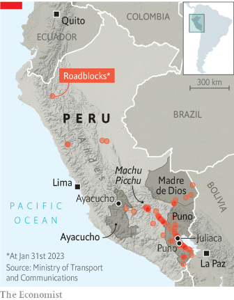
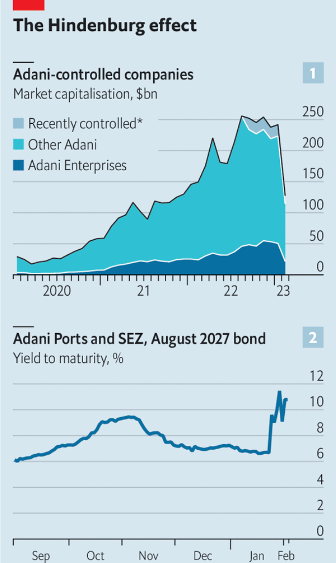

### 1. The world this week
#### 1.1 [Politics](https://www.economist.com/the-world-this-week/2023/02/02/politics)

#### 1.2 [Business](https://www.economist.com/the-world-this-week/2023/02/02/business)
  

#### 1.3 [KAL’s cartoon](https://www.economist.com/the-world-this-week/2023/02/02/kals-cartoon)
  

#### 1.4 [This week’s cover](https://www.economist.com/the-world-this-week/2023/02/02/this-weeks-cover)

### 2. Leaders
#### 2.1 [Joe Biden’s effort to remake the economy is ambitious, risky—and selfish](https://www.economist.com/leaders/2023/02/02/joe-bidens-effort-to-remake-the-economy-is-ambitious-risky-and-selfish)

#### 2.2 [Nagging questions over the Adani empire won’t go away](https://www.economist.com/leaders/2023/01/31/nagging-questions-over-the-adani-empire-wont-go-away)

#### 2.3 [The Bank of Japan should stop defending its cap on bond yields](https://www.economist.com/leaders/2023/02/02/the-bank-of-japan-should-stop-defending-its-cap-on-bond-yields)

#### 2.4 [Why the West’s oil sanctions on Russia are proving to be underwhelming](https://www.economist.com/leaders/2023/02/01/why-the-wests-oil-sanctions-on-russia-are-proving-to-be-underwhelming)
  

#### 2.5 [Peru needs an early election and outside support, not interference](https://www.economist.com/leaders/2023/02/02/peru-needs-an-early-election-and-outside-support-not-interference)

### 3. Letters
#### 3.1 [Letters to the editor](https://www.economist.com/letters/2023/02/02/letters-to-the-editor)

### 4. By Invitation
#### 4.1 [Ukraine should—and, properly supported, can—seize Crimea, argues Ben Hodges](https://www.economist.com/by-invitation/2023/01/29/ukraine-should-and-properly-supported-can-seize-crimea-argues-ben-hodges)

#### 4.2 [Talks between Russia and Ukraine would save lives, argues Christopher Chivvis](https://www.economist.com/by-invitation/2023/01/29/talks-between-russia-and-ukraine-would-save-lives-argues-christopher-chivvis)

### 5. Briefing
#### 5.1 [America’s government is spending lavishly to revive manufacturing](https://www.economist.com/briefing/2023/02/02/americas-government-is-spending-lavishly-to-revive-manufacturing)
  
  
  

### 6. Britain
#### 6.1 [For Britain to grow faster it needs better managers](https://www.economist.com/britain/2023/01/31/for-britain-to-grow-faster-it-needs-better-managers)
  

#### 6.2 [The BBC World Service shuts several foreign-language radio services](https://www.economist.com/britain/2023/02/02/the-bbc-world-service-shuts-several-foreign-language-radio-services)

#### 6.3 [The BBC assesses its coverage of the dismal science](https://www.economist.com/britain/2023/02/02/the-bbc-assesses-its-coverage-of-the-dismal-science)

#### 6.4 [The murder of a king makes for a most jolly day out](https://www.economist.com/britain/2023/01/31/the-murder-of-a-king-makes-for-a-most-jolly-day-out)

#### 6.5 [Where should trans prisoners serve their sentences?](https://www.economist.com/britain/2023/02/02/where-should-trans-prisoners-serve-their-sentences)
  

#### 6.6 [Britain’s newest islets are made of wet wipes](https://www.economist.com/britain/2023/01/30/britains-newest-islets-are-made-of-wet-wipes)

#### 6.7 [Meet Ms Heeves, the face of Britain’s new political consensus](https://www.economist.com/britain/2023/02/02/meet-ms-heeves-the-face-of-britains-new-political-consensus)

### 7. Europe
#### 7.1 [Ukraine’s troops in the east are quietly confident](https://www.economist.com/europe/2023/02/01/ukraines-troops-in-the-east-are-quietly-confident)
  

#### 7.2 [Georgia is drifting into the Kremlin’s orbit](https://www.economist.com/europe/2023/01/31/georgia-is-drifting-into-the-kremlins-orbit)

#### 7.3 [A campaign to “de-Russify” Ukraine is under way](https://www.economist.com/europe/2023/01/29/a-campaign-to-de-russify-ukraine-is-under-way)

#### 7.4 [A burnt Koran holds back Sweden and Finland from joining NATO](https://www.economist.com/europe/2023/02/02/a-burnt-koran-holds-back-sweden-and-finland-from-joining-nato)
  

#### 7.5 [Pragmatism paints a paler shade of Green](https://www.economist.com/europe/2023/01/30/pragmatism-paints-a-paler-shade-of-green)
  

#### 7.6 [At last, populism in Europe is losing its mojo](https://www.economist.com/europe/2023/02/02/at-last-populism-in-europe-is-losing-its-mojo)

### 8. United States
#### 8.1 [America needs a new environmentalism](https://www.economist.com/united-states/2023/01/29/america-needs-a-new-environmentalism)
  

#### 8.2 [Why holding bad police officers to account is so difficult](https://www.economist.com/united-states/2023/02/01/why-holding-bad-police-officers-to-account-is-so-difficult)

#### 8.3 [The sport of ice fishing is being transformed by technology](https://www.economist.com/united-states/2023/02/02/the-sport-of-ice-fishing-is-being-transformed-by-technology)

#### 8.4 [Why it was so easy for crooks to steal money meant for pandemic relief](https://www.economist.com/united-states/2023/02/02/why-it-was-so-easy-for-crooks-to-steal-money-meant-for-pandemic-relief)

#### 8.5 [Medication for opioid addiction is getting easier to access](https://www.economist.com/united-states/2023/02/02/medication-for-opioid-addiction-is-getting-easier-to-access)

#### 8.6 [Republicans are right that federal budgeting is a joke](https://www.economist.com/united-states/2023/02/02/republicans-are-right-that-federal-budgeting-is-a-joke)

### 9. Middle East & Africa
#### 9.1 [Nigeria’s presidential race goes down to the wire](https://www.economist.com/middle-east-and-africa/2023/02/02/nigerias-presidential-race-goes-down-to-the-wire)
  

#### 9.2 [Can Kenya bring peace to eastern Congo?](https://www.economist.com/middle-east-and-africa/2023/02/02/can-kenya-bring-peace-to-eastern-congo)

#### 9.3 [South Africa’s blackouts hurt the economy in unexpected ways](https://www.economist.com/middle-east-and-africa/2023/02/02/south-africas-blackouts-hurt-the-economy-in-unexpected-ways)

#### 9.4 [Lebanon’s judges battle over their probe of Beirut’s port blast](https://www.economist.com/middle-east-and-africa/2023/02/02/lebanons-judges-battle-over-their-probe-of-beiruts-port-blast)

#### 9.5 [Israel’s government is facing anger from new and unexpected quarters](https://www.economist.com/middle-east-and-africa/2023/02/02/israels-government-is-facing-anger-from-new-and-unexpected-quarters)

#### 9.6 [France dumps Morocco in favour of Algeria](https://www.economist.com/middle-east-and-africa/2023/02/02/france-dumps-morocco-in-favour-of-algeria)
  

### 10. The Americas
#### 10.1 [Political turmoil is tearing Peru apart](https://www.economist.com/the-americas/2023/01/30/political-turmoil-is-tearing-peru-apart)
  
  

#### 10.2 [The United States says corruption in Paraguay starts at the top](https://www.economist.com/the-americas/2023/02/02/the-united-states-says-corruption-in-paraguay-starts-at-the-top)

### 11. Asia
#### 11.1 [America’s hoped-for Asian semiconductor pact looks tricky](https://www.economist.com/asia/2023/02/02/americas-hoped-for-asian-semiconductor-pact-looks-tricky)
  

#### 11.2 [South Korea still refuses to send arms to Ukraine](https://www.economist.com/asia/2023/02/02/south-korea-still-refuses-to-send-arms-to-ukraine)

#### 11.3 [Shah Rukh Khan faces down India’s Hindu right](https://www.economist.com/asia/2023/02/02/shah-rukh-khan-faces-down-indias-hindu-right)

#### 11.4 [China’s put-upon maritime neighbours are pushing back](https://www.economist.com/asia/2023/02/01/chinas-put-upon-maritime-neighbours-are-pushing-back)

#### 11.5 [Myanmar’s civil war has moved to its heartlands](https://www.economist.com/asia/2023/01/31/myanmars-civil-war-has-moved-to-its-heartlands)
  

### 12. China
#### 12.1 [A new challenge to relations between America and China](https://www.economist.com/china/2023/01/29/a-new-challenge-to-relations-between-america-and-china)

#### 12.2 [Will we ever know how many people died of covid-19 in China?](https://www.economist.com/china/2023/02/02/will-we-ever-know-how-many-people-died-of-covid-19-in-china)
  

#### 12.3 [A geopolitical setback for China in the Pacific](https://www.economist.com/china/2023/02/02/a-geopolitical-setback-for-china-in-the-pacific)
  

#### 12.4 [Why Vladimir Putin is not a pariah in China](https://www.economist.com/china/2023/02/02/why-vladimir-putin-is-not-a-pariah-in-china)

### 13. Business
#### 13.1 [What next for Gautam Adani’s embattled empire?](https://www.economist.com/business/2023/02/01/what-next-for-gautam-adanis-embattled-empire)
  
  

#### 13.2 [Hindenburg Research, attacker of the Adani empire](https://www.economist.com/business/2023/02/02/hindenburg-research-attacker-of-the-adani-empire)

#### 13.3 [The race of the AI labs heats up](https://www.economist.com/business/2023/01/30/the-race-of-the-ai-labs-heats-up)
  
  

#### 13.4 [The relationship between AI and humans](https://www.economist.com/business/2023/02/02/the-relationship-between-ai-and-humans)

#### 13.5 [Things are looking up for Meta](https://www.economist.com/business/2023/02/02/things-are-looking-up-for-meta)

#### 13.6 [An alliance between Renault and Nissan gets a reboot](https://www.economist.com/business/2023/02/02/an-alliance-between-renault-and-nissan-gets-a-reboot)

#### 13.7 [China’s BYD is overtaking Tesla as the carmaker extraordinaire](https://www.economist.com/business/2023/02/02/chinas-byd-is-overtaking-tesla-as-the-carmaker-extraordinaire)

### 14. Finance & economics
#### 14.1 [How Russia dodges oil sanctions on an industrial scale](https://www.economist.com/finance-and-economics/2023/01/29/how-russia-dodges-oil-sanctions-on-an-industrial-scale)
  
  
  

#### 14.2 [Is there a fix for Japan’s markets mess?](https://www.economist.com/finance-and-economics/2023/01/31/is-there-a-fix-for-japans-markets-mess)

#### 14.3 [The last gasp of the meme-stock era](https://www.economist.com/finance-and-economics/2023/02/02/the-last-gasp-of-the-meme-stock-era)

#### 14.4 [China is paralysing global debt-forgiveness efforts](https://www.economist.com/finance-and-economics/2023/02/02/china-is-paralysing-global-debt-forgiveness-efforts)

#### 14.5 [Rallying markets suffer from a doveish illusion](https://www.economist.com/finance-and-economics/2023/02/01/rallying-markets-suffer-from-a-doveish-illusion)
  

#### 14.6 [Super-tight policy is still struggling to control inflation](https://www.economist.com/finance-and-economics/2023/02/02/super-tight-policy-is-still-struggling-to-control-inflation)
  

#### 14.7 [The AI boom: lessons from history](https://www.economist.com/finance-and-economics/2023/02/02/the-ai-boom-lessons-from-history)

### 15. Science & technology
#### 15.1 [The touchy-feely world of the metaverse and future gadgets](https://www.economist.com/science-and-technology/2023/02/01/the-touchy-feely-world-of-the-metaverse-and-future-gadgets)

#### 15.2 [People of different opinions process political data differently](https://www.economist.com/science-and-technology/2023/02/02/people-of-different-opinions-process-political-data-differently)

#### 15.3 [Birds are just as fashion-conscious as people](https://www.economist.com/science-and-technology/2023/02/01/birds-are-just-as-fashion-conscious-as-people)

#### 15.4 [Researchers find a way to make VR headsets more realistic](https://www.economist.com/science-and-technology/2023/02/01/researchers-find-a-way-to-make-vr-headsets-more-realistic)

### 16. Culture
#### 16.1 [Martin Wolf’s new book analyses the West’s malaise](https://www.economist.com/culture/2023/02/02/martin-wolfs-new-book-analyses-the-wests-malaise)

#### 16.2 [Explaining Chinese amnesia over the Cultural Revolution](https://www.economist.com/culture/2023/02/02/explaining-chinese-amnesia-over-the-cultural-revolution)

#### 16.3 [Released 50 years ago, “Soylent Green” is an eerie prophecy](https://www.economist.com/culture/2023/02/02/released-50-years-ago-soylent-green-is-an-eerie-prophecy)

#### 16.4 [As Europeans went west, indigenous people travelled the other way](https://www.economist.com/culture/2023/02/02/as-europeans-went-west-indigenous-people-travelled-the-other-way)

#### 16.5 [Look closely at Peter Doig’s paintings. Then look again](https://www.economist.com/culture/2023/02/02/look-closely-at-peter-doigs-paintings-then-look-again)

#### 16.6 [Some well-known etymologies are too good to be true](https://www.economist.com/culture/2023/02/02/some-well-known-etymologies-are-too-good-to-be-true)

### 17. Economic & financial indicators
#### 17.1 [Economic data, commodities and markets](https://www.economist.com/economic-and-financial-indicators/2023/02/02/economic-data-commodities-and-markets)
  
  
  
  

### 18. Graphic detail
#### 18.1 [Habitat loss and climate change increase the risk of new diseases](https://www.economist.com/graphic-detail/2023/01/31/habitat-loss-and-climate-change-increase-the-risk-of-new-diseases)

### 19. The Economist explains
#### 19.1 [Why does Ukraine want Western jets—and will it get them?](https://www.economist.com/the-economist-explains/2023/02/01/why-does-ukraine-want-western-jets-and-will-it-get-them)

#### 19.2 [Who is Gautam Adani?](https://www.economist.com/the-economist-explains/2023/01/31/who-is-gautam-adani)

### 20. Obituary
#### 20.1 [Gina Lollobrigida’s ambition was her strength and her weakness](https://www.economist.com/obituary/2023/02/02/gina-lollobrigidas-ambition-was-her-strength-and-her-weakness)

