### 1. The world this week
#### 1.1 [Politics](https://www.economist.com/the-world-this-week/2023/02/09/politics)

#### 1.2 [Business](https://www.economist.com/the-world-this-week/2023/02/09/business)
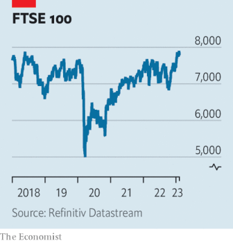  

#### 1.3 [KAL’s cartoon](https://www.economist.com/the-world-this-week/2023/02/09/kals-cartoon)
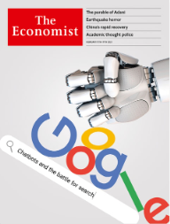  

#### 1.4 [This week’s covers](https://www.economist.com/the-world-this-week/2023/02/09/this-weeks-covers)

### 2. Leaders
#### 2.1 [The battle for internet search](https://www.economist.com/leaders/2023/02/09/the-battle-for-internet-search)

#### 2.2 [The devastating earthquakes in Turkey and Syria might upend politics, too](https://www.economist.com/leaders/2023/02/08/the-devastating-earthquakes-in-turkey-and-syria-might-upend-politics-too)

#### 2.3 [Arab petrostates must prepare their citizens for a post-oil future](https://www.economist.com/leaders/2023/02/09/arab-petrostates-must-prepare-their-citizens-for-a-post-oil-future)

#### 2.4 [How to promote academic freedom in America](https://www.economist.com/leaders/2023/02/09/how-to-promote-academic-freedom-in-america)

#### 2.5 [Cold-war lessons from China’s spy balloon](https://www.economist.com/leaders/2023/02/09/cold-war-lessons-from-chinas-spy-balloon)

#### 2.6 [The humbling of Gautam Adani is a test for Indian capitalism](https://www.economist.com/leaders/2023/02/09/the-humbling-of-gautam-adani-is-a-test-for-indian-capitalism)

### 3. Letters
#### 3.1 [Letters to the editor](https://www.economist.com/letters/2023/02/09/letters-to-the-editor)

### 4. By Invitation
#### 4.1 [Jeremy Hunt’s four-pillar plan to boost productivity](https://www.economist.com/by-invitation/2023/02/09/jeremy-hunts-four-pillar-plan-to-boost-productivity)

#### 4.2 [Sir Richard Barrons on how the characteristics of war are changing](https://www.economist.com/by-invitation/2023/02/09/sir-richard-barrons-on-how-the-characteristics-of-war-are-changing)

#### 4.3 [Michael Liebreich wants existing low-carbon technologies to be scaled up much faster](https://www.economist.com/by-invitation/2023/02/07/michael-liebreich-wants-existing-low-carbon-technologies-to-be-scaled-up-much-faster)

### 5. Briefing
#### 5.1 [Why Adani Group’s troubles will reverberate across India](https://www.economist.com/briefing/2023/02/09/why-adani-groups-troubles-will-reverberate-across-india)
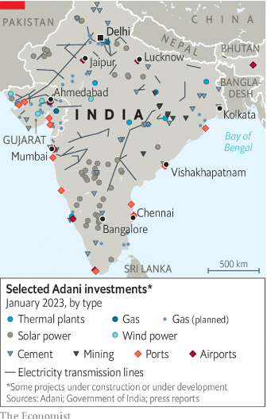  
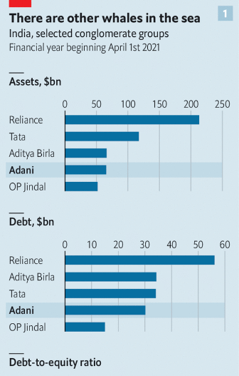  
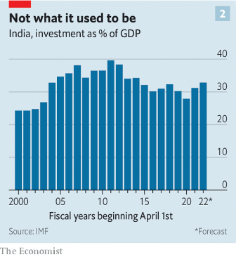  

### 6. Europe
#### 6.1 [The earthquakes in Turkey and Syria have shaken both countries](https://www.economist.com/europe/2023/02/09/the-earthquakes-in-turkey-and-syria-have-shaken-both-countries)
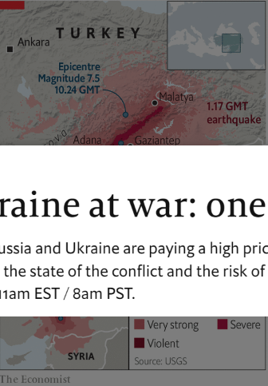  

#### 6.2 [Russia’s technocrats keep funds flowing for Vladimir Putin’s war](https://www.economist.com/europe/2023/02/04/russias-technocrats-keep-funds-flowing-for-vladimir-putins-war)
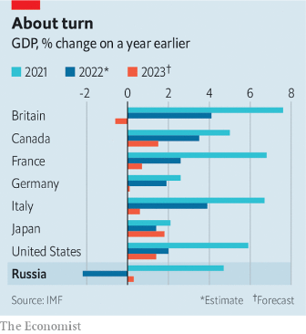  

#### 6.3 [Thousands of Ukrainian soldiers are suffering with PTSD](https://www.economist.com/europe/2023/02/09/thousands-of-ukrainian-soldiers-are-suffering-with-ptsd)

#### 6.4 [Why France is arguing about work, and the right to be lazy](https://www.economist.com/europe/2023/02/06/why-france-is-arguing-about-work-and-the-right-to-be-lazy)

#### 6.5 [Europe should not respond to America’s subsidies binge with its own blunders](https://www.economist.com/europe/2023/02/09/europe-should-not-respond-to-americas-subsidies-binge-with-its-own-blunders)

### 7. Britain
#### 7.1 [The British government is planning another crackdown on asylum-seekers](https://www.economist.com/britain/2023/02/08/the-british-government-is-planning-another-crackdown-on-asylum-seekers)
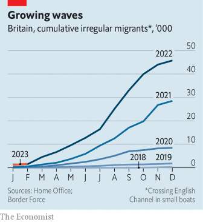  

#### 7.2 [Volodymyr Zelensky visits Britain](https://www.economist.com/britain/2023/02/09/volodymyr-zelensky-visits-britain)

#### 7.3 [Steelmaking in Britain has to get greener. But who’ll pay?](https://www.economist.com/britain/2023/02/09/steelmaking-in-britain-has-to-get-greener-but-wholl-pay)
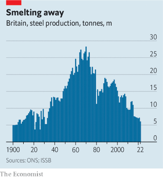  

#### 7.4 [The technology that can help British hospitals work better](https://www.economist.com/britain/2023/02/09/the-technology-that-can-help-british-hospitals-work-better)

#### 7.5 [Shamanism is Britain’s fastest-growing religion](https://www.economist.com/britain/2023/02/09/shamanism-is-britains-fastest-growing-religion)

#### 7.6 [The heat-pump challenge in Britain](https://www.economist.com/britain/2023/02/06/the-heat-pump-challenge-in-britain)
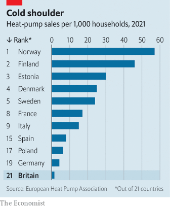  

#### 7.7 [The Conservative Party’s morbid symptoms](https://www.economist.com/britain/2023/02/07/the-conservative-partys-morbid-symptoms)

### 8. United States
#### 8.1 [American universities are hiring based on devotion to diversity](https://www.economist.com/united-states/2023/02/04/american-universities-are-hiring-based-on-devotion-to-diversity)

#### 8.2 [Joe Biden is not quitting fossil fuels](https://www.economist.com/united-states/2023/02/09/joe-biden-is-not-quitting-fossil-fuels)

#### 8.3 [The history and limits of America’s favourite new economic weapon](https://www.economist.com/united-states/2023/02/08/the-history-and-limits-of-americas-favourite-new-economic-weapon)

#### 8.4 [A new primary calendar gives black Democrats an earlier say for 2024](https://www.economist.com/united-states/2023/02/09/a-new-primary-calendar-gives-black-democrats-an-earlier-say-for-2024)

#### 8.5 [The Murdaugh trial and small-town power](https://www.economist.com/united-states/2023/02/09/the-murdaugh-trial-and-small-town-power)

#### 8.6 [History may yet judge Joe Biden’s presidency as transformational](https://www.economist.com/united-states/2023/02/08/history-may-yet-judge-joe-bidens-presidency-as-transformational)

### 9. Middle East & Africa
#### 9.1 [After decades of empty talk, reforms in Gulf states are real—but risky](https://www.economist.com/middle-east-and-africa/2023/02/09/after-decades-of-empty-talk-reforms-in-gulf-states-are-real-but-risky)
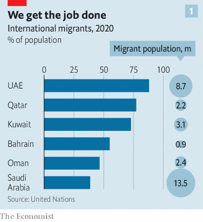  
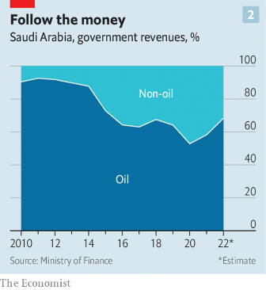  

#### 9.2 [Taking stock of America’s flagship trade programme for Africa](https://www.economist.com/middle-east-and-africa/2023/02/09/taking-stock-of-americas-flagship-trade-programme-for-africa)
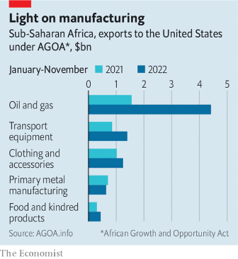  

### 10. The Americas
#### 10.1 [Can Colombia’s mercurial president bring “total peace”?](https://www.economist.com/the-americas/2023/02/08/can-colombias-mercurial-president-bring-total-peace)
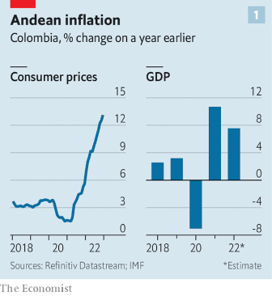  
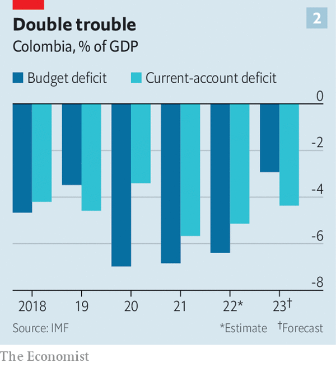  
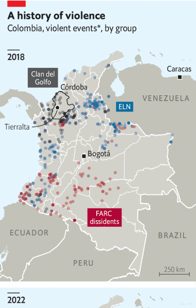  

#### 10.2 [Brazil’s new president is visiting Joe Biden to boost relations](https://www.economist.com/the-americas/2023/02/09/brazils-new-president-is-visiting-joe-biden-to-boost-relations)

### 11. Asia
#### 11.1 [Pakistan is at risk of default](https://www.economist.com/asia/2023/02/07/pakistan-is-at-risk-of-default)
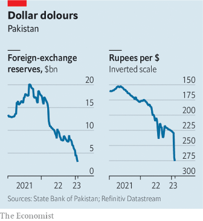  

#### 11.2 [Indian investors pile in to women’s cricket](https://www.economist.com/asia/2023/02/09/indian-investors-pile-in-to-womens-cricket)

#### 11.3 [Japanese workers are seeking higher wages overseas](https://www.economist.com/asia/2023/02/09/japanese-workers-are-seeking-higher-wages-overseas)

#### 11.4 [Squashing dissidents in Uzbekistan](https://www.economist.com/asia/2023/02/09/squashing-dissidents-in-uzbekistan)

#### 11.5 [Democracy is reviving in Asia](https://www.economist.com/asia/2023/02/09/democracy-is-reviving-in-asia)

### 12. China
#### 12.1 [Tensions will linger over a Chinese balloon downed by America](https://www.economist.com/china/2023/02/09/tensions-will-linger-over-a-chinese-balloon-downed-by-america)

#### 12.2 [Hong Kong starts its largest national-security trial](https://www.economist.com/china/2023/02/09/hong-kong-starts-its-largest-national-security-trial)

#### 12.3 [A hit film recalling an ancient poem fuels Chinese nationalist fervour](https://www.economist.com/china/2023/02/09/a-hit-film-recalling-an-ancient-poem-fuels-chinese-nationalist-fervour)

#### 12.4 [The lessons from the Chinese spy balloon](https://www.economist.com/china/2023/02/07/the-lessons-from-the-chinese-spy-balloon)

### 13. International
#### 13.1 [How a tide of tech money is transforming charity](https://www.economist.com/international/2023/02/09/how-a-tide-of-tech-money-is-transforming-charity)
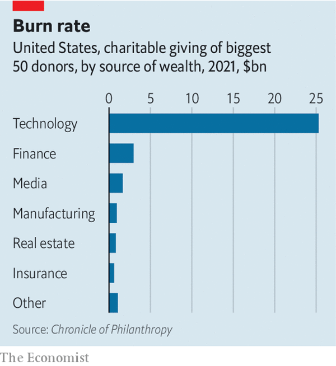  

### 14. Business
#### 14.1 [Is Google’s 20-year dominance of search in peril?](https://www.economist.com/business/2023/02/08/is-googles-20-year-search-dominance-about-to-end)
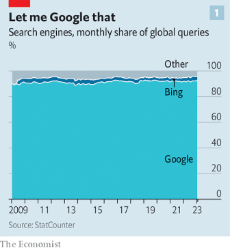  
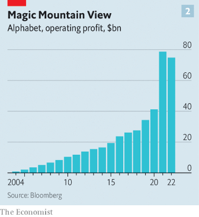  
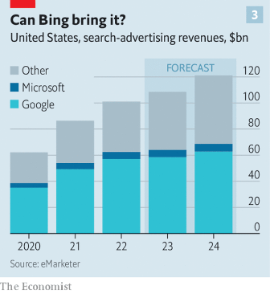  

#### 14.2 [Alleged fraud at a Brazilian retailer sparks a corporate reckoning](https://www.economist.com/business/2023/02/09/alleged-fraud-at-a-brazilian-retailer-sparks-a-corporate-reckoning)

#### 14.3 [The pitfalls of loving your job a little too much](https://www.economist.com/business/2023/02/09/the-pitfalls-of-loving-your-job-a-little-too-much)

#### 14.4 [Where on Earth is big oil spending its $150bn profit bonanza?](https://www.economist.com/business/2023/02/06/where-on-earth-is-big-oil-spending-its-150bn-profit-bonanza)
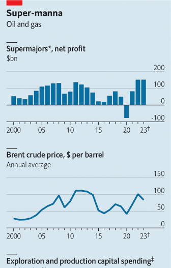  
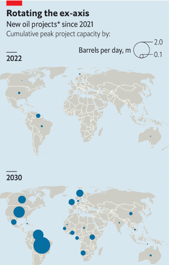  

#### 14.5 [What would Joseph Schumpeter have made of Apple?](https://www.economist.com/business/2023/02/09/what-would-joseph-schumpeter-have-made-of-apple)

### 15. Finance & economics
#### 15.1 [China’s ultra-fast economic recovery](https://www.economist.com/finance-and-economics/2023/02/05/chinas-ultra-fast-economic-recovery)
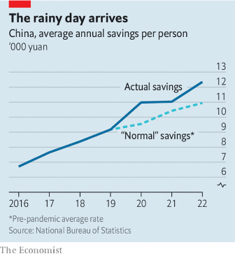  
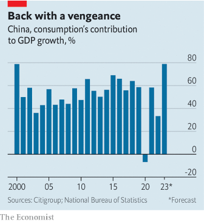  

#### 15.2 [South Korea’s housing crunch offers a warning for other countries](https://www.economist.com/finance-and-economics/2023/02/09/south-koreas-housing-crunch-offers-a-warning-for-other-countries)
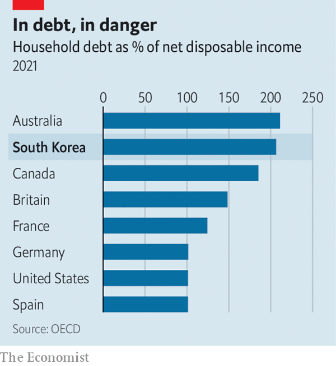  

#### 15.3 [Surging stocks undermine a hallowed investing rule](https://www.economist.com/finance-and-economics/2023/02/07/surging-stocks-undermine-a-hallowed-investing-rule)

#### 15.4 [City centres: from offices to family homes](https://www.economist.com/finance-and-economics/2023/02/09/city-centres-from-offices-to-family-homes)

#### 15.5 [The Federal Reserve’s $2.5trn question](https://www.economist.com/finance-and-economics/2023/02/09/the-federal-reserves-25trn-question)
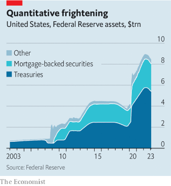  

#### 15.6 [Google, Microsoft and the threat from overmighty trustbusters](https://www.economist.com/finance-and-economics/2023/02/09/google-microsoft-and-the-threat-from-overmighty-trustbusters)

### 16. Science & technology
#### 16.1 [How to predict record-shattering weather events](https://www.economist.com/science-and-technology/2023/02/08/extreme-weather-events-are-getting-more-frequent)
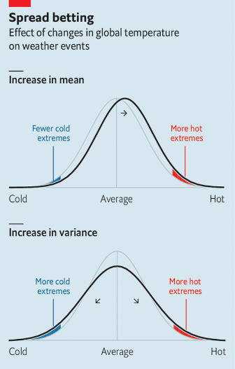  

#### 16.2 [DARPA, lasers and an internet in orbit](https://www.economist.com/science-and-technology/2023/02/08/darpa-lasers-and-an-internet-in-orbit)

### 17. Culture
#### 17.1 [A television show about Jesus Christ has become an unlikely hit](https://www.economist.com/culture/2023/02/08/a-television-show-about-jesus-christ-has-become-an-unlikely-hit)

#### 17.2 [A new history focuses on the collaborators in the Holocaust](https://www.economist.com/culture/2023/02/08/a-new-history-focuses-on-the-collaborators-in-the-holocaust)

#### 17.3 [Salman Rushdie’s new novel is an ode to storytelling and freedom](https://www.economist.com/culture/2023/02/08/salman-rushdies-new-novel-is-an-ode-to-storytelling-and-freedom)

#### 17.4 [Thai restaurateurs and British pubs have proved a perfect pairing](https://www.economist.com/culture/2023/02/08/thai-restaurateurs-and-british-pubs-have-proved-a-perfect-pairing)

#### 17.5 [Anaximander is a hero in the development of scientific thinking](https://www.economist.com/culture/2023/02/08/anaximander-is-a-hero-in-the-development-of-scientific-thinking)

#### 17.6 [The genius of Johannes Vermeer is on display as never before](https://www.economist.com/culture/2023/02/08/the-genius-of-johannes-vermeer-is-on-display-as-never-before)

### 18. Economic & financial indicators
#### 18.1 [Economic data, commodities and markets](https://www.economist.com/economic-and-financial-indicators/2023/02/09/economic-data-commodities-and-markets)
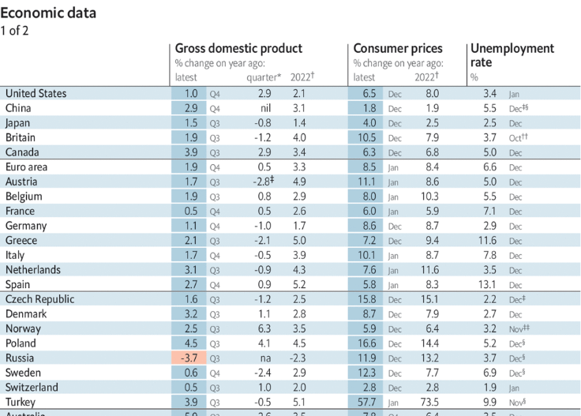  
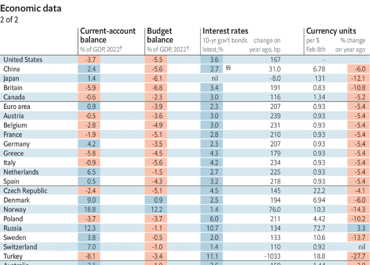  
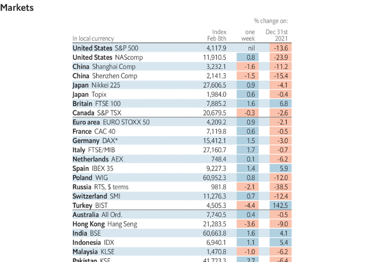  
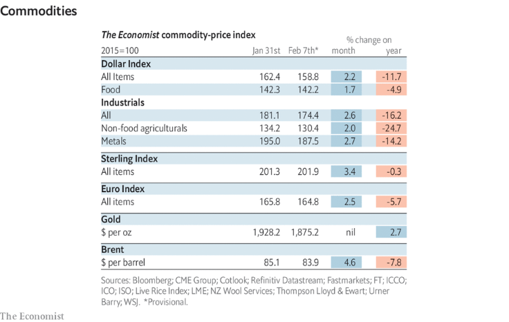  

### 19. Graphic detail
#### 19.1 [Turkey sits at the crossroads of tectonic plates as well as civilisations](https://www.economist.com/graphic-detail/2023/02/09/turkey-sits-at-the-crossroads-of-tectonic-plates-as-well-as-civilisations)

### 20. The Economist explains
#### 20.1 [What is short-selling?](https://www.economist.com/the-economist-explains/2023/02/08/what-is-short-selling)

#### 20.2 [How drones dogfight above Ukraine](https://www.economist.com/the-economist-explains/2023/02/07/how-drones-dogfight-above-ukraine)

### 21. Obituary
#### 21.1 [Pervez Musharraf was one of Pakistan’s better dictators](https://www.economist.com/obituary/2023/02/09/pervez-musharraf-was-one-of-pakistans-better-dictators)

