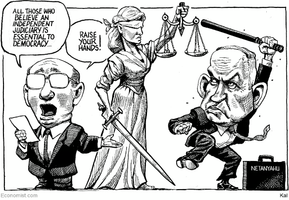
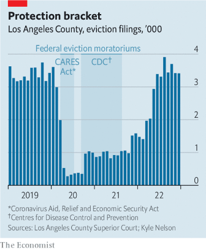

### 1. The world this week
#### 1.1 [Politics](https://www.economist.com/the-world-this-week/2023/02/16/politics)

#### 1.2 [Business](https://www.economist.com/the-world-this-week/2023/02/16/business)
  

#### 1.3 [KAL’s cartoon](https://www.economist.com/the-world-this-week/2023/02/16/kals-cartoon)
  

#### 1.4 [This week’s cover](https://www.economist.com/the-world-this-week/2023/02/16/this-weeks-cover)

### 2. Leaders
#### 2.1 [Inflation will be harder to bring down than markets think](https://www.economist.com/leaders/2023/02/16/inflation-will-be-harder-to-bring-down-than-markets-think)

#### 2.2 [Nicola Sturgeon’s resignation is part of Britain’s great moderation](https://www.economist.com/leaders/2023/02/15/nicola-sturgeons-resignation-is-part-of-britains-great-moderation)

#### 2.3 [Israel’s proposed legal reforms are a dreadful answer to a real problem](https://www.economist.com/leaders/2023/02/15/israels-proposed-legal-reforms-are-a-dreadful-answer-to-a-real-problem)

#### 2.4 [The world won’t decarbonise fast enough unless renewables make real money](https://www.economist.com/leaders/2023/02/16/the-world-wont-decarbonise-fast-enough-unless-renewables-make-real-money)
  

#### 2.5 [Nigeria desperately needs a new kind of leadership](https://www.economist.com/leaders/2023/02/16/nigeria-desperately-needs-a-new-kind-of-leadership)

### 3. Letters
#### 3.1 [Letters to the editor](https://www.economist.com/letters/2023/02/16/letters-to-the-editor)

### 4. By Invitation
#### 4.1 [Asiwaju Bola Tinubu on why he is running to be Nigeria’s president](https://www.economist.com/by-invitation/2023/02/15/asiwaju-bola-tinubu-on-why-he-is-running-to-be-nigerias-president)

#### 4.2 [Peter Obi on why he is running to be Nigeria’s president](https://www.economist.com/by-invitation/2023/02/15/peter-obi-on-why-he-is-running-to-be-nigerias-president)

#### 4.3 [The overhaul of Israel’s judiciary will maim its democracy, says Polly Bronstein](https://www.economist.com/by-invitation/2023/02/14/the-overhaul-of-israels-judiciary-will-maim-its-democracy-says-polly-bronstein)

### 5. Briefing
#### 5.1 [Lots of investors think inflation is under control. Not so fast](https://www.economist.com/briefing/2023/02/16/lots-of-investors-think-inflation-is-under-control-not-so-fast)
  
  
  
  

### 6. Europe
#### 6.1 [Why there are so few babies in southern Europe](https://www.economist.com/europe/2023/02/16/why-there-are-so-few-babies-in-southern-europe)
  
  

#### 6.2 [Turkey’s earthquakes show the deadly extent of construction scams](https://www.economist.com/europe/2023/02/12/turkeys-earthquakes-show-the-deadly-extent-of-construction-scams)

#### 6.3 [Moldova fears it may fall victim to a Russian coup plot](https://www.economist.com/europe/2023/02/13/moldova-fears-it-may-fall-victim-to-a-russian-coup-plot)

#### 6.4 [Poland’s rule-of-law conflict with the EU is coming to a head](https://www.economist.com/europe/2023/02/16/polands-rule-of-law-conflict-with-the-eu-is-coming-to-a-head)

#### 6.5 [Trouble at Italy’s San Remo song festival](https://www.economist.com/europe/2023/02/16/trouble-at-italys-san-remo-song-festival)

#### 6.6 [What’s behind France’s fatal fascination with Russia](https://www.economist.com/europe/2023/02/16/whats-behind-frances-fatal-fascination-with-russia)

### 7. Britain
#### 7.1 [Nicola Sturgeon leaves with Scotland split in two](https://www.economist.com/britain/2023/02/15/nicola-sturgeon-leaves-with-scotland-split-in-two)
  

#### 7.2 [Britons take against asylum hotels](https://www.economist.com/britain/2023/02/16/britons-take-against-asylum-hotels)

#### 7.3 [The shape of the post-pandemic economy in Britain](https://www.economist.com/britain/2023/02/16/the-shape-of-the-post-pandemic-economy-in-britain)
  

#### 7.4 [The mystery of the twitching crabs](https://www.economist.com/britain/2023/02/16/the-mystery-of-the-twitching-crabs)

#### 7.5 [Britain could soon give up its last African colony](https://www.economist.com/britain/2023/02/13/britain-could-soon-give-up-its-last-african-colony)
  

#### 7.6 [The Brexit Re-enactment Society](https://www.economist.com/britain/2023/02/14/the-brexit-re-enactment-society)

### 8. United States
#### 8.1 [Nikki Haley’s bid illustrates the problems of the Republican Party](https://www.economist.com/united-states/2023/02/14/nikki-haleys-bid-illustrates-the-problems-of-the-republican-party)

#### 8.2 [Pandemic eviction bans have spawned a renters’-rights movement](https://www.economist.com/united-states/2023/02/16/pandemic-eviction-bans-have-spawned-a-renters-rights-movement)
  

#### 8.3 [In the wake of violence American cities resort to youth curfews](https://www.economist.com/united-states/2023/02/16/in-the-wake-of-violence-american-cities-resort-to-youth-curfews)

#### 8.4 [Should tech platforms be liable for the content they carry?](https://www.economist.com/united-states/2023/02/16/should-tech-platforms-be-liable-for-the-content-they-carry)

#### 8.5 [Volunteers teach debating skills to America’s incarcerated](https://www.economist.com/united-states/2023/02/16/volunteers-teach-debating-skills-to-americas-incarcerated)

#### 8.6 [What America has been shooting down in the sky](https://www.economist.com/united-states/2023/02/15/what-america-has-been-shooting-down-in-the-sky)

#### 8.7 [Why proposed laws targeting drag shows are proliferating in America](https://www.economist.com/united-states/2023/02/12/why-proposed-laws-targeting-drag-shows-are-proliferating-in-america)
  

### 9. Middle East & Africa
#### 9.1 [Can a political underdog save Nigeria?](https://www.economist.com/interactive/middle-east-and-africa/2023/02/14/can-a-political-underdog-save-nigeria)

#### 9.2 [Proposed legal reforms could be dire for Israel](https://www.economist.com/middle-east-and-africa/2023/02/16/proposed-legal-reforms-could-be-dire-for-israel)

#### 9.3 [Bashar al-Assad does not want to let a calamity go to waste](https://www.economist.com/middle-east-and-africa/2023/02/16/bashar-al-assad-does-not-want-to-let-a-calamity-go-to-waste)

### 10. The Americas
#### 10.1 [Latin America’s left-wing presidents risk stoking inflation](https://www.economist.com/the-americas/2023/02/15/latin-americas-left-wing-presidents-risk-stoking-inflation)
  
  

#### 10.2 [Daniel Ortega expels 222 political prisoners from Nicaragua](https://www.economist.com/the-americas/2023/02/16/daniel-ortega-expels-222-political-prisoners-from-nicaragua)

#### 10.3 [Latin America’s prisons are overcrowded and violent](https://www.economist.com/the-americas/2023/02/16/latin-americas-prisons-are-overcrowded-and-violent)

### 11. Asia
#### 11.1 [India and Pakistan are choking on each other’s pollution](https://www.economist.com/asia/2023/02/13/india-and-pakistan-are-choking-on-each-others-pollution)
  

#### 11.2 [The Taliban are digging an enormous canal](https://www.economist.com/asia/2023/02/16/the-taliban-are-digging-an-enormous-canal)

#### 11.3 [Australia re-bans alcohol in some Aboriginal communities](https://www.economist.com/asia/2023/02/16/australia-re-bans-alcohol-in-some-aboriginal-communities)

#### 11.4 [After silencing critics at home, Narendra Modi goes after foreign media](https://www.economist.com/asia/2023/02/16/after-silencing-critics-at-home-narendra-modi-goes-after-foreign-media)

### 12. China
#### 12.1 [How China’s police are ensnaring thousands of suspects abroad](https://www.economist.com/china/2023/02/14/how-chinas-police-are-ensnaring-thousands-of-suspects-abroad)

#### 12.2 [How much of a concern are China’s overseas police stations?](https://www.economist.com/china/2023/02/16/how-much-of-a-concern-are-chinas-overseas-police-stations)

#### 12.3 [Chinese propaganda is surprisingly effective abroad](https://www.economist.com/china/2023/02/16/chinese-propaganda-is-surprisingly-effective-abroad)

#### 12.4 [China is losing Taiwanese heart and minds](https://www.economist.com/china/2023/02/16/china-is-losing-taiwanese-heart-and-minds)

### 13. International
#### 13.1 [Throughout the rich world, the young are falling out of love with cars](https://www.economist.com/international/2023/02/16/throughout-the-rich-world-the-young-are-falling-out-of-love-with-cars)

### 14. Business
#### 14.1 [What Tencent’s rebound says about prospects for China’s big tech](https://www.economist.com/what-tencents-rebound-says-about-prospects-for-chinas-big-tech)
  
  

#### 14.2 [What European business makes of the green-subsidy race](https://www.economist.com/business/2023/02/14/what-european-business-makes-of-the-green-subsidy-race)
  

#### 14.3 [Adani companies’ decent earnings offer only moderate relief](https://www.economist.com/business/2023/02/16/adani-companies-decent-earnings-offer-only-moderate-relief)
  

#### 14.4 [Corporate intrigue at the heart of K-pop](https://www.economist.com/business/2023/02/16/corporate-intrigue-at-the-heart-of-k-pop)

#### 14.5 [Bob Iger makes big changes at Disney](https://www.economist.com/business/2023/02/16/bob-iger-makes-big-changes-at-disney)
  

#### 14.6 [Why it’s time to get shot of coffee meetings at work](https://www.economist.com/business/2023/02/16/why-its-time-to-get-shot-of-coffee-meetings-at-work)

#### 14.7 [AI-wielding tech firms are giving a new shape to modern warfare](https://www.economist.com/business/2023/02/16/ai-wielding-tech-firms-are-giving-a-new-shape-to-modern-warfare)

### 15. Finance & economics
#### 15.1 [War and subsidies have turbocharged the green transition](https://www.economist.com/finance-and-economics/2023/02/13/war-and-subsidies-have-turbocharged-the-green-transition)
  
  
  

#### 15.2 [Cobalt, a crucial battery material, is suddenly superabundant](https://www.economist.com/finance-and-economics/2023/02/16/cobalt-a-crucial-battery-material-is-suddenly-superabundant)
  

#### 15.3 [Scrutiny of major crypto institutions is intensifying](https://www.economist.com/finance-and-economics/2023/02/16/scrutiny-of-major-crypto-institutions-is-intensifying)

#### 15.4 [Why more Chinese tourism means more capital flight](https://www.economist.com/finance-and-economics/2023/02/16/why-more-chinese-tourism-means-more-capital-flight)

#### 15.5 [Investors expect the economy to avoid recession](https://www.economist.com/finance-and-economics/2023/02/15/investors-expect-the-economy-to-avoid-recession)

#### 15.6 [The World Bank’s embattled chief steps down](https://www.economist.com/finance-and-economics/2023/02/16/the-world-banks-embattled-chief-steps-down)

#### 15.7 [Lael Brainard will take control of America’s economic nerve centre](https://www.economist.com/finance-and-economics/2023/02/15/lael-brainard-will-take-control-of-americas-economic-nerve-centre)

#### 15.8 [The case for globalisation optimism](https://www.economist.com/finance-and-economics/2023/02/16/the-case-for-globalisation-optimism)

### 16. Science & technology
#### 16.1 [A new way to clean up the steel industry](https://www.economist.com/science-and-technology/2023/02/15/a-new-way-to-clean-up-the-steel-industry)
  

#### 16.2 [A step towards a contraceptive pill for men?](https://www.economist.com/science-and-technology/2023/02/15/a-step-towards-a-contraceptive-pill-for-men)

#### 16.3 [Vaccines based on mRNA need to get out of the freezer](https://www.economist.com/science-and-technology/2023/02/16/vaccines-based-on-mrna-need-to-get-out-of-the-freezer)

#### 16.4 [Plants call for help with a chemical employed by people as a drug](https://www.economist.com/science-and-technology/2023/02/15/plants-call-for-help-with-a-chemical-employed-by-people-as-a-drug)

#### 16.5 [Two of the most enigmatic phenomena in the cosmos may be linked](https://www.economist.com/science-and-technology/2023/02/15/two-of-the-most-enigmatic-phenomena-in-the-cosmos-may-be-linked)

### 17. Culture
#### 17.1 [A portrait of the Russian artist in the age of Z](https://www.economist.com/culture/2023/02/16/a-portrait-of-the-russian-artist-in-the-age-of-z)

#### 17.2 [William Byrd was a favourite composer of Elizabeth I](https://www.economist.com/culture/2023/02/16/william-byrd-was-a-favourite-composer-of-elizabeth-i)

#### 17.3 [“My Nemesis” is a tale of middle age, femininity and desire](https://www.economist.com/culture/2023/02/16/my-nemesis-is-a-tale-of-middle-age-femininity-and-desire)

#### 17.4 [American business and propaganda for free markets](https://www.economist.com/culture/2023/02/16/american-business-and-propaganda-for-free-markets)

#### 17.5 [An author reconstructs the life of her murdered sister](https://www.economist.com/culture/2023/02/16/an-author-reconstructs-the-life-of-her-murdered-sister)

#### 17.6 [If stigma is the problem, using different words may not help](https://www.economist.com/culture/2023/02/16/if-stigma-is-the-problem-using-different-words-may-not-help)

### 18. Economic & financial indicators
#### 18.1 [Economic data, commodities and markets](https://www.economist.com/economic-and-financial-indicators/2023/02/16/economic-data-commodities-and-markets)
  
  
  
  

### 19. Graphic detail
#### 19.1 [Poor areas suffered 3.5 times more damage in Turkey’s earthquake](https://www.economist.com/graphic-detail/2023/02/16/poor-areas-suffered-35-times-more-damage-in-turkeys-earthquake)

### 20. The Economist explains
#### 20.1 [Will avian flu be the next human pandemic?](https://www.economist.com/the-economist-explains/2023/02/14/will-avian-flu-be-the-next-human-pandemic)

### 21. Obituary
#### 21.1 [Maya Widmaier-Picasso helped to revive her father’s creativity](https://www.economist.com/obituary/2023/02/16/maya-widmaier-picasso-helped-to-revive-her-fathers-creativity)

