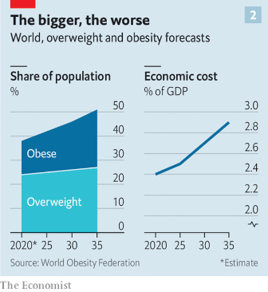
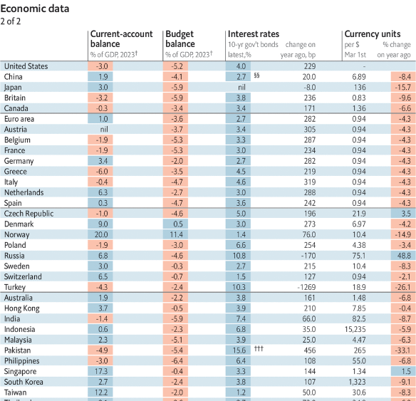

### 1. The world this week
#### 1.1 [Politics](https://www.economist.com/the-world-this-week/2023/03/02/politics)

#### 1.2 [Business](https://www.economist.com/the-world-this-week/2023/03/02/business)
  

#### 1.3 [KAL’s cartoon](https://www.economist.com/the-world-this-week/2023/03/02/kals-cartoon)
  

#### 1.4 [This week’s cover](https://www.economist.com/the-world-this-week/2023/03/02/this-weeks-cover)

### 2. Leaders
#### 2.1 [New drugs could spell an end to the world’s obesity epidemic](https://www.economist.com/leaders/2023/03/02/new-drugs-could-spell-an-end-to-the-worlds-obesity-epidemic)

#### 2.2 [The new Brexit deal is the best Britain can expect. Support it](https://www.economist.com/leaders/2023/02/27/the-new-brexit-deal-is-the-best-britain-can-expect-support-it)

#### 2.3 [Is Bangladesh’s admired growth model coming unstuck?](https://www.economist.com/leaders/2023/03/02/is-bangladeshs-admired-growth-model-coming-unstuck)
  

#### 2.4 [The tech slump is encouraging venture capital to rediscover old ways](https://www.economist.com/leaders/2023/03/02/the-tech-slump-is-encouraging-venture-capital-to-rediscover-old-ways)

#### 2.5 [Saving the rainforests would be a bargain](https://www.economist.com/leaders/2023/03/02/saving-the-rainforests-would-be-a-bargain)

### 3. Letters
#### 3.1 [Letters to the editor](https://www.economist.com/letters/2023/03/02/letters-to-the-editor)

### 4. By Invitation
#### 4.1 [Brian Lande and Jeff Rojek believe that American police need better training](https://www.economist.com/by-invitation/2023/02/24/brian-lande-and-jeff-rojek-believe-that-american-police-need-better-training)

### 5. Briefing
#### 5.1 [A new class of drugs for weight loss could end obesity](https://www.economist.com/briefing/2023/03/02/a-new-class-of-drugs-for-weight-loss-could-end-obesity)
  
  
  

### 6. Europe
#### 6.1 [The war in Ukraine has made eastern Europe stronger](https://www.economist.com/europe/2023/02/27/the-war-in-ukraine-has-made-eastern-europe-stronger)
  
  
  

#### 6.2 [Ukraine finds stepping up mobilisation is not so easy](https://www.economist.com/europe/2023/02/26/ukraine-finds-stepping-up-mobilisation-is-not-so-easy)

#### 6.3 [Syrian earthquake survivors in Turkey have nowhere to go](https://www.economist.com/europe/2023/03/02/syrian-earthquake-survivors-in-turkey-have-nowhere-to-go)

#### 6.4 [Italy’s largest opposition party gets a young and radical new leader](https://www.economist.com/europe/2023/02/27/italys-largest-opposition-party-gets-a-young-and-radical-new-leader)

#### 6.5 [After seven years of Brexit talks, Europe has emerged as the clear winner](https://www.economist.com/europe/2023/03/02/after-seven-years-of-brexit-talks-europe-has-emerged-as-the-clear-winner)

### 7. Britain
#### 7.1 [Britain’s stockmarket has languished. Its gilt market may be next](https://www.economist.com/britain/2023/03/02/britains-stockmarket-has-languished-its-gilt-market-may-be-next)
  
  

#### 7.2 [Explaining what is in the Windsor framework](https://www.economist.com/britain/2023/03/02/explaining-what-is-in-the-windsor-framework)

#### 7.3 [Britain’s tomatoes are a victim of the energy crisis](https://www.economist.com/britain/2023/03/02/britains-tomatoes-are-a-victim-of-the-energy-crisis)

#### 7.4 [Nicola Sturgeon’s modest record of reform](https://www.economist.com/britain/2023/03/02/nicola-sturgeons-modest-record-of-reform)

#### 7.5 [Can Britain and France put their differences behind them?](https://www.economist.com/britain/2023/03/02/can-britain-and-france-put-their-differences-behind-them)

#### 7.6 [God’s pronouns are causing conniptions in Britain](https://www.economist.com/britain/2023/03/02/gods-pronouns-are-causing-conniptions-in-britain)

#### 7.7 [How Britain’s Conservative Party channels Milhouse from The Simpsons](https://www.economist.com/britain/2023/03/02/how-britains-conservative-party-channels-milhouse-from-the-simpsons)

### 8. United States
#### 8.1 [In search of Ron DeSantis’s foreign-policy doctrine](https://www.economist.com/united-states/2023/03/01/in-search-of-ron-desantiss-foreign-policy-doctrine)

#### 8.2 [The Supreme Court looks askance at Biden’s student-debt relief](https://www.economist.com/united-states/2023/02/28/the-supreme-court-looks-askance-at-bidens-student-debt-relief)

#### 8.3 [Scott Adams’s racist comments were spurred by a badly worded poll](https://www.economist.com/united-states/2023/03/02/scott-adamss-racist-comments-were-spurred-by-a-badly-worded-poll)
  

#### 8.4 [Chicago’s mayoral run-off will test the Democrats’ left and right](https://www.economist.com/united-states/2023/03/01/chicagos-mayoral-run-off-will-test-the-democrats-left-and-right)

#### 8.5 [The big American post-Roe battle over abortion pills](https://www.economist.com/united-states/2023/02/26/the-big-american-post-roe-battle-over-abortion-pills)

#### 8.6 [Why Connecticut is exonerating witches](https://www.economist.com/united-states/2023/03/02/why-connecticut-is-exonerating-witches)

#### 8.7 [Biden’s big bet on big government](https://www.economist.com/united-states/2023/03/02/bidens-big-bet-on-big-government)

### 9. Middle East & Africa
#### 9.1 [How America plans to break China’s grip on African minerals](https://www.economist.com/middle-east-and-africa/2023/02/28/how-america-plans-to-break-chinas-grip-on-african-minerals)
  

#### 9.2 [Bola Tinubu, Nigeria’s political kingmaker, wins a flawed election](https://www.economist.com/middle-east-and-africa/2023/03/01/bola-tinubu-nigerias-political-kingmaker-wins-a-flawed-election)

#### 9.3 [A new type of Palestinian militia is emerging](https://www.economist.com/middle-east-and-africa/2023/03/02/a-new-type-of-palestinian-militia-is-emerging)

#### 9.4 [Tunisia’s autocratic ruler adopts the “Great Replacement” theory](https://www.economist.com/middle-east-and-africa/2023/03/02/tunisias-autocratic-ruler-adopts-the-great-replacement-theory)

#### 9.5 [Why Baghdad may have the worst traffic in the Middle East](https://www.economist.com/middle-east-and-africa/2023/03/02/why-baghdad-may-have-the-worst-traffic-in-the-middle-east)

### 10. The Americas
#### 10.1 [Brazil’s new president may soon face another threat: his predecessor](https://www.economist.com/the-americas/2023/03/02/brazils-new-president-may-soon-face-another-threat-his-predecessor)

#### 10.2 [Mexico’s government has attacked the country’s electoral watchdog](https://www.economist.com/the-americas/2023/03/02/mexicos-government-has-attacked-the-countrys-electoral-watchdog)

### 11. Asia
#### 11.1 [Bangladesh’s economic miracle is in jeopardy](https://www.economist.com/asia/2023/03/01/bangladeshs-economic-miracle-is-in-jeopardy)
  
  

#### 11.2 [India’s G20 presidency will be a win for Narendra Modi](https://www.economist.com/asia/2023/02/28/indias-g20-presidency-will-be-a-win-for-narendra-modi)

#### 11.3 [South-East Asia is crying out for regional leadership](https://www.economist.com/asia/2023/03/02/south-east-asia-is-crying-out-for-regional-leadership)

#### 11.4 [Young South Koreans are embracing fractional investing](https://www.economist.com/asia/2023/03/02/young-south-koreans-are-embracing-fractional-investing)

#### 11.5 [New Zealand is right to atone for its colonial crimes in the Pacific](https://www.economist.com/asia/2023/03/02/new-zealand-is-right-to-atone-for-its-colonial-crimes-in-the-pacific)

### 12. China
#### 12.1 [China’s prime minister, Li Keqiang, is about to retire](https://www.economist.com/china/2023/03/02/chinas-prime-minister-li-keqiang-is-about-to-retire)
  

#### 12.2 [Chinese arms could revive Russia’s failing war](https://www.economist.com/china/2023/03/02/chinese-arms-could-revive-russias-failing-war)
  

#### 12.3 [How to prevent sycophancy in China’s civil service](https://www.economist.com/china/2023/03/02/how-to-prevent-sycophancy-in-chinas-civil-service)

#### 12.4 [Why aren’t China and America more afraid of a war?](https://www.economist.com/china/2023/03/02/why-arent-china-and-america-more-afraid-of-a-war)

### 13. International
#### 13.1 [The biggest obstacle to saving rainforests is lawlessness](https://www.economist.com/international/2023/02/27/the-biggest-obstacle-to-saving-rainforests-is-lawlessness)
  
  

### 14. Business
#### 14.1 [How the titans of tech investing are staying warm over the VC winter](https://www.economist.com/business/2023/02/26/how-the-titans-of-tech-investing-are-staying-warm-over-the-vc-winter)
  
  
  

#### 14.2 [Investors are going nuts for ChatGPT-ish artificial intelligence](https://www.economist.com/business/2023/02/28/investors-are-going-nuts-for-chatgpt-ish-artificial-intelligence)
  

#### 14.3 [Foreign investors are being snagged by India’s tax net](https://www.economist.com/business/2023/03/02/foreign-investors-are-being-snagged-by-indias-tax-net)

#### 14.4 [Artificial intelligence is reaching behind newspaper paywalls](https://www.economist.com/business/2023/03/02/artificial-intelligence-is-reaching-behind-newspaper-paywalls)

#### 14.5 [The uses and abuses of hype](https://www.economist.com/business/2023/03/02/the-uses-and-abuses-of-hype)

#### 14.6 [Lessons from Novo Nordisk on the stampede for obesity drugs](https://www.economist.com/business/2023/03/02/lessons-from-novo-nordisk-on-the-stampede-for-obesity-drugs)

### 15. Finance & economics
#### 15.1 [America’s property market suggests recession is on the way](https://www.economist.com/finance-and-economics/2023/03/01/americas-property-market-suggests-recession-is-on-the-way)
  

#### 15.2 [Russia’s sanctions-dodging is getting ever more sophisticated](https://www.economist.com/finance-and-economics/2023/03/02/russias-sanctions-dodging-is-getting-ever-more-sophisticated)

#### 15.3 [The anti-ESG industry is taking investors for a ride](https://www.economist.com/finance-and-economics/2023/03/02/the-anti-esg-industry-is-taking-investors-for-a-ride)

#### 15.4 [China’s cities are on the verge of a debt crisis](https://www.economist.com/finance-and-economics/2023/02/27/chinas-cities-are-on-the-verge-of-a-debt-crisis)

#### 15.5 [Is India’s boom helping the poor?](https://www.economist.com/finance-and-economics/2023/03/02/is-indias-boom-helping-the-poor)

#### 15.6 [David Solomon lacks answers for Goldman Sachs’s angry investors](https://www.economist.com/finance-and-economics/2023/03/01/david-solomon-lacks-answers-for-goldman-sachss-angry-investors)

#### 15.7 [Ajay Banga may be just what the fractious World Bank requires](https://www.economist.com/finance-and-economics/2023/03/02/ajay-banga-may-be-just-what-the-fractious-world-bank-requires)
  

#### 15.8 [The case against Google hinges on an antitrust “mistake”](https://www.economist.com/finance-and-economics/2023/03/02/the-case-against-google-hinges-on-an-antitrust-mistake)

### 16. Science & technology
#### 16.1 [Firms search for greener supplies of graphite for EV batteries](https://www.economist.com/science-and-technology/2023/03/01/firms-search-for-greener-supplies-of-graphite-for-ev-batteries)

#### 16.2 [The origin of grapevines is a tangled vine itself](https://www.economist.com/science-and-technology/2023/03/02/the-origin-of-grapevines-is-a-tangled-vine-itself)

#### 16.3 [Antarctic rocks can help sort stone tools from natural lookalikes](https://www.economist.com/science-and-technology/2023/03/01/antarctic-rocks-can-help-sort-stone-tools-from-natural-lookalikes)

### 17. Culture
#### 17.1 [Nigel Biggar tries—and fails—to rehabilitate the British Empire](https://www.economist.com/culture/2023/03/02/nigel-biggar-tries-and-fails-to-rehabilitate-the-british-empire)

#### 17.2 [“I Have Some Questions for You” raises lots of them](https://www.economist.com/culture/2023/03/02/i-have-some-questions-for-you-raises-lots-of-them)

#### 17.3 [Three stories of collusion during the second world war](https://www.economist.com/culture/2023/03/02/three-stories-of-collusion-during-the-second-world-war)

#### 17.4 [The defiant artistry of 19th-century African-American potters](https://www.economist.com/culture/2023/03/02/the-defiant-artistry-of-19th-century-african-american-potters)

#### 17.5 [Marcel Marceau was a giant of an underappreciated art form](https://www.economist.com/culture/2023/03/02/marcel-marceau-was-a-giant-of-an-underappreciated-art-form)

### 18. Economic & financial indicators
#### 18.1 [Economic data, commodities and markets](https://www.economist.com/economic-and-financial-indicators/2023/03/02/economic-data-commodities-and-markets)
  
  
  
  

### 19. Graphic detail
#### 19.1 [Places with high religious participation have fewer deaths of despair](https://www.economist.com/graphic-detail/2023/02/27/places-with-high-religious-participation-have-fewer-deaths-of-despair)

### 20. The Economist explains
#### 20.1 [How quickly can Russia rebuild its tank fleet?](https://www.economist.com/the-economist-explains/2023/02/27/how-quickly-can-russia-rebuild-its-tank-fleet)

#### 20.2 [Why statelessness is bad for countries and people](https://www.economist.com/the-economist-explains/2023/02/28/why-statelessness-is-bad-for-countries-and-people)

### 21. Obituary
#### 21.1 [Bernard Ingham and Betty Boothroyd ensured democracy worked as it should](https://www.economist.com/obituary/2023/03/02/bernard-ingham-and-betty-boothroyd-ensured-democracy-worked-as-it-should)

