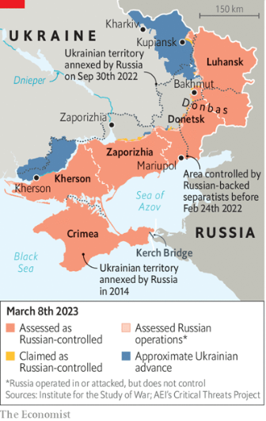
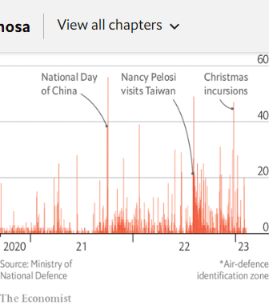

### 1. The world this week
#### 1.1 [Politics](https://www.economist.com/the-world-this-week/2023/03/09/politics)

#### 1.2 [Business](https://www.economist.com/the-world-this-week/2023/03/09/business)
  

#### 1.3 [KAL’s cartoon](https://www.economist.com/the-world-this-week/2023/03/09/kals-cartoon)
  

#### 1.4 [This week’s covers](https://www.economist.com/the-world-this-week/2023/03/09/this-weeks-covers)

### 2. Leaders
#### 2.1 [Britain has endured a decade of early deaths. Why?](https://www.economist.com/leaders/2023/03/09/britain-has-endured-a-decade-of-early-deaths-why)

#### 2.2 [How to avoid war over Taiwan](https://www.economist.com/leaders/2023/03/09/how-to-avoid-war-over-taiwan)

#### 2.3 [A stubbornly strong economy complicates the fight against inflation](https://www.economist.com/leaders/2023/03/08/a-stubbornly-strong-economy-complicates-the-fight-against-inflation)
  

#### 2.4 [Strikes at home and war in Ukraine test the French president](https://www.economist.com/leaders/2023/03/09/strikes-at-home-and-war-in-ukraine-test-the-french-president)

#### 2.5 [American universities are pursuing fairness the wrong way](https://www.economist.com/leaders/2023/03/09/american-universities-are-pursuing-fairness-the-wrong-way)

### 3. Letters
#### 3.1 [Letters to the editor](https://www.economist.com/letters/2023/03/09/letters-to-the-editor)

### 4. By Invitation
#### 4.1 [Britain’s most recent defence attaché in Moscow on the failings of Valery Gerasimov](https://www.economist.com/by-invitation/2023/03/05/britains-most-recent-defence-attache-in-moscow-on-the-failings-of-valery-gerasimov)

### 5. Briefing
#### 5.1 [America and China are preparing for a war over Taiwan](https://www.economist.com/briefing/2023/03/09/america-and-china-are-preparing-for-a-war-over-taiwan)
  
  
  

### 6. Europe
#### 6.1 [Ukraine is building up its forces for an offensive](https://www.economist.com/europe/2023/03/06/ukraine-is-building-up-its-forces-for-an-offensive)
  
  

#### 6.2 [France is in a stand-off against Emmanuel Macron’s pension reform](https://www.economist.com/europe/2023/03/09/france-is-in-a-stand-off-against-emmanuel-macrons-pension-reform)

#### 6.3 [Turkey’s opposition has picked its man](https://www.economist.com/europe/2023/03/09/turkeys-opposition-has-picked-its-man)

#### 6.4 [Ukraine’s most committed backer wins a huge election victory in Estonia](https://www.economist.com/europe/2023/03/06/ukraines-most-committed-backer-wins-a-huge-election-victory-in-estonia)

#### 6.5 [Russia’s population nightmare is going to get even worse](https://www.economist.com/europe/2023/03/04/russias-population-nightmare-is-going-to-get-even-worse)
  
  

#### 6.6 [Germany is letting a domestic squabble pollute Europe’s green ambitions](https://www.economist.com/europe/2023/03/09/germany-is-letting-a-domestic-squabble-pollute-europes-green-ambitions)

### 7. Britain
#### 7.1 [Why did 250,000 Britons die sooner than expected?](https://www.economist.com/interactive/britain/2023/03/09/why-did-250000-britons-die-sooner-than-expected)

#### 7.2 [Can an AI be an inventor?](https://www.economist.com/britain/2023/03/09/can-an-ai-be-an-inventor)

#### 7.3 [Britain’s new plan to “stop the boats”](https://www.economist.com/britain/2023/03/07/britains-new-plan-to-stop-the-boats)

#### 7.4 [Sales of romance novels are rising in Britain](https://www.economist.com/britain/2023/03/06/sales-of-romance-novels-are-rising-in-britain)

#### 7.5 [Thatcher, Sunak and the politics of the supermarket](https://www.economist.com/britain/2023/03/08/thatcher-sunak-and-the-politics-of-the-supermarket)

### 8. United States
#### 8.1 [What if Joe Biden decided against running for re-election?](https://www.economist.com/united-states/2023/03/09/what-if-joe-biden-decided-against-running-for-re-election)
  

#### 8.2 [Legal action may change transgender care in America](https://www.economist.com/united-states/2023/03/07/legal-action-may-change-transgender-care-in-america)

#### 8.3 [Cannabis and anaesthesia do not mix](https://www.economist.com/united-states/2023/03/09/cannabis-and-anaesthesia-do-not-mix)

#### 8.4 [America’s schools are heading for a crunch](https://www.economist.com/united-states/2023/03/09/americas-schools-are-heading-for-a-crunch)

#### 8.5 [Three Republican states pull out of voter-fraud prevention scheme](https://www.economist.com/united-states/2023/03/09/three-republican-states-pull-out-of-voter-fraud-prevention-scheme)

#### 8.6 [Quite a few young Americans plan to end their days as compost](https://www.economist.com/united-states/2023/03/09/quite-a-few-young-americans-plan-to-end-their-days-as-compost)
  

#### 8.7 [America’s government has not been “weaponised”](https://www.economist.com/united-states/2023/03/09/americas-government-has-not-been-weaponised)

### 9. Middle East & Africa
#### 9.1 [As they cut back on hiring, Arab bureaucracies are spending more to get less](https://www.economist.com/middle-east-and-africa/2023/03/09/as-they-cut-back-on-hiring-arab-bureaucracies-are-spending-more-to-get-less)
  

#### 9.2 [Fiddling with Egypt’s clocks](https://www.economist.com/middle-east-and-africa/2023/03/09/fiddling-with-egypts-clocks)

#### 9.3 [The growth of Africa’s towns and small cities is transforming the continent](https://www.economist.com/middle-east-and-africa/2023/03/09/the-growth-of-africas-towns-and-small-cities-is-transforming-the-continent)
  
  

### 10. The Americas
#### 10.1 [Argentina is wasting the vast opportunities China offers it](https://www.economist.com/the-americas/2023/03/07/argentina-is-wasting-the-vast-opportunities-china-offers-it)
  

### 11. Asia
#### 11.1 [How Donald Trump damaged America’s interests in Asia](https://www.economist.com/asia/2023/03/07/how-donald-trump-damaged-americas-interests-in-asia)
  
  

#### 11.2 [Are Thailand’s gay TV dramas the next K-pop?](https://www.economist.com/asia/2023/03/09/are-thailands-gay-tv-dramas-the-next-k-pop)

#### 11.3 [South Korea has a plan to end its forced-labour feud with Japan](https://www.economist.com/asia/2023/03/06/south-korea-has-a-plan-to-end-its-forced-labour-feud-with-japan)

#### 11.4 [The rift in Singapore’s first family turns even nastier](https://www.economist.com/asia/2023/03/09/the-rift-in-singapores-first-family-turns-even-nastier)

### 12. China
#### 12.1 [Tough language from Xi Jinping belies his anxiety](https://www.economist.com/china/2023/03/09/tough-language-from-xi-jinping-belies-his-anxiety)

#### 12.2 [Interpreting China’s unambitious growth target](https://www.economist.com/china/2023/03/05/interpreting-chinas-unambitious-growth-target)
  

#### 12.3 [Many of China’s top politicians were educated in the West](https://www.economist.com/china/2023/03/09/many-of-chinas-top-politicians-were-educated-in-the-west)

#### 12.4 [What party control means in China](https://www.economist.com/china/2023/03/09/what-party-control-means-in-china)

### 13. International
#### 13.1 [Emmanuel Macron’s vision of a more muscular Europe is coming true](https://www.economist.com/international/2023/03/08/emmanuel-macrons-vision-of-a-more-muscular-europe-is-coming-true)

### 14. Special report
#### 14.1 [Taiwan is a vital island that is under serious threat](https://www.economist.com/special-report/2023/03/06/taiwan-is-a-vital-island-that-is-under-serious-threat)
  

#### 14.2 [How Taiwan is shaped by its history and identity](https://www.economist.com/special-report/2023/03/06/how-taiwan-is-shaped-by-its-history-and-identity)
  

#### 14.3 [It is time to divert Taiwan’s trade and investment from China](https://www.economist.com/special-report/2023/03/06/it-is-time-to-divert-taiwans-trade-and-investment-from-china)
  

#### 14.4 [Taiwan’s dominance of the chip industry makes it more important](https://www.economist.com/special-report/2023/03/06/taiwans-dominance-of-the-chip-industry-makes-it-more-important)

#### 14.5 [The battle with China is psychological as much as physical](https://www.economist.com/special-report/2023/03/06/the-battle-with-china-is-psychological-as-much-as-physical)
  

#### 14.6 [Taiwan needs a new defence strategy to deal with China](https://www.economist.com/special-report/2023/03/06/taiwan-needs-a-new-defence-strategy-to-deal-with-china)
  
  

#### 14.7 [Taiwanese politics faces a crucial election in early 2024](https://www.economist.com/special-report/2023/03/06/taiwanese-politics-faces-a-crucial-election-in-early-2024)

#### 14.8 [Taiwan desperately needs support from the world](https://www.economist.com/special-report/2023/03/06/taiwan-desperately-needs-support-from-the-world)

#### 14.9 [Sources and acknowledgments](https://www.economist.com/special-report/2023/03/07/sources-and-acknowledgments)

### 15. Business
#### 15.1 [How China Inc is tackling the TikTok problem](https://www.economist.com/business/2023/03/07/how-china-inc-is-tackling-the-tiktok-problem)
  

#### 15.2 [Don’t fear an AI-induced jobs apocalypse just yet](https://www.economist.com/business/2023/03/06/dont-fear-an-ai-induced-jobs-apocalypse-just-yet)
  
  
  
  

#### 15.3 [After years in decline, is the gender pay gap opening up?](https://www.economist.com/business/2023/03/09/after-years-in-decline-is-the-gender-pay-gap-opening-up)
  

#### 15.4 [The small consolations of office irritations](https://www.economist.com/business/2023/03/09/the-small-consolations-of-office-irritations)

#### 15.5 [How to stop the commoditisation of container shipping](https://www.economist.com/business/2023/03/09/how-to-stop-the-commoditisation-of-container-shipping)

### 16. Finance & economics
#### 16.1 [Can the West’s perplexing employment miracle continue?](https://www.economist.com/finance-and-economics/2023/03/05/can-the-wests-perplexing-employment-miracle-continue)
  
  
  

#### 16.2 [How to measure China’s true economic growth](https://www.economist.com/finance-and-economics/2023/03/09/how-to-measure-chinas-true-economic-growth)
  

#### 16.3 [China’s Communist Party takes aim at hedonistic bankers](https://www.economist.com/finance-and-economics/2023/03/09/chinas-communist-party-takes-aim-at-hedonistic-bankers)

#### 16.4 [New York’s stockmarkets are thrashing Hong Kong and London](https://www.economist.com/finance-and-economics/2023/03/07/new-yorks-stockmarkets-are-thrashing-hong-kong-and-london)

#### 16.5 [Lessons from finance’s experience with artificial intelligence](https://www.economist.com/finance-and-economics/2023/03/09/lessons-from-finances-experience-with-artificial-intelligence)
  

#### 16.6 [Why commodities shine in a time of stagflation](https://www.economist.com/finance-and-economics/2023/03/09/why-commodities-shine-in-a-time-of-stagflation)

#### 16.7 [Emerging-market central-bank experiments risk reigniting inflation](https://www.economist.com/finance-and-economics/2023/03/09/emerging-market-central-bank-experiments-risk-reigniting-inflation)

### 17. Science & technology
#### 17.1 [A cartography of human histology is in the making](https://www.economist.com/science-and-technology/2023/03/08/a-cartography-of-human-histology-is-in-the-making)
  

#### 17.2 [The ocean is as important to the climate as the atmosphere](https://www.economist.com/science-and-technology/2023/03/08/the-ocean-is-as-important-to-the-climate-as-the-atmosphere)

#### 17.3 [Studying broken chromosomes can illuminate neuroscience](https://www.economist.com/science-and-technology/2023/03/08/studying-broken-chromosomes-can-illuminate-neuroscience)

#### 17.4 [Newfangled coins and mercenaries may have brought about democracy](https://www.economist.com/science-and-technology/2023/03/08/newfangled-coins-and-mercenaries-may-have-brought-about-democracy)

### 18. Culture
#### 18.1 [Two brave books tell the story of lockdown in Wuhan](https://www.economist.com/culture/2023/03/09/two-brave-books-tell-the-story-of-lockdown-in-wuhan)

#### 18.2 [Peter Frankopan looks at the past differently in “The Earth Transformed”](https://www.economist.com/culture/2023/03/09/peter-frankopan-looks-at-the-past-differently-in-the-earth-transformed)

#### 18.3 [It’s war at this year’s Oscars](https://www.economist.com/culture/2023/03/08/its-war-at-this-years-oscars)

#### 18.4 [Singapore’s unique dining style comes to Manhattan](https://www.economist.com/culture/2023/03/09/singapores-unique-dining-style-comes-to-manhattan)

#### 18.5 [Sumner Redstone and the battle for Paramount](https://www.economist.com/culture/2023/03/09/sumner-redstone-and-the-battle-for-paramount)

#### 18.6 [In “Birnam Wood”, Eleanor Catton returns with a thriller](https://www.economist.com/culture/2023/03/09/in-birnam-wood-eleanor-catton-returns-with-a-thriller)

### 19. Economic & financial indicators
#### 19.1 [Economic data, commodities and markets](https://www.economist.com/economic-and-financial-indicators/2023/03/09/economic-data-commodities-and-markets)
  
  
  
  

### 20. Graphic detail
#### 20.1 [Retail investors are losing billions buying stock options](https://www.economist.com/graphic-detail/2023/03/07/retail-investors-are-losing-billions-buying-stock-options)

### 21. The Economist explains
#### 21.1 [Why a new UN treaty to safeguard the “high seas” matters](https://www.economist.com/the-economist-explains/2023/03/08/why-a-new-un-treaty-to-safeguard-the-high-seas-matters)

#### 21.2 [Who blew up the Nord Stream pipelines?](https://www.economist.com/the-economist-explains/2023/03/08/who-blew-up-the-nord-stream-pipelines)
  

### 22. Obituary
#### 22.1 [Justin Schmidt made a lifetime study of insects that attack us](https://www.economist.com/obituary/2023/03/09/justin-schmidt-made-a-lifetime-study-of-insects-that-attack-us)

