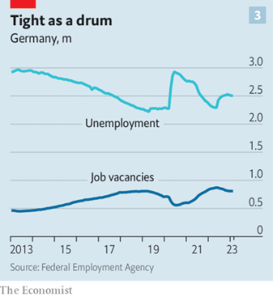
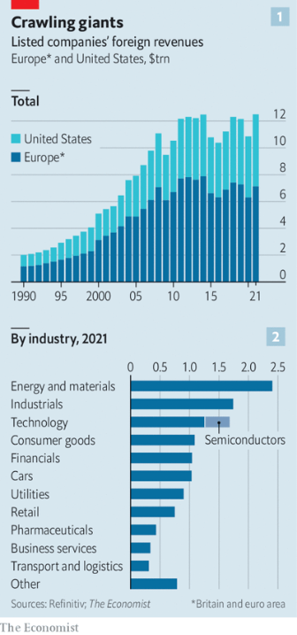

### 1. The world this week
#### 1.1 [Politics](https://www.economist.com/the-world-this-week/2023/03/16/politics)

#### 1.2 [Business](https://www.economist.com/the-world-this-week/2023/03/16/business)
  

#### 1.3 [KAL’s cartoon](https://www.economist.com/the-world-this-week/2023/03/16/kals-cartoon)
  

#### 1.4 [This week’s covers](https://www.economist.com/the-world-this-week/2023/03/16/this-weeks-covers)

### 2. Leaders
#### 2.1 [What’s wrong with the banks](https://www.economist.com/leaders/2023/03/16/whats-wrong-with-the-banks)

#### 2.2 [Will Bibi break Israel?](https://www.economist.com/leaders/2023/03/16/will-bibi-break-israel)

#### 2.3 [Ron DeSantis emboldens Vladimir Putin](https://www.economist.com/leaders/2023/03/16/ron-desantis-emboldens-vladimir-putin)

#### 2.4 [The AUKUS pact is a model for Western allies](https://www.economist.com/leaders/2023/03/16/the-aukus-pact-is-a-model-for-western-allies)

#### 2.5 [Why America is going to look more like Texas](https://www.economist.com/leaders/2023/03/16/why-america-is-going-to-look-more-like-texas)
  

#### 2.6 [Jeremy Hunt’s budget is better at diagnosis than treatment](https://www.economist.com/leaders/2023/03/15/jeremy-hunts-budget-is-better-at-diagnosis-than-treatment)

### 3. Letters
#### 3.1 [Letters to the editor](https://www.economist.com/letters/2023/03/16/letters-to-the-editor)

### 4. By Invitation
#### 4.1 [Alexei Navalny’s chief of staff says personal sanctions need rethinking](https://www.economist.com/by-invitation/2023/03/14/alexei-navalnys-chief-of-staff-says-personal-sanctions-need-rethinking)

#### 4.2 [Tony Yates considers policy after Silicon Valley Bank’s collapse](https://www.economist.com/by-invitation/2023/03/16/tony-yates-considers-policy-after-silicon-valley-banks-collapse)

### 5. Briefing
#### 5.1 [Texas’s latest boom is its biggest yet](https://www.economist.com/briefing/2023/03/16/texass-latest-boom-is-its-biggest-yet)
  
  

### 6. Europe
#### 6.1 [Germany is at last tackling its long-standing economic weaknesses](https://www.economist.com/europe/2023/03/15/germany-is-finally-tackling-its-long-standing-economic-weaknesses)
  
  
  

#### 6.2 [The alarming comeback of Austria’s far-right Freedom Party](https://www.economist.com/europe/2023/03/16/the-alarming-comeback-of-austrias-far-right-freedom-party)

#### 6.3 [Ethnic Hungarians have been having a tricky time in Ukraine](https://www.economist.com/europe/2023/03/16/ethnic-hungarians-have-been-having-a-tricky-time-in-ukraine)
  

#### 6.4 [How Ukraine tamed Russian missile barrages and kept the lights on](https://www.economist.com/europe/2023/03/12/how-ukraine-tamed-russian-missile-barrages-and-kept-the-lights-on)

#### 6.5 [Europe has led the global charge against big tech. But does it need a new approach?](https://www.economist.com/europe/2023/03/16/europe-has-led-the-global-charge-against-big-tech-but-does-it-need-a-new-approach)

### 7. Britain
#### 7.1 [Will Jeremy Hunt’s “budget for growth” achieve its goal?](https://www.economist.com/britain/2023/03/15/will-jeremy-hunts-budget-for-growth-achieve-its-goal)
  

#### 7.2 [The chancellor hopes more child care will get more parents working](https://www.economist.com/britain/2023/03/15/the-chancellor-hopes-more-child-care-will-get-more-parents-working)

#### 7.3 [In the name of the planet, Wales curtails roadbuilding](https://www.economist.com/britain/2023/03/16/in-the-name-of-the-planet-wales-curtails-roadbuilding)
  

#### 7.4 [Britain takes a fresh look at its foreign policy](https://www.economist.com/britain/2023/03/13/britain-takes-a-fresh-look-at-its-foreign-policy)

#### 7.5 [Britons warm up to saunas](https://www.economist.com/britain/2023/03/16/britons-warm-up-to-saunas)

#### 7.6 [State-school admissions are rising at Oxford and Cambridge](https://www.economist.com/britain/2023/03/11/state-school-admissions-are-rising-at-oxford-and-cambridge)

#### 7.7 [It is far too easy to run lawbreaking businesses in Britain](https://www.economist.com/britain/2023/03/16/it-is-far-too-easy-to-run-lawbreaking-businesses-in-britain)

### 8. United States
#### 8.1 [In America climate hawks and Big Oil alike cheer geothermal energy](https://www.economist.com/united-states/2023/03/14/in-america-climate-hawks-and-big-oil-alike-cheer-geothermal-energy)
  

#### 8.2 [Theft from America’s anti-poverty programmes seems troublingly easy](https://www.economist.com/united-states/2023/03/16/theft-from-americas-anti-poverty-programmes-seems-troublingly-easy)

#### 8.3 [Chicago’s public schools are emptying. Politics makes it hard to fix](https://www.economist.com/united-states/2023/03/16/chicagos-public-schools-are-emptying-politics-makes-it-hard-to-fix)

#### 8.4 [The price of eggs in America cannot be explained by inflation alone](https://www.economist.com/united-states/2023/03/16/the-price-of-eggs-in-america-cannot-be-explained-by-inflation-alone)
  

#### 8.5 [Why are so many whales washing up dead on east-coast beaches?](https://www.economist.com/united-states/2023/03/16/why-are-so-many-whales-washing-up-dead-on-east-coast-beaches)

#### 8.6 [Why did America’s leaders stop caring about schools?](https://www.economist.com/united-states/2023/03/16/why-did-americas-leaders-stop-caring-about-schools)

### 9. Middle East & Africa
#### 9.1 [Binyamin Netanyahu is exploiting Israel’s divisions](https://www.economist.com/middle-east-and-africa/2023/03/16/binyamin-netanyahu-is-exploiting-israels-divisions)
  

#### 9.2 [China brokers an Iran-Saudi rapprochement](https://www.economist.com/middle-east-and-africa/2023/03/10/china-brokers-an-iran-saudi-rapprochement)

#### 9.3 [How an east African country became an odd sort of global powerhouse](https://www.economist.com/middle-east-and-africa/2023/03/16/how-an-east-african-country-became-an-odd-sort-of-global-powerhouse)

### 10. The Americas
#### 10.1 [El Salvador’s authoritarian president is becoming a regional role model](https://www.economist.com/the-americas/2023/03/16/el-salvadors-authoritarian-president-is-becoming-a-regional-role-model)
  

### 11. Asia
#### 11.1 [The Anglophone military alliance in Asia is seriously ambitious](https://www.economist.com/asia/2023/03/13/the-anglophone-military-alliance-in-asia-is-seriously-ambitious)
  

#### 11.2 [India is getting an eye-wateringly big transport upgrade](https://www.economist.com/asia/2023/03/13/india-is-getting-an-eye-wateringly-big-transport-upgrade)
  
  

#### 11.3 [Micronesia takes on China](https://www.economist.com/asia/2023/03/16/micronesia-takes-on-china)

### 12. China
#### 12.1 [China’s new head of government, Li Qiang, has Xi Jinping’s ear](https://www.economist.com/china/2023/03/12/chinas-new-head-of-government-li-qiang-has-xi-jinpings-ear)

#### 12.2 [How life has changed along China’s border with South-East Asia](https://www.economist.com/china/2023/03/16/how-life-has-changed-along-chinas-border-with-south-east-asia)
  

#### 12.3 [Why Chairman Mao’s victims are denied justice](https://www.economist.com/china/2023/03/16/why-chairman-maos-victims-are-denied-justice)

### 13. International
#### 13.1 [Russia’s friends are a motley—and shrinking—crew](https://www.economist.com/international/2023/03/14/russias-friends-are-a-motley-and-shrinking-crew)
  
  

### 14. Business
#### 14.1 [Are Western companies becoming less global?](https://www.economist.com/business/2023/03/16/are-western-companies-becoming-less-global)
  
  
  
  

#### 14.2 [Shareholders have high hopes for Bayer’s new boss](https://www.economist.com/business/2023/03/16/shareholders-have-high-hopes-for-bayers-new-boss)

#### 14.3 [Saudi Aramco makes an eye-popping $160bn in profit](https://www.economist.com/business/2023/03/16/saudi-aramco-makes-an-eye-popping-160bn-in-profit)
  

#### 14.4 [Can Gautam Adani ride out the storm?](https://www.economist.com/business/2023/03/16/can-gautam-adani-ride-out-the-storm)
  

#### 14.5 [From high-speed rail to the Olympics, why do big projects go wrong?](https://www.economist.com/business/2023/03/16/from-high-speed-rail-to-the-olympics-why-do-big-projects-go-wrong)

#### 14.6 [A battle royal is brewing over copyright and AI](https://www.economist.com/business/2023/03/15/a-battle-royal-is-brewing-over-copyright-and-ai)

### 15. Finance & economics
#### 15.1 [How deep is the rot in America’s banking industry?](https://www.economist.com/finance-and-economics/2023/03/16/how-deep-is-the-rot-in-americas-banking-industry)
  
  
  

#### 15.2 [For markets Silicon Valley Bank’s demise signals a painful new phase](https://www.economist.com/finance-and-economics/2023/03/14/for-markets-silicon-valley-banks-demise-signals-a-painful-new-phase)

#### 15.3 [The search for Silicon Valley Bank-style portfolios](https://www.economist.com/finance-and-economics/2023/03/16/the-search-for-silicon-valley-bank-style-portfolios)
  

#### 15.4 [What the loss of Silicon Valley Bank means for Silicon Valley](https://www.economist.com/finance-and-economics/2023/03/14/what-the-loss-of-silicon-valley-bank-means-for-silicon-valley)

#### 15.5 [Credit Suisse faces share-price turbulence, as fear sweeps the market](https://www.economist.com/finance-and-economics/2023/03/15/credit-suisse-faces-share-price-turbulence-as-fear-sweeps-the-market)
  

#### 15.6 [Is the global investment boom turning to bust?](https://www.economist.com/finance-and-economics/2023/03/16/is-the-global-investment-boom-turning-to-bust)
  
  

#### 15.7 [The Fed smothers capitalism in an attempt to save it](https://www.economist.com/finance-and-economics/2023/03/16/the-fed-smothers-capitalism-in-an-attempt-to-save-it)

### 16. Science & technology
#### 16.1 [Evidence is growing that playing contact sports can lead to long-term brain injuries](https://www.economist.com/science-and-technology/2023/03/15/evidence-is-growing-that-playing-contact-sports-can-lead-to-long-term-brain-injuries)

#### 16.2 [To ensure vaccines work properly, men should get a good night’s sleep](https://www.economist.com/science-and-technology/2023/03/15/to-ensure-vaccines-work-properly-men-should-get-a-good-nights-sleep)

#### 16.3 [A big advance in mapping the structure of the brain](https://www.economist.com/science-and-technology/2023/03/10/a-big-advance-in-mapping-the-structure-of-the-brain)

#### 16.4 [Pressurised natural caves could offer a home from home on the Moon](https://www.economist.com/science-and-technology/2023/03/15/pressurised-natural-caves-could-offer-a-home-from-home-on-the-moon)

### 17. Culture
#### 17.1 [“Poverty, By America” is a fierce polemic on an enduring problem](https://www.economist.com/culture/2023/03/15/poverty-by-america-is-a-fierce-polemic-on-an-enduring-problem)

#### 17.2 [The story of the poisoners known as the “Angel Makers of Nagyrev”](https://www.economist.com/culture/2023/03/16/the-story-of-the-poisoners-known-as-the-angel-makers-of-nagyrev)

#### 17.3 [Are science and religion fated to be adversaries?](https://www.economist.com/culture/2023/03/15/are-science-and-religion-fated-to-be-adversaries)

#### 17.4 [“Omit needless words!” But not all of them](https://www.economist.com/culture/2023/03/16/omit-needless-words-but-not-all-of-them)

### 18. Economic & financial indicators
#### 18.1 [Economic data, commodities and markets](https://www.economist.com/economic-and-financial-indicators/2023/03/16/economic-data-commodities-and-markets)
  
  
  
  

### 19. Graphic detail
#### 19.1 [Upper legislative houses tend to be biased and malapportioned](https://www.economist.com/graphic-detail/2023/03/14/upper-legislative-houses-tend-to-be-biased-and-malapportioned)

### 20. The Economist explains
#### 20.1 [What to make of a clash between a Russian jet and an American drone](https://www.economist.com/the-economist-explains/2023/03/15/what-to-make-of-a-clash-between-a-russian-jet-and-an-american-drone)
  

#### 20.2 [Why Russian women are flying to Argentina to give birth](https://www.economist.com/the-economist-explains/2023/03/14/why-russian-women-are-flying-to-argentina-to-give-birth)

### 21. Obituary
#### 21.1 [Oe Kenzaburo was made a writer by a family crisis](https://www.economist.com/obituary/2023/03/16/oe-kenzaburo-was-made-a-writer-by-a-family-crisis)

