### 1. The world this week
#### 1.1 [Politics](https://www.economist.com/the-world-this-week/2023/04/05/politics)

#### 1.2 [Business](https://www.economist.com/the-world-this-week/2023/04/05/business)
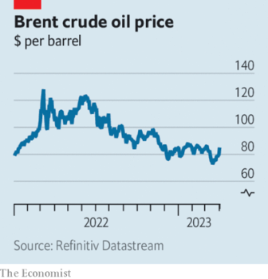  

#### 1.3 [KAL’s cartoon](https://www.economist.com/the-world-this-week/2023/04/05/kals-cartoon)
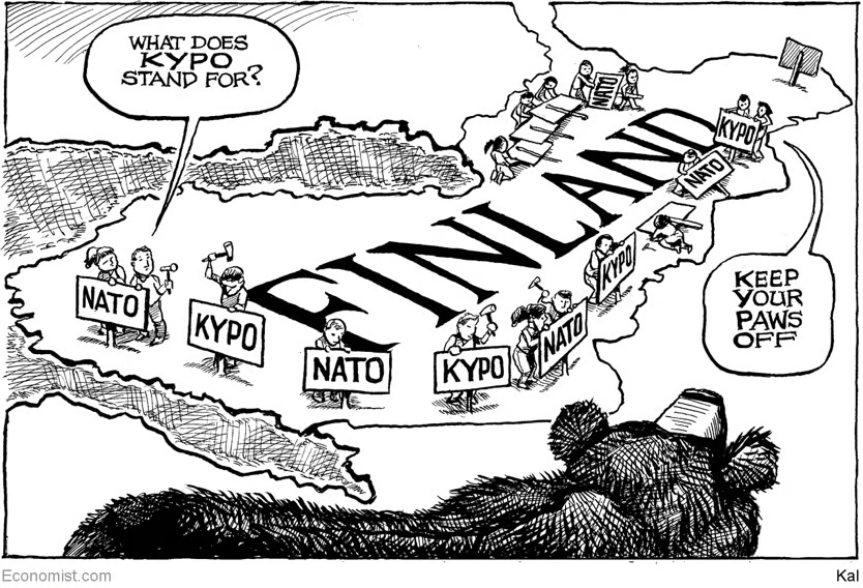  

#### 1.4 [This week’s covers](https://www.economist.com/the-world-this-week/2023/04/05/this-weeks-covers)

### 2. Leaders
#### 2.1 [The case for an environmentalism that builds](https://www.economist.com/leaders/2023/04/05/the-case-for-an-environmentalism-that-builds)

#### 2.2 [What America has got wrong about gender medicine](https://www.economist.com/leaders/2023/04/05/what-america-has-got-wrong-about-gender-medicine)

#### 2.3 [What is a responsible cyber power?](https://www.economist.com/leaders/2023/04/05/what-is-a-responsible-cyber-power)

#### 2.4 [What America’s friends should make of The Trump Show](https://www.economist.com/leaders/2023/04/04/what-americas-friends-should-make-of-the-trump-show)

#### 2.5 [How to fix the International Monetary Fund](https://www.economist.com/leaders/2023/04/05/how-to-fix-the-international-monetary-fund)

#### 2.6 [The university lottery](https://www.economist.com/leaders/2023/04/05/the-university-lottery)

### 3. Letters
#### 3.1 [Letters to the editor](https://www.economist.com/letters/2023/04/05/letters-to-the-editor)

### 4. By Invitation
#### 4.1 [The Fed may not get inflation down to 2%, says Richard Clarida](https://www.economist.com/by-invitation/2023/04/04/the-fed-may-not-get-inflation-down-to-2-says-richard-clarida)

### 5. Briefing
#### 5.1 [The evidence to support medicalised gender transitions in adolescents is worryingly weak](https://www.economist.com/briefing/2023/04/05/the-evidence-to-support-medicalised-gender-transitions-in-adolescents-is-worryingly-weak)
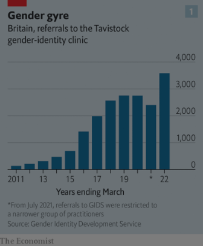  
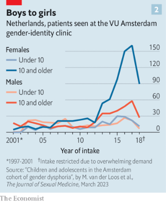  

### 6. Europe
#### 6.1 [Who does Olaf Scholz listen to?](https://www.economist.com/europe/2023/04/05/who-does-olaf-scholz-listen-to)

#### 6.2 [Turkey’s Kurds are joining the coalition to oust Erdogan](https://www.economist.com/europe/2023/04/05/turkeys-kurds-are-joining-the-coalition-to-oust-erdogan)

#### 6.3 [Calls for Russia to free Evan Gershkovich fall on deaf ears](https://www.economist.com/europe/2023/04/05/calls-for-russia-to-free-evan-gershkovich-fall-on-deaf-ears)

#### 6.4 [Sanna Marin concedes defeat in Finland](https://www.economist.com/europe/2023/04/03/sanna-marin-concedes-defeat-in-finland)
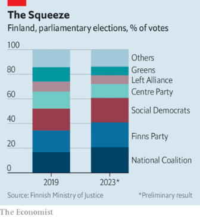  

#### 6.5 [Ukraine’s gay soldiers fight Russia—and for their rights](https://www.economist.com/europe/2023/04/05/ukraines-gay-soldiers-fight-russia-and-for-their-rights)

#### 6.6 [Montenegro’s long-time boss is ousted](https://www.economist.com/europe/2023/04/05/montenegros-long-time-boss-is-ousted)

### 7. Britain
#### 7.1 [Thanks to the Belfast Agreement, Northern Ireland is a better place](https://www.economist.com/britain/2023/04/05/thanks-to-the-belfast-agreement-northern-ireland-is-a-better-place)
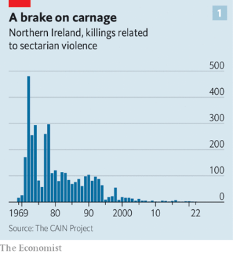  
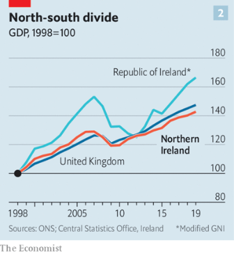  
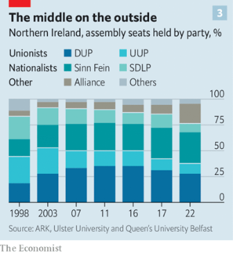  

#### 7.2 [Cyberwarfare is all in the mind, says Britain](https://www.economist.com/britain/2023/04/04/cyberwarfare-is-all-in-the-mind-says-britain)

#### 7.3 [Nigel Lawson was the economic brain of Thatcherism](https://www.economist.com/britain/2023/04/04/nigel-lawson-was-the-economic-brain-of-thatcherism)

#### 7.4 [National Swing Man, the British electorate’s new-old tribe](https://www.economist.com/britain/2023/04/05/national-swing-man-the-british-electorates-new-old-tribe)

### 8. United States
#### 8.1 [America’s chance to become a clean-energy superpower](https://www.economist.com/united-states/2023/04/05/americas-chance-to-become-a-clean-energy-superpower)
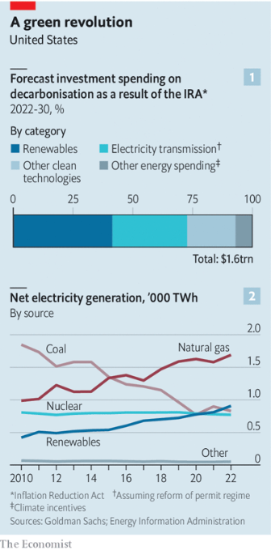  
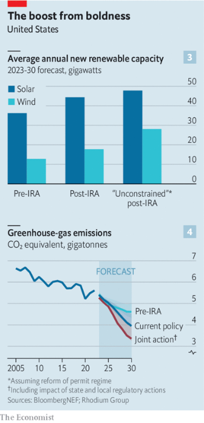  

#### 8.2 [At American law schools, a fresh fuss over freedom of speech](https://www.economist.com/united-states/2023/04/05/at-american-law-schools-a-fresh-fuss-over-freedom-of-speech)

#### 8.3 [The message from the striking elections in Chicago and Wisconsin](https://www.economist.com/united-states/2023/04/05/the-message-from-the-striking-elections-in-chicago-and-wisconsin)

#### 8.4 [Guam, where America’s next war may begin](https://www.economist.com/united-states/2023/04/02/guam-where-americas-next-war-may-begin)
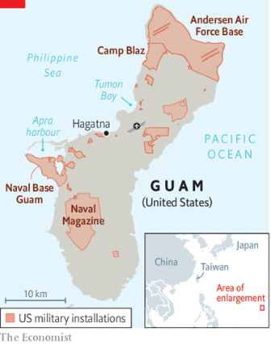  

#### 8.5 [Why do Democrats keep helping Trump?](https://www.economist.com/united-states/2023/04/05/why-do-democrats-keep-helping-trump)

### 9. Middle East & Africa
#### 9.1 [The world’s peak population may be smaller than expected](https://www.economist.com/middle-east-and-africa/2023/04/05/the-worlds-peak-population-may-be-smaller-than-expected)
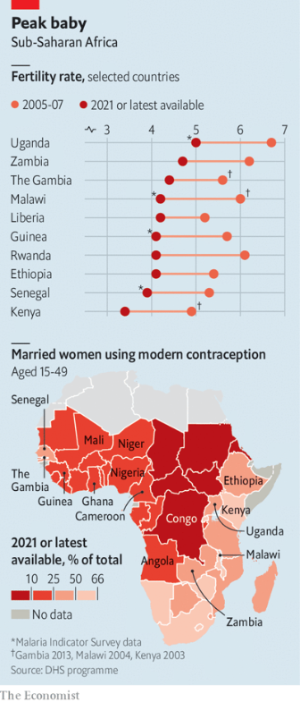  

#### 9.2 [Kenya’s population growth is slowing in cities and towns](https://www.economist.com/middle-east-and-africa/2023/04/05/kenyas-population-growth-is-slowing-in-cities-and-towns)
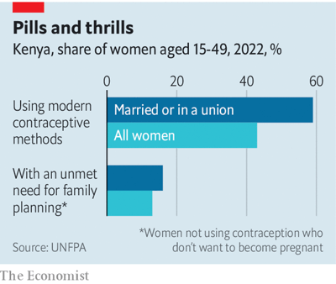  

#### 9.3 [Russians have helped make Dubai’s property market red hot—again](https://www.economist.com/middle-east-and-africa/2023/04/05/russians-have-helped-make-dubais-property-market-red-hot-again)

#### 9.4 [February’s earthquakes have damaged the Middle East’s dams](https://www.economist.com/middle-east-and-africa/2023/04/05/februarys-earthquakes-have-damaged-the-middle-easts-dams)
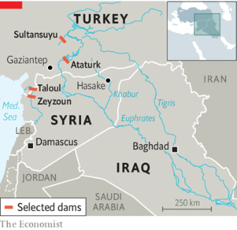  

### 10. The Americas
#### 10.1 [Evangelicals may soon rival Catholics in Latin America](https://www.economist.com/the-americas/2023/04/05/evangelicals-may-soon-rival-catholics-in-latin-america)
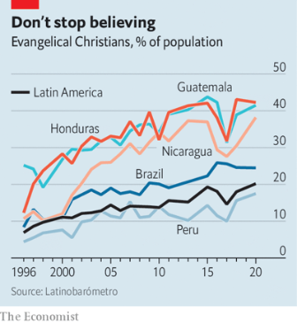  

#### 10.2 [Crazy policies and climate change are hurting Latin American agriculture](https://www.economist.com/the-americas/2023/04/05/crazy-policies-and-climate-change-are-hurting-latin-american-agriculture)
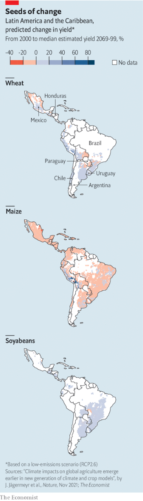  

### 11. Asia
#### 11.1 [India’s deadly heatwaves are getting even hotter](https://www.economist.com/asia/2023/04/02/global-warming-is-killing-indians-and-pakistanis)
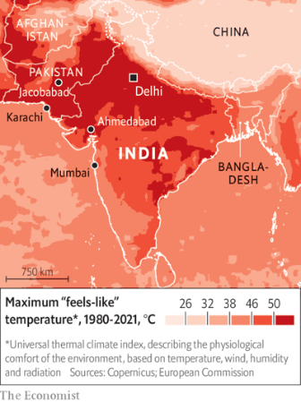  
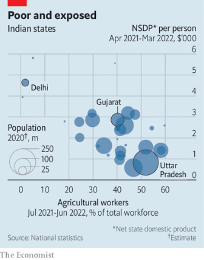  

#### 11.2 [The Indian Premier League is taking over global cricket](https://www.economist.com/asia/2023/03/31/the-indian-premier-league-is-taking-over-global-cricket)

#### 11.3 [Sakamoto Ryuichi heard how the world sounds—and changed it](https://www.economist.com/asia/2023/04/04/sakamoto-ryuichi-heard-how-the-world-sounds-and-changed-it)

#### 11.4 [China’s huge Asian investments fail to buy it soft power](https://www.economist.com/asia/2023/04/05/chinas-huge-asian-investments-fail-to-buy-it-soft-power)

#### 11.5 [The view from the front line between Taiwan and China](https://www.economist.com/asia/2023/04/05/the-view-from-the-front-line-between-taiwan-and-china)
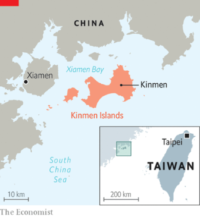  

### 12. China
#### 12.1 [Will Xi Jinping outsmart Emmanuel Macron?](https://www.economist.com/china/2023/04/04/will-xi-jinping-outsmart-emmanuel-macron)

#### 12.2 [Ethnic terminology bedevils Taiwan-China relations](https://www.economist.com/china/2023/04/05/ethnic-terminology-bedevils-taiwan-china-relations)

#### 12.3 [It is getting even harder for Western scholars to do research in China](https://www.economist.com/china/2023/04/05/it-is-getting-even-harder-for-western-scholars-to-do-research-in-china)

#### 12.4 [Why Xi Jinping is not another Chairman Mao](https://www.economist.com/china/2023/04/05/why-xi-jinping-is-not-another-chairman-mao)

### 13. International
#### 13.1 [Was your degree really worth it?](https://www.economist.com/international/2023/04/03/was-your-degree-really-worth-it)
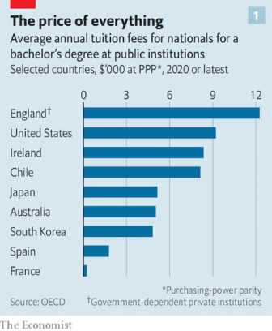  
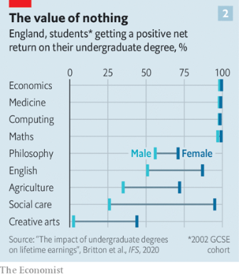  
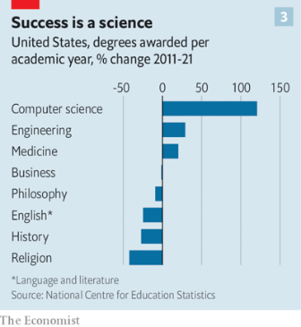  

### 14. Technology Quarterly
#### 14.1 [The electric grid is about to be transformed](https://www.economist.com/technology-quarterly/2023/04/05/the-electric-grid-is-about-to-be-transformed)
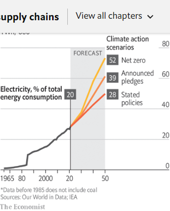  

#### 14.2 [Adding capacity to the electricity grid is not a simple task](https://www.economist.com/technology-quarterly/2023/04/05/adding-capacity-to-the-electricity-grid-is-not-a-simple-task)

#### 14.3 [Electric grids fed by renewables need a different kind of plumbing](https://www.economist.com/technology-quarterly/2023/04/05/electric-grids-fed-by-renewables-need-a-different-kind-of-plumbing)
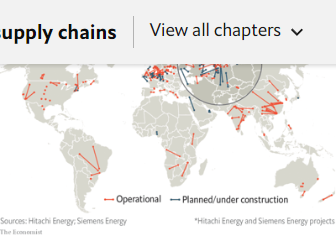  

#### 14.4 [It is harder for new electric grids to balance supply and demand](https://www.economist.com/technology-quarterly/2023/04/05/it-is-harder-for-new-electric-grids-to-balance-supply-and-demand)
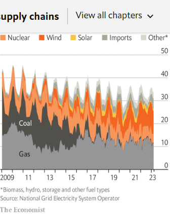  

#### 14.5 [The physics of rotating masses can no longer define the electric grid](https://www.economist.com/technology-quarterly/2023/04/05/the-physics-of-rotating-masses-can-no-longer-define-the-electric-grid)

### 15. Business
#### 15.1 [Meet Asia’s millennial plutocrats](https://www.economist.com/business/2023/04/03/meet-asias-millennial-plutocrats)
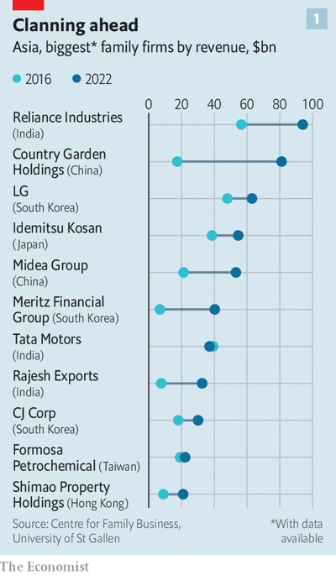  
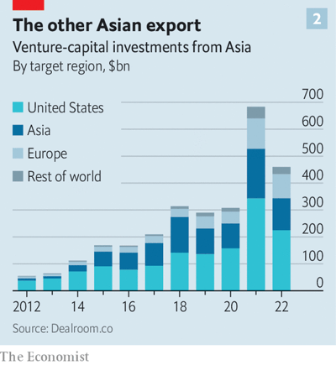  

#### 15.2 [How AI could disrupt video-gaming](https://www.economist.com/business/2023/04/05/how-ai-could-disrupt-video-gaming)

#### 15.3 [American railways and truckers are at a crossroads](https://www.economist.com/business/2023/04/05/american-railways-and-truckers-are-at-a-crossroads)
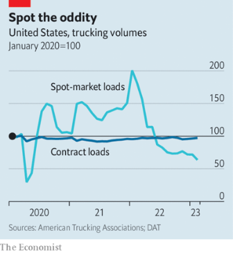  

#### 15.4 [The resistible lure of the family business](https://www.economist.com/business/2023/04/05/the-resistible-lure-of-the-family-business)

#### 15.5 [EY gets banned from new audit business in Germany](https://www.economist.com/business/2023/04/05/ey-gets-banned-from-new-audit-business-in-germany)

#### 15.6 [Toyota gets a new hand at the wheel](https://www.economist.com/business/2023/04/05/toyota-gets-a-new-hand-at-the-wheel)
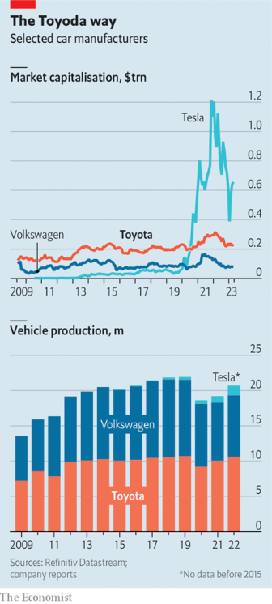  

#### 15.7 [What the world’s hottest MBA courses reveal about 21st-century business](https://www.economist.com/business/2023/04/05/what-the-worlds-hottest-mba-courses-reveal-about-21st-century-business)

### 16. Finance & economics
#### 16.1 [The IMF faces a nightmarish identity crisis](https://www.economist.com/finance-and-economics/2023/04/04/the-imf-faces-a-nightmarish-identity-crisis)
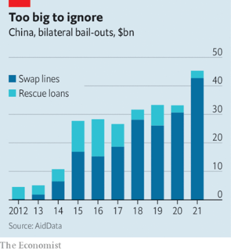  
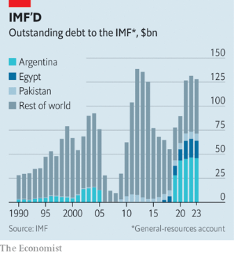  
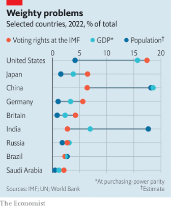  

#### 16.2 [Chinese officials promise foreign investors greater access](https://www.economist.com/finance-and-economics/2023/04/05/chinese-officials-promise-foreign-investors-greater-access)
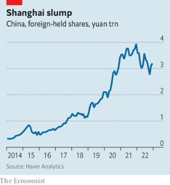  

#### 16.3 [The Swiss rage about the demise of Credit Suisse](https://www.economist.com/finance-and-economics/2023/04/04/the-swiss-rage-about-the-demise-of-credit-suisse)

#### 16.4 [Stocks have shrugged off the banking turmoil. Haven’t they?](https://www.economist.com/finance-and-economics/2023/04/05/stocks-have-shrugged-off-the-banking-turmoil-havent-they)

#### 16.5 [The rich world’s housing crunch is far from over](https://www.economist.com/finance-and-economics/2023/04/02/the-rich-worlds-housing-crunch-is-far-from-over)
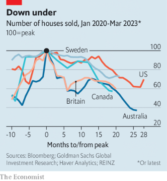  

#### 16.6 [Why economics does not understand business](https://www.economist.com/finance-and-economics/2023/04/04/why-economics-does-not-understand-business)

### 17. Science & technology
#### 17.1 [Icy moons with vast oceans are the latest candidates for alien life](https://www.economist.com/science-and-technology/2023/04/05/icy-moons-with-vast-oceans-are-the-latest-candidates-for-alien-life)

#### 17.2 [It doesn’t take much to make machine-learning algorithms go awry](https://www.economist.com/science-and-technology/2023/04/05/it-doesnt-take-much-to-make-machine-learning-algorithms-go-awry)

#### 17.3 [An algorithm can diagnose a cold from changes in someone’s voice](https://www.economist.com/science-and-technology/2023/04/05/an-algorithm-can-diagnose-a-cold-from-changes-in-someones-voice)

### 18. Culture
#### 18.1 [Northern Ireland’s arts have blossomed. But divisions endure](https://www.economist.com/culture/2023/04/05/northern-irelands-arts-have-blossomed-but-divisions-endure)

#### 18.2 [Inside the fight against misogyny and patriarchy in South Korea](https://www.economist.com/culture/2023/04/05/inside-the-fight-against-misogyny-and-patriarchy-in-south-korea)

#### 18.3 [Wit and wisdom in “The Five Sorrowful Mysteries of Andy Africa”](https://www.economist.com/culture/2023/04/05/wit-and-wisdom-in-the-five-sorrowful-mysteries-of-andy-africa)

#### 18.4 [Games are a weapon in the war on disinformation](https://www.economist.com/culture/2023/04/05/games-are-a-weapon-in-the-war-on-disinformation)

#### 18.5 [Picasso was a genius—and a beast. Can the two be separated?](https://www.economist.com/culture/2023/04/05/picasso-was-a-genius-and-a-beast-can-the-two-be-separated)

### 19. Economic & financial indicators
#### 19.1 [Economic data, commodities and markets](https://www.economist.com/economic-and-financial-indicators/2023/04/05/economic-data-commodities-and-markets)
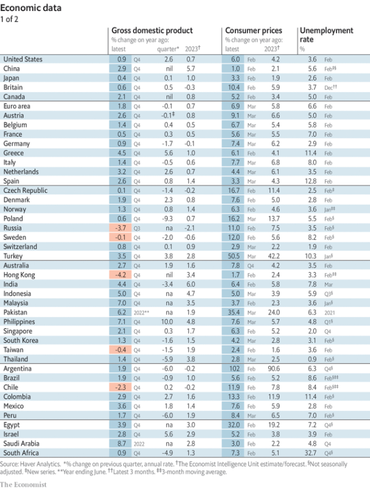  
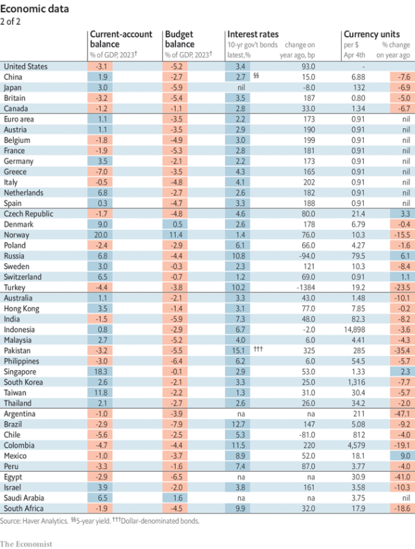  
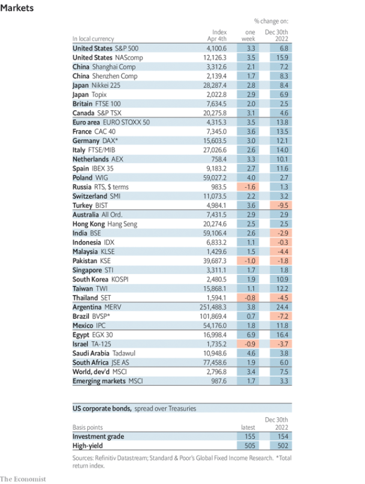  
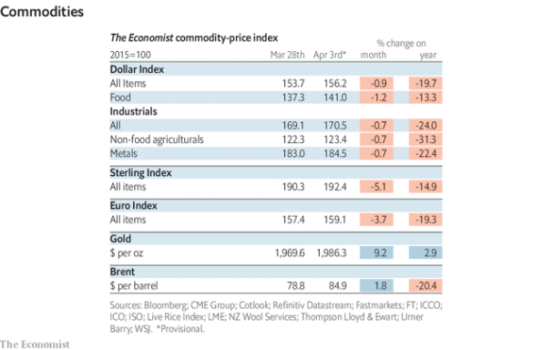  

### 20. Graphic detail
#### 20.1 [A new study of studies reignites controversy over mask mandates](https://www.economist.com/graphic-detail/2023/04/04/a-new-study-of-studies-reignites-controversy-over-mask-mandates)

### 21. The Economist explains
#### 21.1 [What to make of Israel’s new national guard](https://www.economist.com/the-economist-explains/2023/04/05/what-to-make-of-israels-new-national-guard)

#### 21.2 [Who is Juan Merchan, the judge overseeing Donald Trump’s arraignment?](https://www.economist.com/the-economist-explains/2023/04/04/who-is-juan-merchan-the-judge-overseeing-donald-trumps-arraignment)

### 22. Obituary
#### 22.1 [Phyllida Barlow had a lifetime of adventure making art](https://www.economist.com/obituary/2023/04/05/phyllida-barlow-had-a-lifetime-of-adventure-making-art)

