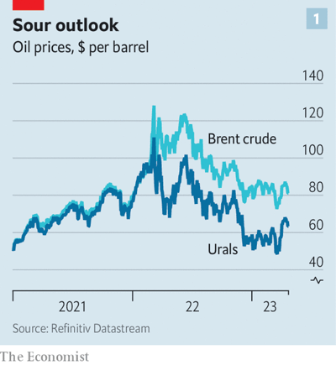
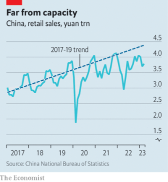
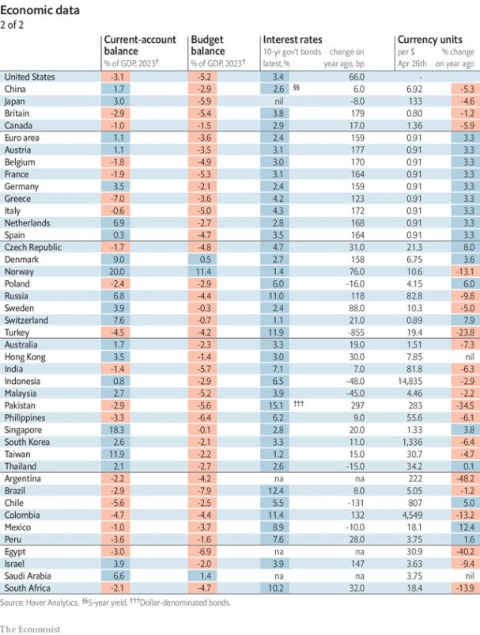

### 1. The world this week
#### 1.1 [Politics](https://www.economist.com/the-world-this-week/2023/04/27/politics)

#### 1.2 [Business](https://www.economist.com/the-world-this-week/2023/04/27/business)
  

#### 1.3 [KAL’s cartoon](https://www.economist.com/the-world-this-week/2023/04/27/kals-cartoon)
  

#### 1.4 [This week’s covers](https://www.economist.com/the-world-this-week/2023/04/27/this-weeks-covers)

### 2. Leaders
#### 2.1 [Is Keir Starmer ready for office?](https://www.economist.com/leaders/2023/04/27/is-keir-starmer-ready-for-office)

#### 2.2 [As Israel turns 75, its biggest threats now come from within](https://www.economist.com/leaders/2023/04/27/as-israel-turns-75-its-biggest-threats-now-come-from-within)

#### 2.3 [The West should supply Ukraine with F-16s](https://www.economist.com/leaders/2023/04/26/the-west-should-supply-ukraine-with-f-16s)

#### 2.4 [The power and the limits of the American dollar](https://www.economist.com/leaders/2023/04/27/the-power-and-the-limits-of-the-american-dollar)

#### 2.5 [Private markets remain attractive, even in a higher-rate world](https://www.economist.com/leaders/2023/04/27/private-markets-remain-attractive-even-in-a-higher-rate-world)
  

### 3. Letters
#### 3.1 [Letters to the editor](https://www.economist.com/letters/2023/04/27/letters-to-the-editor)

### 4. By Invitation
#### 4.1 [Avi Shlaim calls for critical reflection](https://www.economist.com/by-invitation/2023/04/25/avi-shlaim-calls-for-critical-reflection-as-israel-turns-75)

#### 4.2 [There is much to celebrate—and worry about—says Yair Lapid](https://www.economist.com/by-invitation/2023/04/23/as-israel-turns-75-there-is-much-to-celebrate-and-much-to-worry-about-says-yair-lapid)

### 5. Briefing
#### 5.1 [Russia’s economy can withstand a long war, but not a more intense one](https://www.economist.com/briefing/2023/04/23/russias-economy-can-withstand-a-long-war-but-not-a-more-intense-one)
  
  

### 6. Europe
#### 6.1 [Ukraine’s top guns need new jets to win the war](https://www.economist.com/europe/2023/04/23/ukraines-top-guns-need-new-jets-to-win-the-war)
  

#### 6.2 [Ukrainians have grown used to living with curfews](https://www.economist.com/europe/2023/04/26/ukrainians-have-grown-used-to-living-with-curfews)

#### 6.3 [Spanish renewable-energy development is waking from its siesta](https://www.economist.com/europe/2023/04/26/spanish-renewable-energy-development-is-waking-from-its-siesta)

#### 6.4 [A post-Erdogan Turkey would only partly change its foreign policy](https://www.economist.com/europe/2023/04/27/a-post-erdogan-turkey-would-only-partly-change-its-foreign-policy)

#### 6.5 [Romania’s hot economy is attracting foreign workers](https://www.economist.com/europe/2023/04/27/romanias-hot-economy-is-attracting-foreign-workers)
  

#### 6.6 [A spat over farming bodes ill for Ukraine’s future European prospects](https://www.economist.com/europe/2023/04/27/a-spat-over-farming-bodes-ill-for-ukraines-future-european-prospects)

### 7. Britain
#### 7.1 [Sir Keir Starmer on “Starmerism”](https://www.economist.com/britain/2023/04/26/sir-keir-starmer-on-starmerism)
  

#### 7.2 [Labour’s green industrial policy will not cure Britain’s economic ills](https://www.economist.com/britain/2023/04/27/labours-green-industrial-policy-will-not-cure-britains-economic-ills)

#### 7.3 [To understand Labour’s shadow cabinet, read its books](https://www.economist.com/britain/2023/04/25/to-understand-labours-shadow-cabinet-read-its-books)

#### 7.4 [How Campbeltown has responded to the boom in Scottish whisky](https://www.economist.com/britain/2023/04/24/how-campbeltown-has-responded-to-the-boom-in-scottish-whisky)
  

#### 7.5 [The scandal at the Confederation of British Industry may be terminal](https://www.economist.com/britain/2023/04/27/the-scandal-at-the-confederation-of-british-industry-may-be-terminal)

#### 7.6 [How one of Britain’s oldest youth clubs is trying to stay relevant](https://www.economist.com/britain/2023/04/27/how-one-of-britains-oldest-youth-clubs-is-trying-to-stay-relevant)

#### 7.7 [Would Labour turn to the left in office?](https://www.economist.com/britain/2023/04/27/would-labour-turn-to-the-left-in-office)

### 8. United States
#### 8.1 [Joe Biden fires the starting gun on the presidential race](https://www.economist.com/united-states/2023/04/27/joe-biden-fires-the-starting-gun-on-the-presidential-race)
  

#### 8.2 [Fox News shows that not even Tucker Carlson is bigger than the network](https://www.economist.com/united-states/2023/04/24/fox-news-shows-that-not-even-tucker-carlson-is-bigger-than-the-network)

#### 8.3 [A New York jury will be asked if Donald Trump is a rapist](https://www.economist.com/united-states/2023/04/25/a-new-york-jury-will-be-asked-if-donald-trump-is-a-rapist)

#### 8.4 [Why Republicans are giving huge pay rises to teachers](https://www.economist.com/united-states/2023/04/22/why-republicans-are-giving-huge-pay-rises-to-teachers)

#### 8.5 [Why Israel is becoming a partisan cause in the United States](https://www.economist.com/united-states/2023/04/27/why-israel-is-becoming-a-partisan-cause-in-the-united-states)

### 9. Middle East & Africa
#### 9.1 [Israel’s angsty 75th anniversary](https://www.economist.com/middle-east-and-africa/2023/04/25/israels-angsty-75th-anniversary)
  

#### 9.2 [How Zionism has evolved from a project to an ideology](https://www.economist.com/middle-east-and-africa/2023/04/27/how-zionism-has-evolved-from-a-project-to-an-ideology)

#### 9.3 [Rampant jihadists are spreading chaos and misery in the Sahel](https://www.economist.com/middle-east-and-africa/2023/04/27/rampant-jihadists-are-spreading-chaos-and-misery-in-the-sahel)
  
  
  

#### 9.4 [The battle for Khartoum is just the beginning of Sudan’s nightmare](https://www.economist.com/middle-east-and-africa/2023/04/27/the-battle-for-khartoum-is-just-the-beginning-of-sudans-nightmare)

### 10. The Americas
#### 10.1 [Nicolás Maduro, Venezuela’s autocrat, is winning](https://www.economist.com/the-americas/2023/04/25/nicolas-maduro-venezuelas-autocrat-is-winning)
  
  
  

### 11. Asia
#### 11.1 [South Korea has America in its face and China breathing down its neck](https://www.economist.com/asia/2023/04/24/south-korea-has-america-in-its-face-and-china-breathing-down-its-neck)

#### 11.2 [Amritpal Singh, self-declared leader of Sikh separatism, is arrested in India](https://www.economist.com/asia/2023/04/27/amritpal-singh-self-declared-leader-of-sikh-separatism-is-arrested-in-india)

#### 11.3 [Cambodia is about to host arguably the world’s biggest sporting event](https://www.economist.com/asia/2023/04/27/cambodia-is-about-to-host-arguably-the-worlds-biggest-sporting-event)

#### 11.4 [Fearing China, Australia rethinks its defence strategy](https://www.economist.com/asia/2023/04/25/fearing-china-australia-rethinks-its-defence-strategy)

#### 11.5 [On China, Japan’s PM wants diplomacy, not war](https://www.economist.com/asia/2023/04/22/on-china-japans-pm-wants-diplomacy-not-war)

### 12. China
#### 12.1 [China’s latest attempt to rally the world against Western values](https://www.economist.com/china/2023/04/27/chinas-latest-attempt-to-rally-the-world-against-western-values)

#### 12.2 [The novel ways old people try to find love in China](https://www.economist.com/china/2023/04/27/the-novel-ways-old-people-try-to-find-love-in-china)

#### 12.3 [At last, Xi Jinping calls Volodymyr Zelensky](https://www.economist.com/china/2023/04/26/at-last-xi-jinping-calls-volodymyr-zelensky)

#### 12.4 [China’s rulers play the law-and-order card, and lose](https://www.economist.com/china/2023/04/27/chinas-rulers-play-the-law-and-order-card-and-lose)

### 13. International
#### 13.1 [How the war split the mafia](https://www.economist.com/international/2023/04/24/how-the-war-split-the-mafia)
  
  

### 14. Business
#### 14.1 [How to make it big in Xi Jinping’s China](https://www.economist.com/business/2023/04/24/how-to-make-it-big-in-xi-jinpings-china)
  
  
  

#### 14.2 [Britain shoots down Microsoft’s $69bn Activision deal](https://www.economist.com/business/2023/04/26/britain-shoots-down-microsofts-69bn-activision-deal)

#### 14.3 [Business links between Germany and China are under review](https://www.economist.com/business/2023/04/27/business-links-between-germany-and-china-are-under-review)
  

#### 14.4 [The battle to control Mexican telecoms](https://www.economist.com/business/2023/04/27/the-battle-to-control-mexican-telecoms)

#### 14.5 [If enough people think you’re a bad boss, then you are](https://www.economist.com/business/2023/04/23/if-enough-people-think-youre-a-bad-boss-then-you-are)

#### 14.6 [Is mining set for a new wave of mega-mergers?](https://www.economist.com/business/2023/04/27/is-mining-set-for-a-new-wave-of-mega-mergers)

### 15. Finance & economics
#### 15.1 [Welcome to a new, humbler private-equity industry](https://www.economist.com/finance-and-economics/2023/04/25/welcome-to-a-new-humbler-private-equity-industry)
  

#### 15.2 [First Republic Bank is on the edge of a precipice](https://www.economist.com/finance-and-economics/2023/04/26/first-republic-bank-is-on-the-edge-of-a-precipice)
  

#### 15.3 [Why commodity-trading scandals are multiplying](https://www.economist.com/finance-and-economics/2023/04/27/why-commodity-trading-scandals-are-multiplying)

#### 15.4 [Patriotic Ukrainians are rushing to pay their taxes](https://www.economist.com/finance-and-economics/2023/04/27/patriotic-ukrainians-are-rushing-to-pay-their-taxes)

#### 15.5 [If China’s growth is so strong, why is inflation so weak?](https://www.economist.com/finance-and-economics/2023/04/27/if-chinas-growth-is-so-strong-why-is-inflation-so-weak)
  

#### 15.6 [Indian firms are flocking to the United Arab Emirates](https://www.economist.com/finance-and-economics/2023/04/27/indian-firms-are-flocking-to-the-united-arab-emirates)
  

#### 15.7 [Investors have reason to fear a strong economy](https://www.economist.com/finance-and-economics/2023/04/27/investors-have-reason-to-fear-a-strong-economy)

#### 15.8 [Economists and investors should pay less attention to consumers](https://www.economist.com/finance-and-economics/2023/04/27/economists-and-investors-should-pay-less-attention-to-consumers)

### 16. Science & technology
#### 16.1 [Too many people take too many pills](https://www.economist.com/science-and-technology/2023/04/26/too-many-people-take-too-many-pills)

#### 16.2 [After half a century, there is a commercial market for Moon missions](https://www.economist.com/science-and-technology/2023/04/26/after-half-a-century-there-is-a-commercial-market-for-moon-missions)

#### 16.3 [How to make low-carbon concrete from old cement](https://www.economist.com/science-and-technology/2023/04/26/how-to-make-low-carbon-concrete-from-old-cement)

### 17. Culture
#### 17.1 [Ukrainian film-makers are capturing the realities of war](https://www.economist.com/culture/2023/04/24/ukrainian-film-makers-are-capturing-the-realities-of-war)

#### 17.2 [Psychedelic music by an Australian nun is an uncanny pleasure](https://www.economist.com/culture/2023/04/27/psychedelic-music-by-an-australian-nun-is-an-uncanny-pleasure)

#### 17.3 [Readers in the West are embracing Japan’s bold women authors](https://www.economist.com/culture/2023/04/27/readers-in-the-west-are-embracing-japans-bold-women-authors)

#### 17.4 [“Revolutionary Spring” brings to life the drama and daring of 1848](https://www.economist.com/culture/2023/04/27/revolutionary-spring-brings-to-life-the-drama-and-daring-of-1848)

#### 17.5 [Asset managers control a growing share of society’s essentials](https://www.economist.com/culture/2023/04/27/asset-managers-control-a-growing-share-of-societys-essentials)

#### 17.6 [ChatGPT raises questions about how humans acquire language](https://www.economist.com/culture/2023/04/26/chatgpt-raises-questions-about-how-humans-acquire-language)

### 18. Economic & financial indicators
#### 18.1 [Economic data, commodities and markets](https://www.economist.com/economic-and-financial-indicators/2023/04/27/economic-data-commodities-and-markets)
  
  
  
  

### 19. Graphic detail
#### 19.1 [Hollywood is losing the battle for China](https://www.economist.com/interactive/2023/04/29/hollywood-is-losing-the-battle-for-china)

### 20. The Economist explains
#### 20.1 [How a 19th-century law could upend abortion access in America](https://www.economist.com/the-economist-explains/2023/04/27/how-a-19th-century-law-could-upend-abortion-access-in-america)

#### 20.2 [Why India’s population is about to overtake China’s](https://www.economist.com/the-economist-explains/2023/04/26/why-indias-population-is-about-to-overtake-chinas)

### 21. Obituary
#### 21.1 [Barry Humphries, creator and manager of Dame Edna Everage, died on April 22nd, aged 89](https://www.economist.com/obituary/2023/04/27/barry-humphries-creator-and-manager-of-dame-edna-everage-died-on-april-22nd-aged-89)

