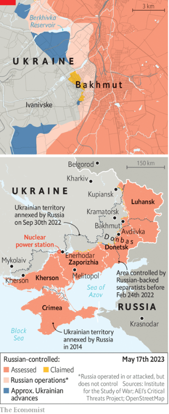
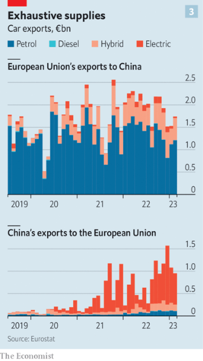
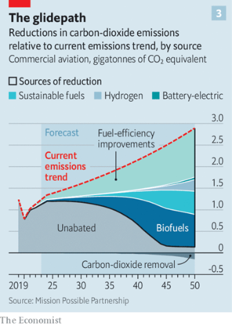
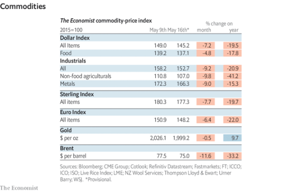

### 1. The world this week
#### 1.1 [Politics](https://www.economist.com/the-world-this-week/2023/05/18/politics)

#### 1.2 [Business](https://www.economist.com/the-world-this-week/2023/05/18/business)
  

#### 1.3 [KAL’s cartoon](https://www.economist.com/the-world-this-week/2023/05/18/kals-cartoon)
  

#### 1.4 [This week’s cover](https://www.economist.com/the-world-this-week/2023/05/18/this-weeks-cover)

### 2. Leaders
#### 2.1 [Joe Biden’s global vision is too timid and pessimistic](https://www.economist.com/leaders/2023/05/18/joe-bidens-global-vision-is-too-timid-and-pessimistic)

#### 2.2 [China and the West take a step to ease Africa’s debt crisis](https://www.economist.com/leaders/2023/05/18/china-and-the-west-take-a-step-to-ease-africas-debt-crisis)
  

#### 2.3 [The humiliation of Thailand’s regime is a boost for Asian democracy](https://www.economist.com/leaders/2023/05/18/the-humiliation-of-thailands-regime-is-a-boost-for-asian-democracy)

#### 2.4 [The fight over the future of global payments](https://www.economist.com/leaders/2023/05/18/the-fight-over-the-future-of-global-payments)
  

#### 2.5 [Trade in dinosaur fossils is good for science](https://www.economist.com/leaders/2023/05/18/trade-in-dinosaur-fossils-is-good-for-science)

### 3. Letters
#### 3.1 [Letters to the editor](https://www.economist.com/letters/2023/05/18/letters-to-the-editor)

### 4. By Invitation
#### 4.1 [Tedros Adhanom, head of the WHO, on the lessons from covid-19](https://www.economist.com/by-invitation/2023/05/15/tedros-adhanom-head-of-the-who-on-the-lessons-from-covid-19)

#### 4.2 [Abebe Aemro Selassie on Africa’s brutal funding squeeze](https://www.economist.com/by-invitation/2023/05/18/abebe-aemro-selassie-on-africas-brutal-funding-squeeze)

### 5. Briefing
#### 5.1 [Henry Kissinger explains how to avoid world war three](https://www.economist.com/briefing/2023/05/17/henry-kissinger-explains-how-to-avoid-world-war-three)

### 6. Europe
#### 6.1 [Recep Tayyip Erdogan beats his challenger as Turkey votes](https://www.economist.com/europe/2023/05/14/recep-tayyip-erdogan-beats-his-challenger-as-turkey-votes)
  

#### 6.2 [Volodymyr Zelensky’s European trip secures a lot more military backing](https://www.economist.com/europe/2023/05/18/volodymyr-zelenskys-european-trip-secures-a-lot-more-military-backing)

#### 6.3 [How a front-line city became Ukraine’s romantic capital](https://www.economist.com/europe/2023/05/17/how-a-front-line-city-became-ukraines-romantic-capital)
  

#### 6.4 [Fears about the reactors at Zaporizhia continue to mount](https://www.economist.com/europe/2023/05/18/fears-about-the-reactors-at-zaporizhia-continue-to-mount)

#### 6.5 [For Giorgia Meloni, supporting Ukraine has some useful benefits](https://www.economist.com/europe/2023/05/18/for-giorgia-meloni-supporting-ukraine-has-some-useful-benefits)

#### 6.6 [Meet the lefty Europeans who want to deliberately shrink the economy](https://www.economist.com/europe/2023/05/18/meet-the-lefty-europeans-who-want-to-deliberately-shrink-the-economy)

### 7. Britain
#### 7.1 [Britain’s Public Order Act goes too far](https://www.economist.com/britain/2023/05/18/britains-public-order-act-goes-too-far)

#### 7.2 [Why are more British adults still living with their parents?](https://www.economist.com/britain/2023/05/15/why-are-more-british-adults-still-living-with-their-parents)
  

#### 7.3 [The Inflation Reduction Act is turning heads among British businesses](https://www.economist.com/britain/2023/05/16/the-inflation-reduction-act-is-turning-heads-among-british-businesses)
  

#### 7.4 [The missing ingredient in Britain’s new law on tenants’ rights](https://www.economist.com/britain/2023/05/18/the-missing-ingredient-in-britains-new-law-on-tenants-rights)
  

#### 7.5 [Aboard Britain’s first commercial self-driving bus](https://www.economist.com/britain/2023/05/18/aboard-britains-first-commercial-self-driving-bus)

#### 7.6 [Want to be a nun? You need to pass these tests](https://www.economist.com/britain/2023/05/18/want-to-be-a-nun-you-need-to-pass-these-tests)

#### 7.7 [Truss Tour: 2023](https://www.economist.com/britain/2023/05/17/truss-tour-2023)

### 8. United States
#### 8.1 [The fault lines in America’s China policy](https://www.economist.com/united-states/2023/05/16/the-fault-lines-in-americas-china-policy)
  

#### 8.2 [What do George Santos, R. Kelly and FIFA have in common?](https://www.economist.com/united-states/2023/05/17/what-do-george-santos-r-kelly-and-fifa-have-in-common)

#### 8.3 [Pinball is booming in America, thanks to nostalgia and canny marketing](https://www.economist.com/united-states/2023/05/14/pinball-is-booming-in-america-thanks-to-nostalgia-and-canny-marketing)

#### 8.4 [Anoint my caverns with oil](https://www.economist.com/united-states/2023/05/18/anoint-my-caverns-with-oil)

#### 8.5 [Congress should fund the BLM (no, not that one)](https://www.economist.com/united-states/2023/05/18/congress-should-fund-the-blm-no-not-that-one)

#### 8.6 [San Francisco’s “woke maths” experiment](https://www.economist.com/united-states/2023/05/18/san-franciscos-woke-maths-experiment)

#### 8.7 [It turns out that Democrats bus migrants, too](https://www.economist.com/united-states/2023/05/18/it-turns-out-that-democrats-bus-migrants-too)

### 9. Middle East & Africa
#### 9.1 [Iran’s proxies in the Middle East remain a powerful force](https://www.economist.com/middle-east-and-africa/2023/05/18/irans-proxies-in-the-middle-east-remain-a-powerful-force)
  

#### 9.2 [America’s new embassy in Beirut is vast](https://www.economist.com/middle-east-and-africa/2023/05/18/americas-new-embassy-in-beirut-is-vast)

#### 9.3 [Looking for the African middle class? Head to the bus park](https://www.economist.com/middle-east-and-africa/2023/05/18/looking-for-the-african-middle-class-head-to-the-bus-park)

#### 9.4 [Foreign airlines in Nigeria are frustrated by the blocking of their funds](https://www.economist.com/middle-east-and-africa/2023/05/18/foreign-airlines-in-nigeria-are-frustrated-by-the-blocking-of-their-funds)

#### 9.5 [Africa faces a mounting debt crisis](https://www.economist.com/middle-east-and-africa/2023/05/16/africa-faces-a-mounting-debt-crisis)
  

### 10. The Americas
#### 10.1 [Latin America’s left-wing experiment is a warning to the world](https://www.economist.com/the-americas/2023/05/18/latin-americas-left-wing-experiment-is-a-warning-to-the-world)
  
  
  

#### 10.2 [Ecuador’s president dissolves Congress to avoid impeachment](https://www.economist.com/the-americas/2023/05/18/ecuadors-president-dissolves-congress-to-avoid-impeachment)

### 11. Asia
#### 11.1 [Can the West win over the rest of the world?](https://www.economist.com/asia/2023/05/16/can-the-west-win-over-the-rest-of-the-world)
  

#### 11.2 [The Taliban go big on animal welfare](https://www.economist.com/asia/2023/05/18/the-taliban-go-big-on-animal-welfare)

#### 11.3 [Thailand’s pro-democracy parties trounce the military establishment](https://www.economist.com/asia/2023/05/15/thailands-pro-democracy-parties-trounce-the-military-establishment)

#### 11.4 [Narendra Modi’s party takes a beating in Karnataka](https://www.economist.com/asia/2023/05/14/narendra-modis-party-takes-a-beating-in-karnataka)

#### 11.5 [Myanmar’s conflict is dividing South-East Asia](https://www.economist.com/asia/2023/05/18/myanmars-conflict-is-dividing-south-east-asia)

### 12. China
#### 12.1 [Why China fears Starlink](https://www.economist.com/china/2023/05/18/why-china-fears-starlink)

#### 12.2 [China is unusually secretive about its space programme](https://www.economist.com/china/2023/05/18/china-is-unusually-secretive-about-its-space-programme)

#### 12.3 [Xiongan is Xi Jinping’s pet project](https://www.economist.com/china/2023/05/18/xiongan-is-xi-jinpings-pet-project)
  

### 13. International
#### 13.1 [Europe can’t decide how to unplug from China](https://www.economist.com/international/2023/05/15/europe-cant-decide-how-to-unplug-from-china)
  
  
  

### 14. Special report
#### 14.1 [As payments systems go digital, they are changing global finance](https://www.economist.com/special-report/2023/05/15/as-payments-systems-go-digital-they-are-changing-global-finance)
  

#### 14.2 [A digital payments revolution in India](https://www.economist.com/special-report/2023/05/15/a-digital-payments-revolution-in-india)
  

#### 14.3 [The old bank/card model is still entrenched in the rich world](https://www.economist.com/special-report/2023/05/15/the-old-bank/card-model-is-still-entrenched-in-the-rich-world)
  
  

#### 14.4 [The promise of crypto has not lived up to its initial excitement](https://www.economist.com/special-report/2023/05/15/the-promise-of-crypto-has-not-lived-up-to-its-initial-excitement)
  

#### 14.5 [Central-bank digital currencies are talked about more than coming to fruition](https://www.economist.com/special-report/2023/05/15/central-bank-digital-currencies-are-talked-about-more-than-coming-to-fruition)

#### 14.6 [Could digital-payments systems help unseat the dollar?](https://www.economist.com/special-report/2023/05/15/could-digital-payments-systems-help-unseat-the-dollar)

#### 14.7 [There are risks but also big potential benefits from digital payments](https://www.economist.com/special-report/2023/05/15/there-are-risks-but-also-big-potential-benefits-from-digital-payments)

#### 14.8 [Video: insights from the author](https://www.economist.com/special-report/2023/05/16/video-insights-from-the-author)

#### 14.9 [Sources and acknowledgments](https://www.economist.com/special-report/2023/05/16/sources-and-acknowledgments)

### 15. Business
#### 15.1 [Businesses are in for a mighty debt hangover](https://www.economist.com/business/2023/05/16/businesses-are-in-for-a-mighty-debt-hangover)
  
  

#### 15.2 [The aviation industry wants to be net zero—but not yet](https://www.economist.com/business/2023/05/14/the-aviation-industry-wants-to-be-net-zero-but-not-yet)
  
  

#### 15.3 [The wind-turbine industry should be booming. Why isn’t it?](https://www.economist.com/business/2023/05/18/the-wind-turbine-industry-should-be-booming-why-isnt-it)
  

#### 15.4 [Businesses’ bottleneck bane](https://www.economist.com/business/2023/05/18/businesses-bottleneck-bane)

#### 15.5 [Mukesh Ambani returns to the spotlight](https://www.economist.com/business/2023/05/18/mukesh-ambani-returns-to-the-spotlight)
  

#### 15.6 [America’s culture wars threaten its single market](https://www.economist.com/business/2023/05/18/americas-culture-wars-threaten-its-single-market)

### 16. Finance & economics
#### 16.1 [The financial system is slipping into state control](https://www.economist.com/finance-and-economics/2023/05/18/the-financial-system-is-slipping-into-state-control)
  

#### 16.2 [What America does after a debt-ceiling disaster](https://www.economist.com/finance-and-economics/2023/05/15/what-america-does-after-a-debt-ceiling-disaster)

#### 16.3 [Is China’s recovery about to stall?](https://www.economist.com/finance-and-economics/2023/05/18/is-chinas-recovery-about-to-stall)
  

#### 16.4 [LIBOR will at last be switched off in June](https://www.economist.com/finance-and-economics/2023/05/18/libor-will-at-last-be-switched-off-in-june)

#### 16.5 [How to invest in artificial intelligence](https://www.economist.com/finance-and-economics/2023/05/17/how-to-invest-in-artificial-intelligence)

#### 16.6 [Robert Lucas was a giant of macroeconomics](https://www.economist.com/finance-and-economics/2023/05/18/robert-lucas-was-a-giant-of-macroeconomics)

### 17. Science & technology
#### 17.1 [The market for dinosaur fossils is booming](https://www.economist.com/science-and-technology/2023/05/17/the-market-for-dinosaur-fossils-is-booming)

#### 17.2 [Artists hope to turn selfies into comets](https://www.economist.com/science-and-technology/2023/05/17/artists-hope-to-turn-selfies-into-comets)

#### 17.3 [Humans shed genetic information everywhere they go](https://www.economist.com/science-and-technology/2023/05/17/humans-shed-genetic-information-everywhere-they-go)

#### 17.4 [The coming years will be the hottest ever](https://www.economist.com/science-and-technology/2023/05/17/the-coming-years-will-be-the-hottest-ever)

#### 17.5 [Insects could help turn beer waste into beef](https://www.economist.com/science-and-technology/2023/05/17/insects-could-help-turn-beer-waste-into-beef)

### 18. Culture
#### 18.1 [In 1983 Arthur Miller directed one of his best-known plays in China](https://www.economist.com/culture/2023/05/18/in-1983-arthur-miller-directed-one-of-his-best-known-plays-in-china)

#### 18.2 [“Fancy Bear Goes Phishing” charts the evolution of hacking](https://www.economist.com/culture/2023/05/17/fancy-bear-goes-phishing-charts-the-evolution-of-hacking)

#### 18.3 [In Emma Cline’s new novel, a young woman loses control of her life](https://www.economist.com/culture/2023/05/18/in-emma-clines-new-novel-a-young-woman-loses-control-of-her-life)

#### 18.4 [Wings v tenders: the choice says more about you than you think](https://www.economist.com/culture/2023/05/18/wings-v-tenders-the-choice-says-more-about-you-than-you-think)

#### 18.5 [In “Fatherland”, an author reckons with his Nazi grandfather](https://www.economist.com/culture/2023/05/18/in-fatherland-an-author-reckons-with-his-nazi-grandfather)

#### 18.6 [Quiet artworks sometimes make the deepest impressions](https://www.economist.com/culture/2023/05/18/quiet-artworks-sometimes-make-the-deepest-impressions)

### 19. Economic & financial indicators
#### 19.1 [Economic data, commodities and markets](https://www.economist.com/economic-and-financial-indicators/2023/05/18/economic-data-commodities-and-markets)
  
  
  
  

### 20. Graphic detail
#### 20.1 [Sacking Tucker Carlson has put a dent in Fox News’s ratings](https://www.economist.com/graphic-detail/2023/05/16/sacking-tucker-carlson-has-put-a-dent-in-fox-newss-ratings)

### 21. Obituary
#### 21.1 [Pema Tseden was the founder and builder of Tibetan cinema](https://www.economist.com/obituary/2023/05/18/pema-tseden-was-the-founder-and-builder-of-tibetan-cinema)

### 22. The Economist reads
#### 22.1 [What to read about villains in business](https://www.economist.com/the-economist-reads/2023/05/16/what-to-read-about-villains-in-business)

