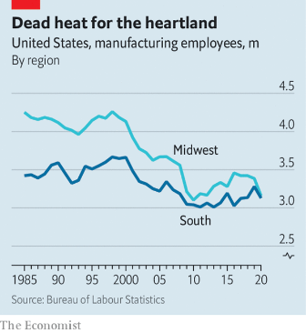
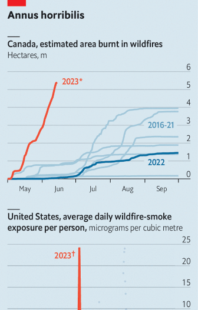

### 1. The world this week
#### 1.1 [Politics](https://www.economist.com/the-world-this-week/2023/06/15/politics)

#### 1.2 [Business](https://www.economist.com/the-world-this-week/2023/06/15/business)
  

#### 1.3 [KAL’s cartoon](https://www.economist.com/the-world-this-week/2023/06/15/kals-cartoon)
  

#### 1.4 [This week’s covers](https://www.economist.com/the-world-this-week/2023/06/15/this-weeks-covers)

### 2. Leaders
#### 2.1 [How Britain can become an AI superpower](https://www.economist.com/leaders/2023/06/15/how-britain-can-become-an-ai-superpower)

#### 2.2 [Joe Biden and Narendra Modi are drawing their countries closer](https://www.economist.com/leaders/2023/06/15/joe-biden-and-narendra-modi-are-drawing-their-countries-closer)

#### 2.3 [The real injustice would have been not to indict Donald Trump](https://www.economist.com/leaders/2023/06/13/is-donald-trump-the-victim-of-a-witch-hunt)

#### 2.4 [The crackdown on foreign firms will deter global business—and undermine China’s own interests](https://www.economist.com/leaders/2023/06/15/the-crackdown-on-foreign-firms-will-deter-global-business-and-undermine-chinas-own-interests)

#### 2.5 [Fiscal policy in the rich world is mind-bogglingly reckless](https://www.economist.com/leaders/2023/06/14/fiscal-policy-in-the-rich-world-is-mind-bogglingly-reckless)
  

### 3. Letters
#### 3.1 [Letters to the editor](https://www.economist.com/letters/2023/06/15/letters-to-the-editor)

### 4. By Invitation
#### 4.1 [Sir Richard Barrons on the broader security considerations around Ukraine’s counter-offensive](https://www.economist.com/by-invitation/2023/06/12/sir-richard-barrons-on-the-broader-security-considerations-around-ukraines-counter-offensive)

#### 4.2 [Finding the money to fix the world requires a rethink on tax, says Jayati Ghosh](https://www.economist.com/by-invitation/2023/06/13/finding-the-money-to-fix-the-world-requires-a-rethink-on-tax-says-jayati-ghosh)

### 5. Europe
#### 5.1 [Ukraine’s counter-offensive is making mixed progress](https://www.economist.com/europe/2023/06/14/ukraines-counter-offensive-is-making-mixed-progress)
  

#### 5.2 [The death of Silvio Berlusconi creates uncertainty for his party](https://www.economist.com/europe/2023/06/13/the-death-of-silvio-berlusconi-creates-uncertainty-for-his-party)

#### 5.3 [Germany’s new national security strategy is strong on goals, less so on means](https://www.economist.com/europe/2023/06/15/germanys-new-national-security-strategy-is-strong-on-goals-less-so-on-means)

#### 5.4 [The problems ailing Western Europe’s left are not just cyclical](https://www.economist.com/europe/2023/06/15/the-problems-ailing-western-europes-left-are-not-just-cyclical)
  

#### 5.5 [Why Europe’s asylum policy desperately needs rebooting](https://www.economist.com/europe/2023/06/15/why-europes-asylum-policy-desperately-needs-rebooting)

### 6. Britain
#### 6.1 [How to make Britain’s AI dreams reality](https://www.economist.com/britain/2023/06/14/how-to-make-britains-ai-dreams-reality)
  
  

#### 6.2 [How much is a human head?](https://www.economist.com/britain/2023/06/14/how-much-is-a-human-head)
  

#### 6.3 [Wage growth, inflation and more place Britain’s central bank in a spot](https://www.economist.com/britain/2023/06/14/wage-growth-inflation-and-more-place-britains-central-bank-in-a-spot)
  

#### 6.4 [Reading the death certificate on Boris Johnson’s political career](https://www.economist.com/britain/2023/06/15/reading-the-death-certificate-on-boris-johnsons-political-career)

### 7. United States
#### 7.1 [The South is fast becoming America’s industrial heartland](https://www.economist.com/united-states/2023/06/12/the-south-is-fast-becoming-americas-industrial-heartland)
  
  

#### 7.2 [How ChatGPT could help teachers and lower the cost of college](https://www.economist.com/united-states/2023/06/15/how-chatgpt-could-help-teachers-and-lower-the-cost-of-college)

#### 7.3 [How LA’s drag nuns took centre stage in the culture wars](https://www.economist.com/united-states/2023/06/15/how-las-drag-nuns-took-centre-stage-in-the-culture-wars)

#### 7.4 [American states are bailing out public transport](https://www.economist.com/united-states/2023/06/15/american-states-are-bailing-out-public-transport)

#### 7.5 [Attack of the feral parakeets in New York](https://www.economist.com/united-states/2023/06/15/attack-of-the-feral-parakeets)

#### 7.6 [How the Pentagon thinks about America’s strategy in the Pacific](https://www.economist.com/united-states/2023/06/15/how-the-pentagon-thinks-about-americas-strategy-in-the-pacific)
  

#### 7.7 [North Carolina may be the hottest political battleground of 2024](https://www.economist.com/united-states/2023/06/15/north-carolina-may-be-the-hottest-political-battleground-of-2024)

### 8. Middle East & Africa
#### 8.1 [Egyptians are disgruntled with President Abdel-Fattah al-Sisi](https://www.economist.com/middle-east-and-africa/2023/06/15/egyptians-are-disgruntled-with-president-abdel-fattah-al-sisi)
  

#### 8.2 [Why wretched Lebanese are fleeing across the sea](https://www.economist.com/middle-east-and-africa/2023/06/15/why-wretched-lebanese-are-fleeing-across-the-sea)
  

#### 8.3 [Saudi Arabia may accept normal relations with Israel](https://www.economist.com/middle-east-and-africa/2023/06/15/saudi-arabia-may-accept-normal-relations-with-israel)

#### 8.4 [Why Kenya could take the lead in carbon removal](https://www.economist.com/middle-east-and-africa/2023/06/15/why-kenya-could-take-the-lead-in-carbon-removal)

#### 8.5 [Rural Africans are finding work beyond their farms](https://www.economist.com/middle-east-and-africa/2023/06/15/rural-africans-are-finding-work-beyond-their-farms)

### 9. The Americas
#### 9.1 [Lula’s ambitious plans to save the Amazon clash with reality](https://www.economist.com/the-americas/2023/06/13/lulas-ambitious-plans-to-save-the-amazon-clash-with-reality)
  
  

#### 9.2 [What does China want from Latin America and the Caribbean?](https://www.economist.com/the-americas/2023/06/15/what-does-china-want-from-latin-america-and-the-caribbean)

#### 9.3 [Canada’s wildfires have burnt an area 16 times larger than normal](https://www.economist.com/the-americas/2023/06/15/canadas-wildfires-have-burnt-an-area-16-times-larger-than-normal)
  

### 10. Asia
#### 10.1 [America is courting India in part for its growing economic clout](https://www.economist.com/asia/2023/06/13/america-is-courting-india-in-part-for-its-growing-economic-clout)
  
  

#### 10.2 [India’s foreign minister on ties with America, China and Russia](https://www.economist.com/asia/2023/06/15/indias-foreign-minister-on-ties-with-america-china-and-russia)

#### 10.3 [On defence, America and India edge closer together](https://www.economist.com/asia/2023/06/15/on-defence-america-and-india-edge-closer-together)

#### 10.4 [Narendra Modi is the world’s most popular leader](https://www.economist.com/asia/2023/06/15/narendra-modi-is-the-worlds-most-popular-leader)

### 11. China
#### 11.1 [America and China try to move past a new bump in relations](https://www.economist.com/china/2023/06/09/america-and-china-try-to-move-past-a-new-bump-in-relations)

#### 11.2 [China hopes Mazu, a sea goddess, can help it win over Taiwan](https://www.economist.com/china/2023/06/15/china-hopes-mazu-a-sea-goddess-can-help-it-win-over-taiwan)

#### 11.3 [China’s tolerance for public oversight is limited](https://www.economist.com/china/2023/06/15/chinas-tolerance-for-public-oversight-is-limited)

#### 11.4 [Xi Jinping reaches into China’s ancient history for a new claim to rule](https://www.economist.com/china/2023/06/15/xi-jinping-reaches-into-chinas-ancient-history-for-a-new-claim-to-rule)

### 12. International
#### 12.1 [India’s diaspora is bigger and more influential than any in history](https://www.economist.com/international/2023/06/12/indias-diaspora-is-bigger-and-more-influential-than-any-in-history)
  
  

### 13. Business
#### 13.1 [Is doing business in China becoming impossible for foreigners?](https://www.economist.com/business/2023/06/11/is-doing-business-in-china-becoming-impossible-for-foreigners)

#### 13.2 [Oracle is making Larry Ellison the world’s third-richest man](https://www.economist.com/business/2023/06/13/oracle-is-making-larry-ellison-the-worlds-third-richest-man)
  

#### 13.3 [It is make or break for Intel’s giant bet on Germany](https://www.economist.com/business/2023/06/15/it-is-make-or-break-for-intels-giant-bet-on-germany)
  

#### 13.4 [The upside of workplace jargon](https://www.economist.com/business/2023/06/15/the-upside-of-workplace-jargon)

#### 13.5 [Which sport is the best business?](https://www.economist.com/business/2023/06/15/which-sport-is-the-best-business)
  

#### 13.6 [Why self-storage is turning into hot property](https://www.economist.com/business/2023/06/15/why-self-storage-is-turning-into-hot-property)
  

#### 13.7 [How long will the travel boom last?](https://www.economist.com/business/2023/06/15/how-long-will-the-travel-boom-last)
  

#### 13.8 [What Tesla and other carmakers can learn from Ford](https://www.economist.com/business/2023/06/13/what-tesla-and-other-carmakers-can-learn-from-ford)

### 14. Finance & economics
#### 14.1 [Is the global housing slump over?](https://www.economist.com/finance-and-economics/2023/06/12/is-the-global-housing-slump-over)
  

#### 14.2 [A new super-regulator takes aim at rampant corruption in Chinese finance](https://www.economist.com/finance-and-economics/2023/06/15/a-new-super-regulator-takes-aim-at-rampant-corruption-in-chinese-finance)
  

#### 14.3 [Sooner or later, America’s financial system could seize up](https://www.economist.com/finance-and-economics/2023/06/15/sooner-or-later-americas-financial-system-could-seize-up)

#### 14.4 [AI is not yet killing jobs](https://www.economist.com/finance-and-economics/2023/06/15/ai-is-not-yet-killing-jobs)
  

#### 14.5 [America is losing ground in Asian trade](https://www.economist.com/finance-and-economics/2023/06/15/america-is-losing-ground-in-asian-trade)

#### 14.6 [South Korea has had enough of being called an emerging market](https://www.economist.com/finance-and-economics/2023/06/15/south-korea-has-had-enough-of-being-called-an-emerging-market)
  

#### 14.7 [Wage-price spirals are far scarier in theory than in practice](https://www.economist.com/finance-and-economics/2023/06/15/wage-price-spirals-are-far-scarier-in-theory-than-in-practice)

### 15. Science & technology
#### 15.1 [The idea of “holobionts” represents a paradigm shift in biology](https://www.economist.com/science-and-technology/2023/06/14/the-idea-of-holobionts-represents-a-paradigm-shift-in-biology)
  

#### 15.2 [There’s more than one way to spay a cat](https://www.economist.com/science-and-technology/2023/06/14/theres-more-than-one-way-to-spay-a-cat)

### 16. Culture
#### 16.1 [For the boldest commentary on African politics, look to cartoonists](https://www.economist.com/culture/2023/06/15/for-the-boldest-commentary-on-african-politics-look-to-cartoonists)

#### 16.2 [The eastern half of Europe is united by its diversity](https://www.economist.com/culture/2023/06/15/the-eastern-half-of-europe-is-united-by-its-diversity)

#### 16.3 [Cormac McCarthy was the great novelist of the American West](https://www.economist.com/culture/2023/06/14/cormac-mccarthy-was-the-great-novelist-of-the-american-west)

#### 16.4 [A potato can have no finer fate than ending up as an Irish crisp](https://www.economist.com/culture/2023/06/15/a-potato-can-have-no-finer-fate-than-ending-up-as-an-irish-crisp)

#### 16.5 [Meant to be liberating, the Sullivanian community became a nightmare](https://www.economist.com/culture/2023/06/15/meant-to-be-liberating-the-sullivanian-community-became-a-nightmare)

#### 16.6 [“The Full Monty” gang are back](https://www.economist.com/culture/2023/06/14/the-full-monty-gang-are-back)

### 17. The Economist reads
#### 17.1 [What to read to understand modern Poland](https://www.economist.com/the-economist-reads/2023/06/15/what-to-read-to-understand-modern-poland)

### 18. Economic & financial indicators
#### 18.1 [Economic data, commodities and markets](https://www.economist.com/economic-and-financial-indicators/2023/06/15/economic-data-commodities-and-markets)
  
  
  
  

### 19. Graphic detail
#### 19.1 [England may soon become the world’s best cricket team](https://www.economist.com/graphic-detail/2023/06/13/england-may-soon-become-the-worlds-best-cricket-team)

### 20. The Economist explains
#### 20.1 [How are people appointed to Britain’s House of Lords?](https://www.economist.com/the-economist-explains/2023/06/15/how-are-people-appointed-to-britains-house-of-lords)
  

#### 20.2 [Are cryptocurrencies securities?](https://www.economist.com/the-economist-explains/2023/06/12/are-cryptocurrencies-securities)

### 21. Obituary
#### 21.1 [Silvio Berlusconi duped Italians for years](https://www.economist.com/obituary/2023/06/12/silvio-berlusconi-has-died-aged-86)

