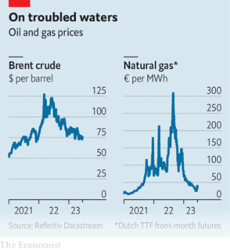

### 1. The world this week
#### 1.1 [Politics](https://www.economist.com/the-world-this-week/2023/06/22/politics)

#### 1.2 [Business](https://www.economist.com/the-world-this-week/2023/06/22/business)

#### 1.3 [KAL’s cartoon](https://www.economist.com/the-world-this-week/2023/06/22/kals-cartoon)
  

#### 1.4 [This week’s covers](https://www.economist.com/the-world-this-week/2023/06/22/this-weeks-covers)

### 2. Leaders
#### 2.1 [Investors must prepare for sustained higher inflation](https://www.economist.com/leaders/2023/06/22/investors-must-prepare-for-sustained-higher-inflation)

#### 2.2 [Building Ukraine 2.0](https://www.economist.com/leaders/2023/06/22/building-ukraine-20)

#### 2.3 [America wants to lower tensions with Iran. Good](https://www.economist.com/leaders/2023/06/21/america-wants-to-lower-tensions-with-iran-good)

#### 2.4 [China’s economic recovery is spluttering. The prognosis is not good](https://www.economist.com/leaders/2023/06/22/chinas-economic-recovery-is-spluttering-the-prognosis-is-not-good)

#### 2.5 [Blocking the Microsoft-Activision deal would harm consumers](https://www.economist.com/leaders/2023/06/22/blocking-the-microsoft-activision-deal-would-harm-consumers)

### 3. Letters
#### 3.1 [Letters to the editor](https://www.economist.com/letters/2023/06/22/letters-to-the-editor)

### 4. By Invitation
#### 4.1 [Artificial intelligence is a familiar-looking monster, say Henry Farrell and Cosma Shalizi](https://www.economist.com/by-invitation/2023/06/21/artificial-intelligence-is-a-familiar-looking-monster-say-henry-farrell-and-cosma-shalizi)

#### 4.2 [Thom Woodroofe on why climate co-operation could be the key to improving Sino-American relations](https://www.economist.com/by-invitation/2023/06/22/thom-woodroofe-on-why-climate-co-operation-could-be-the-key-to-improving-sino-american-relations)

### 5. Briefing
#### 5.1 [War is reshaping the Ukrainian state—for the better](https://www.economist.com/briefing/2023/06/22/war-is-reshaping-the-ukrainian-state-for-the-better)

#### 5.2 [Inflation is as corrosive to investing as it is to the real economy](https://www.economist.com/briefing/2023/06/21/inflation-is-as-corrosive-to-investing-as-it-is-to-the-real-economy)

### 6. Europe
#### 6.1 [Ukraine’s spymaster has got under the Kremlin’s skin](https://www.economist.com/europe/2023/06/20/ukraines-spymaster-has-got-under-the-kremlins-skin)

#### 6.2 [France’s top general on lessons from the battlefield](https://www.economist.com/europe/2023/06/18/frances-top-general-on-lessons-from-the-battlefield)

#### 6.3 [Greece votes, again, following the sinking of a migrant boat](https://www.economist.com/europe/2023/06/22/greece-votes-again-following-the-sinking-of-a-migrant-boat)

#### 6.4 [Turkish property prices are soaring](https://www.economist.com/europe/2023/06/22/turkish-property-prices-are-soaring)

#### 6.5 [A farewell to small cars, the industrial icons that put Europe on wheels](https://www.economist.com/europe/2023/06/21/a-farewell-to-small-cars-the-industrial-icons-that-put-europe-on-wheels)

### 7. Britain
#### 7.1 [Britain’s inflation pain is mostly self-inflicted and getting worse](https://www.economist.com/britain/2023/06/21/britains-inflation-pain-is-mostly-self-inflicted-and-getting-worse)

#### 7.2 [Pay for bosses in Britain falls far behind America. Tough luck](https://www.economist.com/britain/2023/06/22/pay-for-bosses-in-britain-falls-far-behind-america-tough-luck)

#### 7.3 [Ben Wallace says he is out of the race for NATO’s top job](https://www.economist.com/britain/2023/06/21/ben-wallace-says-he-is-out-of-the-race-for-natos-top-job)

#### 7.4 [Should Britain change its abortion laws?](https://www.economist.com/britain/2023/06/20/should-britain-change-its-abortion-laws)

#### 7.5 [Indians are flocking to study at British universities](https://www.economist.com/britain/2023/06/18/indians-are-flocking-to-study-at-british-universities)
  

#### 7.6 [Vaping among schoolchildren has become a moral panic in Britain](https://www.economist.com/britain/2023/06/22/vaping-among-schoolchildren-has-become-a-moral-panic-in-britain)

#### 7.7 [Sir Keir Starmer’s magic lamp](https://www.economist.com/britain/2023/06/19/sir-keir-starmers-magic-lamp)

### 8. United States
#### 8.1 [Why Joe Biden’s trustbusters have fallen short of their ambitions](https://www.economist.com/united-states/2023/06/21/why-joe-bidens-trustbusters-have-fallen-short-of-their-ambitions)

#### 8.2 [Pain and pride around a vital American highway](https://www.economist.com/united-states/2023/06/22/pain-and-pride-around-a-vital-american-highway)
  

#### 8.3 [As response rates decline, the risk of polling errors rises](https://www.economist.com/united-states/2023/06/22/as-response-rates-decline-the-risk-of-polling-errors-rises)

#### 8.4 [Hunter Biden’s plea bargain will not stop Republicans chasing him](https://www.economist.com/united-states/2023/06/22/hunter-bidens-plea-bargain-will-not-stop-republicans-chasing-him)

#### 8.5 [Nearly all Louisiana’s death-row inmates have filed for clemency](https://www.economist.com/united-states/2023/06/22/nearly-all-louisianas-death-row-inmates-have-filed-for-clemency)

#### 8.6 [One year after Dobbs, America’s pro-life movement is in flux](https://www.economist.com/united-states/2023/06/22/one-year-after-dobbs-americas-pro-life-movement-is-in-flux)

#### 8.7 [Why the multiverse is eating popular culture](https://www.economist.com/united-states/2023/06/22/why-the-multiverse-is-eating-popular-culture)

### 9. Middle East & Africa
#### 9.1 [African countries are fed up with being marginalised in global institutions](https://www.economist.com/middle-east-and-africa/2023/06/19/african-countries-are-fed-up-with-being-marginalised-in-global-institutions)

#### 9.2 [Jihadists in Congo linked are extending their reach in the region](https://www.economist.com/middle-east-and-africa/2023/06/22/jihadists-in-congo-linked-are-extending-their-reach-in-the-region)

#### 9.3 [America and Iran try to step back from the brink over nukes](https://www.economist.com/middle-east-and-africa/2023/06/22/america-and-iran-try-to-step-back-from-the-brink-over-nukes)

#### 9.4 [The war in Ukraine is boosting Israel’s arms exports](https://www.economist.com/middle-east-and-africa/2023/06/22/the-war-in-ukraine-is-boosting-israels-arms-exports)

### 10. The Americas
#### 10.1 [Annual inflation of 114% is pushing Argentina to the right](https://www.economist.com/the-americas/2023/06/22/annual-inflation-of-114-is-pushing-argentina-to-the-right)

#### 10.2 [Press freedom is stifled in Guatemala ahead of an election](https://www.economist.com/the-americas/2023/06/22/press-freedom-is-stifled-in-guatemala-ahead-of-an-election)

#### 10.3 [Canada has a shortage of lifeguards](https://www.economist.com/the-americas/2023/06/22/canada-has-a-shortage-of-lifeguards)

### 11. Asia
#### 11.1 [Can Australia break China’s monopoly on critical minerals?](https://www.economist.com/asia/2023/06/20/can-australia-break-chinas-monopoly-on-critical-minerals)

#### 11.2 [Narendra Modi’s yoga evangelism](https://www.economist.com/asia/2023/06/20/narendra-modis-yoga-evangelism)

#### 11.3 [The Taliban have launched an impressive new war on drugs](https://www.economist.com/asia/2023/06/22/the-taliban-have-launched-an-impressive-new-war-on-drugs)

#### 11.4 [South Korea, having sworn to lead the green transition, is holding it up](https://www.economist.com/asia/2023/06/22/south-korea-having-sworn-to-lead-the-green-transition-is-holding-it-up)

#### 11.5 [Japan is nostalgic for a past that was in part worse than its present](https://www.economist.com/asia/2023/06/22/japan-is-nostalgic-for-a-past-that-was-in-part-worse-than-its-present)

### 12. China
#### 12.1 [When it comes to a war with Taiwan, many Chinese urge caution](https://www.economist.com/china/2023/06/19/when-it-comes-to-a-war-with-taiwan-many-chinese-urge-caution)

#### 12.2 [China has its eyes on Okinawa](https://www.economist.com/china/2023/06/22/china-has-its-eyes-on-okinawa)

#### 12.3 [Why foreign dignitaries wear red when meeting Xi Jinping](https://www.economist.com/china/2023/06/22/why-foreign-dignitaries-wear-red-when-meeting-xi-jinping)

### 13. International
#### 13.1 [NATO is agonising over whether to let Ukraine join](https://www.economist.com/international/2023/06/21/nato-is-agonising-over-whether-to-let-ukraine-join)

### 14. Business
#### 14.1 [America’s plan to vet investments into China](https://www.economist.com/business/2023/06/22/americas-plan-to-vet-investments-into-china)
  

#### 14.2 [Why is China blocking graphite exports to Sweden?](https://www.economist.com/business/2023/06/22/why-is-china-blocking-graphite-exports-to-sweden)

#### 14.3 [Europe’s last finishing school targets anxious executives](https://www.economist.com/business/2023/06/22/europes-last-finishing-school-targets-anxious-executives)

#### 14.4 [Doctor Walmart will see you now](https://www.economist.com/business/2023/06/21/doctor-walmart-will-see-you-now)

#### 14.5 [India leads a boom in orders for passenger jets](https://www.economist.com/business/2023/06/22/india-leads-a-boom-in-orders-for-passenger-jets)

#### 14.6 [“Scaling People” is a textbook piece of management writing](https://www.economist.com/business/2023/06/22/scaling-people-is-a-textbook-piece-of-management-writing)

#### 14.7 [The new king of beers is a Mexican-American success story](https://www.economist.com/business/2023/06/20/the-new-king-of-beers-is-a-mexican-american-success-story)

### 15. Finance & economics
#### 15.1 [China’s economy is on course for a “double dip”](https://www.economist.com/finance-and-economics/2023/06/18/chinas-economy-is-on-course-for-a-double-dip)

#### 15.2 [Rebuilding Ukraine will require money, but also tough reforms](https://www.economist.com/finance-and-economics/2023/06/22/rebuilding-ukraine-will-require-money-but-also-tough-reforms)

#### 15.3 [Against expectations, oil and gas remain cheap](https://www.economist.com/finance-and-economics/2023/06/19/against-expectations-oil-and-gas-remain-cheap)
  

#### 15.4 [Why investors can’t agree on the financial outlook](https://www.economist.com/finance-and-economics/2023/06/22/why-investors-cant-agree-on-the-financial-outlook)

#### 15.5 [India’s journey from agricultural basket case to breadbasket](https://www.economist.com/finance-and-economics/2023/06/22/indias-journey-from-agricultural-basket-case-to-breadbasket)

#### 15.6 [Can the West build up its armed forces on the cheap?](https://www.economist.com/finance-and-economics/2023/06/22/can-the-west-build-up-its-armed-forces-on-the-cheap)

### 16. Science & technology
#### 16.1 [The bigger-is-better approach to AI is running out of road](https://www.economist.com/science-and-technology/2023/06/21/the-bigger-is-better-approach-to-ai-is-running-out-of-road)
  

#### 16.2 [Study drugs make healthy people worse at problem-solving, not better](https://www.economist.com/science-and-technology/2023/06/20/study-drugs-make-healthy-people-worse-at-problem-solving-not-better)

#### 16.3 [Sweden wants to build an entire city from wood](https://www.economist.com/science-and-technology/2023/06/21/sweden-wants-to-build-an-entire-city-from-wood)

### 17. Culture
#### 17.1 [A TV drama about Taiwanese politics has sparked a social reckoning](https://www.economist.com/culture/2023/06/22/a-tv-drama-about-taiwanese-politics-has-sparked-a-social-reckoning)

#### 17.2 [A sculpture in San Francisco Bay points towards the future](https://www.economist.com/culture/2023/06/22/a-sculpture-in-san-francisco-bay-points-towards-the-future)

#### 17.3 [Lorrie Moore’s protagonist goes on a road trip with a dead girlfriend](https://www.economist.com/culture/2023/06/22/lorrie-moores-protagonist-goes-on-a-road-trip-with-a-dead-girlfriend)

#### 17.4 [Is North Korea’s propagandist-in-chief also its dictator-in-waiting?](https://www.economist.com/culture/2023/06/22/is-north-koreas-propagandist-in-chief-also-its-dictator-in-waiting)

#### 17.5 [The world’s waste problem is growing fast](https://www.economist.com/culture/2023/06/21/the-worlds-waste-problem-is-growing-fast)

#### 17.6 [Talking about AI in human terms is natural—but wrong](https://www.economist.com/culture/2023/06/22/talking-about-ai-in-human-terms-is-natural-but-wrong)

### 18. Economic & financial indicators
#### 18.1 [Economic data, commodities and markets](https://www.economist.com/economic-and-financial-indicators/2023/06/22/economic-data-commodities-and-markets)
  
  

### 19. Graphic detail
#### 19.1 [Buyers of Russian crude are exporting refined oil to the West](https://www.economist.com/graphic-detail/2023/06/20/buyers-of-russian-crude-are-exporting-refined-oil-to-the-west)

### 20. Obituary
#### 20.1 [Daniel Ellsberg leaked the Pentagon Papers to try to stop the Vietnam war](https://www.economist.com/obituary/2023/06/21/daniel-ellsberg-leaked-the-pentagon-papers-to-try-to-stop-the-vietnam-war)

