### 1. The world this week
#### 1.1 [Politics](https://www.economist.com/the-world-this-week/2023/07/06/politics)

#### 1.2 [Business](https://www.economist.com/the-world-this-week/2023/07/06/business)
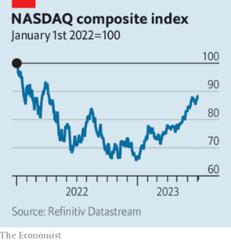  

#### 1.3 [KAL’s cartoon](https://www.economist.com/the-world-this-week/2023/07/06/kals-cartoon)
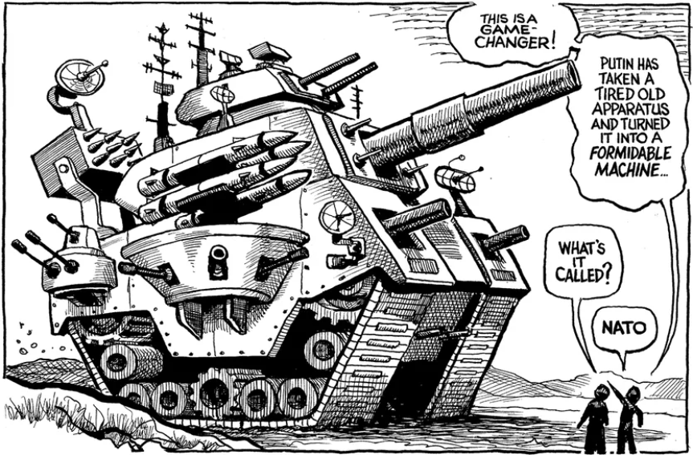  

#### 1.4 [This week’s covers](https://www.economist.com/the-world-this-week/2023/07/06/this-weeks-covers)

### 2. Leaders
#### 2.1 [A new era of high-tech war has begun](https://www.economist.com/leaders/2023/07/06/a-new-era-of-high-tech-war-has-begun)

#### 2.2 [The new Asian family](https://www.economist.com/leaders/2023/07/06/the-new-asian-family)

#### 2.3 [“Greedflation” is a nonsense idea](https://www.economist.com/leaders/2023/07/06/greedflation-is-a-nonsense-idea)
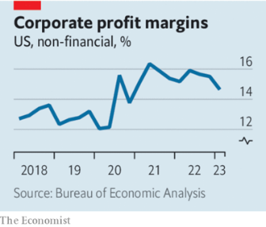  

#### 2.4 [The real problem with Britain’s water companies](https://www.economist.com/leaders/2023/07/05/the-real-problem-with-britains-water-companies)

#### 2.5 [Why affirmative action in American universities had to go](https://www.economist.com/leaders/2023/06/30/why-affirmative-action-in-american-universities-had-to-go)

#### 2.6 [The world needs more battery metals. Time to mine the seabed](https://www.economist.com/leaders/2023/07/06/the-world-needs-more-battery-metals-time-to-mine-the-seabed)
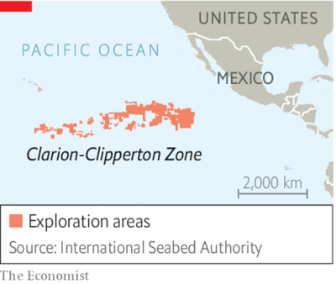  

### 3. Letters
#### 3.1 [Letters to the editor](https://www.economist.com/letters/2023/07/06/letters-to-the-editor)

### 4. By Invitation
#### 4.1 [Lee Bollinger laments the ruling by America’s Supreme Court against affirmative action](https://www.economist.com/by-invitation/2023/06/29/lee-bollinger-laments-the-ruling-by-americas-supreme-court-against-affirmative-action)

#### 4.2 [Alexander Gabuev on China’s strategic calculations after the turmoil in Russia](https://www.economist.com/by-invitation/2023/07/03/alexander-gabuev-on-chinas-strategic-calculations-after-the-turmoil-in-russia)

#### 4.3 [Thames Water may be troubled but privatisation has served Britain well, argues Michael Howard](https://www.economist.com/by-invitation/2023/07/06/thames-water-may-be-troubled-but-privatisation-has-served-britain-well-argues-michael-howard)

### 5. Briefing
#### 5.1 [Why China should be friendlier to its neighbours](https://www.economist.com/briefing/2023/07/04/why-china-should-be-friendlier-to-its-neighbours)
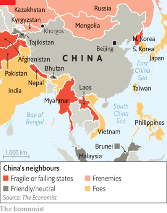  
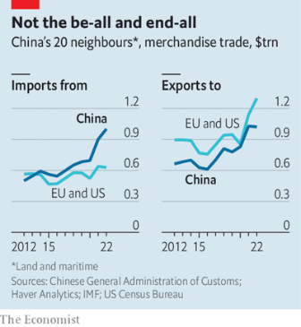  

### 6. Europe
#### 6.1 [Vladimir Putin’s useful idiots](https://www.economist.com/europe/2023/07/03/vladimir-putins-useful-idiots)

#### 6.2 [Ukraine wants American cluster bombs—quickly](https://www.economist.com/europe/2023/07/04/ukraine-wants-american-cluster-bombs-quickly)
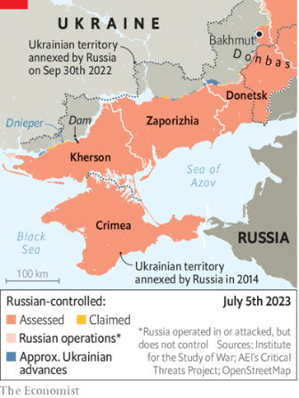  

#### 6.3 [The Baltic states fear that NATO is being complacent](https://www.economist.com/europe/2023/07/06/the-baltic-states-fear-that-nato-is-being-complacent)
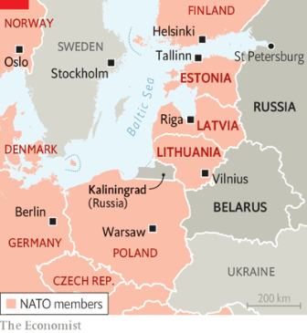  

#### 6.4 [Can Sweden’s two-track economy avoid a recession?](https://www.economist.com/europe/2023/07/06/can-swedens-two-track-economy-avoid-a-recession)
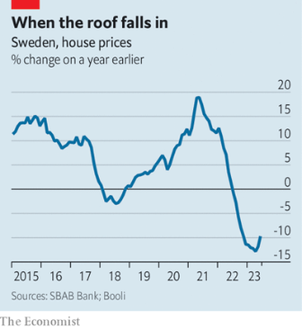  

#### 6.5 [The burning of the banlieues](https://www.economist.com/europe/2023/07/05/the-burning-of-the-banlieues)

### 7. Britain
#### 7.1 [How to understand the woeful state of Britain’s water utilities](https://www.economist.com/britain/2023/07/06/how-to-understand-the-woeful-state-of-britains-water-utilities)

#### 7.2 [Labour’s cabinet would be Britain’s most state-educated since 1945](https://www.economist.com/britain/2023/07/06/labours-cabinet-would-be-britains-most-state-educated-since-1945)

#### 7.3 [The NHS in England gets a plan for fixing its broken workforce](https://www.economist.com/britain/2023/06/30/the-nhs-in-england-gets-a-plan-for-fixing-its-broken-workforce)
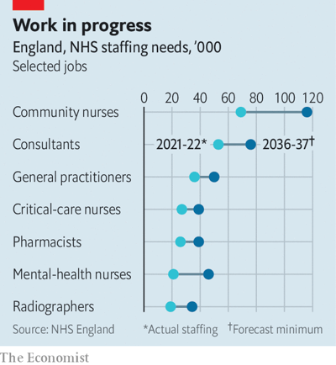  

#### 7.4 [Britons love country fairs. Why?](https://www.economist.com/britain/2023/06/23/britons-love-country-fairs-why)

#### 7.5 [Why right-wing Europeans are flocking to an English thinker](https://www.economist.com/britain/2023/07/02/why-right-wing-europeans-are-flocking-to-an-english-thinker)

#### 7.6 [Britain’s tough asylum plans are held up in court and by the Lords](https://www.economist.com/britain/2023/07/04/britains-tough-asylum-plans-are-held-up-in-court-and-by-the-lords)

#### 7.7 [Britons turn into Borat when it comes to health, housing and avocados](https://www.economist.com/britain/2023/07/06/britons-turn-into-borat-when-it-comes-to-health-housing-and-avocados)

### 8. United States
#### 8.1 [What to make of the Supreme Court’s tumultuous term](https://www.economist.com/united-states/2023/07/02/what-to-make-of-the-supreme-courts-tumultuous-term)

#### 8.2 [Can baseball fans be won over by the world’s second biggest sport?](https://www.economist.com/united-states/2023/07/06/can-baseball-fans-be-won-over-by-the-worlds-second-biggest-sport)

#### 8.3 [Chicago hopes to become a world centre for quantum research](https://www.economist.com/united-states/2023/07/06/chicago-hopes-to-become-a-world-centre-for-quantum-research)

#### 8.4 [Republican presidential candidates canoodle with Moms for Liberty](https://www.economist.com/united-states/2023/07/06/republican-presidential-candidates-canoodle-with-moms-for-liberty)

#### 8.5 [Dick Ravitch, New York’s fiscal superman](https://www.economist.com/united-states/2023/07/06/dick-ravitch-new-yorks-fiscal-superman)

#### 8.6 [How American universities will react as race-based admissions end](https://www.economist.com/united-states/2023/06/29/how-american-universities-will-react-as-race-based-admissions-end)

#### 8.7 [America has a shortage of lab monkeys](https://www.economist.com/united-states/2023/07/06/america-has-a-shortage-of-lab-monkeys)

### 9. Middle East & Africa
#### 9.1 [What MBS wants from Joe Biden](https://www.economist.com/middle-east-and-africa/2023/07/05/what-mbs-wants-from-joe-biden)

#### 9.2 [Israel launched its biggest raid on the West Bank in over 20 years](https://www.economist.com/middle-east-and-africa/2023/07/06/israel-launched-its-biggest-raid-on-the-west-bank-in-over-20-years)
  

#### 9.3 [Nigeria’s new president acts fast](https://www.economist.com/middle-east-and-africa/2023/07/06/nigerias-new-president-acts-fast)

#### 9.4 [Senegal’s President Macky Sall says he won’t stand for a third term](https://www.economist.com/middle-east-and-africa/2023/07/06/senegals-president-macky-sall-says-he-wont-stand-for-a-third-term)

#### 9.5 [Genocide all over again?](https://www.economist.com/middle-east-and-africa/2023/07/06/genocide-all-over-again)
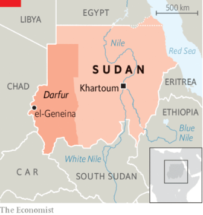  

### 10. The Americas
#### 10.1 [Jair Bolsonaro is barred from office for eight years](https://www.economist.com/the-americas/2023/06/30/jair-bolsonaro-is-barred-from-office-for-eight-years)

#### 10.2 [This year’s El Niño will hit Peru especially hard](https://www.economist.com/the-americas/2023/07/06/this-years-el-nino-will-hit-peru-especially-hard)

#### 10.3 [Cuba’s Communist government taps the diaspora for cash](https://www.economist.com/the-americas/2023/07/06/cubas-communist-government-taps-the-diaspora-for-cash)

### 11. Asia
#### 11.1 [East Asia’s new family portrait](https://www.economist.com/interactive/asia/2023/06/30/east-asias-new-family-portrait)

#### 11.2 [India, an aspiring digital superpower, keeps shutting down the internet](https://www.economist.com/asia/2023/07/05/india-an-aspiring-digital-superpower-keeps-shutting-down-the-internet)

#### 11.3 [Sri Lanka is uncovering mass graves but not the grisly truth of its civil war](https://www.economist.com/asia/2023/07/06/sri-lanka-is-uncovering-mass-graves-but-not-the-grisly-truth-of-its-civil-war)

### 12. China
#### 12.1 [China’s Communist Party is tightening its grip in businesses](https://www.economist.com/china/2023/07/06/chinas-communist-party-is-tightening-its-grip-in-businesses)

#### 12.2 [Hong Kong puts a price on the heads of democracy activists](https://www.economist.com/china/2023/07/04/hong-kong-puts-a-price-on-the-heads-of-democracy-activists)

#### 12.3 [Challenging the stigma associated with single mothers in China](https://www.economist.com/china/2023/07/06/challenging-the-stigma-associated-with-single-mothers-in-china)

#### 12.4 [China’s message to the global south](https://www.economist.com/china/2023/07/06/chinas-message-to-the-global-south)

### 13. International
#### 13.1 [NATO is drafting new plans to defend Europe](https://www.economist.com/international/2023/07/02/nato-is-drafting-new-plans-to-defend-europe)
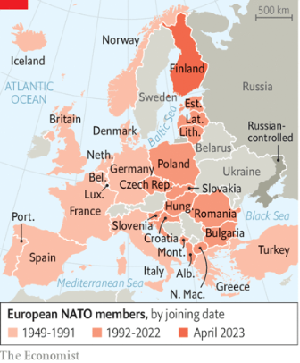  
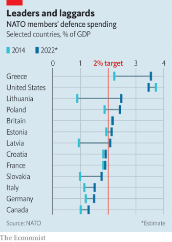  

### 14. Special report
#### 14.1 [The war in Ukraine shows how technology is changing the battlefield](https://www.economist.com/special-report/2023/07/03/the-war-in-ukraine-shows-how-technology-is-changing-the-battlefield)
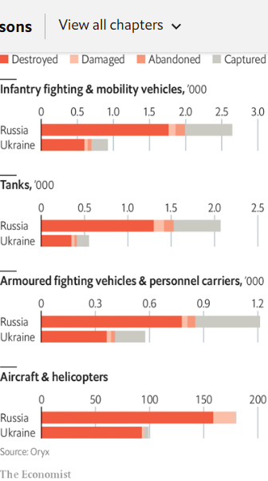  

#### 14.2 [The latest in the battle of jamming with electronic beams](https://www.economist.com/special-report/2023/07/03/the-latest-in-the-battle-of-jamming-with-electronic-beams)

#### 14.3 [Why logistics are too important to be left to the generals](https://www.economist.com/special-report/2023/07/03/why-logistics-are-too-important-to-be-left-to-the-generals)

#### 14.4 [Technology is deepening civilian involvement in war](https://www.economist.com/special-report/2023/07/03/technology-is-deepening-civilian-involvement-in-war)
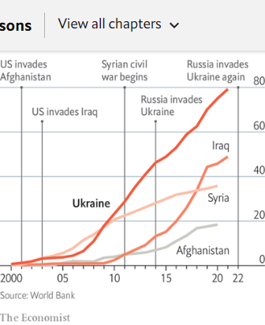  

#### 14.5 [How Ukraine’s enemy is also learning lessons, albeit slowly](https://www.economist.com/special-report/2023/07/03/how-ukraines-enemy-is-also-learning-lessons-albeit-slowly)

#### 14.6 [How oceans became new technological battlefields](https://www.economist.com/special-report/2023/07/03/how-oceans-became-new-technological-battlefields)

#### 14.7 [Western armies are learning a lot from the war in Ukraine](https://www.economist.com/special-report/2023/07/03/western-armies-are-learning-a-lot-from-the-war-in-ukraine)

#### 14.8 [Video: How we studied the lessons of Ukraine](https://www.economist.com/special-report/2023/07/03/video-how-we-studied-the-lessons-of-ukraine)

#### 14.9 [Sources and acknowledgments](https://www.economist.com/special-report/2023/07/04/sources-and-acknowledgments)

### 15. Business
#### 15.1 [The Musk-Zuckerberg social-media smackdown](https://www.economist.com/business/2023/07/04/the-musk-zuckerberg-social-media-smackdown)

#### 15.2 [In its tech war with America, China brings out the big guns](https://www.economist.com/business/2023/07/04/in-its-tech-war-with-america-china-brings-out-the-big-guns)

#### 15.3 [Can a viable industry emerge from the hydrogen shakeout?](https://www.economist.com/business/2023/07/03/can-a-viable-industry-emerge-from-the-hydrogen-shakeout)
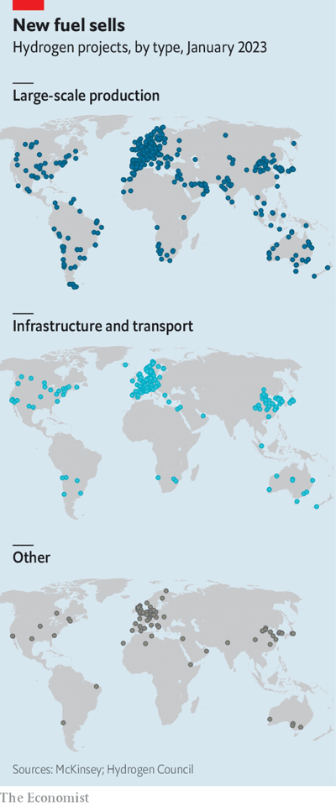  
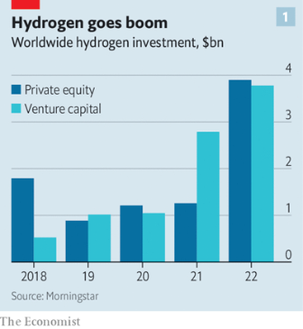  
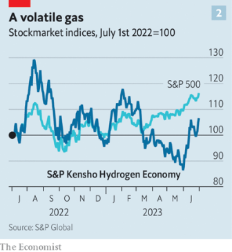  
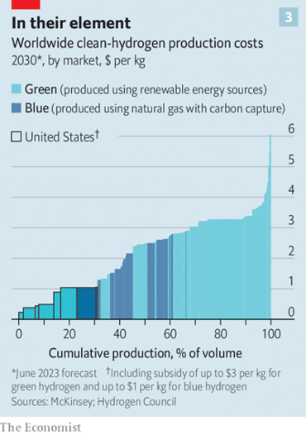  

#### 15.4 [How white-collar warriors gear up for the day](https://www.economist.com/business/2023/07/06/how-white-collar-warriors-gear-up-for-the-day)

#### 15.5 [A Lego-lover’s guide to preparing for the AI age](https://www.economist.com/business/2023/07/06/a-lego-lovers-guide-to-preparing-for-the-ai-age)

### 16. Finance & economics
#### 16.1 [Economists draw swords over how to fix inflation](https://www.economist.com/finance-and-economics/2023/07/05/economists-draw-swords-over-how-to-fix-inflation)
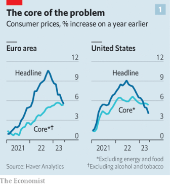  
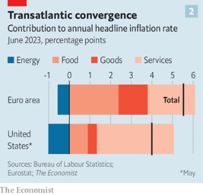  

#### 16.2 [How to win the battle against inflation](https://www.economist.com/finance-and-economics/2023/07/06/how-to-win-the-battle-against-inflation)
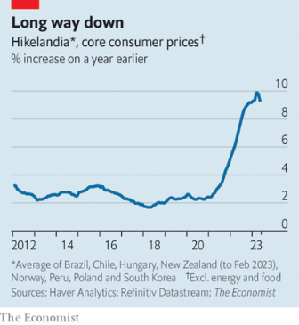  

#### 16.3 [Copper is unexpectedly getting cheaper](https://www.economist.com/finance-and-economics/2023/07/06/copper-is-unexpectedly-getting-cheaper)
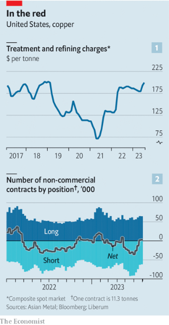  

#### 16.4 [Does it pay to be a communist in China?](https://www.economist.com/finance-and-economics/2023/07/06/does-it-pay-to-be-a-communist-in-china)
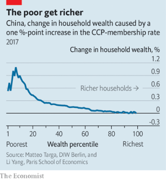  

#### 16.5 [How far will Wall Street job losses go?](https://www.economist.com/finance-and-economics/2023/07/06/how-far-will-wall-street-job-losses-go)
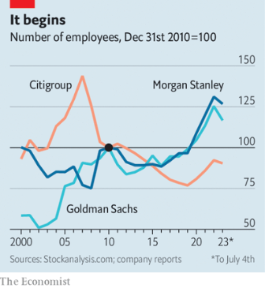  

#### 16.6 [Can anything pop the everything bubble?](https://www.economist.com/finance-and-economics/2023/07/04/can-anything-pop-the-everything-bubble)

#### 16.7 [Erdoganomics is spreading across the world](https://www.economist.com/finance-and-economics/2023/07/06/erdoganomics-is-spreading-across-the-world)

### 17. Science & technology
#### 17.1 [Deep-sea mining may soon ease the world’s battery-metal shortage](https://www.economist.com/science-and-technology/2023/07/02/deep-sea-mining-may-soon-ease-the-worlds-battery-metal-shortage)
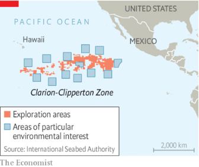  

#### 17.2 [New technology could cement Indonesia’s dominance of vital nickel](https://www.economist.com/science-and-technology/2023/07/05/new-technology-could-cement-indonesias-dominance-of-vital-nickel)
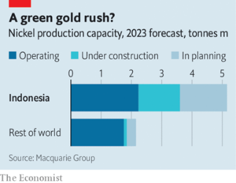  

#### 17.3 [A gigantic landslide shows the limit to how high mountains can grow](https://www.economist.com/science-and-technology/2023/07/06/a-gigantic-landslide-shows-the-limit-to-how-high-mountains-can-grow)

#### 17.4 [A Belgian company wants to create woolly-mammoth burgers](https://www.economist.com/science-and-technology/2023/07/05/a-belgian-company-wants-to-create-woolly-mammoth-burgers)

### 18. Culture
#### 18.1 [Governments are using culture to spur economic regeneration](https://www.economist.com/culture/2023/07/06/governments-are-using-culture-to-spur-economic-regeneration)

#### 18.2 [A new book revisits the trial of Philippe Pétain in 1945](https://www.economist.com/culture/2023/07/06/a-new-book-revisits-the-trial-of-philippe-petain-in-1945)

#### 18.3 [Mary Jackson has turned sweetgrass basketry into a fine-art form](https://www.economist.com/culture/2023/07/06/mary-jackson-has-turned-sweetgrass-basketry-into-a-fine-art-form)

#### 18.4 [Forough Farrokhzad gave voice to Iranian women’s despair and defiance](https://www.economist.com/culture/2023/07/06/forough-farrokhzad-gave-voice-to-iranian-womens-despair-and-defiance)

### 19. The Economist reads
#### 19.1 [What to read to become a better writer](https://www.economist.com/the-economist-reads/2022/09/09/what-to-read-to-become-a-better-writer)

### 20. Economic & financial indicators
#### 20.1 [Economic data, commodities and markets](https://www.economist.com/economic-and-financial-indicators/2023/07/06/economic-data-commodities-and-markets)
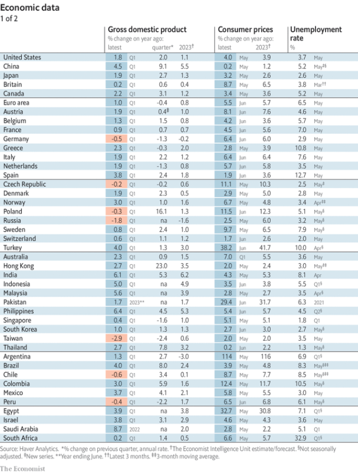  
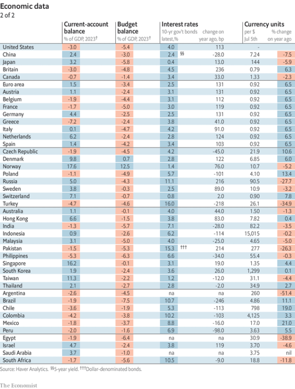  
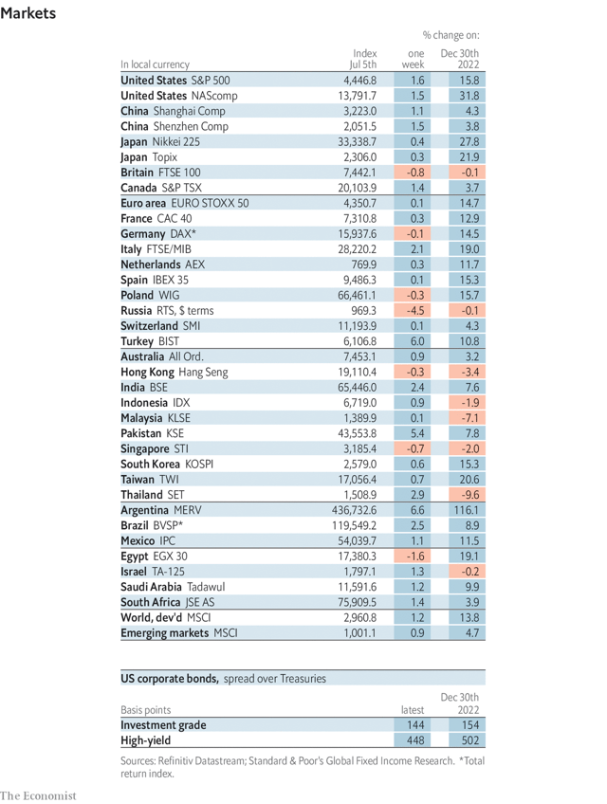  
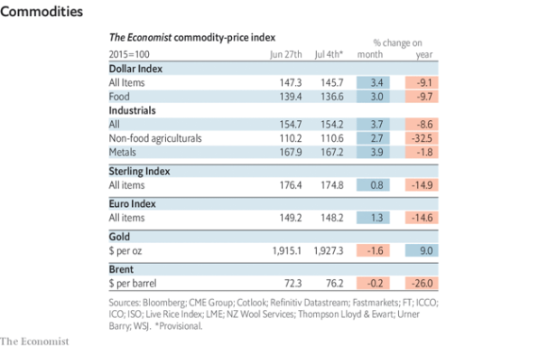  

### 21. Graphic detail
#### 21.1 [Prescription rules for obesity drugs may unfairly exclude non-whites](https://www.economist.com/graphic-detail/2023/07/05/prescription-rules-for-obesity-drugs-may-unfairly-exclude-non-whites)

### 22. The Economist explains
#### 22.1 [Why Hong Kong is criminalising a song](https://www.economist.com/the-economist-explains/2023/07/05/why-hong-kong-is-criminalising-a-song)

#### 22.2 [Can Russia’s navy thwart attacks by repainting its ships?](https://www.economist.com/the-economist-explains/2023/07/03/can-russias-navy-thwart-attacks-by-repainting-its-ships)

### 23. Obituary
#### 23.1 [Donald Triplett was the first man diagnosed with autism](https://www.economist.com/obituary/2023/07/06/donald-triplett-was-the-first-man-diagnosed-with-autism)

