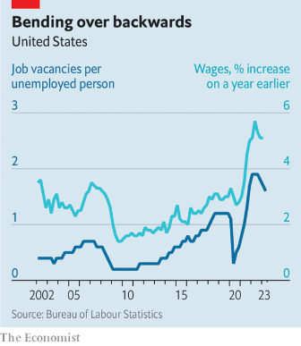

### 1. The world this week
#### 1.1 [Politics](https://www.economist.com/the-world-this-week/2023/07/13/politics)

#### 1.2 [Business](https://www.economist.com/the-world-this-week/2023/07/13/business)

#### 1.3 [KAL’s cartoon](https://www.economist.com/the-world-this-week/2023/07/13/kals-cartoon)
  

#### 1.4 [This week’s cover](https://www.economist.com/the-world-this-week/2023/07/13/this-weeks-cover)

### 2. Leaders
#### 2.1 [How MAGA Republicans plan to make Donald Trump’s second term count](https://www.economist.com/leaders/2023/07/13/how-maga-republicans-plan-to-make-donald-trumps-second-term-count)

#### 2.2 [NATO’s promises to Ukraine mark real progress](https://www.economist.com/leaders/2023/07/12/natos-promises-to-ukraine-mark-real-progress)

#### 2.3 [American trustbusters are losing their focus](https://www.economist.com/leaders/2023/07/13/american-trustbusters-are-losing-their-focus)

#### 2.4 [Subsidies and protection for manufacturing will harm the world economy](https://www.economist.com/leaders/2023/07/13/subsidies-and-protection-for-manufacturing-will-harm-the-world-economy)
  

#### 2.5 [Worry not about when the Anthropocene began, but how it might end](https://www.economist.com/leaders/2023/07/13/what-matters-about-the-anthropocene-is-not-when-it-began-but-how-it-might-end)

### 3. Letters
#### 3.1 [Letters to the editor](https://www.economist.com/letters/2023/07/13/letters-to-the-editor)

### 4. By Invitation
#### 4.1 [John Schoonbee on why new drugs, while helpful, are no panacea for obesity](https://www.economist.com/by-invitation/2023/07/12/john-schoonbee-on-why-new-drugs-while-helpful-are-no-panacea-for-obesity)

### 5. Briefing
#### 5.1 [The meticulous, ruthless preparations for a second Trump term](https://www.economist.com/briefing/2023/07/13/the-meticulous-ruthless-preparations-for-a-second-trump-term)

### 6. Europe
#### 6.1 [NATO did not give Volodymyr Zelensky everything he wanted](https://www.economist.com/europe/2023/07/12/nato-did-not-give-volodymyr-zelensky-everything-he-wanted)
  

#### 6.2 [Sappers risk their lives to win Ukraine back, inch by inch](https://www.economist.com/europe/2023/07/09/sappers-risk-their-lives-to-win-ukraine-back-inch-by-inch)
  

#### 6.3 [Support for the hard-right AfD is surging in Germany](https://www.economist.com/europe/2023/07/13/support-for-the-hard-right-afd-is-surging-in-germany)

#### 6.4 [Why Spain’s reasonably successful prime minister might lose his job](https://www.economist.com/europe/2023/07/13/why-spains-reasonably-successful-prime-minister-might-lose-his-job)
  

#### 6.5 [Farewell, Mark Rutte, the Tiggerish Dutch prime minister](https://www.economist.com/europe/2023/07/13/farewell-mark-rutte-the-tiggerish-dutch-prime-minister)

### 7. Britain
#### 7.1 [The Conservative Party faces a mutiny in Metroland](https://www.economist.com/britain/2023/07/11/the-conservative-party-faces-a-mutiny-in-metroland)
  

#### 7.2 [Many Britons have changed their minds on gay marriage](https://www.economist.com/britain/2023/07/13/many-britons-have-changed-their-minds-on-gay-marriage)
  

#### 7.3 [British pension funds agree to invest more in private markets](https://www.economist.com/britain/2023/07/12/british-pension-funds-agree-to-invest-more-in-private-markets)

#### 7.4 [Britain’s doctors are on strike, again](https://www.economist.com/britain/2023/07/13/britains-doctors-are-on-strike-again)

#### 7.5 [Why the Orkney Islands are considering joining Norway](https://www.economist.com/britain/2023/07/13/why-the-orkney-islands-are-considering-joining-norway)

#### 7.6 [The strange success of the Tories’ schools policy](https://www.economist.com/britain/2023/07/13/the-strange-success-of-the-tories-schools-policy)

### 8. United States
#### 8.1 [The American left and right loathe each other and agree on a lot](https://www.economist.com/united-states/2023/07/13/the-american-left-and-right-loathe-each-other-and-agree-on-a-lot)

#### 8.2 [Tony Evers’s veto shows the growing power of Midwestern Democrats](https://www.economist.com/united-states/2023/07/13/tony-everss-veto-shows-the-growing-power-of-midwestern-democrats)

#### 8.3 [A pilgrimage to the mecca of mediumship](https://www.economist.com/united-states/2023/07/13/a-pilgrimage-to-the-mecca-of-mediumship)

#### 8.4 [Judge and staff shortages are leaving Americans in limbo](https://www.economist.com/united-states/2023/07/13/judge-and-staff-shortages-are-leaving-americans-in-limbo)

#### 8.5 [An abortion battle causes mayhem in America’s military ranks](https://www.economist.com/united-states/2023/07/13/an-abortion-battle-causes-mayhem-in-americas-military-ranks)

#### 8.6 [America’s state lawmakers are passing ineffective anti-porn laws](https://www.economist.com/united-states/2023/07/13/americas-state-lawmakers-are-passing-ineffective-anti-porn-laws)

#### 8.7 [Joe Biden should run against the Ivy League](https://www.economist.com/united-states/2023/07/12/joe-biden-should-run-against-the-ivy-league)

### 9. Middle East & Africa
#### 9.1 [Why Cape Town beats Johannesburg](https://www.economist.com/middle-east-and-africa/2023/07/12/why-cape-town-beats-johannesburg)
  

#### 9.2 [War crimes in Tigray may be covered up or forgotten](https://www.economist.com/middle-east-and-africa/2023/07/09/war-crimes-in-tigray-may-be-covered-up-or-forgotten)
  

#### 9.3 [Syria’s president wants non-Muslim religions to help end his pariah status](https://www.economist.com/middle-east-and-africa/2023/07/13/syrias-president-wants-non-muslim-religions-to-help-end-his-pariah-status)

#### 9.4 [Politicians in Libya make another ill-fated push for elections](https://www.economist.com/middle-east-and-africa/2023/07/13/politicians-in-libya-make-another-ill-fated-push-for-elections)

#### 9.5 [Does Islam smile on cryptocurrency?](https://www.economist.com/middle-east-and-africa/2023/07/13/does-islam-smile-on-cryptocurrency)

### 10. The Americas
#### 10.1 [Latin America is set to become a major oil producer this decade](https://www.economist.com/the-americas/2023/07/11/latin-america-is-set-to-become-a-major-oil-producer-this-decade)
  
  
  

### 11. Asia
#### 11.1 [In Asia data flows are part of a new great game](https://www.economist.com/asia/2023/07/10/in-asia-data-flows-are-part-of-a-new-great-game)

#### 11.2 [Why has Vietnam banned the “Barbie” film?](https://www.economist.com/asia/2023/07/13/why-has-vietnam-banned-the-barbie-film)

#### 11.3 [Cambodia’s autocrat is fixing his succession](https://www.economist.com/asia/2023/07/13/cambodias-autocrat-is-fixing-his-succession)

#### 11.4 [The Taliban embrace cultural heritage](https://www.economist.com/asia/2023/07/11/the-taliban-embrace-cultural-heritage)

#### 11.5 [Asia is rowing about Fukushima nuclear wastewater](https://www.economist.com/asia/2023/07/13/asia-is-rowing-about-fukushima-nuclear-wastewater)

### 12. China
#### 12.1 [China is obsessed with food security. Climate change will challenge it](https://www.economist.com/china/2023/07/13/china-is-obsessed-with-food-security-climate-change-will-challenge-it)
  

#### 12.2 [The Chinese are working more hours than ever](https://www.economist.com/china/2023/07/13/the-chinese-are-working-more-hours-than-ever)
  

#### 12.3 [Another comeback for China’s street merchants](https://www.economist.com/china/2023/07/13/another-comeback-for-chinas-street-merchants)

#### 12.4 [Rule by law, with Chinese characteristics](https://www.economist.com/china/2023/07/13/rule-by-law-with-chinese-characteristics)

### 13. International
#### 13.1 [What would Europe do if Trump won?](https://www.economist.com/international/2023/07/11/what-would-europe-do-if-trump-won)

### 14. Business
#### 14.1 [Is big business really getting too big?](https://www.economist.com/business/2023/07/12/is-big-business-really-getting-too-big)

#### 14.2 [Britain hands Microsoft’s Activision deal an extra life](https://www.economist.com/business/2023/07/13/britain-hands-microsofts-activision-deal-an-extra-life)

#### 14.3 [The fight over working from home goes global](https://www.economist.com/business/2023/07/10/the-fight-over-working-from-home-goes-global)

#### 14.4 [Big pharma is warming to the potential of AI](https://www.economist.com/business/2023/07/13/big-pharma-is-warming-to-the-potential-of-ai)

#### 14.5 [Executive coaching is useful therapy that you can expense](https://www.economist.com/business/2023/07/13/executive-coaching-is-useful-therapy-that-you-can-expense)

#### 14.6 [The last, unfulfilled dream of Jamie Dimon, king of Wall Street](https://www.economist.com/business/2023/07/11/the-last-unfulfilled-dream-of-jamie-dimon-king-of-wall-street)

### 15. Finance & economics
#### 15.1 [The world is in the grip of a manufacturing delusion](https://www.economist.com/finance-and-economics/2023/07/13/the-world-is-in-the-grip-of-a-manufacturing-delusion)
  
  
  
  

#### 15.2 [China controls the supply of crucial war minerals](https://www.economist.com/finance-and-economics/2023/07/13/china-controls-the-supply-of-crucial-war-minerals)
  
  

#### 15.3 [Is America’s inflationary fever breaking?](https://www.economist.com/finance-and-economics/2023/07/13/is-americas-inflationary-fever-breaking)
  

#### 15.4 [China’s war on financial reality](https://www.economist.com/finance-and-economics/2023/07/13/chinas-war-on-financial-reality)

#### 15.5 [The mystery of gold prices](https://www.economist.com/finance-and-economics/2023/07/13/the-mystery-of-gold-prices)

#### 15.6 [Why people struggle to understand climate risk](https://www.economist.com/finance-and-economics/2023/07/13/why-people-struggle-to-understand-climate-risk)

### 16. Science & technology
#### 16.1 [What are the chances of an AI apocalypse?](https://www.economist.com/science-and-technology/2023/07/10/what-are-the-chances-of-an-ai-apocalypse)
  

#### 16.2 [An enormous—and unexpected—lump of granite has been found on the Moon](https://www.economist.com/science-and-technology/2023/07/12/an-enormous-and-unexpected-lump-of-granite-has-been-found-on-the-moon)

#### 16.3 [A Canadian lake could mark the start of humanity’s geological epoch](https://www.economist.com/science-and-technology/2023/07/12/a-canadian-lake-could-mark-the-start-of-humanitys-geological-epoch)

#### 16.4 [Sabre-tooth tigers and dire wolves were in trouble before they vanished](https://www.economist.com/science-and-technology/2023/07/12/sabre-tooth-tigers-and-dire-wolves-were-in-trouble-before-they-vanished)

### 17. Culture
#### 17.1 [Try these books on your summer holiday](https://www.economist.com/culture/2023/07/13/try-these-books-on-your-summer-holiday)

#### 17.2 [When it comes to ice cream, the instinct to innovate is misguided](https://www.economist.com/culture/2023/07/13/when-it-comes-to-ice-cream-the-instinct-to-innovate-is-misguided)

#### 17.3 [Khaled Khalifa’s new novel tells the story of two families in Aleppo](https://www.economist.com/culture/2023/07/13/khaled-khalifas-new-novel-tells-the-story-of-two-families-in-aleppo)

#### 17.4 [“Narcas” offers a rare glimpse of the women in drug gangs](https://www.economist.com/culture/2023/07/13/narcas-offers-a-rare-glimpse-of-the-women-in-drug-gangs)

#### 17.5 [Bruce Springsteen turns back the clock—and stops it](https://www.economist.com/culture/2023/07/11/bruce-springsteen-turns-back-the-clock-and-stops-it)

### 18. The Economist reads
#### 18.1 [What to read to become more creative](https://www.economist.com/the-economist-reads/2023/07/12/what-to-read-to-become-more-creative)

### 19. Economic & financial indicators
#### 19.1 [Economic data, commodities and markets](https://www.economist.com/economic-and-financial-indicators/2023/07/13/economic-data-commodities-and-markets)
  
  
  
  

### 20. Graphic detail
#### 20.1 [A new study finds that 47,000 Russian combatants have died in Ukraine](https://www.economist.com/graphic-detail/2023/07/12/a-new-study-finds-that-47000-russian-combatants-have-died-in-ukraine)

### 21. The Economist explains
#### 21.1 [How AI image-generators work](https://www.economist.com/the-economist-explains/2023/07/10/how-ai-image-generators-work)

#### 21.2 [Why a cancer scare around aspartame is mostly unfounded](https://www.economist.com/the-economist-explains/2023/07/13/why-a-cancer-scare-around-aspartame-is-mostly-unfounded)

### 22. Obituary
#### 22.1 [Victoria Amelina explored a land of atrocities and secrets](https://www.economist.com/obituary/2023/07/13/victoria-amelina-explored-a-land-of-atrocities-and-secrets)

