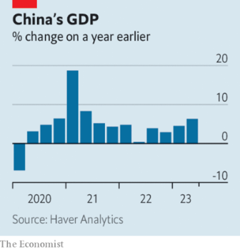
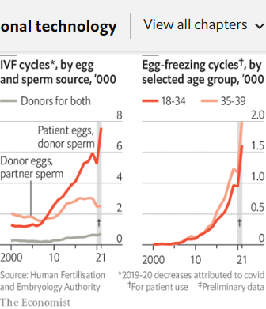
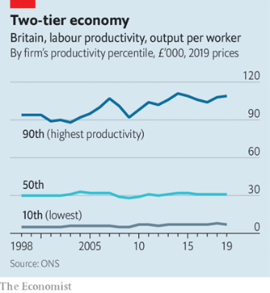

### 1. The world this week
#### 1.1 [Politics](https://www.economist.com/the-world-this-week/2023/07/20/politics)

#### 1.2 [Business](https://www.economist.com/the-world-this-week/2023/07/20/business)
  

#### 1.3 [KAL’s cartoon](https://www.economist.com/the-world-this-week/2023/07/20/kals-cartoon)
  

#### 1.4 [This week’s cover](https://www.economist.com/the-world-this-week/2023/07/20/this-weeks-cover)

### 2. Leaders
#### 2.1 [Making babymaking better](https://www.economist.com/leaders/2023/07/20/making-babymaking-better)

#### 2.2 [How cities can respond to extreme heat](https://www.economist.com/leaders/2023/07/20/how-cities-can-respond-to-extreme-heat)

#### 2.3 [The world economy is still in danger](https://www.economist.com/leaders/2023/07/19/the-world-economy-is-still-in-danger)
  

#### 2.4 [What the China-India detente means for the West](https://www.economist.com/leaders/2023/07/20/what-the-china-india-detente-means-for-the-west)

#### 2.5 [What the world’s budding autocrats are learning from El Salvador](https://www.economist.com/leaders/2023/07/20/what-the-worlds-budding-autocrats-are-learning-from-el-salvador)

#### 2.6 [Should Ukraine get Russia’s frozen reserves?](https://www.economist.com/leaders/2023/07/20/should-ukraine-get-russias-frozen-reserves)

### 3. Letters
#### 3.1 [Letters to the editor](https://www.economist.com/letters/2023/07/20/letters-to-the-editor)

### 4. By Invitation
#### 4.1 [George Clooney and John Prendergast on how the West can kill the Wagner virus](https://www.economist.com/by-invitation/2023/07/17/george-clooney-and-john-prendergast-on-how-the-west-can-kill-the-wagner-virus)

#### 4.2 [Alberto Núñez Feijóo on why he deserves to lead Spain](https://www.economist.com/by-invitation/2023/07/19/alberto-nunez-feijoo-on-why-he-deserves-to-lead-spain)

#### 4.3 [As Spain prepares to vote, its Socialist prime minister sets out the case for continuity](https://www.economist.com/by-invitation/2023/07/19/as-spain-prepares-to-vote-its-socialist-prime-minister-sets-out-the-case-for-continuity)

### 5. Briefing
#### 5.1 [Could America’s economy escape recession?](https://www.economist.com/briefing/2023/07/20/could-americas-economy-escape-recession)
  
  
  
  

### 6. Europe
#### 6.1 [Post-mutiny Moscow descends into factional murk](https://www.economist.com/europe/2023/07/18/post-mutiny-moscow-descends-into-factional-murk)

#### 6.2 [Zaporizhia braces itself for Russian nuclear tricks](https://www.economist.com/europe/2023/07/16/zaporizhia-braces-itself-for-russian-nuclear-tricks)
  

#### 6.3 [France’s Zeitenwende](https://www.economist.com/europe/2023/07/20/frances-zeitenwende)

#### 6.4 [Why the EU will not seize Russian state assets to rebuild Ukraine](https://www.economist.com/europe/2023/07/20/why-the-eu-will-not-seize-russian-state-assets-to-rebuild-ukraine)

#### 6.5 [How Ukrainians affect Poland](https://www.economist.com/europe/2023/07/20/how-ukrainians-affect-poland)
  

#### 6.6 [A spat in Brussels pits an open vision of Europe against an insular one](https://www.economist.com/europe/2023/07/19/a-spat-in-brussels-pits-an-open-vision-of-europe-against-an-insular-one)

### 7. Britain
#### 7.1 [Muddled policies are harming British universities](https://www.economist.com/britain/2023/07/18/muddled-policies-are-harming-british-universities)
  

#### 7.2 [British inflation may not be as sticky as thought](https://www.economist.com/britain/2023/07/19/british-inflation-may-not-be-as-sticky-as-thought)
  

#### 7.3 [A big battery investment is good news for British carmaking](https://www.economist.com/britain/2023/07/20/a-big-battery-investment-is-good-news-for-british-carmaking)

#### 7.4 [Sir Tony Blair mesmerises the Labour Party, again](https://www.economist.com/britain/2023/07/20/sir-tony-blair-mesmerises-the-labour-party-again)

#### 7.5 [Whoever runs Britain will struggle to get tough on China](https://www.economist.com/britain/2023/07/20/whoever-runs-britain-will-struggle-to-get-tough-on-china)

#### 7.6 [The rise of the self-pitying MP](https://www.economist.com/britain/2023/07/20/the-rise-of-the-self-pitying-mp)

### 8. United States
#### 8.1 [Americans are moving to places besieged by extreme heat](https://www.economist.com/united-states/2023/07/20/americans-are-moving-to-places-besieged-by-extreme-heat)
  

#### 8.2 [The FDA approves the first-ever non-prescription birth-control pill](https://www.economist.com/united-states/2023/07/20/the-fda-approves-the-first-ever-non-prescription-birth-control-pill)

#### 8.3 [Ron DeSantis is relying on big donors and his super PAC](https://www.economist.com/united-states/2023/07/20/ron-desantis-is-relying-on-big-donors-and-his-super-pac)
  

#### 8.4 [What America’s bike-share schemes tell you about venture capital](https://www.economist.com/united-states/2023/07/20/what-americas-bike-share-schemes-tell-you-about-venture-capital)

#### 8.5 [How Mexico has become the “enemy” of America’s Republicans](https://www.economist.com/united-states/2023/07/20/how-mexico-has-become-the-enemy-of-americas-republicans)
  

#### 8.6 [The case for a third-party campaign in 2024 is actuarial, not ideological](https://www.economist.com/united-states/2023/07/20/the-case-for-a-third-party-campaign-in-2024-is-actuarial-not-ideological)

### 9. Middle East & Africa
#### 9.1 [Why Africa is poised to become a big player in energy markets](https://www.economist.com/interactive/middle-east-and-africa/2023/07/18/why-africa-is-poised-to-become-a-big-player-in-energy-markets)

#### 9.2 [Israel’s constitutional chaos is far from over](https://www.economist.com/middle-east-and-africa/2023/07/17/israels-constitutional-chaos-is-far-from-over)

#### 9.3 [How well-connected Iranians import their goodies](https://www.economist.com/middle-east-and-africa/2023/07/20/how-well-connected-iranians-import-their-goodies)

### 10. The Americas
#### 10.1 [Nayib Bukele shows how to dismantle a democracy and stay popular](https://www.economist.com/the-americas/2023/07/20/nayib-bukele-shows-how-to-dismantle-a-democracy-and-stay-popular)
  
  
  

#### 10.2 [Young Latin Americans are unusually open to autocrats](https://www.economist.com/the-americas/2023/07/20/young-latin-americans-are-unusually-open-to-autocrats)
  

### 11. Asia
#### 11.1 [A battery supply chain that excludes China looks impossible](https://www.economist.com/asia/2023/07/17/a-battery-supply-chain-that-excludes-china-looks-impossible)
  
  

#### 11.2 [Singapore is the world leader in selling cultivated meat](https://www.economist.com/asia/2023/07/20/singapore-is-the-world-leader-in-selling-cultivated-meat)

#### 11.3 [An American soldier has deserted to North Korea](https://www.economist.com/asia/2023/07/19/an-american-soldier-has-deserted-to-north-korea)

#### 11.4 [Why are politics in West Bengal so violent?](https://www.economist.com/asia/2023/07/20/why-are-politics-in-west-bengal-so-violent)

### 12. China
#### 12.1 [Can academic joint ventures between China and the West survive?](https://www.economist.com/china/2023/07/20/can-academic-joint-ventures-between-china-and-the-west-survive)

#### 12.2 [A clue to China’s true covid-19 death toll](https://www.economist.com/china/2023/07/20/a-clue-to-chinas-true-covid-19-death-toll)
  

#### 12.3 [Germany’s new strategy for dealings with China](https://www.economist.com/china/2023/07/20/germanys-new-strategy-for-dealings-with-china)

#### 12.4 [How China trains its journalists to report “correctly”](https://www.economist.com/china/2023/07/20/how-china-trains-its-journalists-to-report-correctly)

#### 12.5 [China’s foreign minister goes missing](https://www.economist.com/china/2023/07/20/chinas-foreign-minister-goes-missing)

### 13. International
#### 13.1 [What if China and India became friends?](https://www.economist.com/international/2023/07/19/what-if-china-and-india-became-friends)
  
  
  

### 14. Technology Quarterly
#### 14.1 [In vitro fertilisation is struggling to keep up with demand](https://www.economist.com/technology-quarterly/2023/07/17/in-vitro-fertilisation-is-struggling-to-keep-up-with-demand)
  

#### 14.2 [IVF remains largely a numbers game](https://www.economist.com/technology-quarterly/2023/07/17/ivf-remains-largely-a-numbers-game)

#### 14.3 [The fertility sector is booming](https://www.economist.com/technology-quarterly/2023/07/17/the-fertility-sector-is-booming)

#### 14.4 [Not all types of families can access IVF](https://www.economist.com/technology-quarterly/2023/07/17/not-all-types-of-families-can-access-ivf)

#### 14.5 [Some women need eggs from others, or from their younger selves](https://www.economist.com/technology-quarterly/2023/07/17/some-women-need-eggs-from-others-or-from-their-younger-selves)
  

#### 14.6 [New ways of making babies are on the horizon](https://www.economist.com/technology-quarterly/2023/07/17/new-ways-of-making-babies-are-on-the-horizon)

#### 14.7 [Lack of basic research has hampered assisted reproduction](https://www.economist.com/technology-quarterly/2023/07/17/lack-of-basic-research-has-hampered-assisted-reproduction)

#### 14.8 [Video: Why we know so little about human reproduction](https://www.economist.com/technology-quarterly/2023/07/17/video-why-we-know-so-little-about-human-reproduction)

#### 14.9 [Sources and acknowledgments](https://www.economist.com/technology-quarterly/2023/07/18/sources-and-acknowledgments)

### 15. Business
#### 15.1 [Tesla’s surprising new route to EV domination](https://www.economist.com/business/2023/07/18/teslas-surprising-new-route-to-ev-domination)
  
  
  

#### 15.2 [Workplace advice from our agony uncle](https://www.economist.com/business/2023/07/20/workplace-advice-from-our-agony-uncle)

#### 15.3 [Can a Czech billionaire rescue Casino?](https://www.economist.com/business/2023/07/20/can-a-czech-billionaire-rescue-casino)

#### 15.4 [The winners and losers from the $69bn Microsoft-Activision mega-deal](https://www.economist.com/business/2023/07/20/the-winners-and-losers-from-the-69bn-microsoft-activision-mega-deal)

#### 15.5 [Startups are producing real dairy without a cow in sight](https://www.economist.com/business/2023/07/20/startups-are-producing-real-dairy-without-a-cow-in-sight)

#### 15.6 [A battle of rickshaw apps shows the promise of India’s digital stack](https://www.economist.com/business/2023/07/20/a-battle-of-rickshaw-apps-shows-the-promise-of-indias-digital-stack)

#### 15.7 [Hollywood’s blockbuster strike may become a flop](https://www.economist.com/business/2023/07/19/hollywoods-blockbuster-strike-may-become-a-flop)

### 16. Finance & economics
#### 16.1 [Your employer is (probably) unprepared for artificial intelligence](https://www.economist.com/finance-and-economics/2023/07/16/your-employer-is-probably-unprepared-for-artificial-intelligence)
  
  
  

#### 16.2 [How much trouble is China’s economy in?](https://www.economist.com/finance-and-economics/2023/07/17/how-much-trouble-is-chinas-economy-in)
  

#### 16.3 [The dollar’s dip will not become a sustained decline](https://www.economist.com/finance-and-economics/2023/07/20/the-dollars-dip-will-not-become-a-sustained-decline)

#### 16.4 [Big tech’s dominance is straining the logic of passive investing](https://www.economist.com/finance-and-economics/2023/07/20/big-techs-dominance-is-straining-the-logic-of-passive-investing)
  

#### 16.5 [America’s big banks are in rude health—with one exception](https://www.economist.com/finance-and-economics/2023/07/19/americas-big-banks-are-in-rude-health-with-one-exception)
  

#### 16.6 [Instant payments finally reach America with FedNow](https://www.economist.com/finance-and-economics/2023/07/20/instant-payments-finally-reach-america-with-fednow)
  

### 17. Science & technology
#### 17.1 [Are the current heatwaves evidence that climate change is speeding up?](https://www.economist.com/science-and-technology/2023/07/19/are-the-current-heatwaves-evidence-that-climate-change-is-speeding-up)
  
  
  

#### 17.2 [Scrapyards adopt new high-tech ways to dismantle cars](https://www.economist.com/science-and-technology/2023/07/19/scrapyards-adopt-new-high-tech-ways-to-dismantle-cars)

#### 17.3 [A spectacular new fossil shows a mammal making a meal of a dinosaur](https://www.economist.com/science-and-technology/2023/07/19/a-spectacular-new-fossil-shows-a-mammal-making-a-meal-of-a-dinosaur)

### 18. Culture
#### 18.1 [Realism with “Oppenheimer”, or escapism with “Barbie”?](https://www.economist.com/culture/2023/07/14/realism-with-oppenheimer-or-escapism-with-barbie)

#### 18.2 [Extreme temperatures separate “the cool and the damned”](https://www.economist.com/culture/2023/07/17/extreme-temperatures-separate-the-cool-and-the-damned)

#### 18.3 [A new novel imagines life in Andy Warhol’s studio](https://www.economist.com/culture/2023/07/20/a-new-novel-imagines-life-in-andy-warhols-studio)

#### 18.4 [Calder Walton’s “Spies” is a riveting history of espionage](https://www.economist.com/culture/2023/07/20/calder-waltons-spies-is-a-riveting-history-of-espionage)

#### 18.5 [“The Retrievals”, a tale of agony and addiction, makes listeners squirm](https://www.economist.com/culture/2023/07/18/the-retrievals-a-tale-of-agony-and-addiction-makes-listeners-squirm)

#### 18.6 [AI is making it possible to clone voices](https://www.economist.com/culture/2023/07/20/ai-is-making-it-possible-to-clone-voices)

### 19. Economic & financial indicators
#### 19.1 [Economic data, commodities and markets](https://www.economist.com/economic-and-financial-indicators/2023/07/20/economic-data-commodities-and-markets)
  
  
  
  

### 20. Graphic detail
#### 20.1 [Data from satellites suggest violence has surged in much of Sudan](https://www.economist.com/graphic-detail/2023/07/20/data-from-satellites-suggest-violence-has-surged-in-much-of-sudan)

### 21. The Economist explains
#### 21.1 [What happens when extreme weather hits several places at once?](https://www.economist.com/the-economist-explains/2023/07/19/what-happens-when-extreme-weather-hits-several-places-at-once)

#### 21.2 [Why developing the world’s first malaria vaccine has taken so long](https://www.economist.com/the-economist-explains/2023/07/18/why-developing-the-worlds-first-malaria-vaccine-has-taken-so-long)
  

### 22. Obituary
#### 22.1 [Milan Kundera believed that truth lay in endless questioning](https://www.economist.com/obituary/2023/07/19/milan-kundera-believed-that-truth-lay-in-endless-questioning)

