### 1. The world this week
#### 1.1 [Politics](https://www.economist.com/the-world-this-week/2023/07/27/politics)

#### 1.2 [Business](https://www.economist.com/the-world-this-week/2023/07/27/business)
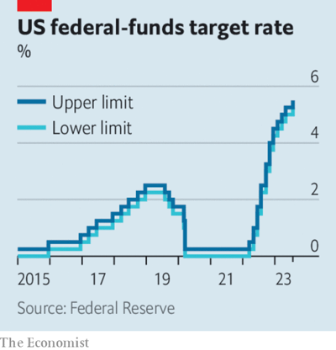  

#### 1.3 [KAL’s cartoon](https://www.economist.com/the-world-this-week/2023/07/27/kals-cartoon)
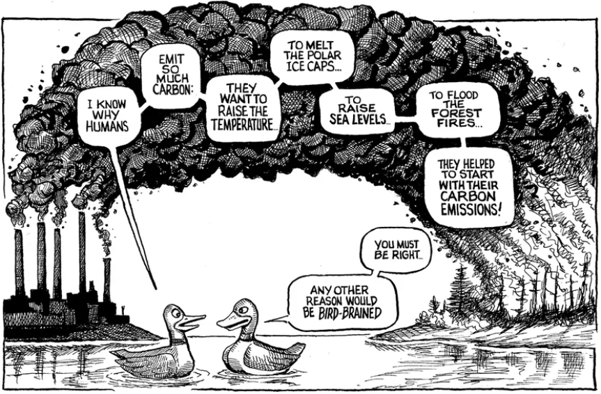  

### 2. Leaders
#### 2.1 [How to run a business in a dangerous and disorderly world](https://www.economist.com/leaders/2023/07/27/how-to-run-a-business-in-a-dangerous-and-disorderly-world)

#### 2.2 [The world should not let Vladimir Putin abandon the grain deal](https://www.economist.com/leaders/2023/07/26/the-world-should-not-let-vladimir-putin-abandon-the-grain-deal)
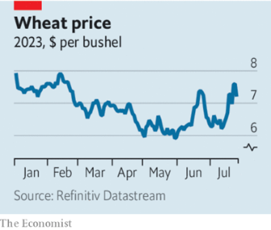  

#### 2.3 [Israel has lurched closer to constitutional chaos](https://www.economist.com/leaders/2023/07/26/israel-has-lurched-closer-to-constitutional-chaos)

#### 2.4 [The world’s poor need to know about weather disasters ahead of time](https://www.economist.com/leaders/2023/07/27/the-worlds-poor-need-to-know-about-weather-disasters-ahead-of-time)

#### 2.5 [Keir Starmer’s plans for aid and diplomacy could help define him](https://www.economist.com/leaders/2023/07/27/keir-starmers-plans-for-aid-and-diplomacy-could-help-define-him)

### 3. Letters
#### 3.1 [Letters to the editor](https://www.economist.com/letters/2023/07/27/letters-to-the-editor)

### 4. By Invitation
#### 4.1 [Lawrence Summers, Philip Zelikow and Robert Zoellick on why Russian reserves should be used to help Ukraine](https://www.economist.com/by-invitation/2023/07/27/lawrence-summers-philip-zelikow-and-robert-zoellick-on-why-russian-reserves-should-be-used-to-help-ukraine)

### 5. Europe
#### 5.1 [Beneath France’s revolts, hidden success](https://www.economist.com/europe/2023/07/27/beneath-frances-revolts-hidden-success)
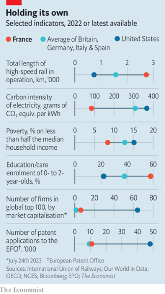  

#### 5.2 [Wildfires threaten Greece’s tourist economy](https://www.economist.com/europe/2023/07/27/wildfires-threaten-greeces-tourist-economy)

#### 5.3 [Ukraine’s missile cemetery](https://www.economist.com/europe/2023/07/27/ukraines-missile-cemetery)

#### 5.4 [Germany tries to stop brawls in public swimming pools](https://www.economist.com/europe/2023/07/27/germany-tries-to-stop-brawls-in-public-swimming-pools)

#### 5.5 [Spain shows that some voters still want centrism](https://www.economist.com/europe/2023/07/26/spain-shows-that-some-voters-still-want-centrism)

### 6. Britain
#### 6.1 [Britain has blown its reputation as a world leader in aid](https://www.economist.com/britain/2023/07/27/britain-has-blown-its-reputation-as-a-world-leader-in-aid)
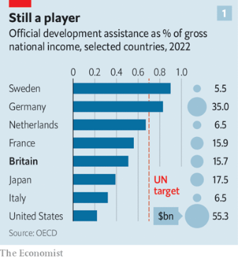  
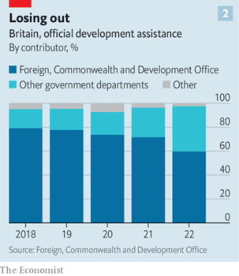  

#### 6.2 [Nigel Farage, NatWest and a political storm](https://www.economist.com/britain/2023/07/26/nigel-farage-natwest-and-a-political-storm)

#### 6.3 [London’s latest effort to clear bad air is contested but necessary](https://www.economist.com/britain/2023/07/25/londons-latest-effort-to-clear-bad-air-is-contested-but-necessary)
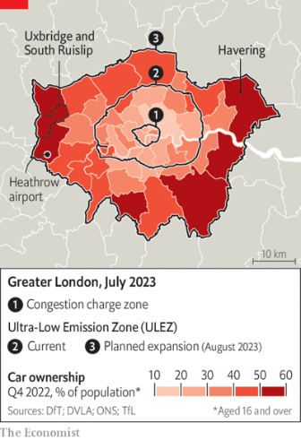  

#### 6.4 [How high should Britain’s interest rates go?](https://www.economist.com/britain/2023/07/27/how-high-should-britains-interest-rates-go)
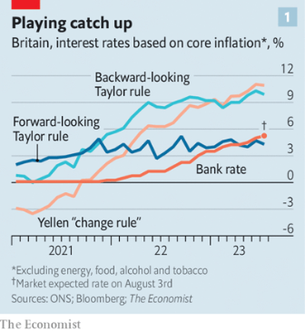  
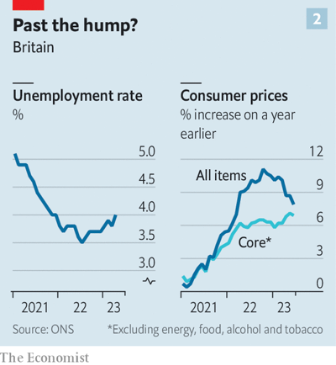  

#### 6.5 [No, really. Rishi Sunak is a right-winger](https://www.economist.com/britain/2023/07/27/no-really-rishi-sunak-is-a-right-winger)

### 7. United States
#### 7.1 [American universities have an incentive to seem extortionate](https://www.economist.com/united-states/2023/07/23/american-universities-have-an-incentive-to-seem-extortionate)
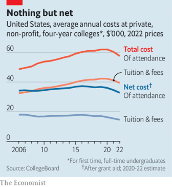  

#### 7.2 [The making of America’s Ivy League elite](https://www.economist.com/united-states/2023/07/24/the-making-of-americas-ivy-league-elite)

#### 7.3 [Oppenheimer’s secret city is a shrine to the Manhattan Project](https://www.economist.com/united-states/2023/07/24/oppenheimers-secret-city-is-a-shrine-to-the-manhattan-project)

#### 7.4 [Regulation could disrupt the booming “kidfluencer” business](https://www.economist.com/united-states/2023/07/27/regulation-could-disrupt-the-booming-kidfluencer-business)

#### 7.5 [The Biden administration embraces place-based industrial policy](https://www.economist.com/united-states/2023/07/27/the-biden-administration-embraces-place-based-industrial-policy)

#### 7.6 [Fentanyl is spreading the opioid crisis into America’s big cities](https://www.economist.com/united-states/2023/07/27/fentanyl-is-spreading-the-opioid-crisis-into-americas-big-cities)

### 8. Middle East & Africa
#### 8.1 [A blow against Israel’s Supreme Court plunges the country into crisis](https://www.economist.com/middle-east-and-africa/2023/07/24/a-blow-against-israels-supreme-court-plunges-the-country-into-crisis)

#### 8.2 [Why African leaders shunned Vladimir Putin’s summit](https://www.economist.com/middle-east-and-africa/2023/07/26/why-african-leaders-shunned-vladimir-putins-summit)
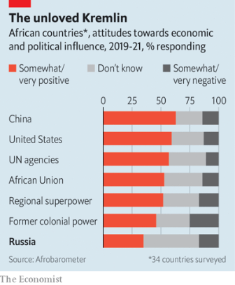  

#### 8.3 [Soldiers declare they have overthrown Niger’s president](https://www.economist.com/middle-east-and-africa/2023/07/27/soldiers-declare-they-have-overthrown-nigers-president)
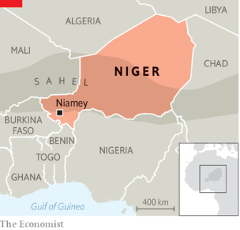  

### 9. The Americas
#### 9.1 [Canada’s miserly defence spending is increasingly embarrassing](https://www.economist.com/the-americas/2023/07/24/canadas-miserly-defence-spending-is-increasingly-embarrassing)
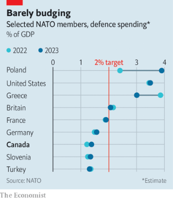  

#### 9.2 [Meet the Peruvian indigenous singer inspired by K-pop](https://www.economist.com/the-americas/2023/07/27/meet-the-peruvian-indigenous-singer-inspired-by-k-pop)

### 10. Asia
#### 10.1 [Kim Jong Un has no desire to let his country rejoin the world](https://www.economist.com/asia/2023/07/24/kim-jong-un-has-no-desire-to-let-his-country-rejoin-the-world)

#### 10.2 [South Korea has given up on talking to the North](https://www.economist.com/asia/2023/07/27/south-korea-has-given-up-on-talking-to-the-north)

#### 10.3 [A slew of scandals puts Singapore’s government on the back foot](https://www.economist.com/asia/2023/07/27/a-slew-of-scandals-puts-singapores-government-on-the-back-foot)

### 11. China
#### 11.1 [Could economic indicators give an early warning of a war over Taiwan?](https://www.economist.com/china/2023/07/27/could-economic-indicators-signal-chinas-intent-to-go-to-war)
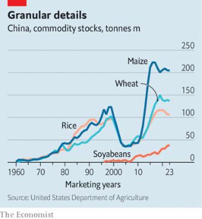  

#### 11.2 [China’s missing foreign minister loses his job](https://www.economist.com/china/2023/07/25/chinas-missing-foreign-minister-loses-his-job)

#### 11.3 [In Xi Jinping’s China, central planners rule](https://www.economist.com/china/2023/07/27/in-xi-jinpings-china-central-planners-rule)

### 12. International
#### 12.1 [The Ukrainian army commits new forces in a big southward push](https://www.economist.com/international/2023/07/27/the-ukrainian-army-commits-new-forces-in-a-big-southward-push)
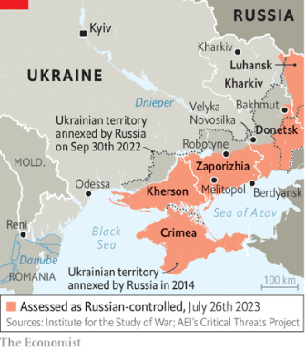  

#### 12.2 [Russia is attacking Ukraine’s agricultural exports](https://www.economist.com/international/2023/07/27/russia-is-attacking-ukraines-agricultural-exports)

### 13. 1843 magazine
#### 13.1 [The demonisation of BlackRock’s Larry Fink](https://www.economist.com/1843/2023/07/27/the-demonisation-of-blackrocks-larry-fink)

#### 13.2 [The Baghdad job: who was behind history’s biggest bank heist?](https://www.economist.com/interactive/1843/2023/07/27/the-baghdad-job-who-was-behind-historys-biggest-bank-heist)

#### 13.3 [Rum and coke and automatic rifles: Myanmar’s Gen Z guerrillas](https://www.economist.com/1843/2023/07/27/rum-and-coke-and-automatic-rifles-myanmars-gen-z-guerrillas)

#### 13.4 [China wants to choose the next Dalai Lama. He has other plans](https://www.economist.com/1843/2023/07/27/china-wants-to-choose-the-next-dalai-lama-he-has-other-plans)

#### 13.5 [How Ukraine’s virtually non-existent navy sank Russia’s flagship](https://www.economist.com/interactive/1843/2023/07/27/how-ukraines-virtually-non-existent-navy-sank-russias-flagship)

### 14. Business
#### 14.1 [China hits back against Western sanctions](https://www.economist.com/business/2023/07/23/china-hits-back-against-western-sanctions)
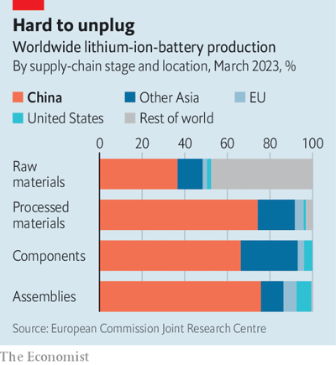  

#### 14.2 [Next-generation Googles run a tighter ship](https://www.economist.com/business/2023/07/25/next-generation-googles-run-a-tighter-ship)
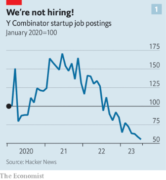  
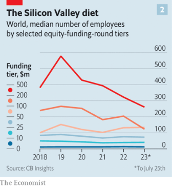  

#### 14.3 [The dark and bright sides of power](https://www.economist.com/business/2023/07/27/the-dark-and-bright-sides-of-power)

#### 14.4 [Can AT&T and Verizon escape managed decline?](https://www.economist.com/business/2023/07/27/can-at-and-t-and-verizon-escape-managed-decline)
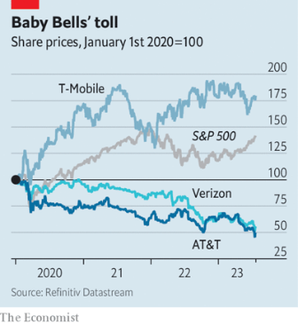  

#### 14.5 [Why your new EV is making funny noises](https://www.economist.com/business/2023/07/27/why-your-new-ev-is-making-funny-noises)

#### 14.6 [Why Walmart is trouncing Amazon in the grocery wars](https://www.economist.com/business/2023/07/24/why-walmart-is-trouncing-amazon-in-the-grocery-wars)

### 15. Finance & economics
#### 15.1 [Can UBS make the most of finance’s deal of the century?](https://www.economist.com/finance-and-economics/2023/07/26/can-ubs-make-the-most-of-finances-deal-of-the-century)
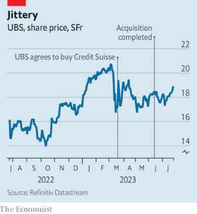  
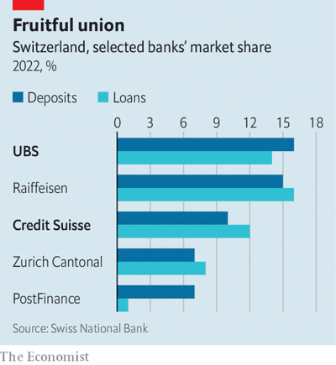  
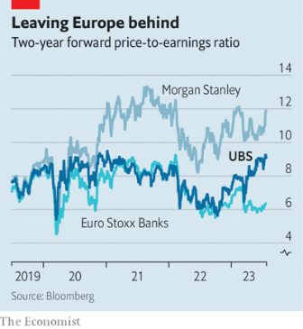  

#### 15.2 [America’s battle with inflation is about to get trickier](https://www.economist.com/finance-and-economics/2023/07/26/americas-battle-with-inflation-is-about-to-get-trickier)
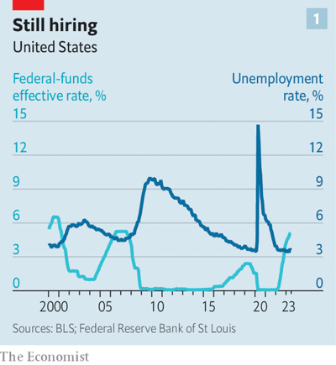  
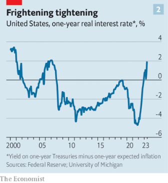  

#### 15.3 [Soaring temperatures and food prices threaten violent unrest](https://www.economist.com/finance-and-economics/2023/07/27/soaring-temperatures-and-food-prices-threaten-violent-unrest)
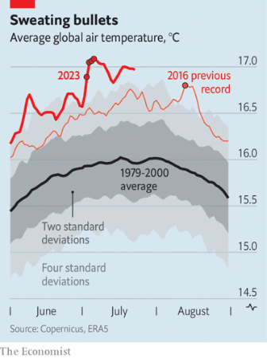  

#### 15.4 [Investors are seized by optimism. Can the bull market last?](https://www.economist.com/finance-and-economics/2023/07/25/investors-are-seized-by-optimism-can-the-bull-market-last)

#### 15.5 [Deflation is curbing China’s economic rise](https://www.economist.com/finance-and-economics/2023/07/27/deflation-is-curbing-chinas-economic-rise)

### 16. Science & technology
#### 16.1 [The high-tech race to improve weather forecasting](https://www.economist.com/science-and-technology/2023/07/26/the-high-tech-race-to-improve-weather-forecasting)
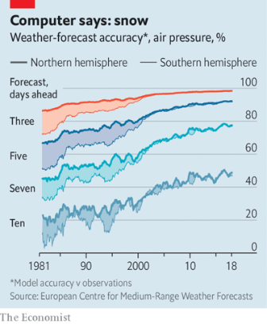  
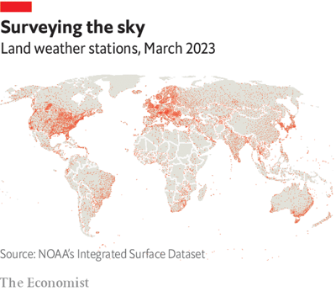  

### 17. Culture
#### 17.1 [Critics are getting less cruel. Alas](https://www.economist.com/culture/2023/07/21/critics-are-getting-less-cruel-alas)

#### 17.2 [How Stalin’s scribbling stooges tricked Western readers](https://www.economist.com/culture/2023/07/27/how-stalins-scribbling-stooges-tricked-western-readers)

#### 17.3 [Confronting the dangers of ultra-processed food](https://www.economist.com/culture/2023/07/24/confronting-the-dangers-of-ultra-processed-food)

#### 17.4 [Christopher Rufo offers a history of the left](https://www.economist.com/culture/2023/07/26/christopher-rufo-offers-a-history-of-the-left)

### 18. The Economist reads
#### 18.1 [What to read about managing people](https://www.economist.com/the-economist-reads/2023/07/28/what-to-read-about-managing-people)

### 19. Economic & financial indicators
#### 19.1 [Economic data, commodities and markets](https://www.economist.com/economic-and-financial-indicators/2023/07/27/economic-data-commodities-and-markets)

### 20. Graphic detail
#### 20.1 [Data on air bases suggest a Chinese invasion of Taiwan may not be imminent](https://www.economist.com/interactive/graphic-detail/2023/07/27/data-on-air-bases-suggest-a-chinese-invasion-of-taiwan-may-not-be-imminent?fsrc=core-app-economist)

### 21. The Economist explains
#### 21.1 [What will be the impact of India’s rice-export ban?](https://www.economist.com/the-economist-explains/2023/07/26/what-will-be-the-impact-of-indias-rice-export-ban)

#### 21.2 [Can superstars like Beyoncé or Taylor Swift spur inflation?](https://www.economist.com/the-economist-explains/2023/07/25/can-superstars-like-beyonce-or-taylor-swift-spur-inflation)

### 22. Obituary
#### 22.1 [André Watts took both Liszt and Schubert to his heart](https://www.economist.com/obituary/2023/07/26/andre-watts-took-both-liszt-and-schubert-to-his-heart)

