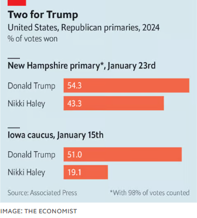

### 1. The world this week
#### 1.1 [Politics](https://www.economist.com/the-world-this-week/2024/01/25/politics)

#### 1.2 [Business](https://www.economist.com/the-world-this-week/2024/01/25/business)
  

#### 1.3 [KAL’s cartoon](https://www.economist.com/the-world-this-week/2024/01/25/kals-cartoon)
  

#### 1.4 _The world this week | The Economist:_ [This week’s covers](https://www.economist.com/the-world-this-week/2024/01/25/this-weeks-covers)  
How we saw the world  

### 2. Leaders
#### 2.1 _Leaders | American immigration:_ [How the border could cost Biden the election](https://www.economist.com/leaders/2024/01/25/how-the-border-could-cost-biden-the-election)  
To keep Trump out of power, the Democrats need to make an offer on immigration policy  

#### 2.2 _Leaders | AI for all:_ [AI holds tantalising promise for the emerging world](https://www.economist.com/leaders/2024/01/25/the-tantalising-promise-of-ai-for-the-emerging-world)  
It could help boost human capital, and ultimately growth  

#### 2.3 _Leaders | Unchaining a tiger:_ [Vietnam needs a new leader](https://www.economist.com/leaders/2024/01/25/vietnam-needs-a-new-leader)  
Doubts about the health of Nguyen Phu Trong have become a political liability  

#### 2.4 _Leaders | Private assets, public interest:_ [The risks to global finance from private equity’s insurance binge](https://www.economist.com/leaders/2024/01/25/the-risks-to-global-finance-from-private-equitys-insurance-binge)  
Funding pensions with private assets holds promise—but needs scrutiny  

#### 2.5 _Leaders | Mainstream Meloni:_ [Giorgia Meloni’s not-so-scary right-wing government](https://www.economist.com/leaders/2024/01/24/giorgia-melonis-not-so-scary-right-wing-government)  
Liberal fears have so far proved overblown  

#### 2.6 _Leaders | Electoral lawfare:_ [African governments are using courts to sway elections](https://www.economist.com/leaders/2024/01/25/african-governments-are-using-courts-to-sway-elections)  
The abuse of judiciaries is harming democracy. Here’s how to stop it  

### 3. Letters
#### 3.1 _Letters | On diversity, equity and inclusion, Chinese cars, presidential hats, Holocaust victims, Norse sagas, movies:_ [Letters to the editor](https://www.economist.com/letters/2024/01/25/letters-to-the-editor)  
A selection of correspondence  

### 4. By Invitation
#### 4.1 _By Invitation | Jews and Muslims:_ [A Muslim faith leader calls for stronger moral leadership in the Middle East](https://www.economist.com/by-invitation/2024/01/25/a-muslim-faith-leader-calls-for-stronger-moral-leadership-in-the-middle-east)  
Remember the lessons of Auschwitz, says Muhammad al-Issa  

### 5. Briefing
#### 5.1 _Briefing | Chatbots for the bottom 4bn:_ [Could AI transform life in developing countries?](https://www.economist.com/briefing/2024/01/25/could-ai-transform-life-in-developing-countries)  
Optimists hope it will ease grave shortages of human capital   
  
  

### 6. Europe
#### 6.1 _Europe | So far, so good:_ [Giorgia Meloni has proved the doubters wrong](https://www.economist.com/europe/2024/01/23/giorgia-meloni-has-proved-the-doubters-wrong)  
But Italy’s hard-right prime minister has troubles ahead  
  
  

#### 6.2 _Europe | Fresh Bürger :_ [Germany strikes a brave new deal on immigration](https://www.economist.com/europe/2024/01/21/germany-strikes-a-brave-new-deal-on-immigration)  
A new citizenship law is followed by huge protests against far-right xenophobia  

#### 6.3 _Europe | Constitutional horse-trading :_ [Geert Wilders makes a show of respecting the law](https://www.economist.com/europe/2024/01/25/a-dutch-populist-geert-wilders-makes-a-show-of-respecting-the-rule-of-law)  
Muslims, and other politicians, worry that it will last only until the Dutch populist enters government  

#### 6.4 _Europe | Happy Austrians, glum Germans :_ [Many Austrians feel their way of life is under threat](https://www.economist.com/europe/2024/01/25/the-viennese-are-still-waltzing)  
The Viennese are still waltzing, but they fret that the music may soon be stopping  

#### 6.5 _Europe | Learning from the east:_ [Europe’s new plan to safeguard its economy](https://www.economist.com/europe/2024/01/24/europes-new-plan-to-safeguard-its-economy)  
But finding consensus is hard  
  

#### 6.6 _Europe | Charlemagne :_ [The EU’s €50bn package to Ukraine is a far cry from its rhetoric ](https://www.economist.com/europe/2024/01/25/the-eus-help-to-ukraine-is-a-far-cry-from-its-rhetoric)  
A help set to be agreed next week is no match for the challenge  

### 7. Britain
#### 7.1 _Britain | Nuclear energy:_ [Britain wants to make nuclear power plants cheaper to build](https://www.economist.com/britain/2024/01/24/britain-wants-to-make-nuclear-power-plants-cheaper-to-build)  
Can new technologies and smarter regulation reduce delays and cost overruns?   
  
  

#### 7.2 _Britain | Snakes (and tortoises, rhinos and gibbons) on a plane :_ [How to transport a rhino](https://www.economist.com/britain/2024/01/25/how-to-transport-a-rhino)  
Heathrow Airport deals with millions of humans a year—but billions of animals  

#### 7.3 _Britain | Howay the Sauds :_ [Football attracts Saudi investment to England’s north-east](https://www.economist.com/britain/2024/01/22/football-attracts-saudi-investment-to-englands-north-east)  
It can do for Newcastle what the UAE did for Manchester—for good and ill  

#### 7.4 _Britain | Hard choices:_ [The ethical quagmire of a fetus-harming epilepsy drug](https://www.economist.com/britain/2024/01/23/the-ethical-quagmire-of-a-fetus-harming-epilepsy-drug)  
Britain is restricting the use of valproate. Charities are alarmed  

#### 7.5 _Britain | Penny slain:_ [Britain’s least valuable coin is in terminal decline](https://www.economist.com/britain/2024/01/21/britains-least-valuable-coin-is-in-terminal-decline)  
Inflation is the prime culprit for the problems of the penny  

#### 7.6 _Britain | Property tax:_ [Britain’s council tax is arbitrary, regressive and needs fixing](https://www.economist.com/britain/2024/01/25/britains-council-tax-is-arbitrary-regressive-and-needs-fixing)  
Based on estimated house values 33 years ago, it is not fit for purpose  
  
  

#### 7.7 _Britain | Bagehot:_ [Britain’s Labour Party is backed by a pro-growth coalition](https://www.economist.com/britain/2024/01/25/britains-labour-party-is-backed-by-a-pro-growth-coalition)  
Its young electoral base offers opportunities to fix a sclerotic economy  

### 8. United States
#### 8.1 _United States | Bordering on disaster:_ [America’s immigration policies are failing](https://www.economist.com/united-states/2024/01/25/how-americas-failed-immigration-policies-might-cost-joe-biden-the-election)  
A new surge of migration is straining a broken system and might cost Joe Biden the election  
  

#### 8.2 _United States | Texas hold’em:_ [The bold Texas plan to stop migrants has hit a wall](https://www.economist.com/united-states/2024/01/25/the-bold-texas-plan-to-stop-migrants-has-hit-a-wall)  
Amid a humanitarian crisis, the Supreme Court sided with the Biden administration on policing powers  

#### 8.3 _Graphic detail | Trouble down south:_ [America’s border crisis in ten charts](https://www.economist.com/united-states/2024/01/25/americas-border-crisis-in-charts)  
How did we get here?  
  
  
  
  
  
  
  
  
  
  

#### 8.4 _United States | MAGA mania:_ [After winning New Hampshire, Trump is cruising to the nomination](https://www.economist.com/united-states/2024/01/24/after-winning-new-hampshire-trump-is-cruising-to-the-nomination)  
Nikki Haley fights on, but her path gets only more daunting from now on    
  

#### 8.5 _United States | Here be dragons:_ [Why politicians are obsessed with mythical Chinese land grabs](https://www.economist.com/united-states/2024/01/22/why-politicians-are-obsessed-with-mythical-chinese-land-grabs)  
No, the Communist Party is not buying up farms  

#### 8.6 _United States | Breaking news:_ [The rise of the TikTok news anchor](https://www.economist.com/united-states/2024/01/25/the-rise-of-the-tiktok-news-anchor)  
A hoard of Pocket Cronkites will read the papers and tell you, like, what they say  
  

#### 8.7 _United States | Lexington :_ [Why America’s political parties are so bad at winning elections](https://www.economist.com/united-states/2024/01/25/why-americas-political-parties-are-so-bad-at-winning-elections)  
And why a new party would probably be no better  

### 9. Middle East & Africa
#### 9.1 _Middle East and Africa | A region on fire:_ [The ever-expanding Middle East war](https://www.economist.com/middle-east-and-africa/2024/01/24/the-ever-expanding-middle-east-war)  
Ten countries have now been dragged into the fighting  

#### 9.2 _Middle East and Africa | Anything but Hamas:_ [Can the Palestinian Authority be beefed up?](https://www.economist.com/middle-east-and-africa/2024/01/25/can-the-palestinian-authority-be-beefed-up)  
Maybe, but it is being undermined from without and within  

#### 9.3 _Middle East and Africa | Putting the rule in rule of law:_ [How to nobble a political rival in Africa and get away with it](https://www.economist.com/middle-east-and-africa/2024/01/25/how-to-nobble-a-political-rival-in-africa-and-get-away-with-it)  
Use the courts  

#### 9.4 _Middle East and Africa | Holy split:_ [Russia’s plan to seduce Christians in Africa](https://www.economist.com/middle-east-and-africa/2024/01/25/russias-plan-to-seduce-christians-in-africa)  
The Ukraine war has split Africa’s Orthodox church  

### 10. The Americas
#### 10.1 _The Americas | North American politics :_ [The prospect of a Trump presidency looms over Mexico’s elections](https://www.economist.com/the-americas/2024/01/23/the-prospect-of-a-second-trump-presidency-looms-over-mexicos-elections)  
Rows over drugs, migration and trade threaten to harm relations  
  

#### 10.2 _The Americas | So, so, so scandalous :_ [Colombia’s first avowedly left-wing president is mired in scandal](https://www.economist.com/the-americas/2024/01/25/colombias-first-avowedly-left-wing-president-is-mired-in-scandal)  
Gustavo Petro’s son, brother, and former chief of staff are all under investigation  

#### 10.3 _The Americas | Narcojustice:_ [Can Ecuador free itself from the grasp of the drug lords?](https://www.economist.com/the-americas/2024/01/25/can-ecuador-free-itself-from-the-grasp-of-the-drug-lords)  
Prosecutors are facing murder and obstruction to clean up the rot in the state  

### 11. Asia
#### 11.1 _Asia | Strong tailwind, no rudder :_ [Few countries are better placed than Vietnam to get rich](https://www.economist.com/asia/2024/01/23/few-countries-are-better-placed-than-vietnam-to-get-rich)  
Yet political paralysis could slow it down  
  
  

#### 11.2 _Asia | Lunar landing:_ [Japan lands on the Moon](https://www.economist.com/asia/2024/01/19/japan-lands-on-the-moon)  
This makes Japan the fifth country to achieve the feat  

#### 11.3 _Asia | As may be prescribed:_ [India tightens the screws on online dissent](https://www.economist.com/asia/2024/01/25/india-tightens-the-screws-on-online-dissent)  
A bouquet of new laws gives the government huge new powers  

#### 11.4 _Asia | Banyan:_ [South Korea’s ban on praising the North is ridiculous](https://www.economist.com/asia/2024/01/22/south-koreas-ban-on-praising-the-north-is-ridiculous)  
The government imprisons a dotty fan of Kim Jong Un  

### 12. China
#### 12.1 _China | China and Taiwan:_ [A new diplomatic struggle is unfolding over Taiwan](https://www.economist.com/china/2024/01/25/a-new-diplomatic-struggle-is-unfolding-over-taiwan)  
It could give China better legal cover for an invasion  

#### 12.2 _China | Easy questions only:_ [At a UN review, China basks in the flattery of friendly countries](https://www.economist.com/china/2024/01/25/at-a-un-review-china-basks-in-the-flattery-of-friendly-countries)  
While dismissing criticism as lies  

#### 12.3 _China | Westerners out, Chinese in :_ [Hong Kong is becoming less of an international city](https://www.economist.com/china/2024/01/25/hong-kong-is-becoming-less-of-an-international-city)  
As foreigners leave, people from the mainland are taking their place  

#### 12.4 _China | Skip, skip, scandal:_ [Why skipping ropes are so expensive in China](https://www.economist.com/china/2024/01/25/why-skipping-ropes-are-so-expensive-in-china)  
A new reason for parents to be angry with the education system  

#### 12.5 _China | Chaguan:_ [Xi Jinping looks abroad for confidence](https://www.economist.com/china/2024/01/25/xi-jinping-looks-abroad-for-confidence)  
The West’s wobbles have China feeling vindicated  

### 13. International
#### 13.1 _International | Isolationist America:_ [The world is bracing for Donald Trump’s possible return](https://www.economist.com/international/2024/01/22/the-world-is-bracing-for-donald-trumps-possible-return)  
He could split countries into users, bruisers and losers  
  

### 14. Business
#### 14.1 _Business | Upsetting the cart:_ [What could bring Apple down?](https://www.economist.com/business/2024/01/24/what-could-bring-apple-down)  
Trustbusters, platform shifts and geopolitics could all hurt the iPhone-maker  
  
  

#### 14.2 _Business | Bartleby:_ [Why you should never retire](https://www.economist.com/business/2024/01/25/why-you-should-never-retire)  
Pleasure cruises, golf and tracing the family tree are not that fulfilling  

#### 14.3 _Business | Picking losers:_ [Why America’s controls on sales of AI tech to China are so leaky](https://www.economist.com/business/2024/01/21/why-americas-controls-on-sales-of-ai-tech-to-china-are-so-leaky)  
For increasingly hawkish lawmakers, that’s a problem  
  

#### 14.4 _Business | The Modi paradox:_ [India’s businessmen like Narendra Modi. They also fear him](https://www.economist.com/business/2024/01/24/indias-businessmen-like-narendra-modi-they-also-fear-him)  
Company bosses are grateful for a strong economy, but worried about retribution  
  
  
  

#### 14.5 _Business | Schumpeter:_ [Can MSCI drag private markets out of the shadows?](https://www.economist.com/business/2024/01/25/can-msci-drag-private-markets-out-of-the-shadows)  
Meet the Nicaraguan revolutionary behind the world’s favourite index supplier  

### 15. Finance & economics
#### 15.1 _Finance and economics | Going for broke:_ [Wall Street titans are betting big on insurers. What could go wrong?](https://www.economist.com/finance-and-economics/2024/01/23/wall-street-titans-are-betting-big-on-insurers-what-could-go-wrong)  
How private-markets giants are overhauling the financial system  
  
  

#### 15.2 _Finance and economics | Escaping the dragon:_ [As the China’s markets suffer, what alternatives do investors have?](https://www.economist.com/finance-and-economics/2024/01/22/how-to-replace-china-in-your-portfolio)  
Optimism about the world’s second-largest stockmarket is a distant memory   
  

#### 15.3 _Finance and economics | Buttonwood:_ [Investors may be getting the Federal Reserve wrong, again](https://www.economist.com/finance-and-economics/2024/01/24/investors-may-be-getting-the-federal-reserve-wrong-again)  
Why expectations of imminent interest-rate cuts could be misplaced  
  

#### 15.4 _Finance and economics | Burger prices:_ [What Donald Trump can learn from the Big Mac index](https://www.economist.com/finance-and-economics/2024/01/25/what-donald-trump-can-learn-from-the-big-mac-index)  
Should the presidential candidate go on another crusade against the yuan?  
  

#### 15.5 _Finance and economics | Gourmet commodities:_ [Why sweet treats are increasingly expensive](https://www.economist.com/finance-and-economics/2024/01/25/why-sweet-treats-are-increasingly-expensive)  
For the sake of your wallet, it might be time to rethink your diet  
  

#### 15.6 _Finance and economics | Ballpark figures:_ [How American states squeeze athletes (and remote workers)](https://www.economist.com/finance-and-economics/2024/01/25/how-american-states-squeeze-athletes-and-remote-workers)  
The public loves jock taxes; baseball players do not  

#### 15.7 _Finance and economics | Free exchange:_ [The false promise of friendshoring](https://www.economist.com/finance-and-economics/2024/01/25/the-false-promise-of-friendshoring)  
America, China and Europe appear to be trading less with their geopolitical rivals  

### 16. Science & technology
#### 16.1 _Science and technology | Caffeine and the climate:_ [Can scientists save your morning cup of coffee?](https://www.economist.com/science-and-technology/2024/01/23/can-scientists-save-your-morning-cup-of-coffee)  
A warming planet threatens the world’s favourite drug  

#### 16.2 _Science and technology | Polyglot machines:_ [Why AI needs to learn new languages](https://www.economist.com/science-and-technology/2024/01/24/why-ai-needs-to-learn-new-languages)  
Efforts are under way to make AI fluent in more than just English  
  

#### 16.3 _Science and technology | Aesop’s ecological fables:_ [How ants persuaded lions to eat buffalo](https://www.economist.com/science-and-technology/2024/01/25/how-ants-persuaded-lions-to-eat-buffalo)  
A tale of elephants, thorn trees, and the sensitivity of ecosystems  

#### 16.4 _Science and technology | Magnets. This is how they work:_ [Scientists have found a new kind of magnetic material](https://www.economist.com/science-and-technology/2024/01/24/scientists-have-found-a-new-kind-of-magnetic-material)  
“Altermagnets” have been hiding in plain sight for 90 years  
  

### 17. Culture
#### 17.1 _Culture | After the fire:_ [Against the odds, Notre Dame cathedral will reopen this year](https://www.economist.com/culture/2024/01/25/against-the-odds-notre-dame-cathedral-will-reopen-this-year)  
The rebuilding of the famous monument prompted a debate about how much should change  

#### 17.2 _Culture |  Sing it again:_ [“Mean Girls” and the rise of the film-turned-musical-turned-remake](https://www.economist.com/culture/2024/01/22/mean-girls-and-the-rise-of-the-film-turned-musical-turned-remake)  
Musical films are hitting a high note  

#### 17.3 _Culture | The comeback kid:_ [Which colour and material is most in vogue in 2024?](https://www.economist.com/culture/2024/01/19/which-colour-and-material-is-most-in-vogue-in-2024)  
It is enjoying a resurgence in design and fashion  

#### 17.4 _Culture | The gates of Salt Lake:_ [Mormonism is America’s homegrown religion](https://www.economist.com/culture/2024/01/25/mormonism-is-americas-homegrown-religion)  
Yet the Christian denomination long defined itself in opposition to the country that spawned it  

#### 17.5 _Culture | Anti-totalitarianism:_ [Hannah Arendt’s message on freethinking is as relevant as ever](https://www.economist.com/culture/2024/01/25/hannah-arendts-message-on-freethinking-is-as-relevant-as-ever)  
Thoughtlessness creates the conditions for evil  

#### 17.6 _Culture | Oh, gods:_ [The modern relevance of 3,000-year-old religious sculptures](https://www.economist.com/culture/2024/01/25/the-modern-relevance-of-3000-year-old-religious-sculptures)  
India’s leading museum is hosting a fascinating show, with global support  

### 18. The Economist reads
#### 18.1 _The Economist reads:_ [What to read to understand El Salvador and the Northern Triangle](https://www.economist.com/the-economist-reads/2024/01/24/what-to-read-to-understand-el-salvador-and-the-northern-triangle)  
Six books about a small region that has a big impact on its neighbours  

### 19. Economic & financial indicators
#### 19.1 [Economic data, commodities and markets](https://www.economist.com/economic-and-financial-indicators/2024/01/25/economic-data-commodities-and-markets)
  
  
  
  

### 20. Obituary
#### 20.1 _Obituary | The wrath of God:_ [Zvi Zamir oversaw a programme of Israeli assassinations](https://www.economist.com/obituary/2024/01/25/zvi-zamir-oversaw-a-programme-of-israeli-assassinations)  
The former director of Mossad, who oversaw a programme of covert assassinations, died on January 2nd, aged 98  

