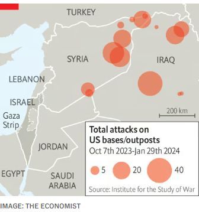
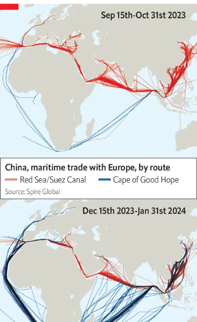

### 1. The world this week
#### 1.1 [Politics](https://www.economist.com/the-world-this-week/2024/02/01/politics)

#### 1.2 [Business](https://www.economist.com/the-world-this-week/2024/02/01/business)
  

#### 1.3 [KAL’s cartoon](https://www.economist.com/the-world-this-week/2024/02/01/kals-cartoon)
  

#### 1.4 _The world this week | The Economist:_ [This week’s covers](https://www.economist.com/the-world-this-week/2024/02/01/this-weeks-covers)  
How we saw the world  

### 2. Leaders
#### 2.1 _Leaders | The war between Israel and Hamas:_ [How to end the Middle East’s agony](https://www.economist.com/leaders/2024/02/01/how-to-end-the-middle-easts-agony)  
War is spreading across the region. There is an alternative  

#### 2.2 _Leaders | Online media:_ [The end of the social network](https://www.economist.com/leaders/2024/02/01/the-end-of-the-social-network)  
As Facebook turns 20, social apps are being transformed  

#### 2.3 _Leaders | Financial crisis in Cairo:_ [Egypt doesn’t deserve a bail-out, but should get one](https://www.economist.com/leaders/2024/02/01/egypt-doesnt-deserve-a-bail-out-but-should-get-one)  
The Middle East cannot afford the collapse of its most populous country  

#### 2.4 _Leaders | A charter for change:_ [The evidence in favour of charter schools in America has strengthened](https://www.economist.com/leaders/2024/02/01/the-evidence-in-favour-of-charter-schools-in-america-has-strengthened)  
Meanwhile, both parties have run away from them  
  

#### 2.5 _Leaders | Beating retreat:_ [How to fix British defence](https://www.economist.com/leaders/2024/02/01/how-to-fix-british-defence)  
It needs more money and more people, but also reform  

### 3. Letters
#### 3.1 _Letters | On Europe’s single market, Israel and genocide, the death penalty, shipping sanctions, lawn bowls:_ [Letters to the editor](https://www.economist.com/letters/2024/02/01/letters-to-the-editor)  
A selection of correspondence  

### 4. Briefing
#### 4.1 _Briefing | Not posting, but watching:_ [As Facebook turns 20, politics is out; impersonal video feeds are in](https://www.economist.com/briefing/2024/02/01/as-facebook-turns-20-politics-is-out-impersonal-video-feeds-are-in)  
Social media are more popular than ever, but social networks are dying  
  
  

### 5. Britain
#### 5.1 _Britain | Losing muscle:_ [Britain’s armed forces are stretched perilously thin](https://www.economist.com/britain/2024/01/29/britains-armed-forces-are-stretched-perilously-thin)  
Too few people, too much botched procurement  
  

#### 5.2 _Britain | Ever closer?:_ [Labour wants to make Brexit work better. What does the EU think?](https://www.economist.com/britain/2024/02/01/how-does-the-eu-view-the-labour-party)  
It would welcome a Starmer-led government. That does not mean it would be generous  

#### 5.3 _Britain | The power comes back on:_ [Northern Ireland gets its government back](https://www.economist.com/britain/2024/01/31/northern-ireland-gets-its-government-back)  
But the deal reveals fissures within the DUP and in Westminster  

#### 5.4 _Britain | As prescribed:_ [The pharmacist will see you now](https://www.economist.com/britain/2024/02/01/the-pharmacist-will-see-you-now)  
A sensible reform to ease pressure on family doctors in England  

#### 5.5 _Britain | The charge is sputtering:_ [EV sales in Britain are disappointing expectations](https://www.economist.com/britain/2024/02/01/ev-sales-in-britain-are-disappointing-expectations)  
Pothole or roadblock?  
  

#### 5.6 _Britain | Bagehot:_ [The search for Conservative Party unity](https://www.economist.com/britain/2024/02/01/the-search-for-conservative-party-unity)  
The most powerful urge in British politics  

### 6. Europe
#### 6.1 _Europe | Trouble at the top:_ [The feud between Ukraine’s president and army chief boils over](https://www.economist.com/europe/2024/01/30/the-feud-between-ukraines-president-and-army-chief-boils-over)  
Is Valery Zaluzhny about to be fired?  
  

#### 6.2 _Europe | A tame candidate turns a little wild:_ [Meet Boris Nadezhdin, Vladimir Putin’s brave challenger](https://www.economist.com/europe/2024/02/01/meet-boris-nadezhdin-vladimir-putins-brave-challenger)  
Backing him is a form of protest  

#### 6.3 _Europe | Still sovereign:_ [Meet the Knights of Malta](https://www.economist.com/europe/2024/02/01/meet-the-knights-of-malta)  
An ancient global order gathers in the Eternal City  

#### 6.4 _Europe | F-16s, by any means :_ [Sweden clears a Turkish hurdle to NATO accession](https://www.economist.com/europe/2024/02/01/sweden-clears-a-turkish-hurdle-to-nato-accession)  
Hungary is still blocking it, though  

#### 6.5 _Europe | The war on the waves:_ [Russia is losing the battle for the Black Sea](https://www.economist.com/europe/2024/01/28/russia-is-losing-the-battle-for-the-black-sea)  
Ukraine wants to keep trade flowing and destroy Russia’s fleet  
  

#### 6.6 _Europe | Charlemagne:_ [Europe’s grumpy farmers are a symptom of wider malaise](https://www.economist.com/europe/2024/02/01/europes-grumpy-farmers-are-a-symptom-of-wider-malaise)  
Farmers are not the only ones resisting modernity  

### 7. United States
#### 7.1 _United States | Political orphans:_ [Charter schools do things that all Democrats say they support](https://www.economist.com/united-states/2024/02/01/charter-schools-do-things-that-all-democrats-say-they-support)  
And yet the party has turned against them  
  
  

#### 7.2 _United States | Fear and voting in Las Vegas:_ [How Nevada’s Republicans made their primary irrelevant](https://www.economist.com/united-states/2024/02/01/how-nevadas-republicans-made-their-primary-irrelevant)  
The state is holding both a caucus and a primary. Voters are confused  

#### 7.3 _United States | The Lake tape:_ [A leaked recording shakes up the Republican Party in Arizona](https://www.economist.com/united-states/2024/02/01/a-leaked-recording-shakes-up-the-republican-party-in-arizona)  
Kari Lake stages a coup and faces a backlash  

#### 7.4 _United States | Lactose laws:_ [Dunkin’ faces a moo-ving class-action suit from the lactose intolerant ](https://www.economist.com/united-states/2024/02/01/dunkin-faces-a-moo-ving-class-action-suit-from-the-lactose-intolerant)  
Is the interpretation of the Americans With Disabilities Act by the plaintiffs udderly silly?  

#### 7.5 _United States | Grab him by the purse:_ [Donald Trump is ordered to pay for his bullying](https://www.economist.com/united-states/2024/01/27/donald-trump-is-ordered-to-pay-for-his-bullying)  
A jury awarded E. Jean Carroll $83m in a second defamation trial  

#### 7.6 _United States | The insecure security secretary:_ [Why not impeach everyone?](https://www.economist.com/united-states/2024/02/01/why-not-impeach-everyone)  
House Republicans are trying to impeach Alejandro Mayorkas, for no good reason  

#### 7.7 _United States | Lexington:_ [How to overcome the biggest obstacle to electric vehicles](https://www.economist.com/united-states/2024/02/01/how-to-overcome-the-biggest-obstacle-to-electric-vehicles)  
A Republican politico wants to save electrification from politics  

### 8. Middle East & Africa
#### 8.1 _Middle East and Africa | Gaza and its reverberations:_ [America’s shuttle diplomacy to wind down the war in Gaza](https://www.economist.com/middle-east-and-africa/2024/02/01/americas-shuttle-diplomacy-to-wind-down-the-war-in-gaza)  
And maybe to bring a lasting peace, too  
  

#### 8.2 _Middle East & Africa | Egypt’s economic woes:_ [The war in Gaza is exacerbating Egypt’s economic collapse](https://www.economist.com/middle-east-and-africa/2024/02/01/the-war-in-gaza-is-exacerbating-egypts-economic-collapse)  
But the government hopes the conflict could be its salvation  

#### 8.3 _Middle East and Africa | The United Nations and Gaza:_ [Did UN workers participate in the October 7th attacks? ](https://www.economist.com/middle-east-and-africa/2024/01/29/is-unrwa-complicit-or-unlucky)  
The allegations against UNRWA threaten aid flows to Palestinians  

#### 8.4 _Middle East and Africa | Hunger returns:_ [Northern Ethiopia is again sliding into starvation](https://www.economist.com/middle-east-and-africa/2024/02/01/northern-ethiopia-is-again-sliding-into-starvation)  
A region ravaged by war is now hit by drought  
  

#### 8.5 _Middle East and Africa | Disunity in west Africa:_ [Three countries hit by coups are leaving west Africa’s main bloc](https://www.economist.com/middle-east-and-africa/2024/02/01/three-countries-hit-by-coups-are-leaving-west-africas-main-bloc)  
Burkina Faso, Mali and Niger inflict more misery on their people  
  

### 9. The Americas
#### 9.1 _The Americas | Autocratic tactics:_ [Nicolás Maduro, Venezuela’s dictator, thumbs his nose at Joe Biden](https://www.economist.com/the-americas/2024/01/31/nicolas-maduro-venezuelas-dictator-thumbs-his-nose-at-joe-biden)  
But will America reinstate all of its sanctions on the South American country?  
  

#### 9.2 _The Americas | All eyes on Five Eyes:_ [Did spies from China, India and Russia meddle in Canada’s elections?](https://www.economist.com/the-americas/2024/02/01/did-spies-from-china-india-and-russia-meddle-in-canadas-elections)  
A new inquiry seeks to find out the extent of foreign interference  

#### 9.3 _The Americas | 5,000 tax rates and counting:_ [Can Lula fix Brazil’s fiscal mess?](https://www.economist.com/the-americas/2024/01/29/can-lula-fix-brazils-fiscal-mess)  
Reform of the world’s most complicated tax system will cut businesses’ costs—if lobbies permit it  

### 10. Asia
#### 10.1 _Asia | On the rocks:_ [Japan’s ruling party is in crisis](https://www.economist.com/asia/2024/01/30/japans-ruling-party-is-in-crisis)  
Kishida Fumio’s chance of a second term looks ever slimmer  

#### 10.2 _Asia | Dancing to victory:_ [TikTok is a key battleground in Indonesia’s election](https://www.economist.com/asia/2024/02/01/tiktok-is-a-key-battleground-in-indonesias-election)  
Liberalism is under threat in the world’s third-largest democracy  

#### 10.3 _Asia | Counting cattle:_ [The Hindu right’s pro-cow policies are terrible for India’s cows](https://www.economist.com/asia/2024/01/28/the-hindu-rights-pro-cow-policies-are-terrible-for-indias-cows)  
A Hindu nationalist cow census is an effort to solve a problem after making it worse  

#### 10.4 _Asia | Bihar blues:_ [India’s opposition bloc disintegrates](https://www.economist.com/asia/2024/01/28/indias-opposition-bloc-disintegrates)  
The defection of Bihar’s chief minister is excellent for Narendra Modi  

#### 10.5 _Asia | Banyan:_ [Asia’s commercial heft helps keep Russia’s war economy going](https://www.economist.com/asia/2024/02/01/asias-commercial-heft-helps-keep-russias-war-economy-going)  
That holds future lessons for America  

#### 10.6 _Asia | Clean bowled:_ [Imran Khan is convicted. Pakistan’s generals are content](https://www.economist.com/asia/2024/01/30/imran-khan-is-convicted-pakistans-generals-are-content)  
The message is clear: don’t bother voting for his party  

### 11. China
#### 11.1 _China | Operation Sit Tight:_ [Is China a winner from the Red Sea attacks?](https://www.economist.com/china/2024/02/01/is-china-a-winner-from-the-red-sea-attacks)  
China seeks to reap political benefits from the new Suez crisis  
  
  
  
  

#### 11.2 _China | One is not enough:_ [Hong Kong gets a second draconian security law](https://www.economist.com/china/2024/01/31/hong-kong-gets-a-second-draconian-security-law)  
John Lee thinks foreign powers are still trying to overthrow his government  

#### 11.3 _China | Salvation lies within:_ [Watching “The Shawshank Redemption” on stage in China](https://www.economist.com/china/2024/02/01/watching-the-shawshank-redemption-on-stage-in-china)  
Why wasn’t this banned?  

#### 11.4 _China | Chaguan:_ [Hard times for China’s micro-industrialists](https://www.economist.com/china/2024/02/01/hard-times-for-chinas-micro-industrialists)  
A rural hub for children’s bicycle-making adjusts to a world with fewer kids  

### 12. International
#### 12.1 _International | Combat in orbit:_ [War in space is no longer science fiction](https://www.economist.com/international/2024/01/31/america-china-and-russia-are-locked-in-a-new-struggle-over-space)  
Inside America’s celestial struggle against China and Russia  
  
  

### 13. Technology Quarterly
#### 13.1 _Technology Quarterly | The foundations of the cloud:_ [Users of the internet need not think about its physical underpinnings](https://www.economist.com/technology-quarterly/2024/01/29/users-of-the-internet-need-not-think-about-its-physical-underpinnings)  
But for technologies like artificial intelligence and the metaverse to work, others will have to, argues Abby Bertics  

#### 13.2 _Technology Quarterly | Towers of glass and steel:_ [Advances in physical storage and retrieval made the cloud possible](https://www.economist.com/technology-quarterly/2024/01/29/advances-in-physical-storage-and-retrieval-made-the-cloud-possible)  
But more progress is needed to sustain it  

#### 13.3 _Technology Quarterly | The edge of tomorrow:_ [The internet got better and faster by moving data closer to users](https://www.economist.com/technology-quarterly/2024/01/29/the-internet-got-better-and-faster-by-moving-data-closer-to-users)  
Now the same must happen with computing power  

#### 13.4 _Technology Quarterly | The internet and climate change:_ [Data centres improved greatly in energy efficiency as they grew massively larger](https://www.economist.com/technology-quarterly/2024/01/29/data-centres-improved-greatly-in-energy-efficiency-as-they-grew-massively-larger)  
But can this continue into the age of AI?  
  

#### 13.5 _Technology Quarterly | Politics:_ [The physical borders of the digital world](https://www.economist.com/technology-quarterly/2024/01/29/the-physical-borders-of-the-digital-world)  
To remain geopolitically robust as it gets more potent, the internet will need more diverse interconnections  

#### 13.6 _Technology Quarterly | Starlink:_ [Satellites offer an important alternative to the wired internet](https://www.economist.com/technology-quarterly/2024/01/29/satellites-offer-an-important-alternative-to-the-wired-internet)  
But most of them will be owned by billionaires with their own interests  

#### 13.7 _Technology Quarterly | Securing the cloud’s future:_ [The internet is integrated into virtually every aspect of life](https://www.economist.com/technology-quarterly/2024/01/29/the-internet-is-integrated-into-virtually-every-aspect-of-life)  
It needs to be kept secure, and kept growing  

#### 13.8 [Sources and acknowledgments](https://www.economist.com/technology-quarterly/2024/01/30/sources-and-acknowledgments)

### 14. Business
#### 14.1 _Business | After the iPhone:_ [Apple’s Vision Pro headset ushers in a new era of personal technology](https://www.economist.com/business/2024/01/31/apples-headset-ushers-in-a-new-era-of-personal-technology)  
Tech firms are racing to build the gadget that supplants the smartphone  
  

#### 14.2 _Business | The AI-chip race:_ [Could AMD break Nvidia’s chokehold on chips?](https://www.economist.com/business/2024/01/31/could-amd-break-nvidias-chokehold-on-chips)  
Taking on the top AI chipmaker will be hard—but maybe not impossible  
  
  

#### 14.3 _Business | Pseudo-heir apparent:_ [Many family firms lack heirs. Unrelated help is at hand](https://www.economist.com/business/2024/01/29/many-family-firms-lack-heirs-unrelated-help-is-at-hand)  
How to succeed when you have no successor  

#### 14.4 _Business | High rollers :_ [Rolls-Royce goes electric—in style](https://www.economist.com/business/2024/02/01/rolls-royce-goes-electric-in-style)  
Battery power suits the priciest vehicles  

#### 14.5 _Business | Gas gaffe:_ [Joe Biden’s limits on LNG exports won’t help the climate](https://www.economist.com/business/2024/02/01/joe-bidens-limits-on-lng-exports-wont-help-the-climate)  
Will they help his re-election chances?  

#### 14.6 _Business | Bartleby:_ [Jürgen Klopp and the importance of energy](https://www.economist.com/business/2024/01/29/jurgen-klopp-and-the-importance-of-energy)  
The resignation of a football manager is a reminder of a CEO superpower  

#### 14.7 _Business | Schumpeter:_ [How much should TikTok fear a resurgent Donald Trump?](https://www.economist.com/business/2024/02/01/how-much-should-tiktok-fear-a-resurgent-donald-trump)  
The MAGA masses are now TikTokers, too  

### 15. Finance & economics
#### 15.1 _Finance and economics | The octogenarian radical:_ [What four more years of Joe Biden would mean for America’s economy](https://www.economist.com/finance-and-economics/2024/01/30/bidenomics-is-an-unfinished-revolution-what-would-four-more-years-mean)  
Bigger government, for a start  
  
  

#### 15.2 _Finance and economics | Buttonwood:_ [Bitcoin ETFs are off to a bad start. Will things improve?](https://www.economist.com/finance-and-economics/2024/02/01/bitcoin-etfs-are-off-to-a-bad-start-will-things-improve)  
Lessons from similar exchange-traded funds  

#### 15.3 _Finance and economics | Game changing:_ [China’s leaders are flailing as markets drop](https://www.economist.com/finance-and-economics/2024/02/01/chinas-leaders-are-flailing-as-markets-drop)  
The government is not used to being bullied  

#### 15.4 _Finance and economics | Never grand:_ [Evergrande’s liquidation is a new low in China’s property crisis](https://www.economist.com/finance-and-economics/2024/01/29/evergrandes-liquidation-is-a-new-low-in-chinas-property-crisis)  
A judge in Hong Kong surprises the mainland  

#### 15.5 _Finance and economics | Prices and wages:_ [Your pay is still going up too fast](https://www.economist.com/finance-and-economics/2024/01/28/your-pay-is-still-going-up-too-fast)  
Why the last part of the inflation fight may be the hardest  
  
  

#### 15.6 _Finance and economics | Free exchange:_ [Biden’s chances of re-election are better than they appear](https://www.economist.com/finance-and-economics/2024/02/01/bidens-chances-of-re-election-are-better-than-they-appear)  
The economy is providing a headwind at present. That could soon change  
  

### 16. Science & technology
#### 16.1 _Science and technology | Embodying the future:_ [Why prosthetic limbs need not look like real ones](https://www.economist.com/science-and-technology/2024/02/01/why-prosthetic-limbs-need-not-look-like-real-ones)  
Designers are experimenting with tentacles, spikes and third thumbs  

#### 16.2 _Science and technology | Medicine and dementia:_ [Alzheimer’s disease may, rarely, be transmitted by medical treatment](https://www.economist.com/science-and-technology/2024/01/29/alzheimers-disease-may-rarely-be-transmitted-by-medical-treatment)  
Childhood treatment with contaminated human growth hormone may cause the disease years later  

#### 16.3 _Science and technology | Hazy figuring:_ [AI could accelerate scientific fraud as well as progress](https://www.economist.com/science-and-technology/2024/02/01/ai-could-accelerate-scientific-fraud-as-well-as-progress)  
Hallucinations, deepfakes and simple nonsense: there are plenty of risks  

#### 16.4 _Science and technology | Bloodhounds of the sea:_ [Why some whales can smell in stereo](https://www.economist.com/science-and-technology/2024/02/01/why-some-whales-can-smell-in-stereo)  
One nostril is good. But two can be better  

### 17. Culture
#### 17.1 _Culture | Write on:_ [Authors are collaborating with AI—and each other](https://www.economist.com/culture/2024/02/01/authors-are-collaborating-with-ai-and-each-other)  
A new novel by Margaret Atwood and others points to an exciting trend  

#### 17.2 _Culture | So long, Hong Kong:_ [A row over the Hong Kong Heritage Museum is a window on China](https://www.economist.com/culture/2024/02/01/a-row-over-the-hong-kong-heritage-museum-is-a-window-on-china)  
Museums are yet another front for Communist Party control  

#### 17.3 _Culture | Bad sport:_ [The violence of “Power Slap” is part of its allure](https://www.economist.com/culture/2024/02/01/the-violence-of-power-slap-is-part-of-its-allure)  
A fringe combat sport is pushing into the mainstream  

#### 17.4 _Culture | Secrecy and sketchiness in art:_ [The Sotheby’s trial revealed the art market’s unsavoury practices](https://www.economist.com/culture/2024/01/31/the-sothebys-trial-revealed-the-art-markets-unsavoury-practices)  
But the outcome suggests not much will change  

#### 17.5 _Culture | Dance like nobody’s watching:_ [Martha Graham’s life tracked the jumps and dips of modern dance](https://www.economist.com/culture/2024/02/01/martha-grahams-life-tracked-the-jumps-and-dips-of-modern-dance)  
A new biography looks at the woman who helped popularise modern dance in America  

#### 17.6 _Culture | Back Story:_ [A new “Mr & Mrs Smith” is about more than action, money and sex](https://www.economist.com/culture/2024/02/01/a-new-mr-and-mrs-smith-is-about-more-than-action-money-and-sex)  
In the TV version, the assassins’ mission is to make you think about marriage  

### 18. The Economist reads
#### 18.1 _The Economist reads | The Economist reads :_ [What are (some of) the best comic novels?](https://www.economist.com/the-economist-reads/2024/02/01/what-are-some-of-the-best-comic-novels)  
Our pick of eight rib-tickling tales  

### 19. Economic & financial indicators
#### 19.1 [Economic data, commodities and markets](https://www.economist.com/economic-and-financial-indicators/2024/02/01/economic-data-commodities-and-markets)
  
  
  
  

### 20. The Economist explains
#### 20.1 _The Economist explains:_ [Did an Israeli hospital raid breach the laws of war?](https://www.economist.com/the-economist-explains/2024/01/31/did-an-israeli-hospital-raid-breach-the-laws-of-war)  
Disguising a soldier as a doctor can be an act of “perfidy”  

#### 20.2 _The Economist explains:_ [What on earth is happening in Poland?](https://www.economist.com/the-economist-explains/2024/01/30/what-on-earth-is-happening-in-poland)  
The new government is aggressively undoing years of illiberal rule. The upshot is a constitutional mess  

### 21. Obituary
#### 21.1 _Obituary | The short-tempered klavier:_ [Peter Schickele and P.D.Q. Bach were sides of the same coin](https://www.economist.com/obituary/2024/02/01/peter-schickele-and-pdq-bach-were-sides-of-the-same-coin)  
The American musical satirist and his bibulous creation died on January 16th, aged 88  

