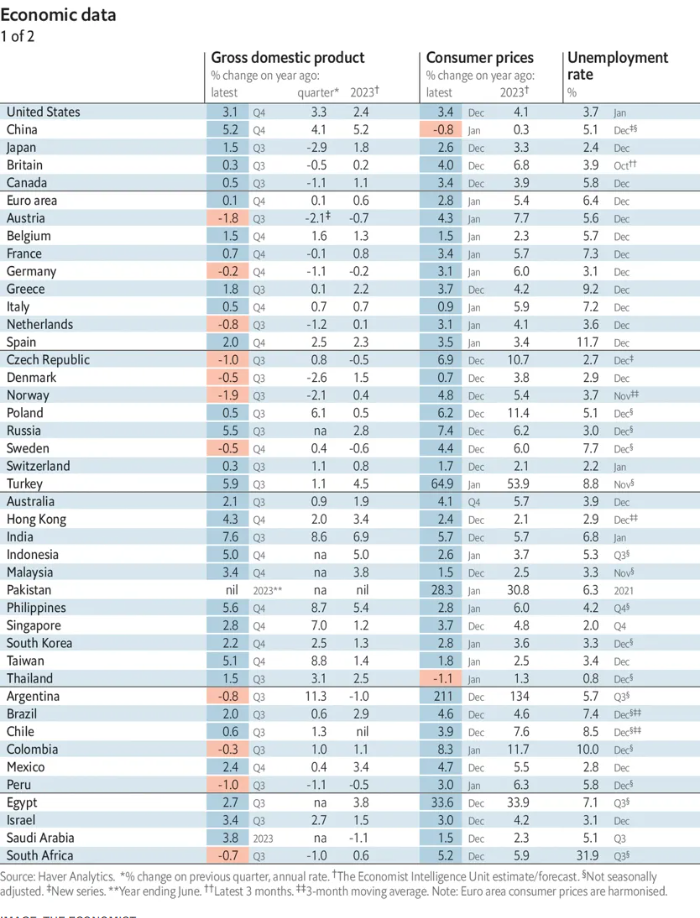

### 1. The world this week
#### 1.1 [Politics](https://www.economist.com/the-world-this-week/2024/02/08/politics)

#### 1.2 [Business](https://www.economist.com/the-world-this-week/2024/02/08/business)
  

#### 1.3 [KAL’s cartoon](https://www.economist.com/the-world-this-week/2024/02/08/kals-cartoon)
  

#### 1.4 _The world this week:_ [This week’s covers](https://www.economist.com/the-world-this-week/2024/02/08/this-weeks-covers)  
How we saw the world  

### 2. Leaders
#### 2.1 _Leaders | Weapons systems:_ [Killer drones pioneered in Ukraine are the weapons of the future](https://www.economist.com/leaders/2024/02/08/killer-drones-pioneered-in-ukraine-are-the-weapons-of-the-future)  
They are reshaping the balance between humans and technology in war  

#### 2.2 _Leaders | China’s confidence shock :_ [Has Xi Jinping lost control of the markets?](https://www.economist.com/leaders/2024/02/08/can-xi-jinping-win-back-the-markets)  
As a property crisis drags the economy into deflation, confidence is seeping away  

#### 2.3 _Leaders | The arsenal of hypocrisy:_ [House Republicans are helping Vladimir Putin](https://www.economist.com/leaders/2024/02/07/house-republicans-are-helping-vladimir-putin)  
Their cynicism over Ukraine weakens America and makes the world less safe  

#### 2.4 _Leaders | What happens when populists lose :_ [Donald Tusk tries to restore Poland’s rule of law](https://www.economist.com/leaders/2024/02/08/donald-tusk-tries-to-restore-polands-rule-of-law)  
Repairing the damage done by the last government will take grit and patience  

#### 2.5 _Leaders | Indonesia’s election:_ [What Jokowi’s inglorious exit means for Indonesia](https://www.economist.com/leaders/2024/02/08/what-jokowis-inglorious-exit-means-for-indonesia)  
The outgoing president is playing kingmaker to a controversial ex-general  
  

### 3. Letters
#### 3.1 _Letters | On China and Taiwan, royalty, artificial intelligence, activist investors, philanthropy, retirement :_ [Letters to the editor](https://www.economist.com/letters/2024/02/08/letters-to-the-editor)  
A selection of correspondence  
  

### 4. By Invitation
#### 4.1 _By Invitation | Indonesia’s election:_ [A presidential candidate sees daunting challenges at home and abroad](https://www.economist.com/by-invitation/2024/02/07/a-presidential-candidate-sees-daunting-challenges-at-home-and-abroad)  
Indonesia can help keep peace in the Indo-Pacific, says Ganjar Pranowo   

#### 4.2 _By Invitation | Artificial intelligence and democracy:_ [An AI-risk expert thinks governments should act to combat disinformation](https://www.economist.com/by-invitation/2024/02/06/an-ai-risk-expert-thinks-governments-should-act-to-combat-disinformation)  
An election may already have been swayed, says Philip Fox  

#### 4.3 _By Invitation | A post-populist perspective:_ [Kyriakos Mitsotakis on how to escape the grip of populism](https://www.economist.com/by-invitation/2024/02/02/kyriakos-mitsotakis-on-how-to-escape-the-grip-of-populism)  
It requires a combination of honesty and flexibility, says Greece’s prime minister  

### 5. Briefing
#### 5.1 _Briefing | Dissipating dreams:_ [China’s well-to-do are under assault from every side](https://www.economist.com/briefing/2024/02/08/chinas-well-to-do-are-under-assault-from-every-side)  
Their agonies at the hands of markets and the state will reshape the Chinese economy  
  
  

### 6. Britain
#### 6.1 _Britain | A pill wind:_ [How Britain lost its war on drugs](https://www.economist.com/britain/2024/02/07/how-britain-lost-its-war-on-drugs)  
Blame new synthetic opioids, inadequate funding and a punitive attitude  
  
  

#### 6.2 _Britain | Royal bodies:_ [What Charles III’s illness says about monarchs and mortality](https://www.economist.com/britain/2024/02/06/what-charles-iiis-illness-says-about-monarchs-and-mortality)  
Britain responds to the king’s cancer diagnosis  

#### 6.3 _Britain | Not so soft:_ [Britain’s economy will need rate cuts sooner rather than later](https://www.economist.com/britain/2024/02/08/britains-economy-will-need-rate-cuts-sooner-rather-than-later)  
Inflation is coming down but worries about growth rise  
  

#### 6.4 _Britain | Eyes right:_ [A tiny right-wing party tries to menace Britain’s Conservatives](https://www.economist.com/britain/2024/02/08/a-tiny-right-wing-party-tries-to-menace-britains-conservatives)  
Reform UK’s best opportunity yet arrives on February 15th  

#### 6.5 _Britain | Remembrance row:_ [The controversy over Britain’s planned Holocaust memorial](https://www.economist.com/britain/2024/02/03/the-controversy-over-britains-planned-holocaust-memorial)  
Wrong place, wrong design  

#### 6.6 _Britain | Death to Britain, but not just yet:_ [Iran is targeting its opponents in Britain](https://www.economist.com/britain/2024/02/08/iran-is-targeting-its-opponents-in-britain)  
Iran’s regime sees London as both hunting ground and playground  

#### 6.7 _Britain | Bagehot:_ [The former prime minister who fascinates the Labour Party](https://www.economist.com/britain/2024/02/08/the-former-prime-minister-who-fascinates-the-labour-party)  
Starmerites are studying a neglected former leader  

### 7. Europe
#### 7.1 _Europe | A party in a death spiral?:_ [A mounting crisis of confidence confronts Olaf Scholz](https://www.economist.com/europe/2024/02/04/a-mounting-crisis-of-confidence-confronts-olaf-scholz)  
Germans are grouchy, the hard right is rampant and the economy sluggish  
  

#### 7.2 _Europe | A moment in the sun:_ [Madrid is booming. Growing while keeping its cool will be the tricky part](https://www.economist.com/europe/2024/02/06/madrid-is-booming-growing-while-keeping-its-cool-will-be-the-tricky-part)  
A southern success story  

#### 7.3 _Europe | Silencing the Kremlin’s critics:_ [Vladimir Putin extends his crackdown in Russia](https://www.economist.com/europe/2024/02/08/vladimir-putin-extends-his-crackdown-in-russia)  
Even troublesome war supporters are targeted  

#### 7.4 _Europe | Return of law:_ [Poland is trying to restore the rule of law without violating it](https://www.economist.com/europe/2024/02/07/poland-is-trying-to-restore-the-rule-of-law-without-violating-it)  
Donald Tusk seeks to undo a hard-right party’s capture of the state  

#### 7.5 _Europe | Charlemagne:_ [Europe is importing a solar boom. Good news for (nearly) everyone](https://www.economist.com/europe/2024/02/08/europe-is-importing-a-solar-boom-good-news-for-nearly-everyone)  
Cheap Chinese solar modules are delivering the EU’s green promises  

### 8. United States
#### 8.1 _United States | Poll positions:_ [Trump’s lead over Biden may be smaller than it looks](https://www.economist.com/united-states/2024/02/04/trumps-lead-over-biden-may-be-smaller-than-it-looks)  
Consider only the highest-quality national polls, and the Republican’s advantage melts away  
  
  

#### 8.2 _United States | Deliberative or disgraced?:_ [What the death of America’s border bill says about toxic congressional politics](https://www.economist.com/united-states/2024/02/06/what-the-death-of-americas-border-bill-says-about-toxic-congressional-politics)  
Republicans opt for theatre instead of governance  

#### 8.3 _United States | Citizen Trump:_ [A court rejects Donald Trump’s claim to absolute immunity](https://www.economist.com/united-states/2024/02/07/a-court-rejects-donald-trumps-claim-to-absolute-immunity)  
The former president will now take his outlandish plea to the Supreme Court  

#### 8.4 _United States | Shh! Legislation in progress:_ [Congress might just pass an astonishingly sensible tax deal](https://www.economist.com/united-states/2024/02/08/congress-might-just-pass-an-astonishingly-sensible-tax-deal)  
But too much attention could scupper it  

#### 8.5 _United States | Direct democracy:_ [Florida too may have an abortion referendum in November](https://www.economist.com/united-states/2024/02/08/florida-too-may-have-an-abortion-referendum-in-november)  
It could influence the presidential election. It would be an even bigger deal for abortion access  

#### 8.6 _United States | Generalising :_ [State attorneys-general are shaping national policy ](https://www.economist.com/united-states/2024/02/08/state-attorneys-general-are-shaping-national-policy)  
Despite not being elected to do so  

#### 8.7 _United States | Lexington:_ [This is not a story about Taylor Swift and the Super Bowl](https://www.economist.com/united-states/2024/02/08/this-is-not-a-story-about-taylor-swift-and-the-super-bowl)  
Well, maybe a little  

### 9. Middle East & Africa
#### 9.1 _Middle East and Africa | Antony Blinken’s shuttle diplomacy:_ [Israel scorns America’s unprecedented peace plan](https://www.economist.com/middle-east-and-africa/2024/02/07/israel-scorns-americas-unprecedented-peace-plan)  
Arab states offer remarkable “security guarantees” to Israel  

#### 9.2 _Middle East and Africa | America’s reverse-Goldilocks strategy:_ [Why Iran is hard to intimidate](https://www.economist.com/middle-east-and-africa/2024/02/06/why-iran-is-hard-to-intimidate)  
US soldiers are a bull’s-eye target for Iranian militias  

#### 9.3 _Middle East and Africa | Israel’s obstructive settlers:_ [America is trying to peg Israel’s settlers back](https://www.economist.com/middle-east-and-africa/2024/02/08/america-is-trying-to-peg-israels-settlers-back)  
But their power in politics and on the ground shows no sign of waning  
  

#### 9.4 _Middle East and Africa | House and home:_ [How to house the world’s fastest-growing population](https://www.economist.com/middle-east-and-africa/2024/02/07/how-to-house-the-worlds-fastest-growing-population)  
About 70% of buildings needed in Africa by 2040 are not yet built  
  
  

#### 9.5 _Middle East and Africa | How to stay in power:_ [Democracy is under attack in Senegal](https://www.economist.com/middle-east-and-africa/2024/02/08/democracy-is-under-attack-in-senegal)  
The election is delayed after riot police drag opposition MPs out of parliament  

### 10. The Americas
#### 10.1 _The Americas | El Salvador:_ [After Nayib Bukele’s crushing, unconstitutional victory, what next?](https://www.economist.com/the-americas/2024/02/05/after-nayib-bukeles-crushing-unconstitutional-victory-what-next)  
El Salvador’s “philosopher king” is already hinting at a third term  

#### 10.2 _The Americas | The C word:_ [Mexico’s president and his family are fighting claims of corruption](https://www.economist.com/the-americas/2024/02/08/mexicos-president-and-his-family-are-fighting-claims-of-corruption)  
The truth is that Andrés Manuel López Obrador has done too little to tackle the problem in society  

#### 10.3 _The Americas | Pensions bonanza:_ [Andrés Manuel López Obrador splashes out as elections loom](https://www.economist.com/the-americas/2024/02/08/andres-manuel-lopez-obrador-splashes-out-as-elections-loom)  
The trouble is Mexico can’t pay the president’s bill  

### 11. Asia
#### 11.1 _Asia | Indonesian politics:_ [A controversial general is likely to be Indonesia’s next leader](https://www.economist.com/asia/2024/02/08/a-controversial-general-is-likely-to-be-indonesias-next-leader)  
Prabowo Subianto looks unfit to govern the world’s third-largest democracy  
  
  

#### 11.2 _Asia | Pay the writers:_ [South Korea’s writers and directors play Squid Game](https://www.economist.com/asia/2024/02/07/south-koreas-writers-and-directors-play-squid-game)  
The people behind the country’s TV and film boom are not profiting from it  

#### 11.3 _Asia | Force for change:_ [Izumi Kenta wants to shake up Japan’s opposition](https://www.economist.com/asia/2024/02/08/izumi-kenta-wants-to-shake-up-japans-opposition)  
The centre-left leader tells The Economist his plan for a more serious politics  

#### 11.4 _Asia | G’day, goodbye:_ [Australia’s enthusiasm for immigration is being tested](https://www.economist.com/asia/2024/02/08/australias-enthusiasm-for-immigration-is-being-tested)  
The country is trying to slash net migration  

#### 11.5 _Asia | Rule of Modi:_ [Are India’s corruption police targeting Narendra Modi’s critics?](https://www.economist.com/asia/2024/02/05/are-indias-corruption-police-targeting-narendra-modis-critics)  
Money-laundering raids, many on the opposition, have increased 27-fold in the past decade  

#### 11.6 _Asia | Banyan:_ [Singapore cracks down on Chinese influence](https://www.economist.com/asia/2024/02/08/singapore-cracks-down-on-chinese-influence)  
The city-state wields its foreign-interference law for the first time  

### 12. China
#### 12.1 _China | Spend more, please:_ [Can China’s consumers save its economy?](https://www.economist.com/china/2024/02/06/can-consumers-rescue-chinas-economy)  
Our number-crunching suggests economic “rebalancing” will be exceptionally hard  
  

#### 12.2 _China | Pay up:_ [Protests are soaring, as China’s workers demand their wages](https://www.economist.com/china/2024/02/08/protests-are-soaring-as-chinas-workers-demand-their-wages)  
They are coming up with creative stunts to put pressure on companies  
  

#### 12.3 _China | Shrouded in secrecy :_ [An espionage case hurts Chinese relations with Australia](https://www.economist.com/china/2024/02/08/an-espionage-case-hurts-chinese-relations-with-australia)  
The mysterious story of Yang Hengjun who is now sentenced to death  

#### 12.4 _China | Chaguan:_ [Xi Jinping’s chaos-loving friends](https://www.economist.com/china/2024/02/08/xi-jinpings-chaos-loving-friends)  
Why is stability-obsessed China aligned with Iran, North Korea and Russia?  

### 13. Business
#### 13.1 _Business | Discomfort level:_ [America’s economy is booming. So why are bosses worried?](https://www.economist.com/business/2024/02/04/americas-economy-is-booming-so-why-are-bosses-worried)  
Three of the forces that propped up profits may now be weakening  
  
  

#### 13.2 _Business | Out of the nick, in time:_ [Samsung’s boss avoids prison, again](https://www.economist.com/business/2024/02/08/samsungs-boss-avoids-prison-again)  
Lee Jae-yong’s acquittal will benefit him, but not necessary South Korea  

#### 13.3 _Business | Team players:_ [Media companies club together for a joint sport-streamer](https://www.economist.com/business/2024/02/08/media-companies-club-together-for-a-joint-sport-streamer)  
Disney, Fox and Warner Bros Discovery have a new game plan  
  

#### 13.4 _Business | Bittersweet life:_ [Can Giorgia Meloni reinvigorate Italia SpA?](https://www.economist.com/business/2024/02/08/can-giorgia-meloni-reinvigorate-italia-spa)  
Why Italian companies find it so hard to grow  
  
  

#### 13.5 _Business | Bartleby:_ [Fairness: the hidden currency of the workplace](https://www.economist.com/business/2024/02/08/fairness-the-hidden-currency-of-the-workplace)  
It animates bosses, employees and customers alike  

#### 13.6 _Business | TsarGPT:_ [Vladimir Putin wants to catch up with the West in AI](https://www.economist.com/business/2024/02/08/vladimir-putin-wants-to-catch-up-with-the-west-in-ai)  
Good luck with that  

#### 13.7 _Business | Schumpeter:_ [Musk v Zuckerberg: who’s winning?](https://www.economist.com/business/2024/02/06/musk-v-zuckerberg-whos-winning)  
One burned billions, the other has earned them  

### 14. Finance & economics
#### 14.1 _Finance and economics | Fanning the flames:_ [China’s stockmarket nightmare is nowhere near over](https://www.economist.com/finance-and-economics/2024/02/07/chinas-stockmarket-nightmare-is-nowhere-near-over)  
The situation ought to worry Xi Jinping  
  
  
  

#### 14.2 _Finance and economics | Buttonwood:_ [The dividend is back. Are investors right to be pleased?](https://www.economist.com/finance-and-economics/2024/02/08/the-dividend-is-back-are-investors-right-to-be-pleased)  
Why cash payments are no longer the preserve of widows and orphans  

#### 14.3 _Finance and economics | Spring fever:_ [Are NYCB’s troubles the start of another banking panic?](https://www.economist.com/finance-and-economics/2024/02/08/are-nycbs-troubles-the-start-of-another-banking-panic)  
Probably not. But they do suggest broader problems  
  

#### 14.4 _Finance and economics | Capital punishment:_ [Bankers have reason to hope Trump triumphs](https://www.economist.com/finance-and-economics/2024/02/08/bankers-have-reason-to-hope-trump-triumphs)  
Will they now spend big on his campaign?  

#### 14.5 _Finance and economics | Running out of road:_ [The false promise of Indonesia’s economy](https://www.economist.com/finance-and-economics/2024/02/08/the-false-promise-of-indonesias-economy)  
Presidential candidates vow to deliver 7% growth. Voters have heard it before  
  

#### 14.6 _Finance and economics | Free exchange:_ [Universities are failing to boost economic growth](https://www.economist.com/finance-and-economics/2024/02/05/universities-are-failing-to-boost-economic-growth)  
Too often they generate ideas that no one knows how to use  

### 15. Science & technology
#### 15.1 [How cheap drones are transforming warfare in Ukraine](https://www.economist.com/interactive/science-and-technology/2024/02/05/cheap-racing-drones-offer-precision-warfare-at-scale)

#### 15.2 _Science and technology | Very small things:_ [NASA’s PACE satellite will tackle the largest uncertainty in climate science](https://www.economist.com/science-and-technology/2024/02/07/nasas-pace-satellite-will-tackle-the-largest-uncertainty-in-climate-science)  
It will monitor tiny particles in Earth’s atmosphere and oceans  

#### 15.3 _Science and technology | A long and winding road:_ [The first endometriosis drug in four decades is on the horizon](https://www.economist.com/science-and-technology/2024/02/07/the-first-endometriosis-drug-in-four-decades-is-on-the-horizon)  
At last, progress is being made on a condition that affects one woman in ten  

#### 15.4 _Science and technology | They’re on a roll:_ [Ancient, damaged Roman scrolls have been deciphered using AI](https://www.economist.com/science-and-technology/2024/02/06/ancient-damaged-roman-scrolls-have-been-deciphered-using-ai)  
The new techniques could help rediscover lost works from antiquity  

#### 15.5 _Science and technology | Baby AI:_ [Scientists have trained an AI through the eyes of a baby](https://www.economist.com/science-and-technology/2024/02/07/scientists-have-trained-an-ai-through-the-eyes-of-a-baby)  
“Chair” and “ball” were among little AI’s first words  

### 16. Culture
#### 16.1 _Culture | Chronicling the past:_ [When is it too soon to write history?](https://www.economist.com/culture/2024/02/05/when-is-it-too-soon-to-write-history)  
Early accounts can stand the test of time, but they have to be riveting  

#### 16.2 _Culture | Size doesn’t matter:_ [Small, but mighty: how cuteness has taken over the world](https://www.economist.com/culture/2024/02/02/small-but-mighty-how-cuteness-has-taken-over-the-world)  
A supposedly childish aesthetic is being taken more seriously  

#### 16.3 _Culture | Labour pains:_ [Lessons for Keir Starmer from Britain’s first Labour government](https://www.economist.com/culture/2024/02/08/lessons-for-keir-starmer-from-britains-first-labour-government)  
The Labour Party first took power 100 years ago  

#### 16.4 _Culture | Name that toon:_ [Chinese animated films are booming](https://www.economist.com/culture/2024/02/08/chinese-animated-films-are-booming)  
But they would be even better if censors relaxed  
  

#### 16.5 _Culture | Back Story:_ [The meaning of the hysteria over Taylor Swift](https://www.economist.com/culture/2024/02/06/the-meaning-of-the-hysteria-over-taylor-swift)  
It reflects the overlap of politics, conspiracy and celebrity  

### 17. The Economist reads
#### 17.1 _The Economist reads:_ [What to read about Pakistan](https://www.economist.com/the-economist-reads/2024/02/06/what-to-read-about-pakistan)  
Six books provide an introduction to a troubled, nuclear-armed country  

### 18. Economic & financial indicators
#### 18.1 [Economic data, commodities and markets](https://www.economist.com/economic-and-financial-indicators/2024/02/08/economic-data-commodities-and-markets)
  
  
  
  

### 19. Obituary
#### 19.1 _Obituary | Backwards up the Khyber:_ [Rosemary Smith set out to prove that women drivers could do as well as men](https://www.economist.com/obituary/2024/02/07/rosemary-smith-set-out-to-prove-that-women-drivers-could-do-as-well-as-men)  
The queen of world rallying died on December 5th, aged 86  

