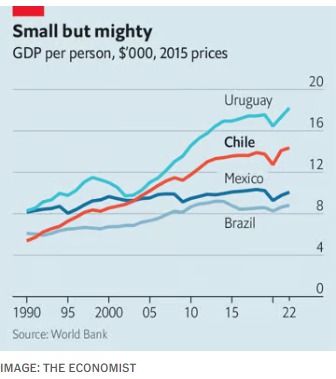
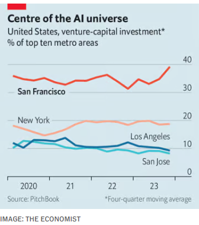

### 1. The world this week
#### 1.1 [Politics](https://www.economist.com/the-world-this-week/2024/02/15/politics)

#### 1.2 [Business](https://www.economist.com/the-world-this-week/2024/02/15/business)
  

#### 1.3 [KAL’s cartoon](https://www.economist.com/the-world-this-week/2024/02/15/kals-cartoon)
  

#### 1.4 _The world this week:_ [This week’s cover](https://www.economist.com/the-world-this-week/2024/02/15/this-weeks-cover)  
How we saw the world  

### 2. Leaders
#### 2.1 _Leaders | The right:_ [The growing peril of national conservatism](https://www.economist.com/leaders/2024/02/15/the-growing-peril-of-national-conservatism)  
It’s dangerous and it’s spreading. Liberals need to find a way to stop it  

#### 2.2 _Leaders | Prepare for President Trump:_ [Europe must hurry to defend itself against Russia—and Donald Trump](https://www.economist.com/leaders/2024/02/12/europe-must-hurry-to-defend-itself-against-russia-and-donald-trump)  
The ex-president’s invitation to Vladimir Putin to attack American allies is an assault on NATO. Ultimately, that is bad for America  

#### 2.3 _Leaders | Decline and fall :_ [Pakistan is out of friends and out of money](https://www.economist.com/leaders/2024/02/14/pakistan-is-out-of-friends-and-out-of-money)  
A botched election and an economic crisis show how low it has fallen  

#### 2.4 _Leaders | A shock to the system:_ [A new answer to the biggest climate conundrum](https://www.economist.com/leaders/2024/02/15/a-new-answer-to-the-biggest-climate-conundrum)  
Will electrification of industry live up to its promise?  

#### 2.5 _Leaders | Silicon rally:_ [As San Francisco builds the future of technology, can it rebuild itself?](https://www.economist.com/leaders/2024/02/15/as-san-francisco-builds-the-future-of-technology-can-it-rebuild-itself)  
People feared a doom loop. Reality has been more surprising  

#### 2.6 _Leaders | America’s shadow central banks:_ [Another bank subsidy America should kill off](https://www.economist.com/leaders/2024/02/13/another-bank-subsidy-america-should-kill-off)  
The Federal Home Loan Banks offer loans to Wall Street that are too cheap  

#### 2.7 _Leaders | The ur-snafu:_ [How not to do a megaproject ](https://www.economist.com/leaders/2024/02/15/how-not-to-do-a-megaproject)  
The lessons of HS2 for Britain and beyond  

### 3. Letters
#### 3.1 _Letters | On export controls on China, charter schools, council tax, Ukraine, DEI, Peter Schickele, common sense:_ [Letters to the editor](https://www.economist.com/letters/2024/02/15/letters-to-the-editor)  
A selection of correspondence  
  

### 4. By Invitation
#### 4.1 _By Invitation | Politics and ageing:_ [David Owen argues that Joe Biden and Donald Trump are both too old to be president](https://www.economist.com/by-invitation/2024/02/12/david-owen-argues-that-joe-biden-and-donald-trump-are-both-too-old-to-be-president)  
Nor should anyone else over 70 be considered for the job, says the politician and former neurologist  

#### 4.2 _By Invitation | Corporate culture:_ [Two experts predict AI will transform companies’ understanding of themselves](https://www.economist.com/by-invitation/2024/02/12/two-experts-predict-ai-will-transform-companies-understanding-of-themselves)  
Wave goodbye to clunky employee surveys, say Don and Charlie Sull  

### 5. Briefing
#### 5.1 _Briefing | Nationalists of the world, unite!:_ [“National conservatives” are forging a global front against liberalism](https://www.economist.com/briefing/2024/02/15/national-conservatives-are-forging-a-global-front-against-liberalism)  
The alliance may be incoherent, but that does not make it harmless  
  

#### 5.2 _Briefing | The burning question:_ [First electric cars. Next, electric factories?](https://www.economist.com/briefing/2024/02/15/first-electric-cars-next-electric-factories)  
They could be a major new way to slow global warming  
  
  

### 6. Europe
#### 6.1 _Europe | How to spend it:_ [The EU’s covid-19 recovery fund has worked, but not as intended](https://www.economist.com/europe/2024/02/15/the-eus-covid-19-recovery-fund-has-worked-but-not-as-intended)  
The fund should pave the way for more collective European spending  
  

#### 6.2 _Europe | A new role:_ [After Russia’s invasion the people of Bessarabia switched sides](https://www.economist.com/europe/2024/02/11/after-russias-invasion-the-people-of-bessarabia-switched-sides)  
A traditionally pro-Russian part of Ukraine now feels very differently  
  

#### 6.3 _Europe | A concrete wall:_ [As Donald Trump threatens NATO, the Baltic states stiffen their defences](https://www.economist.com/europe/2024/02/10/as-donald-trump-threatens-nato-the-baltic-states-stiffen-their-defences)  
Russia’s formidable installations in Ukraine are reviving interest in fortification  
  

#### 6.4 _Europe | Back from the slagheap:_ [As German industry declines, the Ruhr gives hope](https://www.economist.com/europe/2024/02/15/as-german-industry-declines-the-ruhr-gives-hope)  
The resilience of the old steelmaking heartland is a model for the future  
  

#### 6.5 _Europe | Overcooked controversy:_ [Europe decides it doesn’t like lab-grown meat before it’s tried it](https://www.economist.com/europe/2024/02/15/europe-decides-it-doesnt-like-lab-grown-meat-before-its-tried-it)  
An Italian ban is red meat for cattle farmers  

#### 6.6 _Europe | Charlemagne:_ [How not to botch the upcoming EU leadership reshuffle](https://www.economist.com/europe/2024/02/15/how-not-to-botch-the-upcoming-eu-leadership-reshuffle)  
The great scramble for top Euro-jobs is upon us, alas  

### 7. Britain
#### 7.1 _Britain | Getting nowhere fast :_ [The horror story of HS2](https://www.economist.com/britain/2024/02/15/the-horror-story-of-hs2)  
How a flagship project became a parable of Britain’s problems    
  
  

#### 7.2 _Britain | Crime prevention:_ [Why British police should focus on victims](https://www.economist.com/britain/2024/02/15/why-british-police-should-focus-on-victims)  
A small number of people suffer a disproportionate amount of crime  

#### 7.3 _Britain | Hotting up:_ [Climate will be a battleground in Britain’s next election](https://www.economist.com/britain/2024/02/15/climate-will-be-a-battleground-in-britains-next-election)  
The Conservatives and Labour both have weaknesses   

#### 7.4 _Britain | Britain’s silver zones:_ [How to live to one hundred](https://www.economist.com/britain/2024/02/12/how-to-live-to-one-hundred)  
Have good genes and move to East Devon  
  

#### 7.5 _Britain | A life more ordinary:_ [British lives are getting duller](https://www.economist.com/britain/2024/02/15/british-lives-are-getting-duller)  
Good news for Britons, bad news for obituarists  

#### 7.6 _Britain | Bagehot:_ [Ban it harder! An unwelcome new trend in British politics](https://www.economist.com/britain/2024/02/14/ban-it-harder-an-unwelcome-new-trend-in-british-politics)  
Do not abduct that cat  

#### 7.7 _Britain | Roses are perishable:_ [Love, frugality and home-grown flowers are in the air](https://www.economist.com/britain/2024/02/09/love-frugality-and-home-grown-flowers-are-in-the-air)  
Valentine’s Day in post-pandemic Britain  

### 8. United States
#### 8.1 _United States | Racial progress in America:_ [Black workers are enjoying a jobs boom in America](https://www.economist.com/united-states/2024/02/14/black-workers-are-enjoying-a-jobs-boom-in-america)  
A tight labour market chips away at some of the most stubborn inequalities  
  
  

#### 8.2 _United States | House of cowards:_ [House Republicans fear Trump too much to aid Ukraine](https://www.economist.com/united-states/2024/02/14/house-republicans-fear-trump-too-much-to-aid-ukraine)  
They include the speaker, Mike Johnson, who won’t allow a vote  

#### 8.3 _United States | All in the family:_ [Cousin marriage is probably fine in most cases](https://www.economist.com/united-states/2024/02/15/cousin-marriage-is-probably-fine-in-most-cases)  
It is also illegal in 25 American states  

#### 8.4 _United States | Parler games:_ [The far-right’s favoured social-media platform plots a comeback](https://www.economist.com/united-states/2024/02/15/the-far-rights-favoured-social-media-platform-plots-a-comeback)  
What to make of Parler’s return  

#### 8.5 _United States | Night court:_ [The search for justice in America is not a nine-to-five job](https://www.economist.com/united-states/2024/02/15/the-search-for-justice-in-america-is-not-a-nine-to-five-job)  
Courts should stay open later. New York City has been doing that since before it was cool  

#### 8.6 _United States | Lexington:_ [Donald Trump’s tremendous love](https://www.economist.com/united-states/2024/02/13/donald-trumps-tremendous-love)  
His politics may seem hostile, yet he talks like a Valentine’s Day card  

### 9. Middle East & Africa
#### 9.1 _Middle East and Africa | The next phase of the Gaza war :_ [If Israel invades, hell looms in Rafah](https://www.economist.com/middle-east-and-africa/2024/02/13/if-israel-invades-hell-looms-in-rafah)  
Binyamin Netanyahu wants to attack now. His generals don’t  
  

#### 9.2 _Middle East and Africa | The case against UNRWA:_ [The real problem with the UN’s agency for Palestinians](https://www.economist.com/middle-east-and-africa/2024/02/15/the-real-problem-with-the-uns-agency-for-palestinians)  
It has perpetuated the misery of Palestinians  

#### 9.3 _Middle East & Africa | Helping the bad guys:_ [How Yemen’s dominant Houthis blackmail foreign aid agencies](https://www.economist.com/middle-east-and-africa/2024/02/15/how-yemens-dominant-houthis-blackmail-foreign-aid-agencies)  
They risk causing a man-made famine with their meddling  

#### 9.4 _Middle East and Africa | South African politics:_ [Is Julius Malema the most dangerous man in South Africa?](https://www.economist.com/middle-east-and-africa/2024/02/15/is-julius-malema-the-most-dangerous-man-in-south-africa)  
His party wants to nationalise all. He may become kingmaker  

#### 9.5 _Middle East and Africa | Taking credit:_ [African governments return to international bond markets](https://www.economist.com/middle-east-and-africa/2024/02/15/african-governments-return-to-international-bond-markets)  
Debt worries have eased a little, but borrowing is still expensive  
  

#### 9.6 _Middle East and Africa | Ukrainians in Sudan:_ [Evidence mounts that Ukrainian forces are in Sudan](https://www.economist.com/middle-east-and-africa/2024/02/15/evidence-mounts-that-ukrainian-forces-are-in-sudan)  
But their presence may not alter the outcome of its civil war  

### 10. The Americas
#### 10.1 _The Americas | The perils of Petrobras:_ [Why Lula keeps meddling with Latin America’s top oil company](https://www.economist.com/the-americas/2024/02/15/why-lula-keeps-meddling-with-latin-americas-top-oil-company)  
His worst instincts are undermining the national oil company’s hard-won gains   
  
  

#### 10.2 _The Americas | From model to muddle:_ [Chile’s crisis is not over yet](https://www.economist.com/the-americas/2024/02/15/chiles-crisis-is-not-over-yet)  
Political tumult is now the norm in the country  
  

### 11. Asia
#### 11.1 _Asia | A historic shift:_ [India’s unprecedented love-in with the Middle East](https://www.economist.com/asia/2024/02/14/indias-unprecedented-love-in-with-the-middle-east)  
Amid a war Narendra Modi builds new Gulf ties  

#### 11.2 _Asia | Junked bonds:_ [India’s Supreme Court delivers a rare setback for Narendra Modi](https://www.economist.com/asia/2024/02/15/indias-supreme-court-delivers-a-rare-setback-for-narendra-modi)  
It declared unconstitutional an opaque campaign-finance tool that chiefly benefited the ruling party  

#### 11.3 _Asia | File under F for “fiasco”:_ [Pakistan’s voters tell the generals where to put it](https://www.economist.com/asia/2024/02/12/pakistans-voters-tell-the-generals-where-to-put-it)  
Imran Khan’s candidates won the most seats despite heavy-handed attempts to hobble them  

#### 11.4 _Asia | General, elected:_ [Prabowo Subianto will be Indonesia’s next president](https://www.economist.com/asia/2024/02/14/prabowo-subianto-will-be-indonesias-next-president)  
The controversial former general is unlikely to boost the country’s democratic credentials  

#### 11.5 _Asia | Banyan :_ [Australia needs to rethink its approach to its Pacific island neighbours ](https://www.economist.com/asia/2024/02/15/australia-needs-to-rethink-its-approach-to-its-pacific-island-neighbours)  
They care more about development than hard security  

### 12. China
#### 12.1 _China | China and the world:_ [Xi Jinping’s paranoia is making China isolated and insular](https://www.economist.com/china/2024/02/12/xi-jinpings-paranoia-is-making-china-isolated-and-insular)  
From his personal travel plans to capital flows, cross-border exchange is shrinking  
  
  
  
  
  
  
  

#### 12.2 _China | Messy for Messi:_ [Hong Kong is struggling to restore its image as a global city](https://www.economist.com/china/2024/02/15/hong-kong-is-struggling-to-restore-its-image-as-a-global-city)  
Efforts have been tripped up by nationalists  

#### 12.3 _China | Life’s a beach:_ [China is trying to boost domestic tourism](https://www.economist.com/china/2024/02/15/china-is-trying-to-boost-domestic-tourism)  
Even “China’s Hawaii” may not tempt them  
  

#### 12.4 _China | Chaguan:_ [How China stifles dissent without a KGB or Stasi of its own](https://www.economist.com/china/2024/02/15/how-china-stifles-dissent-without-a-kgb-or-stasi-of-its-own)  
A secret policeman on every street  

### 13. International
#### 13.1 _International | Counting the votes:_ [2024 is a giant test of nerves for democracy](https://www.economist.com/international/2024/02/11/2024-is-a-giant-test-of-nerves-for-democracy)  
A warning from election results so far—and what follows in America, Europe and India  
  
  

### 14. Business
#### 14.1 _Business | Chipping in:_ [China is quietly reducing its reliance on foreign chip technology](https://www.economist.com/business/2024/02/13/china-is-quietly-reducing-its-reliance-on-foreign-chip-technology)  
Firms such as Huawei are cultivating local suppliers  
  

#### 14.2 _Business | Tokyo Electrified:_ [Japan’s semiconductor toolmakers are booming](https://www.economist.com/business/2024/02/15/japans-semiconductor-toolmakers-are-booming)  
How long will it last?  
  

#### 14.3 _Business | Paramount’s paramours:_ [Would-be suitors are wooing Paramount](https://www.economist.com/business/2024/02/15/would-be-suitors-are-wooing-paramount)  
The drama highlights the parlous state of the entertainment industry  

#### 14.4 _Business | The super store:_ [Why Costco is so loved](https://www.economist.com/business/2024/02/15/why-costco-is-so-loved)  
Keeping customers, employees and investors happy is no mean feat  

#### 14.5 _Business | Bartleby:_ [How to benefit from the conversations you have at work](https://www.economist.com/business/2024/02/15/how-to-benefit-from-the-conversations-you-have-at-work)  
Stop thinking about your next point and listen to the one being made  

#### 14.6 _Business | Boxing match:_ [How worried should Amazon be about Shein and Temu?](https://www.economist.com/business/2024/02/15/how-worried-should-amazon-be-about-shein-and-temu)  
Dirt-cheap products and marketing splurges are catching clicks  

#### 14.7 _Business | Schumpeter:_ [The row over US Steel shows the new meaning of national security](https://www.economist.com/business/2024/02/15/the-row-over-us-steel-shows-the-new-meaning-of-national-security)  
Should a Japanese buyer really be blocked from acquiring the American firm?  

### 15. Finance & economics
#### 15.1 _Finance and economics | Artificial intelligence:_ [How San Francisco staged a surprising comeback](https://www.economist.com/finance-and-economics/2024/02/12/san-franciscos-surprising-comeback)  
Forget the controversy. America’s tech capital is building the future  
  
  
  

#### 15.2 _Finance and economics | Buttonwood:_ [Investing in commodities has become nightmarishly difficult](https://www.economist.com/finance-and-economics/2024/02/15/investing-in-commodities-has-become-nightmarishly-difficult)  
What happened to that “supercycle”?  

#### 15.3 _Finance and economics | Putting out fires:_ [How the world economy learned to love chaos](https://www.economist.com/finance-and-economics/2024/02/11/how-the-world-economy-learned-to-love-chaos)  
War, high interest rates and financial strife are yet to bring down growth  

#### 15.4 _Finance and economics | Conflict trading:_ [The Ukraine war offers energy arbitrage opportunities](https://www.economist.com/finance-and-economics/2024/02/15/the-ukraine-war-offers-energy-arbitrage-opportunities)  
It also provides a glimpse at the future of European gas supplies  

#### 15.5 _Finance and economics | American banks:_ [Is working from home about to spark a financial crisis?](https://www.economist.com/2024/02/14/is-working-from-home-about-to-spark-a-financial-crisis)  
That is the worry. But it is overblown  

#### 15.6 _Finance and economics | Free exchange:_ [In defence of a financial instrument that fails to do its job](https://www.economist.com/finance-and-economics/2024/02/15/in-defence-of-a-financial-instrument-that-fails-to-do-its-job)  
Inflation-linked bonds are a poor inflation hedge, but that’s not the point  

### 16. Science & technology
#### 16.1 _Science and technology | Lunar odyssey:_ [A private Moon mission hopes to succeed where others have failed](https://www.economist.com/science-and-technology/2024/02/15/a-private-moon-mission-hopes-to-succeed-where-others-have-failed)  
The odds are stacked against it  
  

#### 16.2 _Science and technology | Milk and two microbes:_ [For the perfect cup of tea, start with the right bacteria](https://www.economist.com/science-and-technology/2024/02/15/for-the-perfect-cup-of-tea-start-with-the-right-bacteria)  
The organisms near a tea plant’s roots can influence the depth of flavour in its leaves  

#### 16.3 _Science and technology | Shame, set and match:_ [What tennis reveals about AI’s impact on human behaviour](https://www.economist.com/science-and-technology/2024/02/15/what-tennis-reveals-about-ais-impact-on-human-behaviour)  
Since the introduction of Hawk-Eye, umpires have been biting their tongues  

#### 16.4 _Science and technology | JET off:_ [A 40-year-old nuclear-fusion experiment bows out in style](https://www.economist.com/science-and-technology/2024/02/09/a-40-year-old-nuclear-fusion-experiment-bows-out-in-style)  
Its final run set a record for how much energy such reactions can produce  

### 17. Culture
#### 17.1 _Culture | Turkish delight:_ [The third-largest exporter of television is not who you might expect](https://www.economist.com/culture/2024/02/15/the-third-largest-exporter-of-television-is-not-who-you-might-expect)  
After America and Britain, Turkey is the biggest seller of scripted shows  

#### 17.2 _Culture | Indecipherable fingerprints:_ [A secret room in Florence boasts drawings by Michelangelo](https://www.economist.com/culture/2024/02/15/a-secret-room-in-florence-boasts-drawings-by-michelangelo)  
The artist’s fingerprints are all over the walls—or are they?  

#### 17.3 _Culture | Laughing to tears:_ [On “A Wonderful Country”, Israelis joke their way through trauma](https://www.economist.com/culture/2024/02/15/on-a-wonderful-country-israelis-joke-their-way-through-trauma)  
Nothing appears off limits on the incisive comedy show, except for Gazans’ pain  

#### 17.4 _Culture | Drugs, terms and steel:_ [The Wa: the world’s biggest drug-dealers, with a tiny profile](https://www.economist.com/culture/2024/02/09/the-wa-the-worlds-biggest-drug-dealers-with-a-tiny-profile)  
A new book looks at how the narco-state has flourished  

#### 17.5 _Culture | Pen v plague:_ [From Napoleon to Vladimir Putin, disease has shaped history](https://www.economist.com/culture/2024/02/15/from-napoleon-to-vladimir-putin-disease-has-shaped-history)  
A sacked New York Times reporter takes a global view of disease  

#### 17.6 _Culture | Back Story :_ [The real message of Vladimir Putin’s chat with Tucker Carlson](https://www.economist.com/culture/2024/02/09/the-real-message-of-vladimir-putins-chat-with-tucker-carlson)  
Russia’s president is not a man to be trusted, still less to emulate or admire  

### 18. The Economist reads
#### 18.1 _The Economist reads:_ [What to read about Indonesia](https://www.economist.com/the-economist-reads/2024/02/13/what-to-read-about-indonesia)  
There’s much more to the country than Bali’s beaches, as these six books demonstrate  

### 19. Economic & financial indicators
#### 19.1 [Economic data, commodities and markets](https://www.economist.com/economic-and-financial-indicators/2024/02/15/economic-data-commodities-and-markets)
  
  
  
  

### 20. The Economist explains
#### 20.1 _The Economist explains:_ [What is Russia’s mysterious new space weapon?](https://www.economist.com/the-economist-explains/2024/02/15/what-is-russias-mysterious-new-space-weapon)  
Theories include a space-nuke or a nuclear-powered jammer  

#### 20.2 _The Economist explains:_ [How Ukraine sank the Caesar Kunikov—and is beating Russia at sea](https://www.economist.com/the-economist-explains/2024/02/14/how-ukraine-sank-the-caesar-kunikov-and-is-beating-russia-at-sea)  
It is the fourth landing ship Ukraine has taken out in the Black Sea in seven months  
  

### 21. Obituary
#### 21.1 _Obituary | A line through the jungle:_ [Jack Jennings was one of the Allied POWs who built the Burma Railway](https://www.economist.com/obituary/2024/02/14/jack-jennings-was-one-of-the-allied-pows-who-built-the-burma-railway)  
The slave labourer for the Japanese died on January 19th, aged 104  

