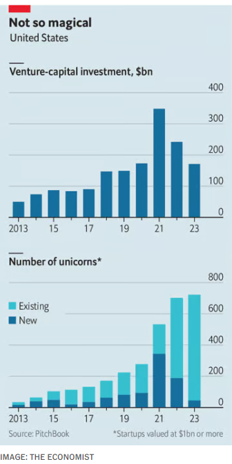

### 1. The world this week
#### 1.1 [Politics](https://www.economist.com/the-world-this-week/2024/02/22/politics)

#### 1.2 [Business](https://www.economist.com/the-world-this-week/2024/02/22/business)
  

#### 1.3 [KAL’s cartoon](https://www.economist.com/the-world-this-week/2024/02/22/kals-cartoon)
  

#### 1.4 _The world this week:_ [This week’s cover](https://www.economist.com/the-world-this-week/2024/02/22/this-weeks-cover)  
How we saw the world  

### 2. Leaders
#### 2.1 _Leaders | NATO:_ [Caught between Putin and Trump](https://www.economist.com/leaders/2024/02/22/caught-between-putin-and-trump)  
Russian aggression and American wavering reveal how ill-equipped Europe is  

#### 2.2 _Leaders | Held in suspense:_ [Do not expect America’s interest rates to fall just yet](https://www.economist.com/leaders/2024/02/22/do-not-expect-americas-interest-rates-to-fall-just-yet)  
The risk of a second wave of inflation remains too great  
  

#### 2.3 _Leaders | Weapons of misconstruction :_ [Sanctions are not the way to fight Vladimir Putin](https://www.economist.com/leaders/2024/02/21/even-the-toughest-sanctions-on-russias-war-machine-are-no-substitute-for-military-aid)  
There is no substitute for military aid to Ukraine  

#### 2.4 _Leaders | Let them dig :_ [The world needs more critical minerals. Governments are not helping](https://www.economist.com/leaders/2024/02/22/the-world-needs-more-critical-minerals-governments-are-not-helping)  
Just obtaining a permit takes a remarkably long time  

#### 2.5 _Leaders | Stop the war:_ [How to prevent another catastrophic regional war in Congo](https://www.economist.com/leaders/2024/02/22/how-to-prevent-another-catastrophic-regional-war-in-congo)  
The world needs to press Rwanda to pull back its forces  

### 3. Letters
#### 3.1 _Letters | On HS2, data centres, Vladimir Putin, the FHLB, academic research, the Holocaust, prosthetic limbs, animals on a plane:_ [Letters to the editor](https://www.economist.com/letters/2024/02/22/letters-to-the-editor)  
A selection of correspondence  

### 4. By Invitation
#### 4.1 _By Invitation | The Middle East:_ [Oman’s foreign minister calls for an emergency peace conference](https://www.economist.com/by-invitation/2024/02/21/omans-foreign-minister-calls-for-an-emergency-peace-conference)  
Hamas, Hizbullah and the Houthis are too deeply rooted in their communities to be excluded, argues Badr Albusaidi  

#### 4.2 _By Invitation | Artificial intelligence and copyright:_ [Don’t give AI free access to work denied to humans, argues a legal scholar ](https://www.economist.com/by-invitation/2024/02/16/dont-give-ai-free-access-to-work-denied-to-humans-argues-a-legal-scholar)  
Ben Sobel thinks lawsuits from rights-holders could reshape copyright law for the better  

### 5. Briefing
#### 5.1 _Briefing | Present at the destruction:_ [Can Europe defend itself without America?](https://www.economist.com/briefing/2024/02/18/can-europe-defend-itself-without-america)  
It would need to replace military aid, a nuclear umbrella and leadership  
  
  
  
  
  

### 6. Europe
#### 6.1 _Europe | Two years on:_ [Vladimir Putin has been fighting not just Ukraine, but his own people](https://www.economist.com/europe/2024/02/19/vladimir-putin-has-been-fighting-not-just-ukraine-but-his-own-people)  
He will not stop  
  
  

#### 6.2 _Europe | War-weary:_ [After two years of war, Ukrainians are becoming pessimistic](https://www.economist.com/europe/2024/02/22/after-two-years-of-war-ukrainians-are-becoming-pessimistic)  
They no longer expect the war to be over soon  
  

#### 6.3 _Europe | The Kremlin’s cross-hairs:_ [Towns in eastern Ukraine fear they will be Russia’s next target](https://www.economist.com/europe/2024/02/20/towns-in-eastern-ukraine-fear-they-will-be-russias-next-target)  
After the fall of Avdiivka, where will be next?  
  
  

#### 6.4 _Europe | Ploughshares into swords:_ [How Boris Pistorius is transforming the German armed forces](https://www.economist.com/europe/2024/02/21/how-boris-pistorius-is-transforming-the-german-armed-forces)  
The defence minister is turning the country’s promises into reality  
  
  

#### 6.5 _Europe | Charlemagne:_ [Europe’s generosity towards Ukrainian refugees is not so welcome…in Ukraine](https://www.economist.com/europe/2024/02/22/europes-generosity-towards-ukrainian-refugees-is-not-so-welcomein-ukraine)  
Ending the “temporary” protection offered to those fleeing war will be tricky  

### 7. Britain
#### 7.1 _Britain | Lifting sands:_ [Can run-down Blackpool turn itself around?](https://www.economist.com/britain/2024/02/22/can-run-down-blackpool-turn-itself-around)  
The plan to regenerate a struggling seaside favourite  

#### 7.2 _Britain | Tax advice:_ [A memo to Britain’s chancellor, Jeremy Hunt](https://www.economist.com/britain/2024/02/22/a-memo-to-britains-chancellor-jeremy-hunt)  
Pre-budget thoughts from a fictitious Treasury adviser  
  

#### 7.3 _Britain | Higher education and race:_ [Some British universities have become remarkably racially diverse](https://www.economist.com/britain/2024/02/22/some-british-universities-have-become-remarkably-racially-diverse)  
Good grades, high expectations and reluctance to travel explain why  
  

#### 7.4 _Britain | Look north:_ [A northern mayor’s left-wing challenge to Labour](https://www.economist.com/britain/2024/02/20/a-northern-mayors-left-wing-challenge-to-labour)  
Can Jamie Driscoll emulate Ken Livingstone?  

#### 7.5 _Britain | Refurbished:_ [How working from home is reshaping Canary Wharf](https://www.economist.com/britain/2024/02/22/how-working-from-home-is-reshaping-canary-wharf)  
London’s dockland district has more homes, more fun and fewer offices  

#### 7.6 _Britain | Bagehot:_ [Sir Keir Starmer: bureaucrat first, politician second](https://www.economist.com/britain/2024/02/21/sir-keir-starmer-bureaucrat-first-politician-second)  
A biography of the Labour leader reveals a reformer ill at ease in politics  

### 8. United States
#### 8.1 _United States | The Trump trials:_ [Why those who wish to see Trump jailed soon will be disappointed](https://www.economist.com/united-states/2024/02/22/why-those-who-wish-to-see-trump-jailed-soon-will-be-disappointed)  
The flimsiest of the cases is set to go first, and all face delays  

#### 8.2 [How might Donald Trump’s trials sway voters?](https://www.economist.com/united-states/2024/02/22/how-might-donald-trumps-trials-sway-voters)

#### 8.3 _United States | From sand to sea:_ [Does the American army’s future lie in Europe or Asia?](https://www.economist.com/united-states/2024/02/19/does-the-american-armys-future-lie-in-europe-or-asia)  
It could not wage wars in both at the same time  
  

#### 8.4 _United States | Counting canines:_ [These American cities are obsessed with dogs](https://www.economist.com/united-states/2024/02/22/these-american-cities-are-obsessed-with-dogs)  
They are probably not the ones you think  
  

#### 8.5 _United States | Lexington:_ [The flaws that China’s chief ideologue found in America](https://www.economist.com/united-states/2024/02/22/the-flaws-that-chinas-chief-ideologue-found-in-america)  
As a young visitor decades ago, Wang Huning saw “an unstoppable undercurrent of crisis”  

### 9. Middle East & Africa
#### 9.1 _Middle East and Africa | On the brink :_ [Congo’s M23 rebellion risks sparking a regional war](https://www.economist.com/middle-east-and-africa/2024/02/22/congos-m23-rebellion-risks-sparking-a-regional-war)  
Goma is under a terrifying siege  
  

#### 9.2 _Middle East and Africa | Pub brawl:_ [The booze industry reveals a lot about Kenya](https://www.economist.com/middle-east-and-africa/2024/02/22/the-booze-industry-reveals-a-lot-about-kenya)  
The politicisation of business is retarding the country’s economy  

#### 9.3 _Middle East and Africa | A boost to democracy:_ [Senegal’s judges stand up for the constitution](https://www.economist.com/middle-east-and-africa/2024/02/22/senegals-judges-stand-up-for-the-constitution)  
But with no date for an election, its democracy is not yet secure  

#### 9.4 _Middle East and Africa | Israel’s ultra-Orthodox:_ [Ultra-Orthodox Israelis’ refusal to fight is a growing problem for Netanyahu](https://www.economist.com/middle-east-and-africa/2024/02/22/ultra-orthodox-israelis-refusal-to-fight-is-a-growing-problem-for-netanyahu)  
Those keeping him in power are unwilling to share the burdens of war  

#### 9.5 _Middle East and Africa | Gaza’s devastated health system:_ [The wrecking of Gaza’s health system goes beyond its hospitals](https://www.economist.com/middle-east-and-africa/2024/02/22/the-wrecking-of-gazas-health-system-goes-beyond-its-hospitals)  
The strip could see 58,000 excess deaths over the next six months if fighting continues  
  

#### 9.6 _Middle East and Africa | Saudi’s booze-free bars:_ [Bar culture has arrived in Saudi Arabia, albeit without the booze](https://www.economist.com/middle-east-and-africa/2024/02/22/bar-culture-has-arrived-in-saudi-arabia-albeit-without-the-booze)  
And the kingdom’s first liquor store has residents wondering if more will follow  

### 10. The Americas
#### 10.1 _The Americas | Lessons from Lima:_ [What Javier Milei could learn from Peru’s economic successes](https://www.economist.com/the-americas/2024/02/22/what-javier-milei-could-learn-from-perus-economic-successes)  
Argentina’s libertarian president wants to rip up the rule book. He shouldn’t  
  

#### 10.2 _The Americas | Ongoing injustice:_ [Jovenel Moïse’s widow is accused of being party to his murder](https://www.economist.com/the-americas/2024/02/22/jovenel-moises-widow-is-accused-of-being-party-to-his-murder)  
She denies the allegations, and many in Haiti think that the charges are political  

### 11. Asia
#### 11.1 _Asia | Uncharitable India:_ [India’s civil society is under attack](https://www.economist.com/asia/2024/02/21/indias-civil-society-is-under-attack)  
The crackdown is hurting policymaking and millions of poor Indian lives  
  

#### 11.2 _Asia | Feral ponies:_ [How wild horses sparked a culture war in Australia](https://www.economist.com/asia/2024/02/22/how-wild-horses-sparked-a-culture-war-in-australia)  
A long-delayed brumby cull is proving controversial  

#### 11.3 _Asia | Gender relations:_ [Japanese men have an identity crisis](https://www.economist.com/asia/2024/02/22/japanese-men-have-an-identity-crisis)  
In Japan, women are empowered. Men don’t know what they are  

#### 11.4 _Asia | Thai politics:_ [Thaksin Shinawatra joins Thailand’s establishment](https://www.economist.com/asia/2024/02/22/thaksin-shinawatra-joins-thailands-establishment)  
The former prime minister has become a tool for nobbling Thai democrats  

#### 11.5 _Asia | Banyan:_ [How independent is India’s Supreme Court?](https://www.economist.com/asia/2024/02/22/how-independent-is-indias-supreme-court)  
Despite its enormous powers, it rarely challenges the government  

### 12. China
#### 12.1 _China | America’s election, viewed from Beijing:_ [How scared is China of Donald Trump’s return?](https://www.economist.com/china/2024/02/20/how-scared-is-china-of-donald-trumps-return)  
60% tariffs are a danger, yet some Chinese nationalists are cheering him on  
  
  
  

#### 12.2 _China | Science fiction:_ [Why fake research is rampant in China](https://www.economist.com/china/2024/02/22/why-fake-research-is-rampant-in-china)  
Eleven students aim to set a better example   
  

#### 12.3 _China | Enter the loong:_ [A nationalist effort to rebrand the Chinese dragon](https://www.economist.com/china/2024/02/22/a-nationalist-effort-to-rebrand-the-chinese-dragon)  
Officials in Beijing want a more friendly symbol for their country  

#### 12.4 _China | Chaguan:_ [Xi Jinping plays social engineer](https://www.economist.com/china/2024/02/22/xi-jinping-plays-social-engineer)  
Inside the Communist Party’s campaign to spread civilised habits  

### 13. International
#### 13.1 _International | From Russia without love :_ [Russian spies are back—and more dangerous than ever](https://www.economist.com/international/2024/02/20/russian-spies-are-back-and-more-dangerous-than-ever)  
The Kremlin’s intelligence agencies have learned from their mistakes in recent years  

### 14. 1843 magazine
#### 14.1 [One day in the life of a Russian political prisoner](https://www.economist.com/1843/2024/02/22/one-day-in-the-life-of-a-russian-political-prisoner)

### 15. Business
#### 15.1 _Business | In a hole:_ [Why the world’s mining companies are so stingy](https://www.economist.com/business/2024/02/18/why-the-worlds-mining-companies-are-so-stingy)  
The energy transition requires vast quantities of metals. But miners are reluctant to invest  
  
  

#### 15.2 _Business | Through the looking glass:_ [The world’s biggest maker of spectacles wants to be a tech firm](https://www.economist.com/business/2024/02/22/the-worlds-biggest-maker-of-spectacles-wants-to-be-a-tech-firm)  
It is experimenting with smart glasses and built-in hearing aids  

#### 15.3 _Business | Flagging business:_ [Why does landlocked Eswatini have a ship registry?](https://www.economist.com/business/2024/02/22/why-does-landlocked-eswatini-have-a-ship-registry)  
Countries like it may be helping to fuel the growth of a “dark fleet”  

#### 15.4 _Business | Bartleby:_ [The making of a PowerPoint slide](https://www.economist.com/business/2024/02/22/the-making-of-a-powerpoint-slide)  
Loosely based on almost-true events  

#### 15.5 _Business | Silicon Valley sobriety:_ [The age of the unicorn is over](https://www.economist.com/business/2024/02/22/the-age-of-the-unicorn-is-over)  
Don’t expect AI to bring it back  
  
  

#### 15.6 _Business | A tale of two chip factories:_ [TSMC is having more luck building in Japan than in America](https://www.economist.com/business/2024/02/22/tsmc-is-having-more-luck-building-in-japan-than-in-america)  
Truculent workers and red tape have slowed its efforts in Arizona  

#### 15.7 _Business | Schumpeter:_ [Is running a top university America’s hardest job?](https://www.economist.com/business/2024/02/20/is-running-a-top-university-americas-hardest-job)  
Balancing a motley crew of interested parties is becoming nearly impossible  

### 16. Finance & economics
#### 16.1 _Finance and economics | Gaps in the fence:_ [Russia outsmarts Western sanctions—and China is paying attention](https://www.economist.com/finance-and-economics/2024/02/21/russia-outsmarts-western-sanctions-and-china-is-paying-attention)  
How the rise of middle powers helps America’s enemies  
  
  

#### 16.2 _Finance and economics | Pick your poison:_ [Europe faces a painful adjustment to higher defence spending](https://www.economist.com/finance-and-economics/2024/02/22/europe-faces-a-painful-adjustment-to-higher-defence-spending)  
The choices: taxes, cuts elsewhere, more borrowing  
  

#### 16.3 _Finance and economics | Buttonwood:_ [Should you put all your savings into stocks?](https://www.economist.com/finance-and-economics/2024/02/19/should-you-put-all-your-savings-into-stocks)  
As markets roar, an old argument returns  

#### 16.4 _Finance and economics | In the nick of time:_ [As the Nikkei 225 hits record highs, Japan’s young start investing](https://www.economist.com/finance-and-economics/2024/02/22/as-the-nikkei-225-hits-record-highs-japans-young-start-investing)  
Will more now favour domestic stocks?  
  

#### 16.5 _Finance and economics | Time to splurge:_ [Gucci, Prada and Tiffany’s bet big on property](https://www.economist.com/finance-and-economics/2024/02/22/gucci-prada-and-tiffanys-bet-big-on-property)  
High-end fashion has some new houses  

#### 16.6 _Finance and economics | Free exchange:_ [Trump wants to whack Chinese firms. How badly could he hurt them?](https://www.economist.com/finance-and-economics/2024/02/22/trump-wants-to-whack-chinese-firms-how-badly-could-he-hurt-them)  
History provides a guide  

### 17. Science & technology
#### 17.1 _Science and technology | PINS and needles:_ [Long covid is not the only chronic condition triggered by infection](https://www.economist.com/science-and-technology/2024/02/21/long-covid-is-not-the-only-chronic-condition-triggered-by-infection)  
Finding similarities between post-infectious illnesses could lead to better treatments  

#### 17.2 _Science and technology | Sweet science:_ [New treatments are emerging for type-1 diabetes](https://www.economist.com/science-and-technology/2024/02/20/new-treatments-are-emerging-for-type-1-diabetes)  
The trick is to outsmart the immune system  

#### 17.3 _Science and technology | Echoes of the past:_ [Radio telescopes could spot asteroids with unprecedented detail](https://www.economist.com/science-and-technology/2024/02/21/radio-telescopes-could-spot-asteroids-with-unprecedented-detail)  
They would need radar to do it  

#### 17.4 _Science and technology | Spoiler alert:_ [The challenges of steering a hypersonic plane](https://www.economist.com/science-and-technology/2024/02/21/the-challenges-of-steering-a-hypersonic-plane)  
At five times the speed of sound, a craft flies through plasma, not air  

### 18. Culture
#### 18.1 _Culture | The war score:_ [How Ukraine’s fortunes have ebbed](https://www.economist.com/culture/2024/02/22/how-ukraines-fortunes-have-ebbed)  
Two new books chronicle Ukrainians’ miraculous early resistance. Today’s reality is more sombre  

#### 18.2 _Culture | Flower power:_ [The history of the opium trade helps explain the modern world](https://www.economist.com/culture/2024/02/22/the-history-of-the-opium-trade-helps-explain-the-modern-world)  
“Smoke and Ashes” is a gripping, true tale of profits, power and powerlessness wrought by drugs  

#### 18.3 _Culture | Aural history:_ [Podcasts got their name 20 years ago this month](https://www.economist.com/culture/2024/02/22/podcasts-got-their-name-20-years-ago-this-month)  
A once-fringe medium has gone mainstream, but many wonder what the future holds  

#### 18.4 _Culture | The lives of others:_ [Is everything you assumed about the Middle Ages wrong?](https://www.economist.com/culture/2024/02/21/is-everything-you-assumed-about-the-middle-ages-wrong)  
There was more to the period than violence, superstition and ignorance, argues a new book  

#### 18.5 _Culture | Escape to “Dalifornia”:_ [Growing numbers of Chinese are escaping urban life for rural peace](https://www.economist.com/culture/2024/02/22/growing-numbers-of-chinese-are-escaping-urban-life-for-rural-peace)  
“The Mountains Are High” examines what is driving people out of Chinese cities to the mountains  

#### 18.6 _Culture | Good optics:_ [Refik Anadol’s use of AI has made him the artist of the moment](https://www.economist.com/culture/2024/02/20/refik-anadols-use-of-ai-has-made-him-the-artist-of-the-moment)  
His work seems to be everywhere, blurring the boundaries between art and engineering  

### 19. Economic & financial indicators
#### 19.1 [Economic data, commodities and markets](https://www.economist.com/economic-and-financial-indicators/2024/02/22/economic-data-commodities-and-markets)
  
  
  
  

### 20. Obituary
#### 20.1 _Obituary | Better Russia, where are you?:_ [Alexei Navalny didn’t just defy Putin—he showed up his depravity](https://www.economist.com/obituary/2024/02/22/alexei-navalny-didnt-just-defy-putin-he-showed-up-his-depravity)  
On February 16th Russian authorities announced the death of the opposition leader  

