### 1. The world this week
#### 1.1 [Politics](https://www.economist.com/the-world-this-week/2024/02/29/politics)

#### 1.2 [Business](https://www.economist.com/the-world-this-week/2024/02/29/business)
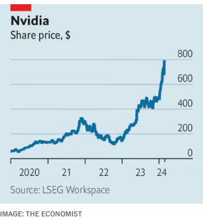  

#### 1.3 [KAL’s cartoon](https://www.economist.com/the-world-this-week/2024/02/29/kals-cartoon)
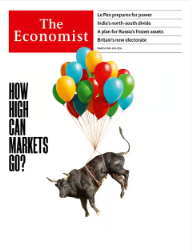  

#### 1.4 _The world this week:_ [This week’s covers](https://www.economist.com/the-world-this-week/2024/02/29/this-weeks-covers)  
How we saw the world  

### 2. Leaders
#### 2.1 _Leaders | Voting intentions:_ [How to build a British voter](https://www.economist.com/leaders/2024/02/28/how-to-build-a-british-voter)  
Labour is assembling an electoral coalition that is young and broad, but volatile too  

#### 2.2 _Leaders | How high can markets go?:_ [A golden age for stockmarkets is drawing to a close](https://www.economist.com/leaders/2024/02/29/stocks-are-booming-but-their-golden-age-is-drawing-to-a-close)  
Share prices may be surging, but even AI is unlikely to drive a repeat of the past decade’s performance  

#### 2.3 _Leaders | A losing battle:_ [Fentanyl cannot be defeated without new tactics](https://www.economist.com/leaders/2024/02/29/fentanyl-cannot-be-defeated-without-new-tactics)  
Suppression works even less well than with other narcotics  
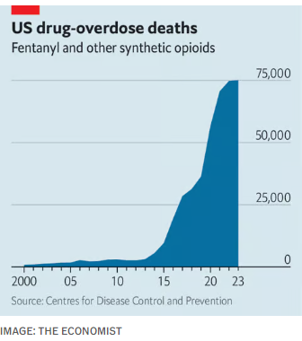  

#### 2.4 _Leaders | French politics:_ [The perils of a Le Pen presidency](https://www.economist.com/leaders/2024/02/26/the-perils-of-a-le-pen-presidency)  
Even three years out, the prospect is alarming  

#### 2.5 _Leaders | Don’t seize: capitalise:_ [How to put Russia’s frozen assets to work for Ukraine](https://www.economist.com/leaders/2024/02/28/how-to-put-russias-frozen-assets-to-work-for-ukraine)  
Exploit them to the full, but legally  
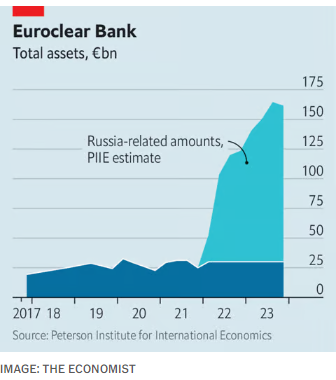  

#### 2.6 _Leaders | One nation under Modi:_ [To see India’s future, go south](https://www.economist.com/leaders/2024/02/29/india-could-be-ruined-by-its-political-and-economic-divisions)  
The country’s regional division could make it—or break it  

#### 2.7 _Leaders | How tyranny travels :_ [Autocracies are exporting autocracy to their diasporas](https://www.economist.com/leaders/2024/02/29/autocracies-are-exporting-autocracy-to-their-diasporas)  
The new danger from transnational repression  

### 3. Letters
#### 3.1 _Letters | On Britain’s armed forces, cousins, business in Italy, private-equity backed insurance, age, Terry Pratchett:_ [Letters to the editor](https://www.economist.com/letters/2024/02/29/letters-to-the-editor)  
A selection of correspondence  

### 4. By Invitation
#### 4.1 _By Invitation | Russia after Navalny:_ [A former political prisoner on how the West should honour Alexei Navalny’s legacy](https://www.economist.com/by-invitation/2024/02/29/a-former-political-prisoner-on-how-the-west-should-honour-alexei-navalnys-legacy)  
It needs to rediscover its concern for Russian dissidents, argues Natan Sharansky  

#### 4.2 _By Invitation | India’s election:_ [Ashoka Mody argues that India is stunted by a lack of moral leadership](https://www.economist.com/by-invitation/2024/02/28/ashoka-mody-argues-that-india-is-stunted-by-a-lack-of-moral-leadership)  
It needs better politicians and a more civic culture, says the academic  

### 5. Briefing
#### 5.1 _Briefing | Relentless reaper:_ [America’s ten-year-old fentanyl epidemic is still getting worse](https://www.economist.com/briefing/2024/02/29/americas-ten-year-old-fentanyl-epidemic-is-still-getting-worse)  
The government is spending record amounts, just to slow its growth  
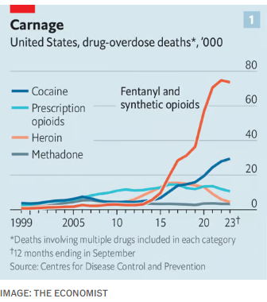  
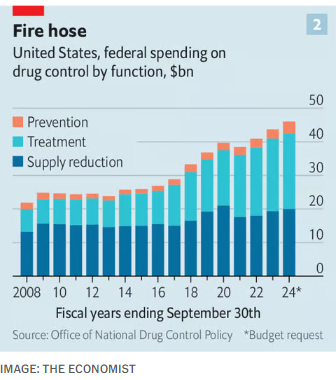  
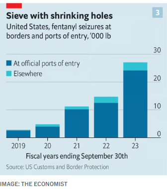  

### 6. Europe
#### 6.1 _Europe | France’s National Rally:_ [How Marine Le Pen is preparing for power](https://www.economist.com/europe/2024/02/25/how-marine-le-pen-is-preparing-for-power)  
The party has its eyes not on protest but on the presidency  

#### 6.2 _Europe | Friendly fire:_ [France and Germany are at loggerheads over military aid to Ukraine](https://www.economist.com/europe/2024/02/29/france-and-germany-are-at-loggerheads-over-military-aid-to-ukraine)  
A summit in France made things worse  
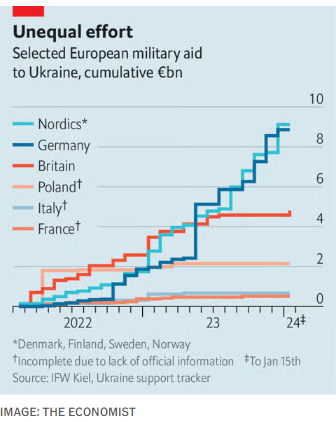  

#### 6.3 _Europe | Get off the fence:_ [Europe hopes barbed wire will keep migrants out. It won’t](https://www.economist.com/europe/2024/02/29/europe-hopes-barbed-wire-will-keep-migrants-out-it-wont)  
Politicians feel compelled to respond to voters’ concerns  
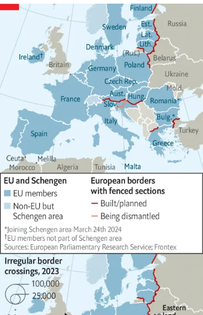  

#### 6.4 _Europe | After the war :_ [Azerbaijan is racing to rebuild in recaptured Nagorno-Karabakh](https://www.economist.com/europe/2024/02/29/azerbaijan-is-racing-to-rebuild-in-recaptured-nagorno-karabakh)  
Exiled Azeris are returning  

#### 6.5 _Europe | Within range:_ [Kharkiv is struggling under Russian rocket attacks](https://www.economist.com/europe/2024/02/26/kharkiv-is-struggling-under-russian-rocket-attacks)  
A border region liberated by Ukraine’s army faces a new onslaught  
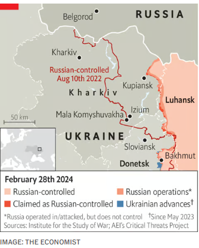  

#### 6.6 _Europe | Charlemagne:_ [Is Europe’s stubby skyline a sign of low ambition?](https://www.economist.com/europe/2024/02/28/is-europes-lack-of-skyscapers-a-blessing-or-a-sign-of-deficient-ambition)  
Only seven of the world’s 1,000 tallest buildings are in the EU  

### 7. Britain
#### 7.1 _Britain | Psephological profiling:_ [A changing British electorate is propelling Labour towards victory](https://www.economist.com/britain/2024/02/28/a-changing-british-electorate-is-propelling-labour-towards-victory)  
Our data shows that the party is forging a remarkably broad electoral coalition  
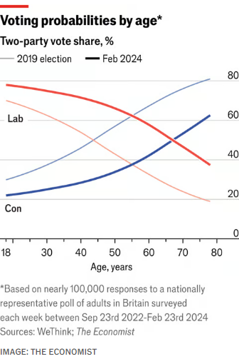  
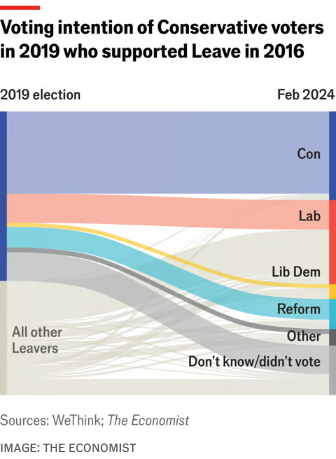  

#### 7.2 _Britain | Own goals:_ [English football’s financial fracas](https://www.economist.com/britain/2024/02/29/english-footballs-financial-fracas)  
Financial-sustainability rules have caused an almighty mess in the Premier League  
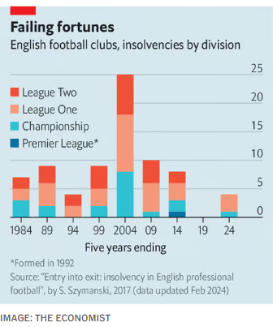  
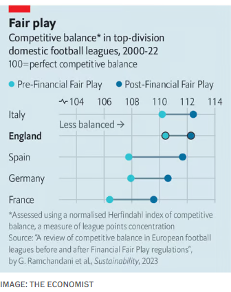  
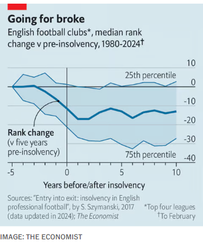  

#### 7.3 _Britain | Local politics :_ [The institution that taught Margaret Thatcher about politics](https://www.economist.com/britain/2024/02/29/the-institution-that-taught-margaret-thatcher-about-politics)  
Grantham town council, of course—what else?  

#### 7.4 _Britain | Just add water:_ [More than half of Britain’s ponds have disappeared](https://www.economist.com/britain/2024/02/27/more-than-half-of-britains-ponds-have-disappeared)  
But “ghost” wetlands can be resuscitated  

#### 7.5 _Britain | Bagehot:_ [Speaker Hoyle and the strange politics of human resources](https://www.economist.com/britain/2024/02/26/speaker-hoyle-and-the-strange-politics-of-human-resources)  
A concern with MPs’ well-being scuppers a crucial debate  

### 8. United States
#### 8.1 _United States | In vitro veritas:_ [IVF is a slam-dunk issue for Democrats. Abortion may not be](https://www.economist.com/united-states/2024/02/28/ivf-is-a-slam-dunk-issue-for-democrats-abortion-not-necessarily)  
The Democratic Party is so giddy about Alabama’s daft court ruling that it risks overlooking its own vulnerabilities  

#### 8.2 _United States | Stoked:_ [The economics of skiing in America](https://www.economist.com/united-states/2024/02/27/the-economics-of-skiing-in-america)  
How monopoly and price discrimination are transforming an industry  

#### 8.3 _United States | Commitment phobia:_ [Does Joe Biden’s re-election campaign have a Gaza problem?](https://www.economist.com/united-states/2024/02/29/does-joe-bidens-re-election-campaign-have-a-gaza-problem)  
The Michigan result would make Donald Trump president if it’s repeated in November  

#### 8.4 _United States | Answers that raise questions:_ [Is Google’s Gemini chatbot woke by accident, or by design?](https://www.economist.com/united-states/2024/02/28/is-googles-gemini-chatbot-woke-by-accident-or-design)  
The tech giant’s new artificial-intelligence model invents black Vikings and Asian popes  

#### 8.5 _United States | Cobalt blues :_ [A millennial is building America’s first nickel-cobalt refinery](https://www.economist.com/united-states/2024/02/29/a-millennial-is-building-americas-first-nickel-cobalt-refinery)  
But it’s proving ethically trickier than she expected  

#### 8.6 _United States | Lexington:_ [Vladimir Putin hardly needs to interfere in American democracy ](https://www.economist.com/united-states/2024/02/29/vladimir-putin-hardly-needs-to-interfere-in-american-democracy)  
Domestic politicians are happy to spread dysfunction on their own  

### 9. Middle East & Africa
#### 9.1 _Middle East and Africa | Dreaming of Dubai:_ [Africa’s tiger economy is shot](https://www.economist.com/middle-east-and-africa/2024/02/29/africas-tiger-economy-is-shot)  
Abiy Ahmed has big dreams for Ethiopia. Reality is far harsher  
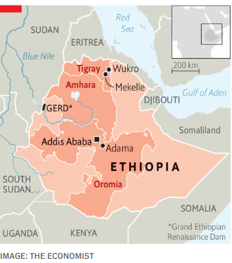  

#### 9.2 _Middle East and Africa | Fresh blood, same problems:_ [The Palestinians’ new prime minister faces a nightmare](https://www.economist.com/middle-east-and-africa/2024/02/26/the-palestinians-new-prime-minister-faces-a-nightmare)  
The PA says it is preparing for an “emerging reality” in Gaza  

#### 9.3 _Middle East and Africa | The beginning of the end:_ [As Iran scares the Middle East, at home its regime rots](https://www.economist.com/middle-east-and-africa/2024/02/28/as-iran-scares-the-middle-east-at-home-its-regime-rots)  
Iran’s phoney elections show how the clerics have lost public support  

### 10. The Americas
#### 10.1 _The Americas | Bringing back Brazil:_ [Lula’s gaffes are dulling Brazil’s G20 shine](https://www.economist.com/the-americas/2024/02/27/lulas-gaffes-are-dulling-brazils-g20-shine)  
Its relationships with the West are healing. But Brazil has not decided what kind of country it will be  
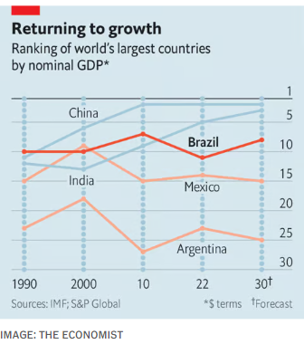  

#### 10.2 _The Americas | The switcheroo:_ [The former president of Honduras is tried for drug trafficking](https://www.economist.com/the-americas/2024/02/29/the-former-president-of-honduras-is-tried-for-drug-trafficking)  
Juan Orlando Hernández used to be a prominent ally in the US war on drugs  

#### 10.3 _The Americas | Kicking back:_ [Argentina’s football clubs are resisting privatisation](https://www.economist.com/the-americas/2024/02/29/argentinas-football-clubs-are-resisting-privatisation)  
Javier Milei wants to attract foreign money into ailing teams  
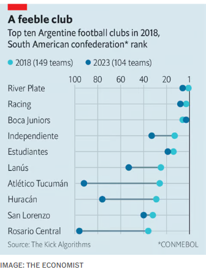  

### 11. Asia
#### 11.1 _Asia | India’s north-south divide:_ [Inside Narendra Modi’s battle to win over the south](https://www.economist.com/asia/2024/02/29/inside-narendra-modis-battle-to-win-over-the-south)  
Can the BJP woo the country’s richer, better-educated states?  
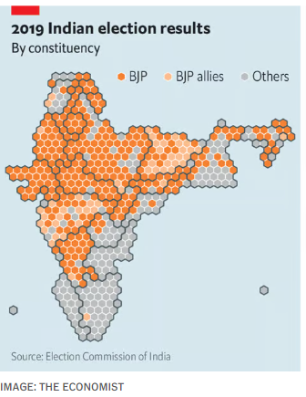  
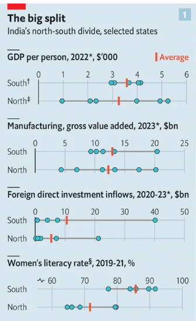  
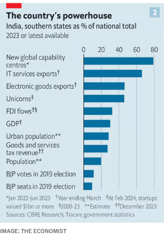  

#### 11.2 _Asia | The actual opposition?:_ [Massive farmers’ protests are a headache for Narendra Modi](https://www.economist.com/asia/2024/02/29/massive-farmers-protests-are-a-headache-for-narendra-modi)  
Even if the recent ones have been contained, discontent remains  

#### 11.3 _Asia | Banyan:_ [What will Prabowo Subianto’s foreign policy look like?](https://www.economist.com/asia/2024/02/29/what-will-prabowo-subiantos-foreign-policy-look-like)  
Indonesia’s new president wants his country to play a bigger role  

### 12. China
#### 12.1 _China | The Chinese diaspora:_ [Living outside China has become more like living inside China](https://www.economist.com/china/2024/02/26/living-outside-china-has-become-more-like-living-inside-china)  
The Communist Party is trying to tighten its grip on the Chinese diaspora  
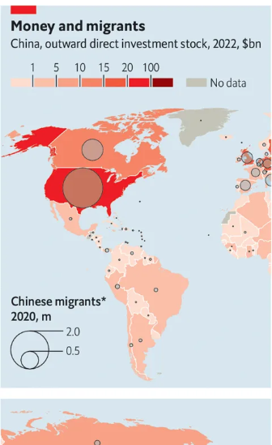  

#### 12.2 _China | Chaguan:_ [China tells bankers to be more patriotic](https://www.economist.com/china/2024/02/29/china-tells-bankers-to-be-more-patriotic)  
Financiers from 200 years ago are wheeled out as role models  

### 13. International
#### 13.1 _International | Surviving in a multipolar world:_ [Africa is juggling rival powers like no other continent ](https://www.economist.com/international/2024/02/28/africa-is-juggling-rival-powers-like-no-other-continent)  
African leaders need to balance vast opportunities against dire risks  
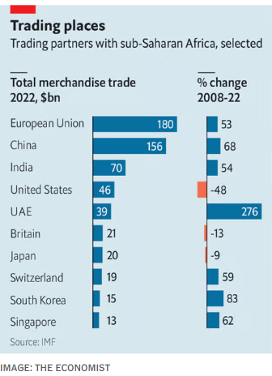  

### 14. Business
#### 14.1 _Business | Meet your new copilot:_ [How businesses are actually using generative AI](https://www.economist.com/business/2024/02/29/how-businesses-are-actually-using-generative-ai)  
Some experiments with chatbots are more useful than others  
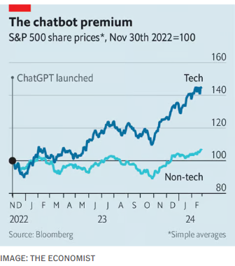  
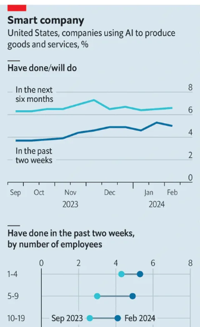  
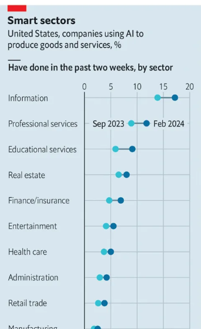  
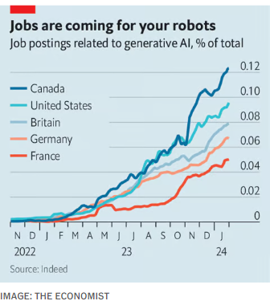  

#### 14.2 _Business | The meaning of Mistral :_ [Meet the French startup hoping to take on OpenAI](https://www.economist.com/business/2024/02/26/meet-the-french-startup-hoping-to-take-on-openai)  
Mistral unveils its latest large language model—and a deal with Microsoft  

#### 14.3 _Business | Divestment dilemmas:_ [Western multinationals’ Russian dilemmas](https://www.economist.com/business/2024/02/29/western-multinationals-russian-dilemmas)  
Staying in Russia carries risks. So does leaving  

#### 14.4 _Business | Bartleby:_ [Why you should lose your temper at work](https://www.economist.com/business/2024/02/29/why-you-should-lose-your-temper-at-work)  
Sometimes. And without throwing anything  

#### 14.5 _Business | Barrelling along :_ [Can whisky conquer Chinese palates?](https://www.economist.com/business/2024/02/29/can-whisky-conquer-chinese-palates)  
Western spirit pedlars think so  

#### 14.6 _Business | Motor no-shows:_ [Car shows in the West are in terminal decline](https://www.economist.com/business/2024/02/29/car-shows-in-the-west-are-in-terminal-decline)  
Chinese firms are keeping them on life support  

#### 14.7 _Business | Schumpeter:_ [How Argentine businessmen size up Javier Milei](https://www.economist.com/business/2024/02/29/how-argentine-businessmen-size-up-javier-milei)  
Is it time to invest in a spot of Malbec?  

### 15. Finance & economics
#### 15.1 _Finance and economics | Fly up to the sky :_ [Stockmarkets are booming. But the good times are unlikely to last](https://www.economist.com/finance-and-economics/2024/02/25/stockmarkets-are-booming-but-the-good-times-are-unlikely-to-last)  
Although AI is propelling valuations, there are deeper forces at work  
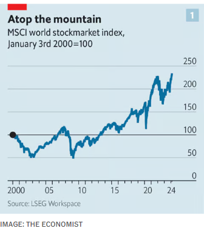  
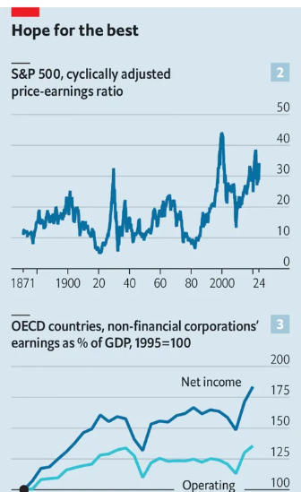  
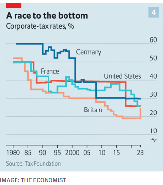  

#### 15.2 _Finance and economics | Too efficient:_ [Are passive funds to blame for market mania?](https://www.economist.com/finance-and-economics/2024/02/29/are-passive-funds-to-blame-for-market-mania)  
They have killed off many of those willing to bet on a downturn  
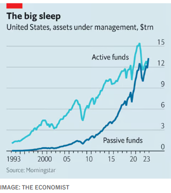  

#### 15.3 _Finance and economics | Stakeholders at the gate:_ [Activist investing is no longer the preserve of hedge-fund sharks](https://www.economist.com/finance-and-economics/2024/02/29/activist-investing-is-no-longer-the-preserve-of-hedge-fund-sharks)  
ExxonMobil and Starbucks are victims of the latest trend  

#### 15.4 _Finance and economics | Still coupled:_ [How Trump and Biden have failed to cut ties with China](https://www.economist.com/finance-and-economics/2024/02/27/how-trump-and-biden-have-failed-to-cut-ties-with-china)  
It is hard to overcome economic incentives  
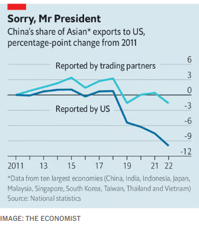  
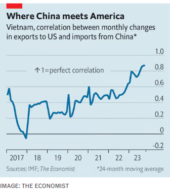  

#### 15.5 _Finance and economics | Buttonwood:_ [Uranium prices are soaring. Investors should be careful](https://www.economist.com/finance-and-economics/2024/02/29/uranium-prices-are-soaring-investors-should-be-careful)  
The metal has a history of meltdowns  

#### 15.6 _Finance and economics | Free exchange:_ [What do you do with 191bn frozen euros owned by Russia?](https://www.economist.com/finance-and-economics/2024/02/28/what-do-you-do-with-191bn-frozen-euros-owned-by-russia)  
The question that now confronts Western policymakers  

### 16. Science & technology
#### 16.1 _Science and technology | Silicon dreamin’:_ [AI models make stuff up. How can hallucinations be controlled?](https://www.economist.com/science-and-technology/2024/02/28/ai-models-make-stuff-up-how-can-hallucinations-be-controlled)  
It is hard to do so without also limiting models’ power  

#### 16.2 _Science and technology | A kiss and a cure:_ [Scientists want to tackle multiple sclerosis by treating the kissing virus](https://www.economist.com/science-and-technology/2024/02/28/scientists-want-to-tackle-multiple-sclerosis-by-treating-the-kissing-virus)  
Vaccines and antivirals are already undergoing trials  

#### 16.3 _Science and technology | At the heart of the battery revolution:_ [A variety of new batteries are coming to power EVs](https://www.economist.com/science-and-technology/2024/02/28/a-variety-of-new-batteries-are-coming-to-power-evs)  
All use different chemistries for cost or performance  

#### 16.4 _Science and technology | Your brain on music:_ [Why recorded music will never feel as good as the real thing](https://www.economist.com/science-and-technology/2024/02/28/why-recorded-music-will-never-feel-as-good-as-the-real-thing)  
The answer, according to neuroscience  

### 17. Culture
#### 17.1 _Culture | Money and the arts:_ [Britain’s arts still dazzle the world](https://www.economist.com/culture/2024/02/29/britains-arts-still-dazzle-the-world)  
But they are being diminished by a funding crisis  

#### 17.2 _Culture | Back Story:_ [“The Picture of Dorian Gray” points to the future of theatre](https://www.economist.com/culture/2024/02/29/the-picture-of-dorian-gray-points-to-the-future-of-theatre)  
A triumphant one-woman show relies on Sarah Snook, daring tech and your imagination  

#### 17.3 _Culture | An artist’s artist:_ [Why did a once-revered painter, Frans Hals, fall out of favour?](https://www.economist.com/culture/2024/02/29/why-did-a-once-revered-painter-frans-hals-fall-out-of-favour)  
A new show at the Rijksmuseum pays tribute to an often overlooked Dutch master  

#### 17.4 _Culture | Cartoon gloom:_ [“Palestine”, an old graphic novel, is making a comeback](https://www.economist.com/culture/2024/02/29/palestine-an-old-graphic-novel-is-making-a-comeback)  
Interest in Joe Sacco’s graphic novel is the highest it has been in 20 years  

#### 17.5 _Culture | Colour by numbers:_ [Can a dozen shipwrecks tell the history of the world?](https://www.economist.com/culture/2024/02/27/explaining-history-through-numerical-groupings-is-in-vogue)  
Historical listicles are in vogue  

#### 17.6 _Culture | Go big or go home:_ [Cinemas may be dying. But IMAX and the high end are thriving](https://www.economist.com/culture/2024/02/28/cinemas-may-be-dying-but-imax-and-the-high-end-are-thriving)  
IMAX’s success points to a growing niche in a shrinking industry  

### 18. The Economist reads
#### 18.1 _The Economist reads:_ [What to read to understand cyber-security](https://www.economist.com/the-economist-reads/2024/02/29/what-to-read-to-understand-cyber-security)  
In the cyberwars that rage across the digital realm, the aggressors have the advantage  

### 19. Economic & financial indicators
#### 19.1 [Economic data, commodities and markets](https://www.economist.com/economic-and-financial-indicators/2024/02/29/economic-data-commodities-and-markets)
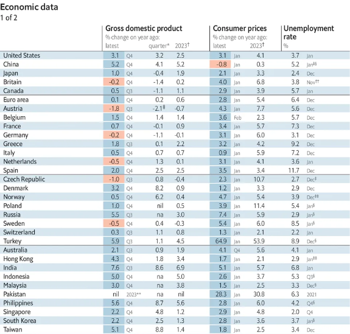  
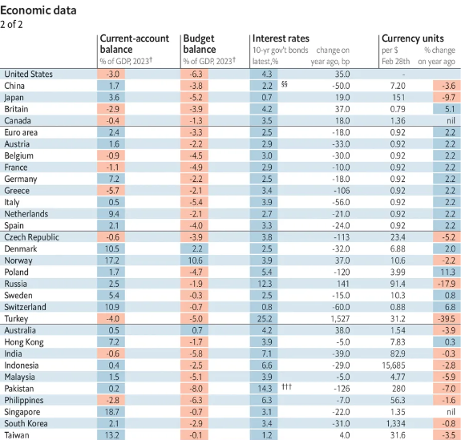  
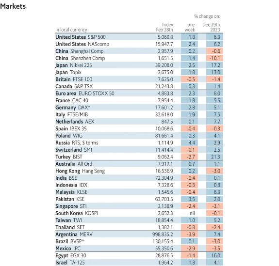  
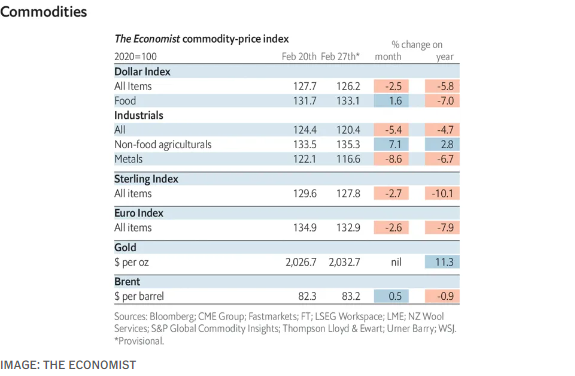  

### 20. Obituary
#### 20.1 _Obituary | His old enemy :_ [Robert Badinter persuaded France to abolish the guillotine](https://www.economist.com/obituary/2024/02/29/robert-badinter-persuaded-france-to-abolish-the-guillotine)  
The man who fought to abolish the death penalty in France died on February 9th, aged 95  

