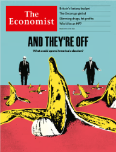

### 1. The world this week
#### 1.1 [Politics](https://www.economist.com/the-world-this-week/2024/03/07/politics)

#### 1.2 [Business](https://www.economist.com/the-world-this-week/2024/03/07/business)
  

#### 1.3 [KAL’s cartoon](https://www.economist.com/the-world-this-week/2024/03/07/kals-cartoon)
  

#### 1.4 _The world this week:_ [This week’s cover](https://www.economist.com/the-world-this-week/2024/03/07/this-weeks-cover)  
How we saw the world  

### 2. Leaders
#### 2.1 _Leaders | And they’re off:_ [Three big risks that might tip America’s presidential election](https://www.economist.com/leaders/2024/03/07/three-big-risks-that-might-tip-americas-presidential-election)  
Third parties, the Trump trials and the candidates’ age introduce a high degree of uncertainty  

#### 2.2 _Leaders | China’s National People’s Congress:_ [Xi Jinping’s hunger for power is hurting China’s economy](https://www.economist.com/leaders/2024/03/06/xi-jinpings-hunger-for-power-is-hurting-chinas-economy)  
A new economic plan won’t end deflation, even as he sidelines his prime minister  

#### 2.3 _Leaders | Jam today, ingredients tomorrow:_ [Britain’s budget cuts taxes on the promise of productivity gains](https://www.economist.com/leaders/2024/03/06/britains-budget-cuts-taxes-on-the-promise-of-productivity-gains)  
Jeremy Hunt has got it the wrong way round  

#### 2.4 _Leaders | Course correction:_ [How to fix the Ivy League](https://www.economist.com/leaders/2024/03/07/how-to-fix-the-ivy-league)  
Its supremacy is being undermined by bad leadership  

#### 2.5 _Leaders | The real skinny :_ [A frenzy of innovation in obesity drugs is under way](https://www.economist.com/leaders/2024/03/07/a-frenzy-of-innovation-in-obesity-drugs-is-under-way)  
Novo Nordisk and Eli Lilly are printing money now. But they will not be a stagnant duopoly  
  

### 3. Letters
#### 3.1 _Letters | On artificial intelligence, the Holocaust, national conservatives, Ukraine, history, investment advice:_ [Letters to the editor](https://www.economist.com/letters/2024/03/07/letters-to-the-editor)  
A selection of correspondence  

### 4. By Invitation
#### 4.1 _By Invitation | Finance and development:_ [Three presidents on how to make global finance work better for Africa](https://www.economist.com/by-invitation/2024/03/06/three-presidents-on-how-to-make-global-finance-work-better-for-africa)  
The continent needs a stronger voice and more help to help itself, say Nana Akufo-Addo, William Samoei Ruto and Hakainde Hichilema  

#### 4.2 _By Invitation | Britain’s fiscal fiction:_ [A former adviser on the 250 words Jeremy Hunt should read out at the budget](https://www.economist.com/by-invitation/2024/03/04/a-former-adviser-on-the-250-words-jeremy-hunt-should-read-out-at-the-budget)  
They would ensure that bad fiscal policy was bad politics, says Tim Leunig  

### 5. Briefing
#### 5.1 _Briefing | Spoilers:_ [Third-party candidates could be decisive in America’s election](https://www.economist.com/briefing/2024/03/07/third-party-candidates-could-tip-americas-presidential-election)  
But they have to get on the ballot first  

### 6. Britain
#### 6.1 _Britain | Briefcase encounter:_ [The British budget mixes sensible tinkering and fiscal fantasy](https://www.economist.com/britain/2024/03/06/the-british-budget-mixes-sensible-tinkering-and-fiscal-fantasy)  
Both the Tories and Labour are making promises they cannot keep  
  
  

#### 6.2 _Britain | Newbury’s finest:_ [Vodafone tries to slim its way back to health](https://www.economist.com/britain/2024/03/07/vodafone-tries-to-slim-its-way-back-to-health)  
At the start of the century, the British telco was worth more than Apple. What happened?  
  

#### 6.3 _Britain | Policing:_ [Rishi Sunak’s crackdown on protests is misguided](https://www.economist.com/britain/2024/03/05/rishi-sunaks-crackdown-on-protests-is-misguided)  
The British government calls it mob rule. Others know it as free speech  

#### 6.4 _Britain | Tough on puffs:_ [The holes in British plans to ban cigarettes and disposable vapes](https://www.economist.com/britain/2024/03/07/the-holes-in-british-plans-to-ban-cigarettes-and-disposable-vapes)  
One policy is contentious, the other stupid  
  

#### 6.5 _Britain | Unnatural selection:_ [Why on earth would anyone become a British MP? ](https://www.economist.com/britain/2024/03/04/why-on-earth-would-anyone-become-a-british-mp)  
Sanity, at least, is no longer a formal requirement. But watch out for the letterboxes   

#### 6.6 _Britain | Bagehot:_ [What the softening of the Sun says about Britain](https://www.economist.com/britain/2024/03/06/what-the-softening-of-the-sun-says-about-britain)  
Two-speed liberalisation remakes a tabloid newspaper  

### 7. Europe
#### 7.1 _Europe | Climate change:_ [Europe’s new-look winter: floods, high sea levels and melting glaciers](https://www.economist.com/europe/2024/03/04/europes-new-look-winter-floods-high-sea-levels-and-melting-glaciers)  
People are seeing extreme weather in action, but not voting to stop it  

#### 7.2 _Europe | On the wild side:_ [Ukraine’s animals are also victims of the war](https://www.economist.com/europe/2024/03/07/ukraines-animals-are-also-victims-of-the-war)  
Though foxes have thrived  

#### 7.3 _Europe | Abortion rules :_ [Why France has made abortion a constitutional right](https://www.economist.com/europe/2024/03/05/why-france-has-made-abortion-a-constitutional-right)  
Lessons from America and Poland  
  

#### 7.4 _Europe | General discomfort:_ [The damage done by Russia’s hack of Germany’s defence ministry](https://www.economist.com/europe/2024/03/06/the-damage-done-by-russias-hack-of-germanys-defence-ministry)  
Underlining Chancellor Scholz’s refusal to send long-range missiles to Ukraine  

#### 7.5 _Europe | Quick march:_ [Moving weapons around Europe fast is crucial for deterring Russia](https://www.economist.com/europe/2024/03/07/moving-weapons-around-europe-fast-is-crucial-for-deterring-russia)  
But progress is slow  
  

#### 7.6 _Europe | Charlemagne:_ [Fifty shades of brown: how splits in Europe’s hard right sap its power](https://www.economist.com/europe/2024/03/07/fifty-shades-of-brown-how-splits-in-europes-hard-right-sap-its-power)  
Divisions are a central feature of the populist right  

### 8. United States
#### 8.1 _United States | Brand Old Party:_ [Super Trump and his mighty MAGA machine](https://www.economist.com/united-states/2024/03/06/super-trump-and-his-mighty-maga-machine)  
After his Super Tuesday wins, Donald Trump moves swiftly to dominate the national Republican Party  

#### 8.2 _United States | Sleepy Tuesday:_ [Donald Trump wasn’t MAGA’s only winner on Super Tuesday](https://www.economist.com/united-states/2024/03/07/donald-trump-wasnt-magas-only-winner-on-super-tuesday)  
The Republicans’ populist wing also flexed its muscle in down-ballot races  
  

#### 8.3 _United States | Executive inaction:_ [Can Joe Biden bring order to the southern border without Congress?](https://www.economist.com/united-states/2024/03/07/can-joe-biden-bring-order-to-the-southern-border-without-congress)  
The president is boxed in on all sides  

#### 8.4 _United States | Words of warning:_ [Is New York rethinking its sanctuary-city status? ](https://www.economist.com/united-states/2024/03/07/is-new-york-rethinking-its-sanctuary-city-status)  
Its mayor casts doubt on a time-honoured policy  

#### 8.5 _United States | Celestial bodies:_ [A private company will send your ashes to the moon](https://www.economist.com/united-states/2024/03/07/a-private-company-will-send-your-ashes-to-the-moon)  
The Navajo Nation wants the feds to stop them  

#### 8.6 _United States | The WPATH files:_ [Leaked discussions reveal uncertainty about transgender care](https://www.economist.com/united-states/2024/03/05/leaked-discussions-reveal-uncertainty-about-transgender-care)  
The files shed light on a controversial area of medicine that has largely retreated into the shadows  

#### 8.7 _United States | Lexington:_ [Has Ron DeSantis gone too far in Florida?](https://www.economist.com/united-states/2024/03/07/has-ron-desantis-gone-too-far-in-florida)  
Believing he has overreached, Democrats plot a path back to relevance  

### 9. Middle East & Africa
#### 9.1 _Middle East and Africa | Bibi blues:_ [Joe Biden is exasperated by Israel but will not stop its war](https://www.economist.com/middle-east-and-africa/2024/03/05/joe-biden-is-exasperated-by-israel-but-will-not-stop-its-war)  
Facing mounting pressure at home and abroad, the president bets on a hostage deal  

#### 9.2 _Middle East and Africa | The war in Gaza:_ [Ramadan could see respite for Gaza, or widening violence](https://www.economist.com/middle-east-and-africa/2024/03/07/ramadan-could-see-respite-for-gaza-or-widening-violence)  
Mediators are hopeful of a truce during the holy month  

#### 9.3 _Middle East and Africa | Riding the CCM seesaw:_ [A lost opportunity to reform Tanzania](https://www.economist.com/middle-east-and-africa/2024/03/07/a-lost-opportunity-to-reform-tanzania)  
The country needs a constitutional overhaul. The ruling party stands in the way  

#### 9.4 _Middle East and Africa | Yesterday’s price is not today’s price:_ [Nigeria’s currency crisis is decades in the making](https://www.economist.com/middle-east-and-africa/2024/03/07/nigerias-currency-crisis-is-decades-in-the-making)  
Fixing it requires deep reform  
  

#### 9.5 _Middle East and Africa | Cryptocurrencies in Africa:_ [Why Africa is crypto’s next frontier ](https://www.economist.com/middle-east-and-africa/2024/03/07/why-africa-is-cryptos-next-frontier)  
Cheap power is fuelling a new sort of mining boom  

### 10. The Americas
#### 10.1 _The Americas | Lawless and disordered:_ [The last scraps of the Haitian state are evaporating](https://www.economist.com/the-americas/2024/03/07/the-last-scraps-of-the-haitian-state-are-evaporating)  
Rape, murder and theft have long been facts of life  

#### 10.2 _The Americas | The legacy of Lava Jato:_ [Corruption is surging across Latin America](https://www.economist.com/the-americas/2024/03/07/corruption-is-surging-across-latin-america)  
Political blowback from a period of intense anti-corruption campaigns is to blame  
  
  

### 11. Asia
#### 11.1 _Asia | Armed and autocratic:_ [North Korea is arming Russia and threatening war with South Korea](https://www.economist.com/asia/2024/03/05/north-korea-is-arming-russia-and-threatening-war-with-south-korea)  
Kim Jong Un likes to provoke. The risks of miscalculation are rising  
  

#### 11.2 _Asia | Stock and awe:_ [Why are so many Indians piling into stocks?](https://www.economist.com/asia/2024/03/07/why-are-so-many-indians-piling-into-stocks)  
The country is in the middle of an unprecedented retail-investment boom  
  

#### 11.3 _Asia | Banyan:_ [What the war in Ukraine means for Asia](https://www.economist.com/asia/2024/03/07/what-the-war-in-ukraine-means-for-asia)  
Peace in East Asia hangs to a worrying extent on the outcome of the conflict  

#### 11.4 _Asia | Too much butter, not enough chicken:_ [Indian food is great. Perhaps too great](https://www.economist.com/asia/2024/03/07/indian-food-is-great-perhaps-too-great)  
Long associated with hunger, India is now confronting an epidemic of obesity and lifestyle diseases  

### 12. China
#### 12.1 _China | Xi’s show:_ [China’s parliament is being used to highlight Xi Jinping’s power](https://www.economist.com/china/2024/03/07/chinas-parliament-is-being-used-to-highlight-xi-jinpings-power)  
The gathering reveals much about the woeful state of the country’s politics and economy  
  
  

#### 12.2 _China | Eyes in the sky :_ [China’s satellites are improving rapidly. Its army will benefit](https://www.economist.com/china/2024/03/07/chinas-satellites-are-improving-rapidly-the-pla-will-benefit)  
Watch out, American warships  
  
  

#### 12.3 _China | Chaguan :_ [Why China’s confidence crisis goes unfixed](https://www.economist.com/china/2024/03/07/why-chinas-confidence-crisis-goes-unfixed)  
In 2024, to acknowledge public gloom is to doubt Xi Jinping  

### 13. International
#### 13.1 _International | Poisoned Ivy:_ [America’s elite universities are bloated, complacent and illiberal ](https://www.economist.com/international/2024/03/04/americas-elite-universities-are-bloated-complacent-and-illiberal)  
To keep its competitive edge the Ivy League will have to change  
  
  
  

### 14. Business
#### 14.1 _Business | Slim pharma:_ [The battle over the trillion-dollar weight-loss bonanza](https://www.economist.com/business/2024/03/04/the-battle-over-the-trillion-dollar-weight-loss-bonanza)  
Novo Nordisk and Eli Lilly are making blockbuster drugs. Can they maintain their lead?  
  
  
  

#### 14.2 _Business | Nootropic kid on the block:_ [Brain-boosting substances are all the rage](https://www.economist.com/business/2024/03/07/brain-boosting-substances-are-all-the-rage)  
Their utility is debatable  

#### 14.3 _Business | The glass-ceiling index:_ [More women are getting onto corporate boards. Good](https://www.economist.com/business/2024/03/07/more-women-are-getting-onto-corporate-boards-good)  
Our annual measure of the role and influence of women in the workforce  
  

#### 14.4 _Business | Judgment day:_ [OpenAI’s legal battles are not putting off customers—yet](https://www.economist.com/business/2024/03/06/openais-legal-battles-are-not-putting-off-customers-yet)  
Elon Musk, the New York Times and trustbusters all want a piece of the startup  

#### 14.5 _Business | More than a headache:_ [Can Bayer recover from its chronic pain?](https://www.economist.com/business/2024/03/07/can-bayer-recover-from-its-chronic-pain)  
The Aspirin-maker is suffering from complications of its acquisition of Monsanto  
  

#### 14.6 _Business | Bartleby:_ [How can firms pass on tacit knowledge?](https://www.economist.com/business/2024/03/07/how-can-firms-pass-on-tacit-knowledge)  
The problem of knowing what your co-workers know  

#### 14.7 _Business | Schumpeter:_ [Apple is right not to rush headlong into generative AI](https://www.economist.com/business/2024/03/03/apple-is-right-not-to-rush-headlong-into-generative-ai)  
One day the Vision Pro could exploit the technology to the full  

### 15. Finance & economics
#### 15.1 _Finance and economics | Staring down the barrel:_ [Can Israel afford to wage war?](https://www.economist.com/finance-and-economics/2024/03/05/can-israel-afford-to-wage-war)  
As the battle continues, costs are spiralling  
  
  

#### 15.2 _Finance and economics | Back to the moon:_ [Bitcoin’s price is surging. What happens next?](https://www.economist.com/finance-and-economics/2024/03/06/bitcoins-price-is-surging-what-happens-next)  
The cryptocurrency is up by 63% this year  
  

#### 15.3 _Finance and economics | Another illusion:_ [Globalisation may not have increased income inequality, after all](https://www.economist.com/finance-and-economics/2024/03/07/globalisation-may-not-have-increased-income-inequality-after-all)  
A new study questions the received wisdom on trends within countries  

#### 15.4 _Finance and economics | Housing costs:_ [America’s rental-market mystery](https://www.economist.com/finance-and-economics/2024/03/07/americas-rental-market-mystery)  
And why it may deter the Federal Reserve from cutting interest rates  
  

#### 15.5 _Finance and economics | Urban economics:_ [The world is in the midst of a city-building boom](https://www.economist.com/finance-and-economics/2024/03/07/the-world-is-in-the-midst-of-a-city-building-boom)  
Everyone, from Donald Trump and Peter Thiel to Abdel Fattah el-Sisi, is getting involved  
  

#### 15.6 _Finance and economics | Buttonwood:_ [How investors get risk wrong](https://www.economist.com/finance-and-economics/2024/03/07/how-investors-get-risk-wrong)  
Contrary to popular wisdom, more volatile stocks do not outperform  

#### 15.7 _Finance and economics | Free exchange:_ [An economist’s guide to the luxury-handbag market](https://www.economist.com/finance-and-economics/2024/03/07/an-economists-guide-to-the-luxury-handbag-market)  
It is plagued by counterfeits—and information asymmetries  

### 16. Science & technology
#### 16.1 _Science and technology | Dancing in the dark:_ [Physicists are reimagining dark matter](https://www.economist.com/science-and-technology/2024/03/06/physicists-are-reimagining-dark-matter)  
There might be new particles, forces and perhaps even a Dark Big Bang  

#### 16.2 _Science and technology | Model baby:_ [Scientists can help fetuses by growing tiny replicas of their organs](https://www.economist.com/science-and-technology/2024/03/05/scientists-can-help-fetuses-by-growing-tiny-replicas-of-their-organs)  
They could be used to improve treatments in the womb  

#### 16.3 _Science and technology | Final countdown:_ [A new technique to work out a corpse’s time of death](https://www.economist.com/science-and-technology/2024/03/06/a-new-technique-to-work-out-a-corpses-time-of-death)  
AI could make the work of pathologists more accurate  

#### 16.4 _Science and technology | Advanced materials:_ [Graphene, a wondrous material, starts to prove useful](https://www.economist.com/science-and-technology/2024/03/06/how-medical-gloves-will-help-launch-satellites)  
It could help launch satellites  

### 17. Culture
#### 17.1 _Culture | Zones of interest:_ [Whoever gets the Best Picture Oscar, international films are winning](https://www.economist.com/culture/2024/03/07/whoever-gets-the-best-picture-oscar-international-films-are-winning)  
Hollywood’s growing love of foreign films says a lot about the insular industry  
  

#### 17.2 _Culture | Back Story :_ [Infatuation, kids, adultery: marriage is the theme of the Oscars](https://www.economist.com/culture/2024/03/07/infatuation-kids-adultery-marriage-is-the-theme-of-the-oscars)  
Together the nominees sketch a composite picture of marriage. Here it is  

#### 17.3 _Culture | And you call yourself civilised?:_ [The history of the West is not quite what you learned in school](https://www.economist.com/culture/2024/03/01/the-history-of-the-west-is-not-quite-what-you-learned-in-school)  
Josephine Quinn’s new book re-examines what people think they know about civilisations  

#### 17.4 _Culture | What’s in store?:_ [Museums have a hoarding problem](https://www.economist.com/culture/2024/03/07/museums-have-a-hoarding-problem)  
Museums’ moves highlight how little of their collections are actually on view  

#### 17.5 _Culture | Hillbilly elegies:_ [Stories about the Dongbei rust belt are resonant in China](https://www.economist.com/culture/2024/03/07/stories-about-the-dongbei-rust-belt-are-resonant-in-china)  
Noirish books, films and TV shows depicting hardship are popular  

#### 17.6 _Culture | No solitude:_ [Gabriel García Márquez’s novella was published against his wishes](https://www.economist.com/culture/2024/03/06/gabriel-garcia-marquezs-novella-was-published-against-his-wishes)  
“Until August” raises questions about authors’ consent and the literary afterlife  

### 18. The Economist reads
#### 18.1 _The Economist reads:_ [The best British political diaries](https://www.economist.com/the-economist-reads/2024/03/07/the-best-british-political-diaries)  
Five volumes full of wit, cattiness and insight into the workings of power  

### 19. Economic & financial indicators
#### 19.1 [Economic data, commodities and markets](https://www.economist.com/economic-and-financial-indicators/2024/03/07/economic-data-commodities-and-markets)
  
  
  
  

### 20. The Economist explains
#### 20.1 _The Economist explains:_ [What is Hindutva, the ideology of India’s ruling party?](https://www.economist.com/the-economist-explains/2024/03/07/what-is-hindutva-the-ideology-of-indias-ruling-party)  
It seeks to equate Indianness with Hinduism  

#### 20.2 _The Economist explains:_ [Does generative artificial intelligence infringe copyright?](https://www.economist.com/the-economist-explains/2024/03/02/does-generative-artificial-intelligence-infringe-copyright)  
Several lawsuits, one brought by the New York Times, could soon answer the question  

### 21. Obituary
#### 21.1 _Obituary | Age and magnificence:_ [Iris Apfel became a fashion icon in her ninth decade](https://www.economist.com/obituary/2024/03/06/iris-apfel-became-a-fashion-icon-in-her-ninth-decade)  
No geriatric nonsense was going to hold her back  

