```{r xaringan-themer, include=FALSE, warning=FALSE}
library(xaringanthemer)
style_mono_accent(
  base_color =  "#8CA88E", #"#1c5253", "#C8102E"
  header_font_google = google_font("Josefin Sans"),
  text_font_google   = google_font("Montserrat", "300", "300i"),
  code_font_google   = google_font("Fira Mono"),
  text_bold_color = "#000000", 
  text_color = "#000000"
)
```

```{r xaringan-panelset, echo=FALSE, include=FALSE, warning=FALSE}
xaringanExtra::use_panelset()
```
```{r xaringan-tile-view, echo=FALSE, include=FALSE, warning=FALSE}
xaringanExtra::use_tile_view()
```


```{r global options, include=FALSE, warning=FALSE}
knitr::opts_chunk$set(#fig.path='Figs/', #fig.width=12, fig.height=8, 
                      echo=FALSE, warning=FALSE, message=FALSE,
                      out.extra = 'style="display:block; margin:auto;"')

setwd("C:\\Users\\fo06mafa\\Documents\\AuthenticApplications")

library(ggplot2)
library(RColorBrewer)
library(ggpubr)
library(reshape)
library(tikzDevice)
library(plyr)
library(dplyr)
library(gtable)
library(grid)
library(gridExtra)
library(cowplot)
library(caroline)
library(ggpmisc)
library(tidyr)
library(plotly)
library(tidyquant)
library(lfe)
library(sjPlot)
library(sjmisc)
library(sjlabelled)
library(arsenal)
library(knitr)
library(GGally)
library(tufte)

reverse_legend_labels <- function(plotly_plot) {
  n_labels <- length(plotly_plot$x$data)
  plotly_plot$x$data[1:n_labels] <- plotly_plot$x$data[n_labels:1]
  plotly_plot
}
```


```{r setup, include=FALSE}
library(knitr)
options(htmltools.dir.version = FALSE)
```

.center[
```{r, fig.asp=0.5, fig.width=16}
share_employers = readRDS(file = "..\\exhibits\\share_employers.RDS")
share_employers + theme_xaringan()
#ggplotly(share_employers)
```
.bullet[
(Source: [Career Builder Survey of 1,012 hiring and human resource managers, 2018](https://press.careerbuilder.com/2018-08-09-More-Than-Half-of-Employers-Have-Found-Content-on-Social-Media-That-Caused-Them-NOT-to-Hire-a-Candidate-According-to-Recent-CareerBuilder-Survey) )
]
]

---

## But
.center2[
.bullet-content[
> Although organizations use SM to assist in staffing decisions, such use is not well understood by researchers
> `r tufte::quote_footer('Roth et al, 2016')`  
]
]
---

# Research Questions

.center2[
.bullet-content[
How do application evaluators …  
1. react to less appealing SM content?  

2. react to candidates with mental health issues?  

3. contradictory info in SM and CV?  

4. a lack of an online presence?  
]
]

---

# Experimental Design

.center[
[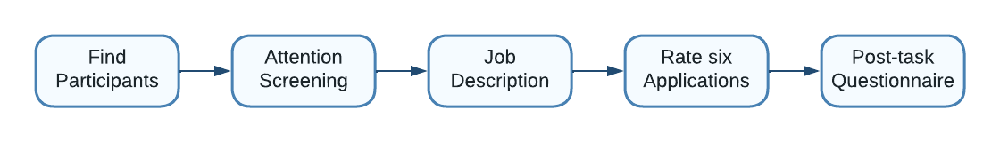](experimental_design.png)
]

---

# Experimental Design: Attention Screening

.center[
[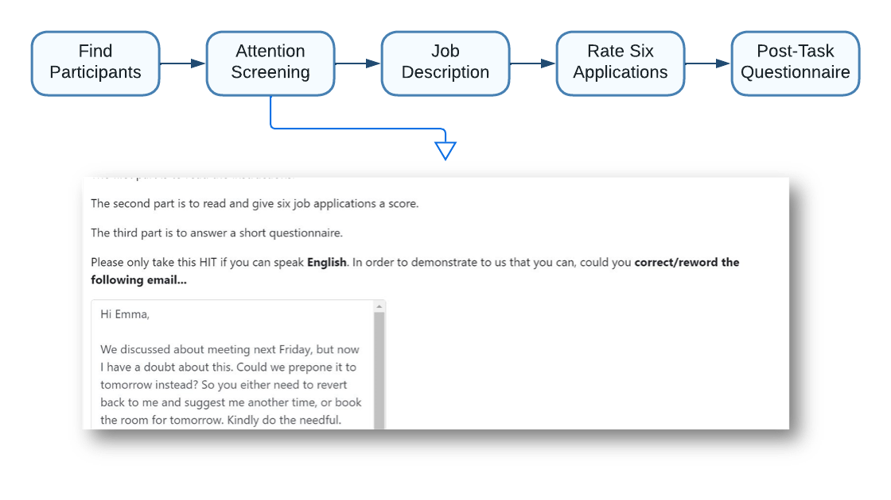](experimental_design2.png)
]

---

# Experimental Design: Job Description

.center[
[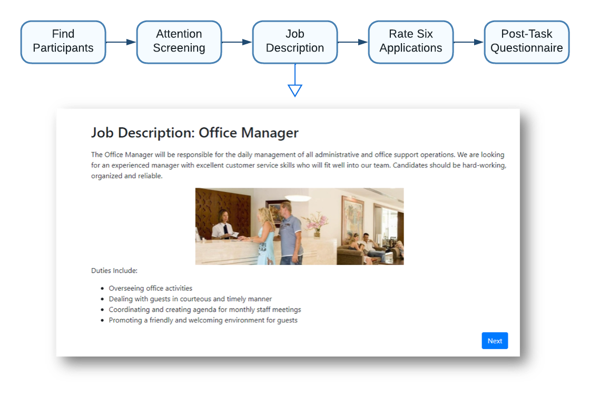](experimental_design3.png)
]

---

# Experimental Design: Applications

.center[
[](experimental_design4.png)
]

---

# Experimental Design: Questionnaire

.center[
[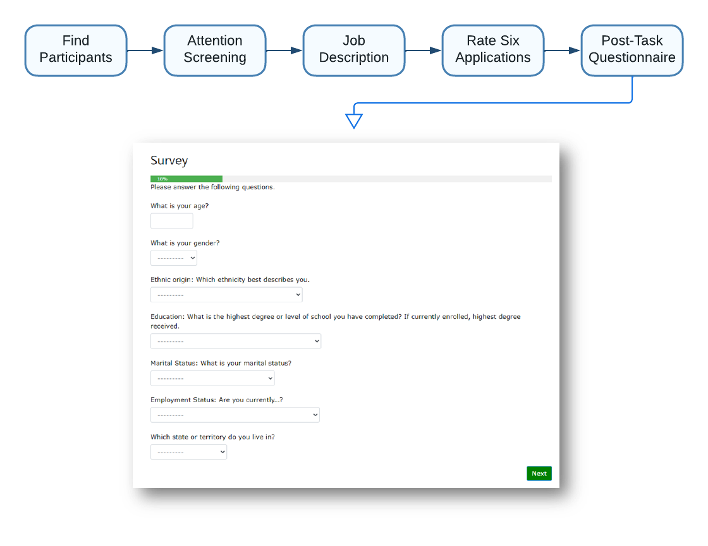](experimental_design5.png)
]

---

# Applications: The CV
.center[
[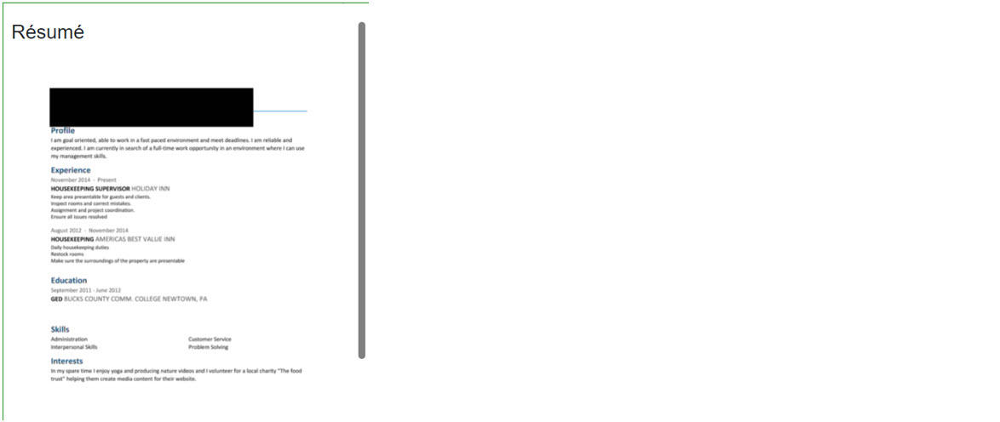](applications_cv.jpg)
]

---
# Applications: The SM
.center[
[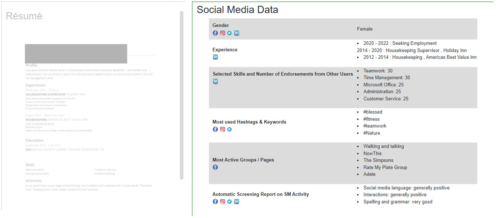](applications_sm.jpg)
]

---
# Treatment 1: 'Bad'
.center[
[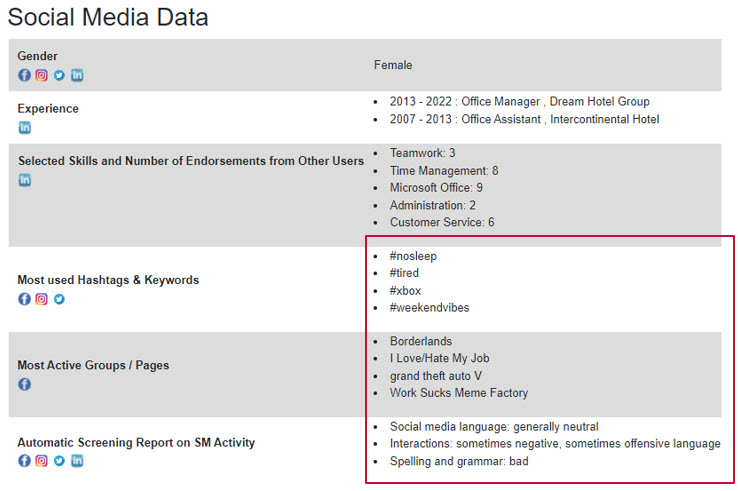](treatment_bad.jpg)
]

---
# Treatment 2: Mental Health
.center[
[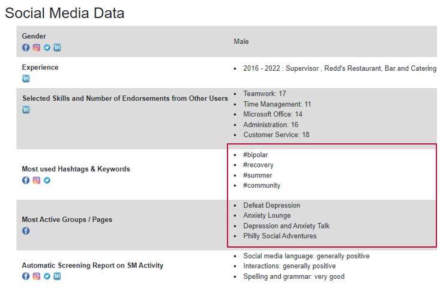](treatment_mental_health.jpg)
]

---
# Treatment 3: Gap
.center[
[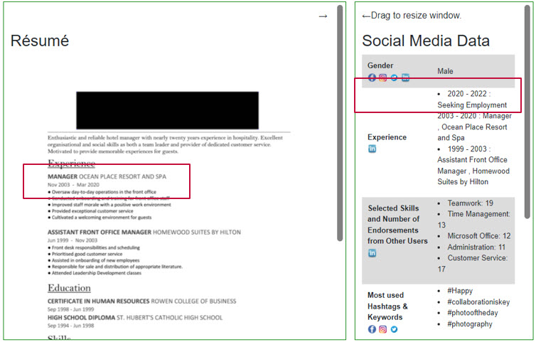](treatment_gap.jpg)
]

---
# Treatment 4: Gap + Lie
.center[
[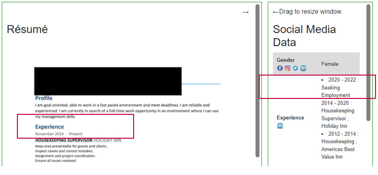](treatment_gap_lie.jpg)
]

---
# Treatment 5: No Social Media
.center[
[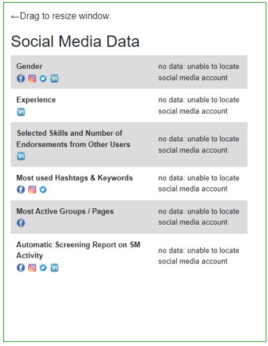](treatment_no_info.jpg)
]

---
# Results: Effort

.pull-left[
```{r, fig.asp=1, fig.width=6}
length_viewed_hist = readRDS(file = "..\\exhibits\\length_viewed_hist.RDS")
length_viewed_hist + theme_xaringan()

```
]
.pull-right[
```{r, fig.asp=1, fig.width=6}
notelegnth_hist = readRDS(file = "..\\exhibits\\notelegnth_hist.RDS")
notelegnth_hist + theme_xaringan()
```
]
---

# Results: Treatment Effects

.center[
```{r, fig.asp=0.5, fig.width=12}
linear_fitmodp_plot = readRDS(file = "..\\exhibits\\linear_fitmodp_plot.RDS")
linear_fitmodp_plot + theme_xaringan()
#ggplotly(linear_fitmodp_plot) %>% layout(legend = list(orientation = "h")) %>% reverse_legend_labels()
```
]

---


class: center, middle

# Thank You!  

