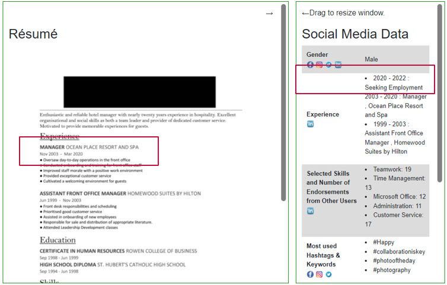
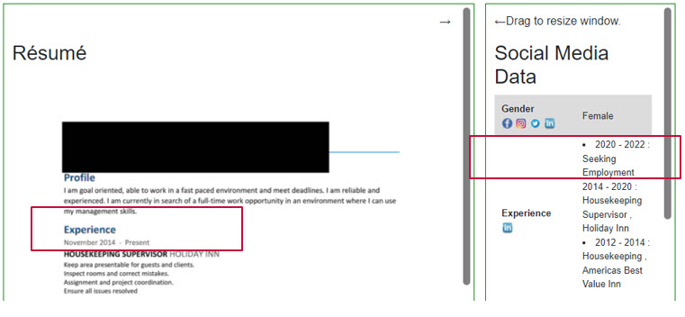

```{r xaringan-themer, include=FALSE, warning=FALSE}
library(xaringanthemer)
style_mono_accent(
  base_color =  "#8CA88E", #"#1c5253", "#C8102E"
  header_font_google = google_font("Josefin Sans"),
  text_font_google   = google_font("Montserrat", "300", "300i"),
  code_font_google   = google_font("Fira Mono"),
  text_bold_color = "#000000", 
  text_color = "#000000"
)
```

```{r xaringan-panelset, echo=FALSE, include=FALSE, warning=FALSE}
xaringanExtra::use_panelset()
```
```{r xaringan-tile-view, echo=FALSE, include=FALSE, warning=FALSE}
xaringanExtra::use_tile_view()
```


```{r global options, include=FALSE, warning=FALSE}
knitr::opts_chunk$set(#fig.path='Figs/', #fig.width=12, fig.height=8, 
                      echo=FALSE, warning=FALSE, message=FALSE,
                      out.extra = 'style="display:block; margin:auto;"')

setwd("C:\\Users\\fo06mafa\\Documents\\AuthenticApplications")

library(ggplot2)
library(RColorBrewer)
library(ggpubr)
library(reshape)
library(tikzDevice)
library(plyr)
library(dplyr)
library(gtable)
library(grid)
library(gridExtra)
library(cowplot)
library(caroline)
library(ggpmisc)
library(tidyr)
library(plotly)
library(tidyquant)
library(lfe)
library(sjPlot)
library(sjmisc)
library(sjlabelled)
library(arsenal)
library(knitr)
library(GGally)
library(tufte)

reverse_legend_labels <- function(plotly_plot) {
  n_labels <- length(plotly_plot$x$data)
  plotly_plot$x$data[1:n_labels] <- plotly_plot$x$data[n_labels:1]
  plotly_plot
}
```


```{r setup, include=FALSE}
library(knitr)
options(htmltools.dir.version = FALSE)
```

# Referneces

Acquisti, A. and Fong, C., 2020. An experiment in hiring discrimination via online social networks. Management Science, 66(3), pp.1005-1024.

Baert, S., 2018. Facebook profile picture appearance affects recruiters’ first hiring decisions. New Media & Society, 20(3), pp.1220-1239.

Becton, J.B., Walker, H.J., Gilstrap, J.B. and Schwager, P.H., 2019. Social media snooping on job applicants: The effects of unprofessional social media information on recruiter perceptions. Personnel Review.

Bohnert, D. and Ross, W.H., 2010. The influence of social networking web sites on the evaluation of job candidates. Cyberpsychology, Behavior, and Social Networking, 13(3), pp.341-347.

Kessler, J.B., Low, C. and Sullivan, C.D., 2019. Incentivized resume rating: Eliciting employer preferences without deception. American Economic Review, 109(11), pp.3713-44.

Roth, P.L., Bobko, P., Van Iddekinge, C.H. and Thatcher, J.B., 2016. Social media in employee-selection-related decisions: A research agenda for uncharted territory. Journal of management, 42(1), pp.269-298.

---
<iframe src="https://ourworldindata.org/grapher/technology-adoption-by-households-in-the-united-states?time=1930..2019&country=~Social+media+usage" loading="lazy" style="width: 100%; height: 600px; border: 0px none;"></iframe>
---

<iframe src="https://ourworldindata.org/grapher/users-by-social-media-platform?time=2004..latest&country=Facebook~Instagram~MySpace~Pinterest~Reddit~Snapchat~TikTok~Tumblr~Twitter~WeChat~Whatsapp~YouTube" loading="lazy" style="width: 100%; height: 600px; border: 0px none;"></iframe>

---


```{r, echo=F}
# All defaults
include_graphics("https://kinsta.com/wp-content/uploads/2018/10/linkedin-members-map.png")
```

.center[Linkedin has 310 MAUs and 740 million members. (Only 16M in DACH) ]

---


<iframe src="https://ourworldindata.org/grapher/daily-hours-spent-with-digital-media-per-adult-user?country=~USA" loading="lazy" style="width: 100%; height: 600px; border: 0px none;"></iframe>

---


<iframe src="https://www.pewresearch.org/internet/chart/which-social-media-platforms-are-most-popular/iframe/#chart" loading="lazy" style="width: 100%; height: 600px; border: 0px none;"></iframe> 		

---

# Social Media is a New Signal

.pull-left[
.bigtab[
<table>
  <tr>
    <th>Signals</th>
    <th>Costly?</th>
  </tr>
  <tr>
    <td>Education</td>
    <td>Costly</td>
  </tr>
  <tr>
    <td>Experience</td>
    <td>Costly</td>
  </tr>
  <tr>
    <td>CV</td>
    <td>Cheap</td>
  </tr>
  <tr>
    <td>Letters of Recommendation</td>
    <td>Cheap</td>
  </tr>
  <tr>
    <td>Interview</td>
    <td>?</td>
  </tr>
  <tr>
    <td>Clothing</td>
    <td>Cheap</td>
  </tr>
  <tr>
    <td>Assessment Tests</td>
    <td>Costly</td>
  </tr>
  <tr>
    <td>Personality Tests</td>
    <td>Cheap</td>
  </tr>
  <tr>
    <td>Social Media</td>
    <td>Costly</td>
  </tr>
</table>
]
]

.pull-right[
.center[
[](SM_Flowchart2.png)
]
]


---

## Literature
.bullet-content[
> Although organizations use SM to assist in staffing decisions, such use is not well understood by researchers
> `r tufte::quote_footer('Roth et al, 2016')`  

- Correspondence
  - Religion, sexual orientation (Acquisti and Fong, 2020)
  - Appearance (Baert, 2018)
  - Origin / Race (Manant, Pajak, and Soulie, 2019)

- Survey / Vignette
 - Alcohol (Becton et al., 2019; Bohnert and Ross, 2010) 
 - Self-absorption, opinionatedness, and alcohol and drug use (Tews, Stafford, and Kudler, 2020) 
]

---

# The Hiring Decision

.pull-left[
.center[
[](recruitment_process.png)
]
]
.pull-right[
.bullet-content[
- We focus on screening
  - sometimes outsourced  
  .small[(source: [Cappelli, P, (2019). Your Approach to Hiring Is All Wrong. Harvard Business Review, May/June 2019 pp 48–58](https://press.careerbuilder.com/2018-08-09-More-Than-Half-of-Employers-Have-Found-Content-on-Social-Media-That-Caused-Them-NOT-to-Hire-a-Candidate-According-to-Recent-CareerBuilder-Survey)]
  - rarely directly incentivised  
  .small[(source: [Hirshman, C, (2003). Incentives for Recruiters?. HR Magazine, Nov 2003](https://www.shrm.org/hr-today/news/hr-magazine/pages/1103hirschman.aspx))]
]
]

# Treatment Summary

**Baseline:** 
- CV varies according to experience, education, hobbies, gender, skills.  
- SM varies according to connections, most active groups, most used keywords & hashtags, automatic AI screening report. Hobbies and skills match CV.


<table>
  <tr>
    <th style = "border: solid 0px #DDEEEE;"></th>
    <th>Baseline</th>
    <th>Reasonable Bad</th>
    <th>Mental Health Issues</th>
    <th>No SM</th>
    <th>Gap</th>
    <th>Lie about Gap</th>
  </tr>
  <tr>
    <th>CV</th>
    <td>Normal</td>
    <td>Normal</td>
    <td>Normal</td>
    <td>Normal</td>
    <td>Employment Gap</td>
    <td>No Employment Gap</td>
  </tr>
  <tr>
    <th>Social Media</th>
    <td>Normal</td>
    <td>"bad" / inconsistent</td>
    <td>Mental Health Issues</td>
    <td>No Data</td>
    <td>Employment Gap</td>
    <td>Employment Gap</td>
  </tr>
</table>

---

# Treatment Mechanism

<table class = "beta">
  <tr>
    <th style = "border: solid 0px #DDEEEE;"></th>
    <th>Baseline</th>
    <th>Reasonable Bad</th>
    <th>Mental Health Issues </th>
  </tr>
  <tr>
    <th>Relevant Skills and Endorsements</th>
    <td>Teamwork: 26<br>Time Management: 9<br>Microsoft Office: 23<br>Administration: 25<br>Customer Service: 5</td>
    <td>Teamwork: 7<br>Time Management: 2<br>Microsoft Office: 9<br>Administration: 3<br>Customer Service: 1</td>
    <td>Baseline</td>
  </tr>
  <tr>
    <th>Most used Hashtags & Keywords</th>
    <td style = "column-count: 2;">#teamwork, <br>	#Nature, <br> #fitness, <br> #blessed, <br> #together, <br>	#Travel, <br> #life, <br> #music, <br> #collaborationiskey, <br>	#Happy, <br> #photooftheday, <br> #photography, <br> #thankyou, <br>	#selfie, <br> #funny, <br> #bestoftheday, <br> #community, <br>	#summer, <br> #art, <br> #style, <br> #teammate, <br>	#beautiful, <br> #food, <br> #sunset</td>
    <td style = "column-count: 2;">#tgif, <br> #weekendvibes, <br> #itsonlytuesday, <br> #tired, <br> #fuckmylife, <br> #nosleep, <br>  #party, <br> #happyhour, <br> #xbox, <br> #gaming, <br> #fortnite </td>
    <td style = "column-count: 2;">#therapy, <br> #bipolar, <br> #bipolardisorder, <br> #recovery</td>
  </tr>
  <tr>
    <th>Most Active Groups / Pages</th>
    <td style = "column-count: 2;">Walking and talking, <br>	NowThis, <br> Adele, <br> Rate My Plate, <br> Group, <br> The Simpsons, <br> The triangle hiking club, <br>	It's Gone Viral, <br> Will Smith, <br> STREET FOOD LOVE, <br> House, <br>  Philadelphia networking group, <br>	Chefclub, <br> vin Diesel, <br> Food & Wine, <br> The Big Bang Theory, <br> Being neighbourly: philadelphia, <br>	Tasty, <br> Taylor Swift, <br> Fine Cooking, <br> Game of Thrones, <br> Philly Social Adventures, <br>	Viral TRND, <br> Katy Perry, <br> Food52, <br> FRIENDS (TV Show), <br> Philadelphia roommates, <br>	Bored Panda, <br> Bruno Mars, <br> Cooking Light, <br> Greys Anatomy </td>
    <td style = "column-count: 2;">Work Sucks Meme Factory, <br>I Love/Hate My Job, <br>I Hate Monday Mornings, <br>grand theft auto V, <br>Call of Duty, <br>Super Smash Bros, <br>Pokemon Sword, <br>Monster Hunter World, <br>Diablo, <br>Borderlands
</td>
    <td style = "column-count: 2;">Defeat Depression, <br>Anxiety and Depression Support Group, <br>Depression and Anxiety Talk, <br>Anxiety Lounge, <br>Schizophrenia Support Group, <br>Bipolar disorder and Manic depression SUPPORT GROUP, <br>Positive Depression/Bipolar Happy Place</td>
  </tr>
  <tr>
    <th>Automatic Screening Report on SM Activity</th>
    <td><ul>
    <li>Social media language: generally positive </li>
    <li>Interactions: generally positive </li>
    <li> Spelling and grammar: very good </li>
    </ul></td>
    <td><ul>
    <li>Social media language: generally neutral </li>
    <li>Interactions: sometimes negative, sometimes offensive language </li>
    <li> Spelling and grammar: bad</li>
    </ul></td>
    <td>Baseline</td>
  </tr>
</table>

---

---

# Treatment 2: Mental Health
.center[
[](treatment_mental_health.jpg)
]

---
# Treatment 3: Gap
.center[
[](treatment_gap.jpg)
]

---
# Treatment 4: Gap + Lie
.center[
[](treatment_gap_lie.jpg)
]

---
# Treatment 5: No Social Media
.center[
[](treatment_no_info.jpg)
]


.pull-left[
# Results
```{r, fig.asp=1, fig.width=6}
CATE_hist = readRDS(file = "..\\exhibits\\CATE_hist.RDS")
CATE_hist + 
  theme(strip.text.y = element_blank(), 
        axis.text.y = element_text(size = 10),
        legend.text = element_text(size = 15),
        legend.title = element_text(size = 17))  + theme_xaringan()
```
]

.pull-right[
.testcal[
```{r echo = F, results="asis"}
testcalgaptab =  readRDS(file = "..\\forests\\testcalgaptab.RDS")
testcalgaptab
testcalgap_lietab =  readRDS(file = "..\\forests\\testcalgap_lietab.RDS")
testcalgap_lietab
testcalmental_healthtab =  readRDS(file = "..\\forests\\testcalmental_healthtab.RDS")
testcalmental_healthtab
testcalno_datatab =  readRDS(file = "..\\forests\\testcalno_datatab.RDS")
testcalno_datatab
testcalbadtab =  readRDS(file = "..\\forests\\testcalbadtab.RDS")
testcalbadtab
```
]
]

---
# Results: Mental Health

.pull-left[
Compare upper and lower quintiles of the CATE
.smalltab[
```{r echo = F, results="asis"}
tabCATEcompmental_health =  readRDS(file = "..\\exhibits\\tabCATEcompmental_health.RDS")
tabCATEcompmental_health
```
]
]

.pull-right[
Regress CATE on dependent variables
.smalltab[
```{r echo = F, results="asis"}
mental_health.blp.tab =  readRDS(file = "..\\forests\\mental_health.blp.tab.RDS")
mental_health.blp.tab
```
]
]
---
# Results: Mental Health

.center[
```{r, fig.asp=0.66, fig.width=9}
linear_libcon_mental_health_plot = readRDS(file = "..\\exhibits\\linear_libcon_mental_health_plot.RDS")
#ggplotly(linear_SM_active_no_data_plot) %>% layout(legend = list(orientation = "h")) %>% reverse_legend_labels()
linear_libcon_mental_health_plot + theme_xaringan()
```
]

---

# Results: No SM

.pull-left[
Compare upper and lower quintiles of the CATE
.smalltab[
```{r echo = F, results="asis"}
tabCATEcompno_data =  readRDS(file = "..\\exhibits\\tabCATEcompno_data.RDS")
tabCATEcompno_data
```
]
]


.pull-right[
Regress CATE on dependent variables
.smalltab[
```{r echo = F, results="asis"}
no_data.blp.tab =  readRDS(file = "..\\forests\\no_data.blp.tab.RDS")
no_data.blp.tab
```
]
]
---

# Results: No SM

.center[
```{r, fig.asp=0.66, fig.width=9}
linear_SM_active_no_data_plot = readRDS(file = "..\\exhibits\\linear_SM_active_no_data_plot.RDS")
#ggplotly(linear_SM_active_mental_health_plot) %>% layout(legend = list(orientation = "h")) %>% reverse_legend_labels()
linear_SM_active_no_data_plot + theme_xaringan()
```
]

---

# Results: 'Bad'
.pull-left[
Compare upper and lower quintiles of the CATE
.smalltab[
```{r echo = F, results="asis"}
tabCATEcompbad =  readRDS(file = "..\\exhibits\\tabCATEcompbad.RDS")
tabCATEcompbad
```
]
]
.pull-right[
Regress CATE on dependent variables
.smalltab[
```{r echo = F, results="asis"}
bad.blp.tab =  readRDS(file = "..\\forests\\bad.blp.tab.RDS")
bad.blp.tab
```
]
]
---

#Results: 'Bad'

.center[
```{r, fig.asp=0.66, fig.width=9}
linear_SMcontents_bad_plot = readRDS(file = "..\\exhibits\\linear_SMcontents_bad_plot.RDS")
#ggplotly(linear_SMcontents_bad_plot) %>% layout(legend = list(orientation = "h")) %>% reverse_legend_labels()
linear_SMcontents_bad_plot + theme_xaringan()
```
]
---

# Recruiters Do What They Say They Do

```{r, fig.asp=0.5, fig.width=12 }
trSMImp_lineplot = readRDS(file = "..\\exhibits\\trSMImp_lineplot.RDS") 
expEXpImp_lineplot = readRDS(file = "..\\exhibits\\expEXpImp_lineplot.RDS") 
educEducImp_lineplot = readRDS(file = "..\\exhibits\\educEducImp_lineplot.RDS") 
grid.arrange(trSMImp_lineplot, expEXpImp_lineplot, educEducImp_lineplot, ncol = 3)  

```
---

# Comparison with the US population
.smalltab[
```{r}
table_one.tidy = readRDS(file = "..\\exhibits\\table_one.tidy.RDS")
DT::datatable(
  table_one.tidy,
  fillContainer = FALSE, options = list(pageLength = 12)
)
```
]
---


## Supporting  Validity


.pull-left[
```{r, fig.asp=1, fig.width=6}
lengthViewed_tr_boxplot = readRDS(file = "..\\exhibits\\lengthViewed_tr_boxplot.RDS")
lengthViewed_tr_boxplot
```
]
.pull-right[
```{r, fig.asp=1, fig.width=6}
notelength_tr_boxplot = readRDS(file = "..\\exhibits\\notelength_tr_boxplot.RDS")
notelength_tr_boxplot
```
]
---


## Supporting  Validity
- People react as expected to the CVs, (more experience/education is better)

.pull-left[
```{r, fig.asp=1, fig.width=6}
exp_boxplot = readRDS(file = "..\\exhibits\\exp_boxplot.RDS")
exp_boxplot

```
]
.pull-right[
```{r, fig.asp=1, fig.width=6}
educ_boxplot = readRDS(file = "..\\exhibits\\educ_boxplot.RDS")
educ_boxplot
```
]
---


## SM information matters
```{r, fig.asp=0.5, fig.width=12}
tr_boxplot = readRDS(file = "..\\exhibits\\tr_boxplot.RDS")
tr_boxplot
```
---


.reduced2[
```{r}
linearModel_tr_tab1 = readRDS(file = "..\\exhibits\\linearModel_tr_tab1.RDS")
linearModel_tr_tab1
```
]
.pull-right2[
```{r,  fig.asp=1.01, fig.width=8}
linearModel_tr_plot1 = readRDS(file = "..\\exhibits\\linearModel_tr_plot1.RDS")
ggplotly(linearModel_tr_plot1) %>% layout(legend = list(orientation = "h")) %>% reverse_legend_labels()
```
]
---


.reduced[
```{r}
linearModel_tr_tab2 = readRDS(file = "..\\exhibits\\linearModel_tr_tab2.RDS")
linearModel_tr_tab2
```
]
.pull-right2[
```{r,  fig.asp=1.01, fig.width=8}
linearModel_tr_plot2 = readRDS(file = "..\\exhibits\\linearModel_tr_plot2.RDS")
ggplotly(linearModel_tr_plot2) %>% layout(legend = list(orientation = "h")) %>% reverse_legend_labels()
```
]
---


## Experience and SM Treatment
```{r, fig.asp=0.5, fig.width=12}
exp_tr_boxplot3 = readRDS(file = "..\\exhibits\\exp_tr_boxplot3.RDS")
exp_tr_boxplot3
```
---


.reduced3[
```{r}
linearModel_tr_tab3 = readRDS(file = "..\\exhibits\\linearModel_tr_tab3.RDS")
linearModel_tr_tab3
```
]
.pull-right3[
```{r,  fig.asp=0.85, fig.width=9.5}
linearModel_tr_plot3 = readRDS(file = "..\\exhibits\\linearModel_tr_plot3.RDS")
ggplotly(linearModel_tr_plot3) %>%layout(legend = list(orientation = "h")) %>% reverse_legend_labels()
```
]
---


## People who noticed gaps.
```{r, fig.asp=0.5, fig.width=12}
noticWorkExpInc_boxplot = readRDS(file = "..\\exhibits\\noticWorkExpInc_boxplot.RDS")
noticWorkExpInc_boxplot
```
---


## People who noticed health problems.
```{r, fig.asp=0.5, fig.width=12}
noticHealth_boxplot = readRDS(file = "..\\exhibits\\noticHealth_boxplot.RDS")
noticHealth_boxplot
```
---


## Age
```{r, fig.asp=0.5, fig.width=12}
ageMentalHelath_boxplot = readRDS(file = "..\\exhibits\\ageMentalHelath_boxplot.RDS")
ageMentalHelath_boxplot
```
---


## Conservatives
```{r, fig.asp=0.5, fig.width=12}
libConMentalHealth_boxplot = readRDS(file = "..\\exhibits\\libConMentalHealth_boxplot.RDS")
libConMentalHealth_boxplot
```
---


## Active on SM
```{r, fig.asp=0.5, fig.width=12}
SMActiveno_data_boxplot = readRDS(file = "..\\exhibits\\SMActiveno_data_boxplot.RDS")
SMActiveno_data_boxplot
```
---


## People who believe SM is a tool
```{r, fig.asp=0.5, fig.width=12}
potentialEmployersBad_boxplot = readRDS(file = "..\\exhibits\\potentialEmployersBad_boxplot.RDS")
potentialEmployersBad_boxplot
```
---


## People who believe SM is Important
```{r, fig.asp=0.5, fig.width=12}
SMContentBad_boxplot = readRDS(file = "..\\exhibits\\SMContentBad_boxplot.RDS")
SMContentBad_boxplot
```
---


## People who say SM is important use SM
```{r, fig.asp=0.5, fig.width=12}
trSMImp_lineplot = readRDS(file = "..\\exhibits\\trSMImp_lineplot.RDS")
trSMImp_lineplot
```
---


## People who say education is important use education
```{r, fig.asp=0.5, fig.width=12}
educEducImp_lineplot = readRDS(file = "..\\exhibits\\educEducImp_lineplot.RDS")
educEducImp_lineplot
```
---


## People who say experience is important use experience
```{r, fig.asp=0.5, fig.width=12}
expEXpImp_lineplot = readRDS(file = "..\\exhibits\\expEXpImp_lineplot.RDS")
expEXpImp_lineplot
```
---


.reduced3[
```{r}
BLP_tr_tab = readRDS(file = "..\\exhibits\\BLP_tr_tab.RDS")
BLP_tr_tab
```
]
.pull-right3[
```{r,  fig.asp=0.85, fig.width=9.5}
BLP_tr_plot = readRDS(file = "..\\exhibits\\BLP_tr_plot.RDS")
ggplotly(BLP_tr_plot) %>%layout(legend = list(orientation = "h")) %>% reverse_legend_labels()
```
]
---


.pull-left[
```{r, fig.asp=1.3, fig.width=7}
linearModel_tr_plot3 = readRDS(file = "..\\exhibits\\linearModel_tr_plot3.RDS")
ggplotly(linearModel_tr_plot3) %>%layout(legend = list(orientation = "h")) %>% reverse_legend_labels()
```
]
.pull-right[
```{r,  fig.asp=1.3, fig.width=7}
BLP_tr_plot = readRDS(file = "..\\exhibits\\BLP_tr_plot.RDS")
ggplotly(BLP_tr_plot) %>%layout(legend = list(orientation = "h")) %>% reverse_legend_labels()
```
]
---


```{r fig.asp=0.66, fig.width=12}
corr_plot = readRDS(file = "..\\exhibits\\corr_plot.RDS")
corr_plot
```
---


.reduced[
```{r}
tableby1 = readRDS(file = "..\\exhibits\\tableby1.RDS")
#tableby1 %>% kable()
```
]

---

## Education and SM Treatment
```{r, fig.asp=0.5, fig.width=12}
educ_tr_boxplot = readRDS(file = "..\\exhibits\\educ_tr_boxplot.RDS")
educ_tr_boxplot
```


---
## Some Feedback:

"I'm assuming that this is just a pool meant to limit to the next phase, interviews. I know I said that for some applicants they might need to get an office clerk position, but I would say make sure you contact them to ask them if you want to interview for those positions. Do anything else would be almost disrespectful, in my opinion."

"Hire my top pick.  Solid performer with all the right qualifications and expertise.  He has been in the industry close to two decades and will provide excellent results."

"Are these actual profiles of real people? How effective are the social media hashtags in determining behavio?"

"Was this for research or actual candidacy?" 


