```{r xaringan-themer, include=FALSE, warning=FALSE}
library(xaringanthemer)
style_mono_accent(
  base_color =  "#8CA88E", #"#1c5253", "#C8102E"
  header_font_google = google_font("Josefin Sans"),
  text_font_google   = google_font("Montserrat", "300", "300i"),
  code_font_google   = google_font("Fira Mono"),
  text_bold_color = "#000000", 
  text_color = "#000000"
)
```

```{r xaringan-panelset, echo=FALSE, include=FALSE, warning=FALSE}
xaringanExtra::use_panelset()
```
```{r xaringan-tile-view, echo=FALSE, include=FALSE, warning=FALSE}
xaringanExtra::use_tile_view()
```


```{r global options, include=FALSE, warning=FALSE}
knitr::opts_chunk$set(#fig.path='Figs/', #fig.width=12, fig.height=8, 
                      echo=FALSE, warning=FALSE, message=FALSE,
                      out.extra = 'style="display:block; margin:auto;"')

setwd("C:\\Users\\fo06mafa\\Documents\\AuthenticApplications")

library(ggplot2)
library(RColorBrewer)
library(ggpubr)
library(reshape)
library(tikzDevice)
library(plyr)
library(dplyr)
library(gtable)
library(grid)
library(gridExtra)
library(cowplot)
library(caroline)
library(ggpmisc)
library(tidyr)
library(plotly)
library(tidyquant)
library(lfe)
library(sjPlot)
library(sjmisc)
library(sjlabelled)
library(arsenal)
library(knitr)
library(GGally)

reverse_legend_labels <- function(plotly_plot) {
  n_labels <- length(plotly_plot$x$data)
  plotly_plot$x$data[1:n_labels] <- plotly_plot$x$data[n_labels:1]
  plotly_plot
}
```


<style>
table {

}
.beta th {
  font-size: 70%;
}
.beta td {
  font-size: 60%;
}
</style>

```{r setup, include=FALSE}
library(knitr)
options(htmltools.dir.version = FALSE)
```

<iframe src="https://ourworldindata.org/grapher/technology-adoption-by-households-in-the-united-states?time=1930..2019&country=~Social+media+usage" loading="lazy" style="width: 100%; height: 600px; border: 0px none;"></iframe>
---

# Social Media is a New Signal

.pull-left[
.bigtab[
<table>
  <tr>
    <th>Signals</th>
    <th>Costly?</th>
  </tr>
  <tr>
    <td>Education</td>
    <td>Costly</td>
  </tr>
  <tr>
    <td>Experience</td>
    <td>Costly</td>
  </tr>
  <tr>
    <td>CV</td>
    <td>Cheap</td>
  </tr>
  <tr>
    <td>Letters of Recommendation</td>
    <td>Cheap</td>
  </tr>
  <tr>
    <td>Interview</td>
    <td>?</td>
  </tr>
  <tr>
    <td>Clothing</td>
    <td>Cheap</td>
  </tr>
  <tr>
    <td>Assessment Tests</td>
    <td>Costly</td>
  </tr>
  <tr>
    <td>Personality Tests</td>
    <td>Cheap</td>
  </tr>
  <tr>
    <td>Social Media</td>
    <td>Costly</td>
  </tr>
</table>
]
]

.pull-right[
.center[
[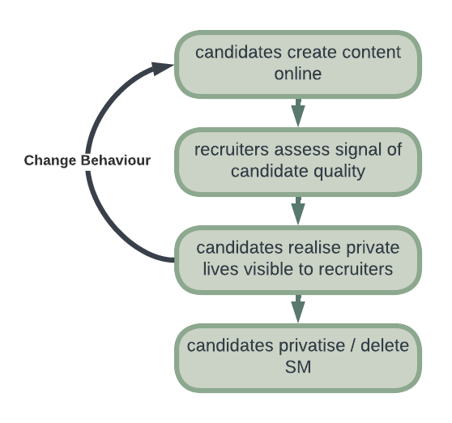](SM_Flowchart2.png)
]
]


---
.center[
[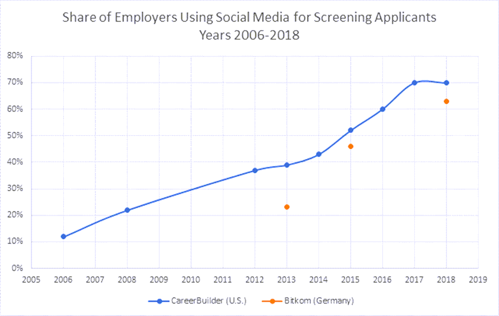](employers_use_sm.png)
]
.bullet[
(Source: [Career Builder Survey of 1,012 hiring and human resource managers, 2018](https://press.careerbuilder.com/2018-08-09-More-Than-Half-of-Employers-Have-Found-Content-on-Social-Media-That-Caused-Them-NOT-to-Hire-a-Candidate-According-to-Recent-CareerBuilder-Survey) )
]

---
# The Hiring Decision

.pull-left[
.center[
[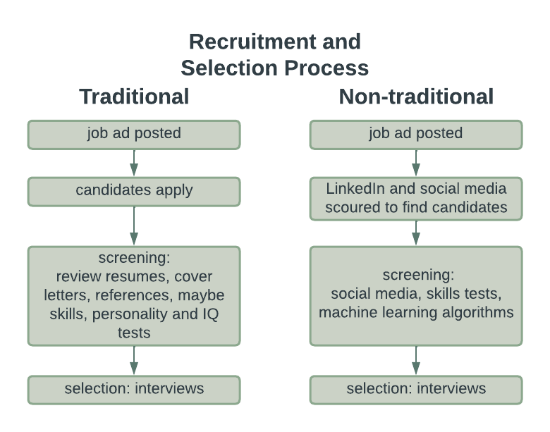](recruitment_process.png)
]
]
.pull-right[
.bullet-content[
- We focus on screening
  - sometimes outsourced  
  .small[(source: [Cappelli, P, (2019). Your Approach to Hiring Is All Wrong. Harvard Business Review, May/June 2019 pp 48–58](https://press.careerbuilder.com/2018-08-09-More-Than-Half-of-Employers-Have-Found-Content-on-Social-Media-That-Caused-Them-NOT-to-Hire-a-Candidate-According-to-Recent-CareerBuilder-Survey)]
  - rarely directly incentivised  
  .small[(source: [Hirshman, C, (2003). Incentives for Recruiters?. HR Magazine, Nov 2003](https://www.shrm.org/hr-today/news/hr-magazine/pages/1103hirschman.aspx))]
]
]

---

# Literature
.bullet-content[
- Correspondence/Audit
- Incentivized Resume Rating (Kessler, 2019)
- Theory
]

---

# Research Questions

.bullet-content[
1. How do recruiters weigh social media info compared to traditional CV info?

2. How do recruiters react to contradictory info in SM and CV?

3. Does revealing mental health issues on SM hinder a job applicant? 

4. Does a lack of online presence hinder a job applicant?
]

---
# Experimental Design

.center[
[](experimental_design.png)
]

---

# Experimental Design: Attention Screening

.center[
[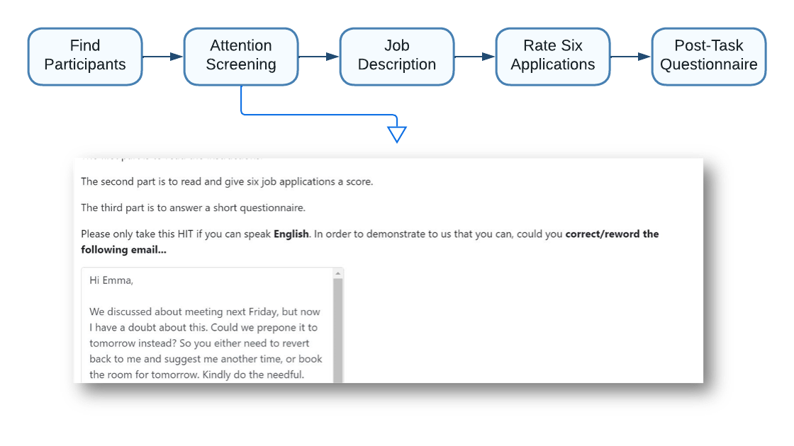](experimental_design2.png)
]

---

# Experimental Design: Job Description

.center[
[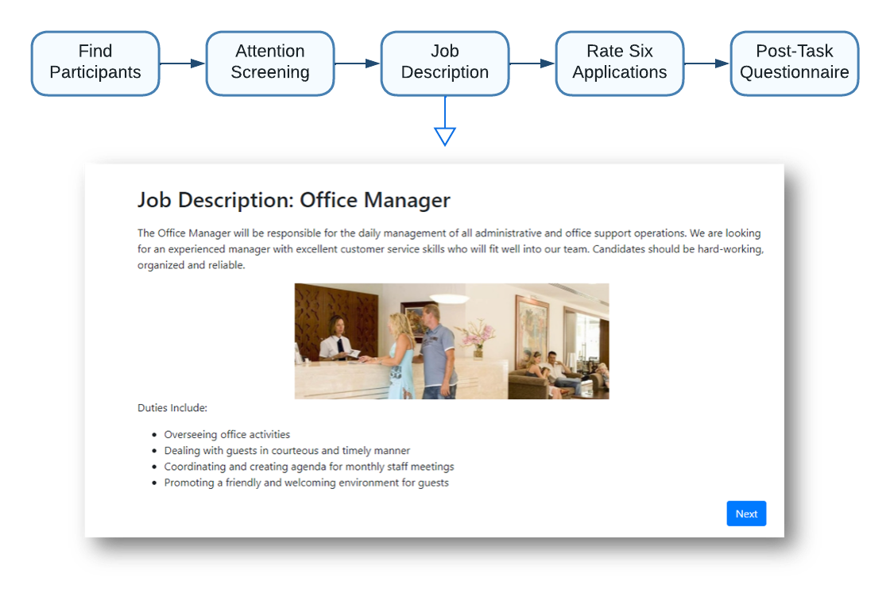](experimental_design3.png)
]

---

# Experimental Design: Applications

.center[
[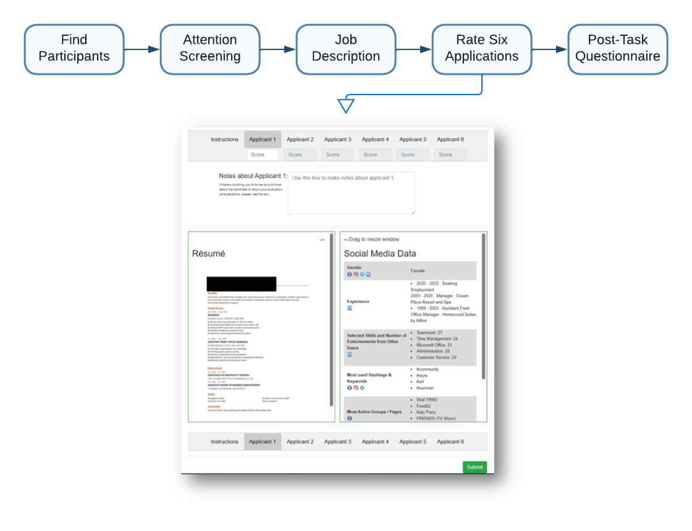](experimental_design4.png)
]

---

# Experimental Design: Questionnaire

.center[
[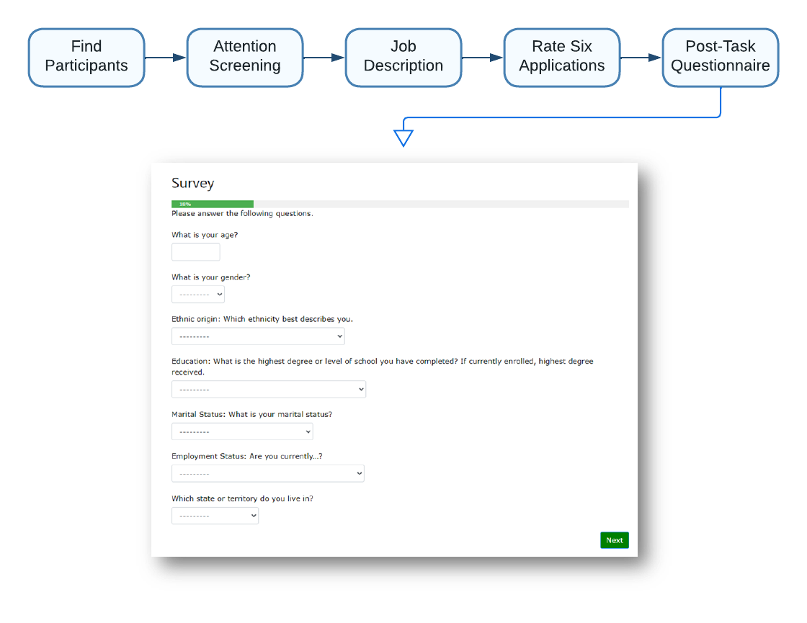](experimental_design5.png)
]

---

# Applications: The CV
.center[
[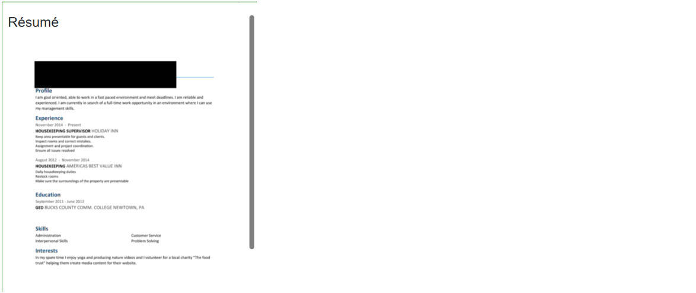](applications_cv.jpg)
]

---
# Applications: The SM
.center[
[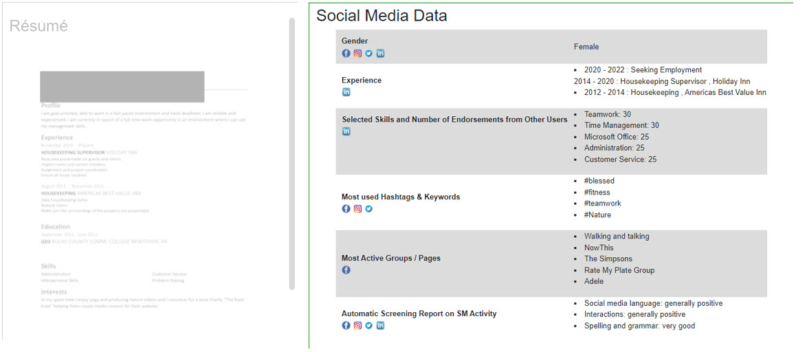](applications_sm.jpg)
]

---
# Treatment 1: 'Bad'
.center[
[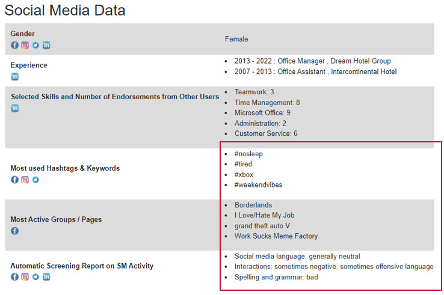](treatment_bad.jpg)
]

---
# Treatment 2: Mental Health
.center[
[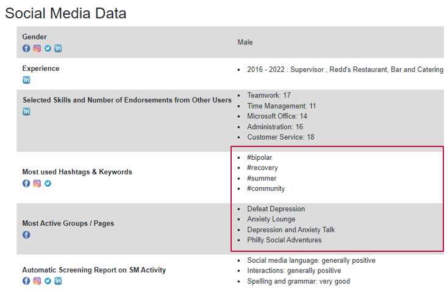](treatment_mental_health.jpg)
]

---
# Treatment 3: Gap
.center[
[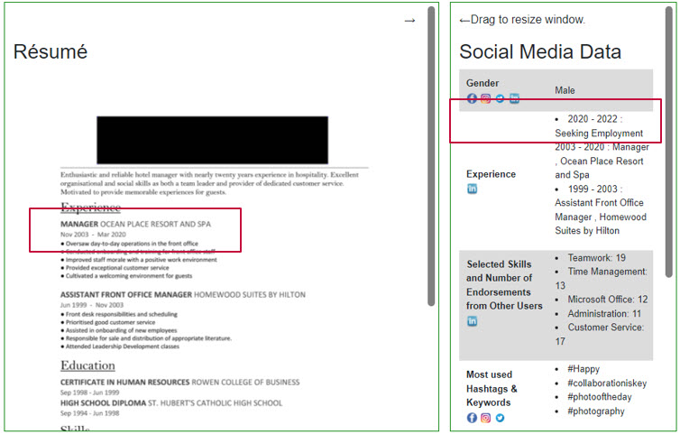](treatment_gap.jpg)
]

---
# Treatment 4: Gap + Lie
.center[
[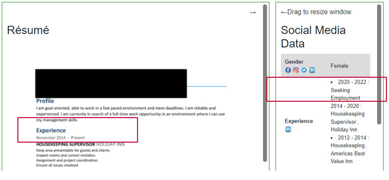](treatment_gap_lie.jpg)
]

---
# Treatment 5: No Social Media
.center[
[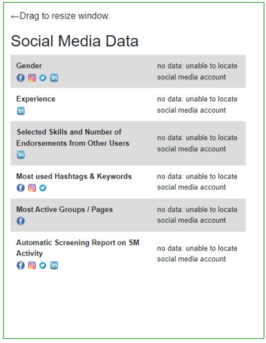](treatment_no_info.jpg)
]

---
# Results: Effort

.pull-left[
```{r, fig.asp=1, fig.width=6}
length_viewed_hist = readRDS(file = "..\\exhibits\\length_viewed_hist.RDS")
length_viewed_hist + theme_xaringan()

```
]
.pull-right[
```{r, fig.asp=1, fig.width=6}
notelegnth_hist = readRDS(file = "..\\exhibits\\notelegnth_hist.RDS")
notelegnth_hist + theme_xaringan()
```
]
---

# Results: Treatment Effects

.center[
```{r, fig.asp=0.66, fig.width=9}
linear_fitmodp_plot = readRDS(file = "..\\exhibits\\linear_fitmodp_plot.RDS")
linear_fitmodp_plot + theme_xaringan()
#ggplotly(linear_fitmodp_plot) %>% layout(legend = list(orientation = "h")) %>% reverse_legend_labels()
```
]

---
.pull-left[
# Results
```{r, fig.asp=1, fig.width=6}
CATE_hist = readRDS(file = "..\\exhibits\\CATE_hist.RDS")
CATE_hist + theme_xaringan()
```
]

.pull-right[
.testcal[
```{r echo = F, results="asis"}
testcalgaptab =  readRDS(file = "..\\forests\\testcalgaptab.RDS")
testcalgaptab
testcalgap_lietab =  readRDS(file = "..\\forests\\testcalgap_lietab.RDS")
testcalgap_lietab
testcalmental_healthtab =  readRDS(file = "..\\forests\\testcalmental_healthtab.RDS")
testcalmental_healthtab
testcalno_datatab =  readRDS(file = "..\\forests\\testcalno_datatab.RDS")
testcalno_datatab
testcalbadtab =  readRDS(file = "..\\forests\\testcalbadtab.RDS")
testcalbadtab
```
]
]

---
# Results: Mental Health

.pull-left[
Compare upper and lower quintiles of the CATE
.smalltab[
```{r echo = F, results="asis"}
tabCATEcompmental_health =  readRDS(file = "..\\exhibits\\tabCATEcompmental_health.RDS")
tabCATEcompmental_health
```
]
]

.pull-right[
Regress CATE on dependent variables
.smalltab[
```{r echo = F, results="asis"}
mental_health.blp.tab =  readRDS(file = "..\\forests\\mental_health.blp.tab.RDS")
mental_health.blp.tab
```
]
]
---
# Results: Mental Health

.center[
```{r, fig.asp=0.66, fig.width=9}
linear_SM_active_no_data_plot = readRDS(file = "..\\exhibits\\linear_SM_active_no_data_plot.RDS")
#ggplotly(linear_SM_active_no_data_plot) %>% layout(legend = list(orientation = "h")) %>% reverse_legend_labels()
linear_SM_active_no_data_plot + theme_xaringan()
```
]

---

# Results: No SM

.pull-left[
Compare upper and lower quintiles of the CATE
.smalltab[
```{r echo = F, results="asis"}
tabCATEcompno_data =  readRDS(file = "..\\exhibits\\tabCATEcompno_data.RDS")
tabCATEcompno_data
```
]
]


.pull-right[
Regress CATE on dependent variables
.smalltab[
```{r echo = F, results="asis"}
no_data.blp.tab =  readRDS(file = "..\\forests\\no_data.blp.tab.RDS")
no_data.blp.tab
```
]
]
---

# Results: No SM

.center[
```{r, fig.asp=1, fig.width=6}
linear_SM_active_mental_health_plot = readRDS(file = "..\\exhibits\\linear_SM_active_mental_health_plot.RDS")
#ggplotly(linear_SM_active_mental_health_plot) %>% layout(legend = list(orientation = "h")) %>% reverse_legend_labels()
linear_SM_active_mental_health_plot + theme_xaringan()
```
]

---

# Results: 'Bad'
.pull-left[
Compare upper and lower quintiles of the CATE
.smalltab[
```{r echo = F, results="asis"}
tabCATEcompbad =  readRDS(file = "..\\exhibits\\tabCATEcompbad.RDS")
tabCATEcompbad
```
]
]
.pull-right[
Regress CATE on dependent variables
.smalltab[
```{r echo = F, results="asis"}
bad.blp.tab =  readRDS(file = "..\\forests\\bad.blp.tab.RDS")
bad.blp.tab
```
]
]
---

#Results: 'Bad'

.center[
```{r, fig.asp=1, fig.width=6}
linear_SMcontents_bad_plot = readRDS(file = "..\\exhibits\\linear_SMcontents_bad_plot.RDS")
#ggplotly(linear_SMcontents_bad_plot) %>% layout(legend = list(orientation = "h")) %>% reverse_legend_labels()
linear_SMcontents_bad_plot + theme_xaringan()
```
]

---
# Recruiters Do What They Say They Do


---
## Questionnaire


---
# Comparison with the US population
.smalltab[
```{r}
table_one.tidy = readRDS(file = "..\\exhibits\\table_one.tidy.RDS")
DT::datatable(
  table_one.tidy,
  fillContainer = FALSE, options = list(pageLength = 12)
)
```
]
---
class: center, middle
count: false

# Thank You!  


---
class: center, middle
count: false

# Appendix


---
count: false

**Baseline:** 
- CV varies according to experience, education, hobbies, gender, skills.  
- SM varies according to connections, most active groups, most used keywords & hashtags, automatic AI screening report. Hobbies and skills match CV.


<table>
  <tr>
    <th style = "border: solid 0px #DDEEEE;"></th>
    <th>Baseline</th>
    <th>Reasonable Bad</th>
    <th>Mental Health Issues</th>
    <th>No SM</th>
    <th>Gap</th>
    <th>Lie about Gap</th>
  </tr>
  <tr>
    <th>CV</th>
    <td>Normal</td>
    <td>Normal</td>
    <td>Normal</td>
    <td>Normal</td>
    <td>Employment Gap</td>
    <td>No Employment Gap</td>
  </tr>
  <tr>
    <th>Social Media</th>
    <td>Normal</td>
    <td>"bad" / inconsistent</td>
    <td>Mental Health Issues</td>
    <td>No Data</td>
    <td>Employment Gap</td>
    <td>Employment Gap</td>
  </tr>
</table>

---
count: false

# Treatment Mechanism

<table class = "beta">
  <tr>
    <th style = "border: solid 0px #DDEEEE;"></th>
    <th>Baseline</th>
    <th>Reasonable Bad</th>
    <th>Mental Health Issues </th>
  </tr>
  <tr>
    <th>Relevant Skills and Endorsements</th>
    <td>Teamwork: 26<br>Time Management: 9<br>Microsoft Office: 23<br>Administration: 25<br>Customer Service: 5</td>
    <td>Teamwork: 7<br>Time Management: 2<br>Microsoft Office: 9<br>Administration: 3<br>Customer Service: 1</td>
    <td>Baseline</td>
  </tr>
  <tr>
    <th>Most used Hashtags & Keywords</th>
    <td style = "column-count: 2;">#teambuilding, <br>#teamwork, <br>#team, <br>#goteam, <br>#teammate, <br>#together, <br>#collaborationiskey, <br>#thankyou, <br>#community, </td>
    <td style = "column-count: 2;">#xbox, <br>#gaming, <br>#fortnite, <br>#memes, <br>#fuckmylife, <br>#tgif, <br>#weekendvibes, <br>#tired, <br>#nosleep, <br>#itsonlytuesday, <br>#party, <br>#happyhour </td>
    <td style = "column-count: 2;">#Therapy, <br>#bipolar, <br>#bipolardisorder, <br>#mentalhealth</td>
  </tr>
  <tr>
    <th>Most Active Groups / Pages</th>
    <td style = "column-count: 2;">Youth basketball development group, <br>the basketball community, <br>the triangle hiking club, <br>walking and talking, <br>philadelphia roommates, <br>philadelphia networking group, <br>Philly Social Adventures, <br>being neighbourly: philadelphia, <br>Exton/Lionville Community Group, <br>Ardmore community social group</td>
    <td style = "column-count: 2;">Grand Theft Auto V, <br>Call of Duty, <br>Super Smash Bros, <br>Pokemon Sword, <br>Monster Hunter World,  <br>Diablo, <br>Borderlands, <br>Work Sucks Meme Factory, <br>I Love/Hate My Job, <br>I Hate Monday Mornings</td>
    <td style = "column-count: 2;">Mental Health America, <br>Mental Health awareness, <br>Mental Health Food, <br>Defeat Depression,  <br>Anxiety and Depression Support Group, <br>Depression and Anxiety Talk</td>
  </tr>
  <tr>
    <th>Automatic Screening Report on SM Activity</th>
    <td>Social Media language generally positive, interactions generally positive</td>
    <td>Social Media language is generally neutral, interactions sometimes negative</td>
    <td>Baseline</td>
  </tr>
</table>

---
count: false

## Supporting  Validity


.pull-left[
```{r, fig.asp=1, fig.width=6}
lengthViewed_tr_boxplot = readRDS(file = "..\\exhibits\\lengthViewed_tr_boxplot.RDS")
lengthViewed_tr_boxplot
```
]
.pull-right[
```{r, fig.asp=1, fig.width=6}
notelength_tr_boxplot = readRDS(file = "..\\exhibits\\notelength_tr_boxplot.RDS")
notelength_tr_boxplot
```
]
---
count: false

## Supporting  Validity
- People react as expected to the CVs, (more experience/education is better)

.pull-left[
```{r, fig.asp=1, fig.width=6}
exp_boxplot = readRDS(file = "..\\exhibits\\exp_boxplot.RDS")
exp_boxplot

```
]
.pull-right[
```{r, fig.asp=1, fig.width=6}
educ_boxplot = readRDS(file = "..\\exhibits\\educ_boxplot.RDS")
educ_boxplot
```
]
---
count: false

## SM information matters
```{r, fig.asp=0.5, fig.width=12}
tr_boxplot = readRDS(file = "..\\exhibits\\tr_boxplot.RDS")
tr_boxplot
```
---
count: false

.reduced2[
```{r}
linearModel_tr_tab1 = readRDS(file = "..\\exhibits\\linearModel_tr_tab1.RDS")
linearModel_tr_tab1
```
]
.pull-right2[
```{r,  fig.asp=1.01, fig.width=8}
linearModel_tr_plot1 = readRDS(file = "..\\exhibits\\linearModel_tr_plot1.RDS")
ggplotly(linearModel_tr_plot1) %>% layout(legend = list(orientation = "h")) %>% reverse_legend_labels()
```
]
---
count: false

.reduced[
```{r}
linearModel_tr_tab2 = readRDS(file = "..\\exhibits\\linearModel_tr_tab2.RDS")
linearModel_tr_tab2
```
]
.pull-right2[
```{r,  fig.asp=1.01, fig.width=8}
linearModel_tr_plot2 = readRDS(file = "..\\exhibits\\linearModel_tr_plot2.RDS")
ggplotly(linearModel_tr_plot2) %>% layout(legend = list(orientation = "h")) %>% reverse_legend_labels()
```
]
---
count: false

## Experience and SM Treatment
```{r, fig.asp=0.5, fig.width=12}
exp_tr_boxplot3 = readRDS(file = "..\\exhibits\\exp_tr_boxplot3.RDS")
exp_tr_boxplot3
```
---
count: false

.reduced3[
```{r}
linearModel_tr_tab3 = readRDS(file = "..\\exhibits\\linearModel_tr_tab3.RDS")
linearModel_tr_tab3
```
]
.pull-right3[
```{r,  fig.asp=0.85, fig.width=9.5}
linearModel_tr_plot3 = readRDS(file = "..\\exhibits\\linearModel_tr_plot3.RDS")
ggplotly(linearModel_tr_plot3) %>%layout(legend = list(orientation = "h")) %>% reverse_legend_labels()
```
]
---
count: false

## People who noticed gaps.
```{r, fig.asp=0.5, fig.width=12}
noticWorkExpInc_boxplot = readRDS(file = "..\\exhibits\\noticWorkExpInc_boxplot.RDS")
noticWorkExpInc_boxplot
```
---
count: false

## People who noticed health problems.
```{r, fig.asp=0.5, fig.width=12}
noticHealth_boxplot = readRDS(file = "..\\exhibits\\noticHealth_boxplot.RDS")
noticHealth_boxplot
```
---
count: false

## Age
```{r, fig.asp=0.5, fig.width=12}
ageMentalHelath_boxplot = readRDS(file = "..\\exhibits\\ageMentalHelath_boxplot.RDS")
ageMentalHelath_boxplot
```
---
count: false

## Conservatives
```{r, fig.asp=0.5, fig.width=12}
libConMentalHealth_boxplot = readRDS(file = "..\\exhibits\\libConMentalHealth_boxplot.RDS")
libConMentalHealth_boxplot
```
---
count: false

## Active on SM
```{r, fig.asp=0.5, fig.width=12}
SMActiveno_data_boxplot = readRDS(file = "..\\exhibits\\SMActiveno_data_boxplot.RDS")
SMActiveno_data_boxplot
```
---
count: false

## People who believe SM is a tool
```{r, fig.asp=0.5, fig.width=12}
potentialEmployersBad_boxplot = readRDS(file = "..\\exhibits\\potentialEmployersBad_boxplot.RDS")
potentialEmployersBad_boxplot
```
---
count: false

## People who believe SM is Important
```{r, fig.asp=0.5, fig.width=12}
SMContentBad_boxplot = readRDS(file = "..\\exhibits\\SMContentBad_boxplot.RDS")
SMContentBad_boxplot
```
---
count: false

## People who say SM is important use SM
```{r, fig.asp=0.5, fig.width=12}
trSMImp_lineplot = readRDS(file = "..\\exhibits\\trSMImp_lineplot.RDS")
trSMImp_lineplot
```
---
count: false

## People who say education is important use education
```{r, fig.asp=0.5, fig.width=12}
educEducImp_lineplot = readRDS(file = "..\\exhibits\\educEducImp_lineplot.RDS")
educEducImp_lineplot
```
---
count: false

## People who say experience is important use experience
```{r, fig.asp=0.5, fig.width=12}
expEXpImp_lineplot = readRDS(file = "..\\exhibits\\expEXpImp_lineplot.RDS")
expEXpImp_lineplot
```
---
count: false


.reduced3[
```{r}
BLP_tr_tab = readRDS(file = "..\\exhibits\\BLP_tr_tab.RDS")
BLP_tr_tab
```
]
.pull-right3[
```{r,  fig.asp=0.85, fig.width=9.5}
BLP_tr_plot = readRDS(file = "..\\exhibits\\BLP_tr_plot.RDS")
ggplotly(BLP_tr_plot) %>%layout(legend = list(orientation = "h")) %>% reverse_legend_labels()
```
]
---
count: false

.pull-left[
```{r, fig.asp=1.3, fig.width=7}
linearModel_tr_plot3 = readRDS(file = "..\\exhibits\\linearModel_tr_plot3.RDS")
ggplotly(linearModel_tr_plot3) %>%layout(legend = list(orientation = "h")) %>% reverse_legend_labels()
```
]
.pull-right[
```{r,  fig.asp=1.3, fig.width=7}
BLP_tr_plot = readRDS(file = "..\\exhibits\\BLP_tr_plot.RDS")
ggplotly(BLP_tr_plot) %>%layout(legend = list(orientation = "h")) %>% reverse_legend_labels()
```
]
---
count: false


```{r fig.asp=0.66, fig.width=12}
corr_plot = readRDS(file = "..\\exhibits\\corr_plot.RDS")
corr_plot
```
---
count: false

.reduced[
```{r}
tableby1 = readRDS(file = "..\\exhibits\\tableby1.RDS")
#tableby1 %>% kable()
```
]


## Conclusions

.bullet-content[
- ?
]

---
count: false

## Education and SM Treatment
```{r, fig.asp=0.5, fig.width=12}
educ_tr_boxplot = readRDS(file = "..\\exhibits\\educ_tr_boxplot.RDS")
educ_tr_boxplot
```
---
count: false

<iframe src="https://ourworldindata.org/grapher/users-by-social-media-platform?time=2004..latest&country=Facebook~Instagram~MySpace~Pinterest~Reddit~Snapchat~TikTok~Tumblr~Twitter~WeChat~Whatsapp~YouTube" loading="lazy" style="width: 100%; height: 600px; border: 0px none;"></iframe>

---
count: false

```{r, echo=F}
# All defaults
include_graphics("https://kinsta.com/wp-content/uploads/2018/10/linkedin-members-map.png")
```

.center[Linkedin has 310 MAUs and 740 million members. (Only 16M in DACH) ]

---
count: false

<iframe src="https://ourworldindata.org/grapher/daily-hours-spent-with-digital-media-per-adult-user?country=~USA" loading="lazy" style="width: 100%; height: 600px; border: 0px none;"></iframe>

---
count: false

<iframe src="https://www.pewresearch.org/internet/chart/which-social-media-platforms-are-most-popular/iframe/#chart" loading="lazy" style="width: 100%; height: 600px; border: 0px none;"></iframe> 		

---
count: false

