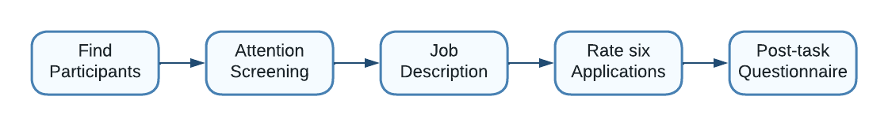

```{r xaringan-themer, include=FALSE, warning=FALSE}
library(xaringanthemer)
style_mono_accent(
  base_color =  "#8CA88E", #"#1c5253", "#C8102E"
  header_font_google = google_font("Josefin Sans"),
  text_font_google   = google_font("Montserrat", "300", "300i"),
  code_font_google   = google_font("Fira Mono"),
  text_bold_color = "#000000", 
  text_color = "#000000"
)
```

```{r xaringan-panelset, echo=FALSE, include=FALSE, warning=FALSE}
xaringanExtra::use_panelset()
```
```{r xaringan-tile-view, echo=FALSE, include=FALSE, warning=FALSE}
xaringanExtra::use_tile_view()
```


```{r global options, include=FALSE, warning=FALSE}
knitr::opts_chunk$set(#fig.path='Figs/', #fig.width=12, fig.height=8, 
                      echo=FALSE, warning=FALSE, message=FALSE,
                      out.extra = 'style="display:block; margin:auto;"')

setwd("C:\\Users\\fo06mafa\\Documents\\AuthenticApplications")

library(ggplot2)
library(RColorBrewer)
library(ggpubr)
library(reshape)
library(tikzDevice)
library(plyr)
library(dplyr)
library(gtable)
library(grid)
library(gridExtra)
library(cowplot)
library(caroline)
library(ggpmisc)
library(tidyr)
library(plotly)
library(tidyquant)
library(lfe)
library(sjPlot)
library(sjmisc)
library(sjlabelled)
library(arsenal)
library(knitr)
library(GGally)
library(tufte)

reverse_legend_labels <- function(plotly_plot) {
  n_labels <- length(plotly_plot$x$data)
  plotly_plot$x$data[1:n_labels] <- plotly_plot$x$data[n_labels:1]
  plotly_plot
}
```


```{r setup, include=FALSE}
library(knitr)
options(htmltools.dir.version = FALSE)
```

<iframe src="https://ourworldindata.org/grapher/technology-adoption-by-households-in-the-united-states?time=1930..2019&country=~Social+media+usage" loading="lazy" style="width: 100%; height: 600px; border: 0px none;"></iframe>
---

# Social Media is a New Signal

.pull-left[
.bigtab[
<table>
  <tr>
    <th>Signals</th>
    <th>Costly?</th>
  </tr>
  <tr>
    <td>Education</td>
    <td>Costly</td>
  </tr>
  <tr>
    <td>Experience</td>
    <td>Costly</td>
  </tr>
  <tr>
    <td>CV</td>
    <td>Cheap</td>
  </tr>
  <tr>
    <td>Letters of Recommendation</td>
    <td>Cheap</td>
  </tr>
  <tr>
    <td>Interview</td>
    <td>?</td>
  </tr>
  <tr>
    <td>Clothing</td>
    <td>Cheap</td>
  </tr>
  <tr>
    <td>Assessment Tests</td>
    <td>Costly</td>
  </tr>
  <tr>
    <td>Personality Tests</td>
    <td>Cheap</td>
  </tr>
  <tr>
    <td>Social Media</td>
    <td>Costly</td>
  </tr>
</table>
]
]

.pull-right[
.center[
[](SM_Flowchart2.png)
]
]


---
.center[
[](employers_use_sm.png)
]
.bullet[
(Source: [Career Builder Survey of 1,012 hiring and human resource managers, 2018](https://press.careerbuilder.com/2018-08-09-More-Than-Half-of-Employers-Have-Found-Content-on-Social-Media-That-Caused-Them-NOT-to-Hire-a-Candidate-According-to-Recent-CareerBuilder-Survey) )
]

---

## Literature
.bullet-content[
> Although organizations use SM to assist in staffing decisions, such use is not well understood by researchers
> `r tufte::quote_footer('Roth et al, 2016')`  

- Correspondence
  - Religion, sexual orientation (Acquisti and Fong, 2020)
  - Appearance (Baert, 2018)
  - Origin / Race (Manant, Pajak, and Soulie, 2019)

- Survey / Vignette
 - Alcohol (Becton et al., 2019; Bohnert and Ross, 2010) 
 - Self-absorption, opinionatedness, and alcohol and drug use (Tews, Stafford, and Kudler, 2020) 
]

---

# Research Questions

.bullet-content[
How do application evaluators …  
1. react to less appealing SM content?  
2. react to candidates with mental health issues?  
3. contradictory info in SM and CV?  
4. a lack of an online presence?  
]

---
# The Hiring Decision

.pull-left[
.center[
[](recruitment_process.png)
]
]
.pull-right[
.bullet-content[
- We focus on screening
  - sometimes outsourced  
  .small[(source: [Cappelli, P, (2019). Your Approach to Hiring Is All Wrong. Harvard Business Review, May/June 2019 pp 48–58](https://press.careerbuilder.com/2018-08-09-More-Than-Half-of-Employers-Have-Found-Content-on-Social-Media-That-Caused-Them-NOT-to-Hire-a-Candidate-According-to-Recent-CareerBuilder-Survey)]
  - rarely directly incentivised  
  .small[(source: [Hirshman, C, (2003). Incentives for Recruiters?. HR Magazine, Nov 2003](https://www.shrm.org/hr-today/news/hr-magazine/pages/1103hirschman.aspx))]
]
]

---


# Experimental Design

.center[
[](experimental_design.png)
]

---

# Experimental Design: Attention Screening

.center[
[](experimental_design2.png)
]

---

# Experimental Design: Job Description

.center[
[](experimental_design3.png)
]

---

# Experimental Design: Applications

.center[
[](experimental_design4.png)
]

---

# Experimental Design: Questionnaire

.center[
[](experimental_design5.png)
]

---

# Applications: The CV
.center[
[](applications_cv.jpg)
]

---
# Applications: The SM
.center[
[](applications_sm.jpg)
]

---
# Treatment 1: 'Bad'
.center[
[](treatment_bad.jpg)
]

---
# Treatment 2: Mental Health
.center[
[](treatment_mental_health.jpg)
]

---
# Treatment 3: Gap
.center[
[](treatment_gap.jpg)
]

---
# Treatment 4: Gap + Lie
.center[
[](treatment_gap_lie.jpg)
]

---
# Treatment 5: No Social Media
.center[
[](treatment_no_info.jpg)
]

---
# Results: Effort

.pull-left[
```{r, fig.asp=1, fig.width=6}
length_viewed_hist = readRDS(file = "..\\exhibits\\length_viewed_hist.RDS")
length_viewed_hist + theme_xaringan()

```
]
.pull-right[
```{r, fig.asp=1, fig.width=6}
notelegnth_hist = readRDS(file = "..\\exhibits\\notelegnth_hist.RDS")
notelegnth_hist + theme_xaringan()
```
]
---

# Results: Treatment Effects

.center[
```{r, fig.asp=0.5, fig.width=12}
linear_fitmodp_plot = readRDS(file = "..\\exhibits\\linear_fitmodp_plot.RDS")
linear_fitmodp_plot + theme_xaringan()
#ggplotly(linear_fitmodp_plot) %>% layout(legend = list(orientation = "h")) %>% reverse_legend_labels()
```
]

---
.pull-left[
# Results
```{r, fig.asp=1, fig.width=6}
CATE_hist = readRDS(file = "..\\exhibits\\CATE_hist.RDS")
CATE_hist + 
  theme(strip.text.y = element_blank(), 
        axis.text.y = element_text(size = 10),
        legend.text = element_text(size = 15),
        legend.title = element_text(size = 17))  + theme_xaringan()
```
]

.pull-right[
.testcal[
```{r echo = F, results="asis"}
testcalgaptab =  readRDS(file = "..\\forests\\testcalgaptab.RDS")
testcalgaptab
testcalgap_lietab =  readRDS(file = "..\\forests\\testcalgap_lietab.RDS")
testcalgap_lietab
testcalmental_healthtab =  readRDS(file = "..\\forests\\testcalmental_healthtab.RDS")
testcalmental_healthtab
testcalno_datatab =  readRDS(file = "..\\forests\\testcalno_datatab.RDS")
testcalno_datatab
testcalbadtab =  readRDS(file = "..\\forests\\testcalbadtab.RDS")
testcalbadtab
```
]
]

---
# Results: Mental Health

.pull-left[
Compare upper and lower quintiles of the CATE
.smalltab[
```{r echo = F, results="asis"}
tabCATEcompmental_health =  readRDS(file = "..\\exhibits\\tabCATEcompmental_health.RDS")
tabCATEcompmental_health
```
]
]

.pull-right[
Regress CATE on dependent variables
.smalltab[
```{r echo = F, results="asis"}
mental_health.blp.tab =  readRDS(file = "..\\forests\\mental_health.blp.tab.RDS")
mental_health.blp.tab
```
]
]
---
# Results: Mental Health

.center[
```{r, fig.asp=0.66, fig.width=9}
linear_libcon_mental_health_plot = readRDS(file = "..\\exhibits\\linear_libcon_mental_health_plot.RDS")
#ggplotly(linear_SM_active_no_data_plot) %>% layout(legend = list(orientation = "h")) %>% reverse_legend_labels()
linear_libcon_mental_health_plot + theme_xaringan()
```
]

---

# Results: No SM

.pull-left[
Compare upper and lower quintiles of the CATE
.smalltab[
```{r echo = F, results="asis"}
tabCATEcompno_data =  readRDS(file = "..\\exhibits\\tabCATEcompno_data.RDS")
tabCATEcompno_data
```
]
]


.pull-right[
Regress CATE on dependent variables
.smalltab[
```{r echo = F, results="asis"}
no_data.blp.tab =  readRDS(file = "..\\forests\\no_data.blp.tab.RDS")
no_data.blp.tab
```
]
]
---

# Results: No SM

.center[
```{r, fig.asp=0.66, fig.width=9}
linear_SM_active_no_data_plot = readRDS(file = "..\\exhibits\\linear_SM_active_no_data_plot.RDS")
#ggplotly(linear_SM_active_mental_health_plot) %>% layout(legend = list(orientation = "h")) %>% reverse_legend_labels()
linear_SM_active_no_data_plot + theme_xaringan()
```
]

---

# Results: 'Bad'
.pull-left[
Compare upper and lower quintiles of the CATE
.smalltab[
```{r echo = F, results="asis"}
tabCATEcompbad =  readRDS(file = "..\\exhibits\\tabCATEcompbad.RDS")
tabCATEcompbad
```
]
]
.pull-right[
Regress CATE on dependent variables
.smalltab[
```{r echo = F, results="asis"}
bad.blp.tab =  readRDS(file = "..\\forests\\bad.blp.tab.RDS")
bad.blp.tab
```
]
]
---

#Results: 'Bad'

.center[
```{r, fig.asp=0.66, fig.width=9}
linear_SMcontents_bad_plot = readRDS(file = "..\\exhibits\\linear_SMcontents_bad_plot.RDS")
#ggplotly(linear_SMcontents_bad_plot) %>% layout(legend = list(orientation = "h")) %>% reverse_legend_labels()
linear_SMcontents_bad_plot + theme_xaringan()
```
]
---

# Recruiters Do What They Say They Do

```{r, fig.asp=0.5, fig.width=12 }
trSMImp_lineplot = readRDS(file = "..\\exhibits\\trSMImp_lineplot.RDS") 
expEXpImp_lineplot = readRDS(file = "..\\exhibits\\expEXpImp_lineplot.RDS") 
educEducImp_lineplot = readRDS(file = "..\\exhibits\\educEducImp_lineplot.RDS") 
grid.arrange(trSMImp_lineplot, expEXpImp_lineplot, educEducImp_lineplot, ncol = 3)  

```
---

class: center, middle

# Thank You!  

