```{r xaringan-themer, include=FALSE, warning=FALSE}
library(xaringanthemer)
style_mono_accent(
  base_color =  "#8CA88E", #"#1c5253", "#C8102E"
  header_font_google = google_font("Josefin Sans"),
  text_font_google   = google_font("Montserrat", "300", "300i"),
  code_font_google   = google_font("Fira Mono"),
  text_bold_color = "#000000", 
  text_color = "#000000"
)
```

```{r xaringan-panelset, echo=FALSE, include=FALSE, warning=FALSE}
xaringanExtra::use_panelset()
```
```{r xaringan-tile-view, echo=FALSE, include=FALSE, warning=FALSE}
xaringanExtra::use_tile_view()
```
layout: true
count: false

# People are imitators

---
count: false

---

.pull-left[
.bullet-content[
- Herding
]
]
.pull-right[
.center2[
<iframe src="https://giphy.com/embed/l2YWjA3A3Yv9tt1Ty" width="480" height="270" frameBorder="0" class="giphy-embed" allowFullScreen></iframe><p><a href="https://giphy.com/gifs/savagekingdom-nat-geo-wild-l2YWjA3A3Yv9tt1Ty"></a></p>
]
]

---

.pull-left[
.bullet-content[
- Herding
]
]
.pull-right[
.center2[
<blockquote class="twitter-tweet"><p lang="en" dir="ltr">A group CrossFitters passed by a restaurant in Brazil. Everyone eating thought they were running away from something, so they jumped up and ran with them. <a href="https://t.co/HYAL4o8mt9">pic.twitter.com/HYAL4o8mt9</a></p>&mdash; Fascinating (@fasc1nate) <a href="https://twitter.com/fasc1nate/status/1586144756413124609?ref_src=twsrc%5Etfw">October 28, 2022</a></blockquote> <script async src="https://platform.twitter.com/widgets.js" charset="utf-8"></script>
]
]


---
.pull-left[
.bullet-content[
- Herding
- Imitative learning (Hoehl et al, 2019)

]
]
.pull-right[
Over-Imitation:
> After seeing an action sequence children and adults tend to copy causally relevant and, more strikingly, even perceivably unnecessary actions in relation to the given goal.

]


---
.pull-left[
.bullet-content[
- Herding
- Imitative learning (Hoehl et al, 2019)
- Conformity (Asch, 1951)
]
]
.pull-right[
.center2[
[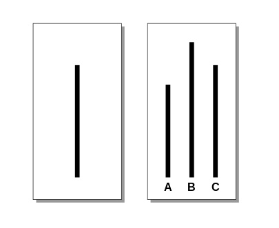](Asch.png)
]
]
---

.pull-left[
.bullet-content[
- Herding
- Imitative learning (Hoehl et al, 2019)
- Conformity (Asch, 1951)
- Matthew Effect (Huber et al, 2022)
]
]
.pull-right[
.center2[
[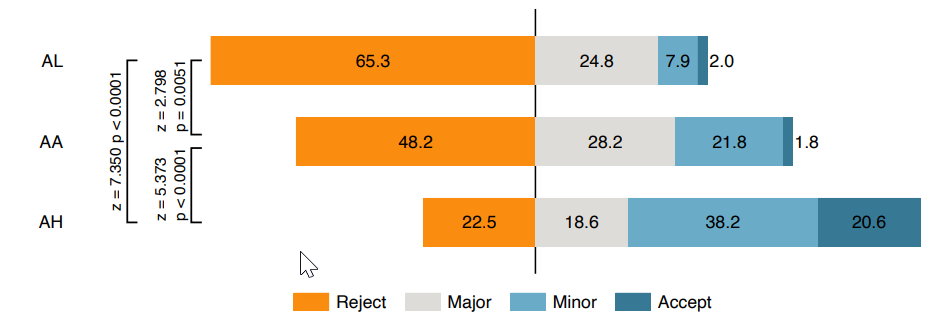](vernonSmith.png)
]
]
---

.pull-left[
.bullet-content[
- Herding
- Imitative learning (Hoehl et al, 2019)
- Conformity (Asch, 1951)
- Matthew Effect (Huber et al, 2022)
- Bandwagon Effect (Mutz, 1998)
]
]
.pull-right[
.center2[
[](bandwagon.png)
]
]

---

.pull-left[
.bullet-content[
- Herding
- Imitative learning (Hoehl et al, 2019)
- Conformity (Asch, 1951)
- Matthew Effect (Huber et al, 2022)
- Bandwagon Effect (Mutz, 1998)
- Social Influence on Preferences (Salganik, Dodds & Watts (2006)
]
]
.pull-right[
.center2[
[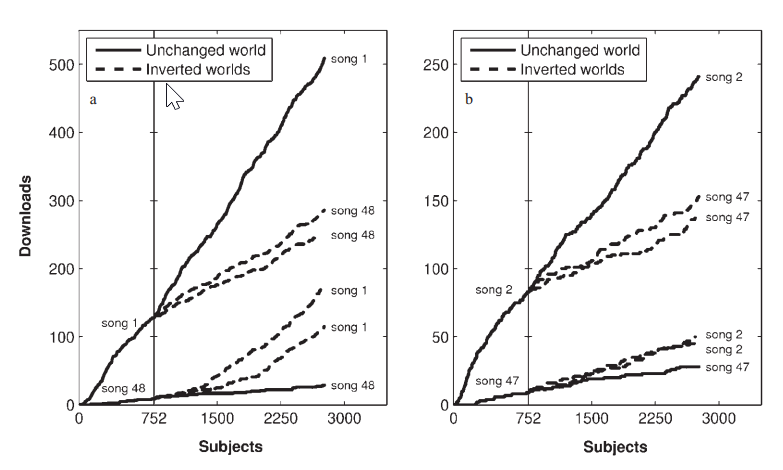](salganik.png)
]
]

---
layout: false
class: center, inverse, middle
count: false

# What does imitation look like in bilateral transactions?

---

# Endowment Effect

.center[
[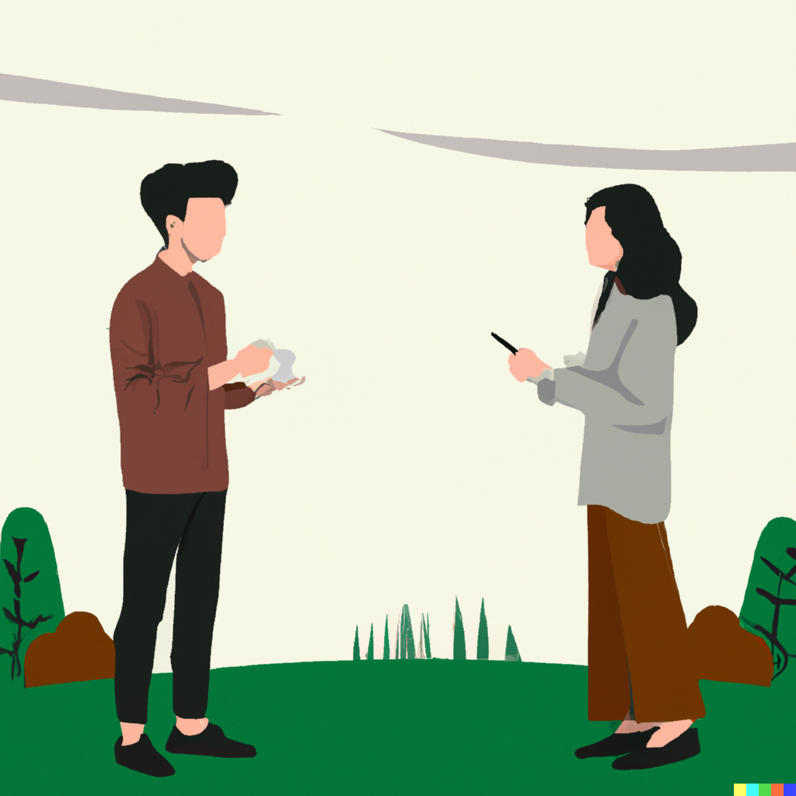](endowment.png)
]

---
layout: false
class: center, inverse, middle
count: false

# When does imitating make sense?

---
# Imitating can make sense if..


.bullet-content[
<ol>
<li> .. we are not sure which outcome is the best 
</ol>
<br/>
]
--
.bullet-content[
<ol start=3>
<li>.. AND some person has a similar utility function to us
</ol>
<br/>
]

---

# Imitating can make sense if..

.bullet-content[
<ol>
<li> .. we are not sure which outcome is the best 
</ol>
<b>incomplete</b> information
]
.bullet-content[
<ol start="3">
<li>.. AND some person has a similar utility function to us
</ol>
<b>affiliated</b> or <b>interdependent</b> utility
]
---
# Affiliated Utility

.center[
.center2[
[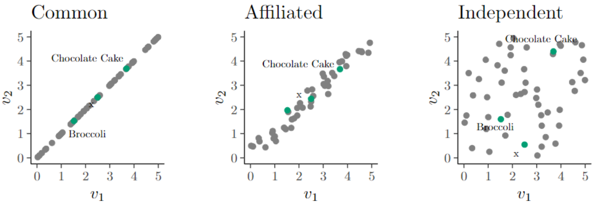](affiliated.png)
]
]
---

# Noisy Utility


.center[
.center2[
[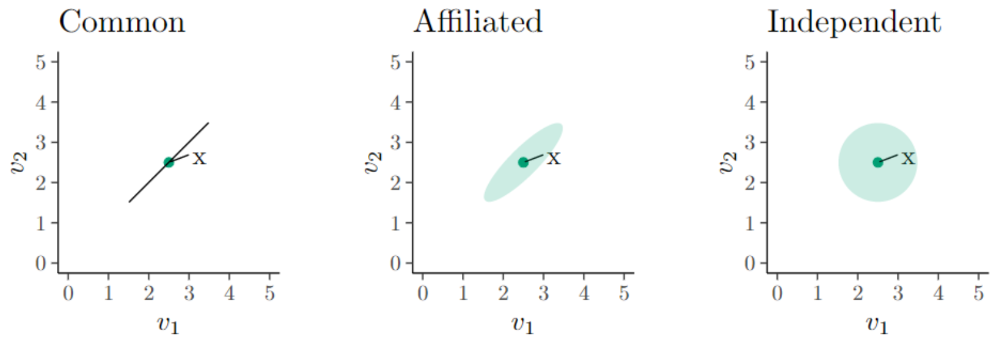](uncertainty.png)
]
]


---

# A gap between WTP and WTA Emerges

.center[
.center2[
[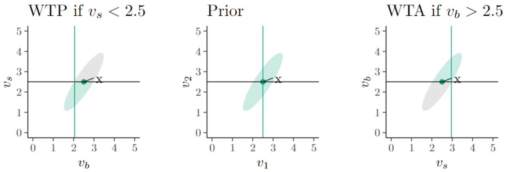](gap_emerges.png)
]
]
---

# Predictions

.center[
.center2[
.bullet-content[
<table>
  <tr>
    <th></th>
    <th>Loss Aversion</th>
    <th>Information Effects</th>
  </tr>
  <tr>
    <th>More Information</th> 
    <td>No difference</td>
    <td>Smaller gaps</td>
  </tr>
  <tr>
    <th>Experienced Trader</th> 
    <td>No difference</td>
    <td>Smaller gaps</td>
  </tr>
  <tr>
    <th>More Comparable Goods</th> 
    <td>No difference</td>
    <td>Smaller gaps</td>
  </tr>
  <tr>
    <th>Thick Markets</th> 
    <td>No difference</td>
    <td>Smaller gaps</td>
  </tr>
  <tr>
    <th>Similar Trading Partner</th> 
    <td>No difference</td>
    <td>Bigger gaps</td>
  </tr>
</table>
]
]
]

---
# Experiment 1

1. Participants are assigned a type: blue or red.
2. Both types receive a voucher.
3. Ask: Do you want to trade your voucher for your trading partner's voucher?
4. Ask: How much would we have to give you in order to trade? (/not trade?)

<table>
  <tr>
    <th></th>
    <th><span style="color:blue">Blue</span> type receives</th>
    <th><span style="color:red">Red</span> type receives</th>
  </tr>
  <tr>
    <th>Treatment 1:</th> 
    <td>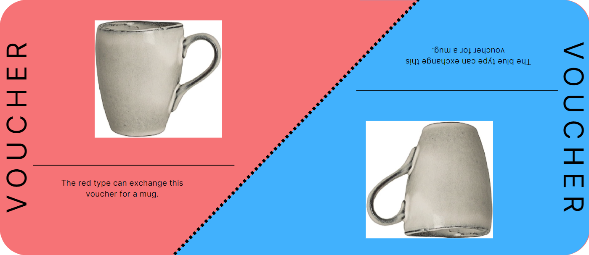</td>
    <td>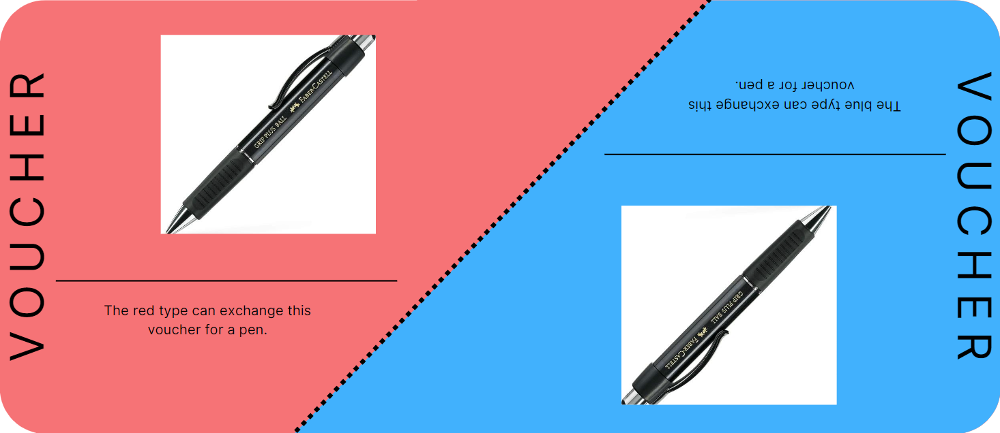</td>
  </tr>
  <tr>
    <th>Treatment 2:</th> 
    <td>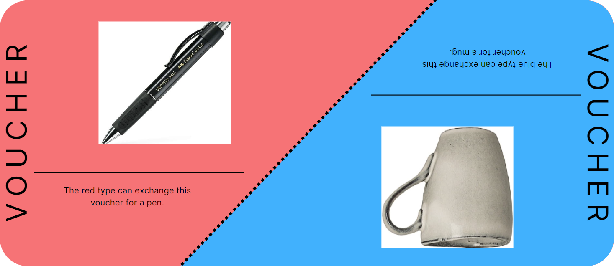</td>
    <td>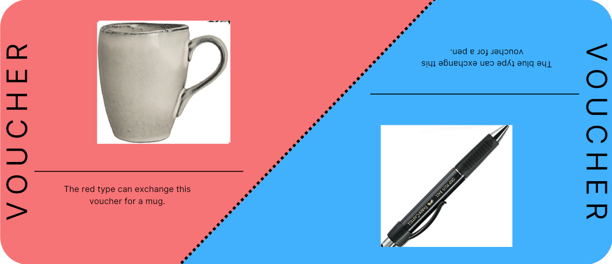</td>
  </tr>
</table>


---

# Experiment 1B

.pull-left[
[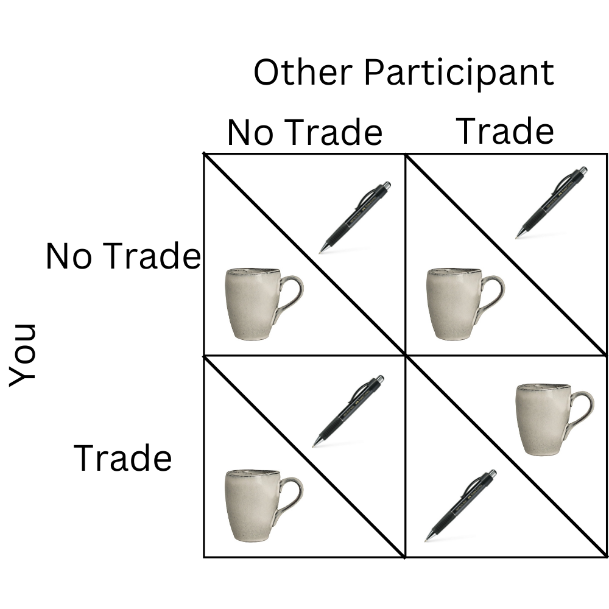](normal_trade.png)
]
.pull-right[
[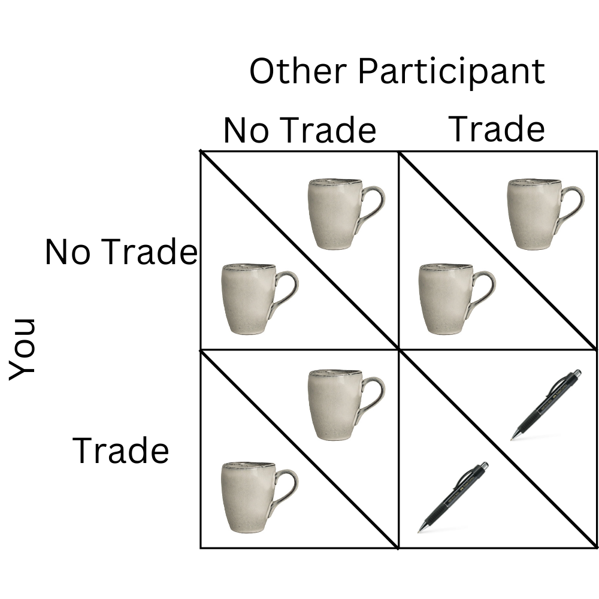](oppposite_trade.png)
]

---

# Experiment 2

.bullet-content[
1. Show participants object
2. Elicit Price
3. Repeat 1&2
4. Implement one round


<table>
  <tr>
    <th></th>
    <th>trade with who?</th>
    <th>what info?</th>
  </tr>
  <tr>
    <th>Treatment 1:</th> 
    <td>Fellow participants</td>
    <td>No info</td>
  </tr>
  <tr>
    <th>Treatment 2:</th> 
    <td>Experimenter / shop</td>
    <td>No info</td>
  </tr>
  <tr>
    <th>Treatment 3:</th> 
    <td>Experimenter / shop</td>
    <td>Amazon page of product</td>
  </tr>
</table>


Keep buyer/seller roles or switch?

]

---

# Experiment 2

 <iframe src="http://localhost:8000/" frameborder="0" style="overflow:hidden;height:100%;width:100%" height="100%" width="100%"></iframe>


---
# Experiment 2
### Goods Ideas:
.bullet-content[
.pull-left[
<ol>
<li> Mug
<li> Pen
<li> tablet
<li> clothing everyone can wear
<li> stamp
<li> carved figurine 
<li> ticket
<li> handmade vintage item
</ol>
]
.pull-right[
<ol start="9">
<li> bar of chocolate
<li> poster / artwork
<li> planner
<li> set of plasters
<li> electric toothbrush
<li> omega 3 oil
<li> book
</ol>
]
]

---
layout: false
class: center, inverse, middle
count: false

# Thank you

---
count: false

# Ellsberg Paradox

.center[
[](ellsberg.png)
]

---

count: false

# Loss Aversion 
#### Losses loom larger than gains


.bullet-content[
Claim:
For any instance that can be explained by loss aversion  
If.. 
1. .. one person's loss is another person's gain,
2. .. and the transaction is voluntary  

.. then it can also be explained by 'bilateral imitation' or noisy affiliated utility.
]


---

count: false

## Noisy Affiliated Utility

<iframe height="800" width="100%" frameborder="no" src="http://bakered91.shinyapps.io/NatureOfGoods"> </iframe>

